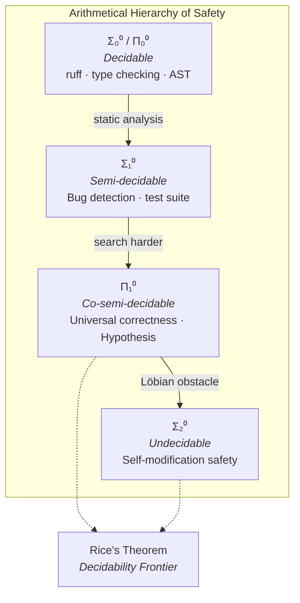
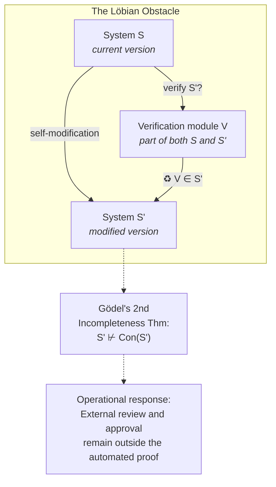

# Formal Reasoning Boundaries: From Static Checks to Executable Contracts

**Series**: AGI Perspectives | **Document**: 9 of 10 | **Last Updated**: March 2026

## The Decidability Frontier

Turing (1936) proved the halting problem undecidable: no algorithm can determine, for all programs, whether they terminate. Rice (1953) generalized this to all non-trivial semantic properties. These results establish a *decidability frontier* — a hard boundary between properties that can be algorithmically verified and those that cannot. For AGI systems, which are by definition Turing-complete and self-modifying, this frontier is the central challenge.

But the decidability frontier is not a binary wall. Between the decidable and the undecidable lies a rich landscape of *semi-decidable* properties (recognizable by Turing machines that halt on positive instances), *co-semi-decidable* properties, and properties that are decidable *for restricted subclasses* of programs. Codomyrmex uses this distinction as a vocabulary for separating static checks, bounded execution, runtime contracts, and optional symbolic reasoning; the repository does not claim to solve the general self-modification problem.

## The Arithmetical Hierarchy and Safety Properties

Safety properties can be classified using the **arithmetical hierarchy** (Rogers, 1967):

| Class | Form | Example | Decidable? |
|:------|:-----|:--------|:-----------|
| Σ₀⁰ = Π₀⁰ | Decidable | "This type annotation is valid" | ✅ Yes |
| Σ₁⁰ | ∃-quantified (RE) | "There exists an input that crashes this function" | ⚠️ Semi-decidable |
| Π₁⁰ | ∀-quantified (co-RE) | "For all inputs, this function terminates" | ⚠️ Co-semi-decidable |
| Σ₂⁰ | ∃∀-quantified | "There exists a modification that preserves all invariants" | ❌ Undecidable |

Codomyrmex's safety properties distribute across this hierarchy:

- **Σ₀⁰ (decidable)**: typing, lint rules (ruff), import structure → `static_analysis` handles these
- **Σ₁⁰ (semi-decidable)**: "does a bug exist?" → a bounded test suite provides partial behavioral evidence, not an oracle for arbitrary inputs
- **Π₁⁰ (co-semi-decidable)**: "is this function correct for all inputs?" → property-based testing (Hypothesis) approximates
- **Σ₂⁰ (undecidable)**: "is this self-modification safe?" → the Löbian obstacle

## Verification Architecture: Defense in Depth

### Layer 1: Syntactic and Type-Theoretic Checks (Σ₀⁰)

This is the most tractable layer. Curry--Howard explains a correspondence between
typing judgments and proofs in a formal type system; it does not turn ordinary Python
type checking into a proof of runtime behavior. Codomyrmex enforces:

- **Ruff** — configured style and static-rule checks. A violation is evidence that the
  source fails the selected lint contract; it is not, by itself, a proof that the
  program is semantically wrong.
- **Type hints + py.typed** — a machine-readable interface vocabulary. A judgment such
  as `def f(x: int) -> str` constrains callers and implementations under the configured
  type checker; it does not prove that every runtime value or side effect obeys the
  annotation.
- **AST analysis** — `static_analysis` inspects syntax trees for selected structural
  invariants. These checks are decidable for the inspected syntax, but incomplete for
  behavior.

The useful claim is conformance to a declared static contract, with an explicit
incompleteness boundary. See the formalism-to-code crosswalk in the manuscript for the
source anchors and evidence classes.

### Layer 2: Behavioral Verification (Σ₁⁰)

The test suite is bounded behavioral evidence: a failing test shows a mismatch between
an expected contract and an observed run, subject to the possibility that the test or
fixture is wrong. Passing tests supports only the exercised paths and configurations.
Coverage is a diagnostic for incompleteness, not a percentage of formally verified
program behavior. Property-based testing via Hypothesis broadens the sampled input
space; it remains testing rather than universal proof.

The **mutation testing** interpretation: a correct test suite should detect all semantically meaningful mutations. The mutation detection rate (MDR) measures test quality independent of coverage:

$$MDR = \frac{|\text{killed mutants}|}{|\text{total non-equivalent mutants}|}$$

### Layer 3: Contract Verification (Π₁⁰ approximation)

The `formal_verification` and `validation` modules implement **design by contract** (Meyer, 1992):

- **Preconditions**: `validate_input(schema)` asserts requirements on function arguments
- **Postconditions**: Return value validators assert guarantees on outputs
- **Invariants**: Class invariants checked at method boundaries

Contracts instantiate a universal-looking requirement for a particular invocation
through *runtime monitoring*. Checking a contract at every invocation is useful online
evidence, but it trades completeness for practical observability and depends on the
contract being correctly specified.

The Hoare triple formalization:

$$\{P\}\ S\ \{Q\}$$

where P is the precondition, S is the statement, and Q is the postcondition. The `validation` module's schema checking implements the precondition P; the return-type checking implements the postcondition Q.

### Layer 4: Self-Reference and External Review

Fallenstein and Soares (2017) formalize the self-referential verification problem. Consider:

1. System S modifies itself to produce S'
2. S attempts to verify that S' preserves safety property φ
3. The verification procedure itself is part of S' (since S' includes the verification module)
4. By Gödel's second incompleteness theorem, S' cannot prove its own consistency

This is the **Löbian obstacle**: a sufficiently powerful system cannot verify its own modifications within its own proof system. The formal statement uses Löb's theorem:

$$\square(\square P \to P) \to \square P$$

If the system could prove "if I can prove my safety, then I am safe," Löb's theorem would force it to prove its safety — contradicting incompleteness.

The repository uses human review as an external decision point for changes that the
automated checks do not establish. This can break an operational approval loop, but it
does not make the reviewer a literal Turing oracle or solve an undecidable safety
problem. The reviewer supplies context, judgment, and accountability outside the
automated proof obligations; the decision remains fallible and should be recorded.

## A Prospective Sheaf-Theoretic Consistency Abstraction

A deeper formalization uses **sheaf theory** (MacLane & Moerdijk, 1994). Define a sheaf F on the dependency graph G where:

- For each module m ∈ V(G), F(m) is the set of valid states of module m
- For each dependency edge (m₁, m₂), the restriction map F(m₁) → F(m₂) enforces interface contracts
- The **gluing axiom** requires: if local sections (per-module states) are compatible on overlaps (shared interfaces), they glue to a unique global section (system state)

This is a possible abstraction for reasoning about interface consistency, not a model
implemented by the repository. To make it more than an analogy, one would need to define
the category of states and restriction maps, prove that the selected module graph and
contracts form the required structure, and connect detected obstructions to executable
counterexamples. Until then, global sections and cohomology are research notation rather
than reported Codomyrmex results.

## The Reflection Tower

Smith's (1984) concept of a **reflection tower** describes a hierarchy of self-aware interpreters, where each level can inspect and modify the level below:

| Level | Reflective Capability | Codomyrmex Implementation |
|:------|:---------------------|:------------------------|
| **L₀** — Object | Execute code | `agents` executing tool calls |
| **L₁** — Meta | Monitor execution | `telemetry` observing agent behavior |
| **L₂** — Meta-meta | Reason about monitoring | `cerebrum` analyzing telemetry patterns |
| **L₃** — Meta³ | Modify reasoning strategy | `evolutionary_ai` evolving cerebrum strategies |
| **L₄** — Meta⁴ | Verify modification correctness | `formal_verification` checking evolution |

This tower is an illustrative decomposition of responsibilities, not a demonstrated
reflective hierarchy. The current repository has monitoring, analysis, modification, and
verification components, but it does not establish that each level can verify the level
below or that a human decision resolves the corresponding logical regress.

## Turing Degrees of Self-Knowledge

The **Turing degree** hierarchy classifies problems by their relative computability. Self-knowledge in codomyrmex occupies positions in this hierarchy:

$$\mathbf{0} \leq_T \mathbf{0'} \leq_T \mathbf{0''} \leq_T \cdots$$

| Knowledge Type | Turing Degree | Decidable? | Module |
|:--------------|:-------------|:-----------|:-------|
| "Am I running?" | **0** (computable) | ✅ | `system_discovery` health check |
| "Will this test pass?" | **0'** (halting problem) | ❌ In general | `ci_cd_automation` (heuristic) |
| "Is my improvement safe?" | **0''** (Σ₂⁰) | ❌ | `formal_verification` (bounded) |
| "Will I converge to AGI?" | **0'''** (Σ₃⁰) | ❌ | Not addressable computationally |

The practical implication is weaker and more useful: direct health checks can be
automated; questions about a particular test run require bounded execution; and global
semantic safety remains outside the demonstrated automated surface. The table is a
classification of question types and available evidence, not a measured assignment of
Turing degrees to modules.

The `validation` module checks selected interface conditions. It should not be described
as computing sheaf cohomology unless a corresponding mathematical structure and
translation are implemented.

## What Can Be Proved: A Realistic Assessment

| Property | Hierarchy Level | Method | Completeness |
|:---------|:-------------|:-------|:-------------|
| Type/interface conformance | Decidable for the selected checker | Static typing | Complete only relative to that checker and model |
| Import structure | Decidable for the inspected graph | Graph analysis | Complete only relative to the inspected graph |
| Specific behavior | Bounded execution | Test suite | Evidence for exercised cases; incomplete globally |
| Universal correctness | Open semantic question | Contracts + property tests | Approximation |
| Self-modification safety | Open semantic question | AST checks, tests, review | Incomplete |
| Emergent property preservation | Open research question | No complete method | Unestablished |

## Cross-References

- **Biological**: [immune_system.md](../bio/immune_system.md) — Immune verification as biological safety
- **Cognitive**: [industrialization.md](../cognitive/industrialization.md) — Quality gates in production systems
- **Previous**: [emergence_and_scale.md](./emergence_and_scale.md) — Emergent properties resist formal specification
- **Next**: [the_colony_thesis.md](./the_colony_thesis.md) — Verification for distributed systems

## References

- Fallenstein, B., & Soares, N. (2017). "Agent Foundations for Aligning Machine Intelligence." *MIRI Technical Report*.
- MacLane, S., & Moerdijk, I. (1994). *Sheaves in Geometry and Logic*. Springer.
- Meyer, B. (1992). "Applying 'Design by Contract'." *IEEE Computer*, 25(10), 40–51.
- Rice, H. G. (1953). "Classes of Recursively Enumerable Sets." *Trans. AMS*, 74(2), 358–366.
- Rogers, H. (1967). *Theory of Recursive Functions and Effective Computability*. McGraw-Hill.
- Turing, A. M. (1936). "On Computable Numbers." *Proc. London Math. Soc.*, 42(1), 230–265.
- Turing, A. M. (1939). "Systems of Logic Based on Ordinals." *Proc. London Math. Soc.*, 45(1), 161–228.

---

*[← Emergence & Scale](./emergence_and_scale.md) | [Next: The Colony Thesis →](./the_colony_thesis.md)*
