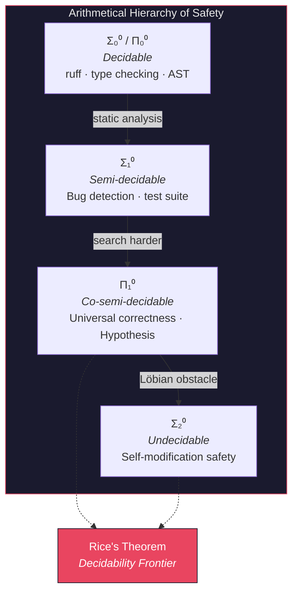
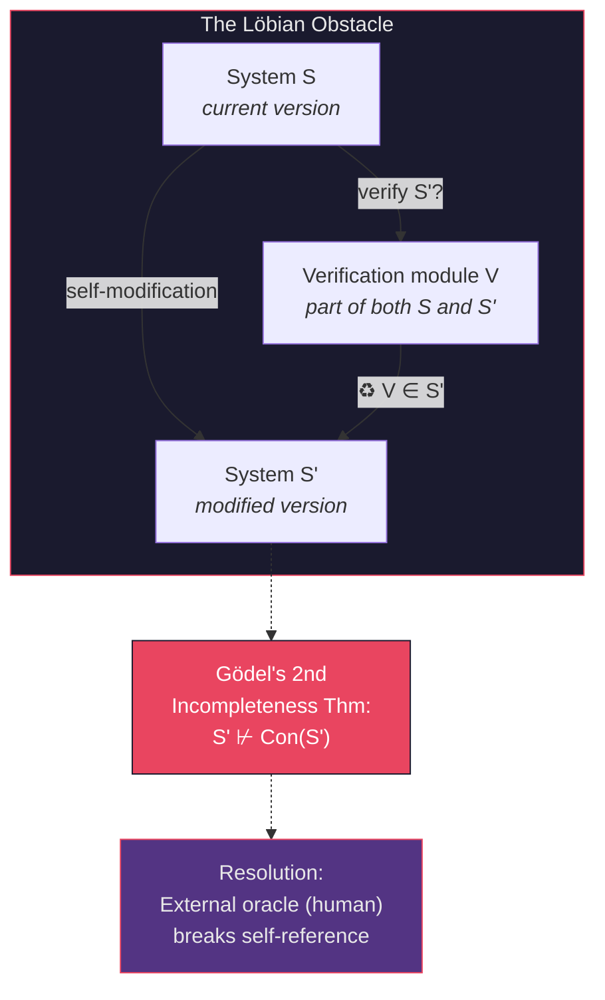

# Formal Specification and Provable Safety for Self-Modifying Systems

**Series**: AGI Perspectives | **Document**: 9 of 10 | **Last Updated**: March 2026

## The Decidability Frontier

Turing (1936) proved the halting problem undecidable: no algorithm can determine, for all programs, whether they terminate. Rice (1953) generalized this to all non-trivial semantic properties. These results establish a *decidability frontier* — a hard boundary between properties that can be algorithmically verified and those that cannot. For AGI systems, which are by definition Turing-complete and self-modifying, this frontier is the central challenge.

But the decidability frontier is not a binary wall. Between the decidable and the undecidable lies a rich landscape of *semi-decidable* properties (recognizable by Turing machines that halt on positive instances), *co-semi-decidable* properties, and properties that are decidable *for restricted subclasses* of programs. Codomyrmex's formal verification strategy exploits this landscape by operating at different points on the decidability spectrum for different properties.

## The Arithmetical Hierarchy and Safety Properties

Safety properties can be classified using the **arithmetical hierarchy** (Rogers, 1967):

| Class | Form | Example | Decidable? |
|:------|:-----|:--------|:-----------|
| Σ₀⁰ = Π₀⁰ | Decidable | "This type annotation is valid" | ✅ Yes |
| Σ₁⁰ | ∃-quantified (RE) | "There exists an input that crashes this function" | ⚠️ Semi-decidable |
| Π₁⁰ | ∀-quantified (co-RE) | "For all inputs, this function terminates" | ⚠️ Co-semi-decidable |
| Σ₂⁰ | ∃∀-quantified | "There exists a modification that preserves all invariants" | ❌ Undecidable |

Codomyrmex's safety properties distribute across this hierarchy:

- **Σ₀⁰ (decidable)**: typing, lint rules (ruff), import structure → `static_analysis` handles these
- **Σ₁⁰ (semi-decidable)**: "does a bug exist?" → the test suite (21,000+ tests) is a partial oracle
- **Π₁⁰ (co-semi-decidable)**: "is this function correct for all inputs?" → property-based testing (Hypothesis) approximates
- **Σ₂⁰ (undecidable)**: "is this self-modification safe?" → the Löbian obstacle

## Verification Architecture: Defense in Depth

### Layer 1: Syntactic and Type-Theoretic Verification (Σ₀⁰)

The most tractable layer. The Curry-Howard correspondence tells us that type-checking is *proof-checking*: a well-typed program is a proof of its type signature's proposition. Codomyrmex enforces:

- **Ruff** — 0 violations enforced repo-wide (ratcheted v1.1.9). This eliminates entire *syntactic* classes of bugs — unused variables, undefined names, import cycles. Formally: ruff enforces a decidable subset of Python's context-free grammar constraints.
- **Type hints + py.typed** — 572 PEP 561 markers across the codebase. Under the Curry-Howard isomorphism, `def f(x: int) -> str` asserts the proposition `Int → Str` — a morphism in the category **Typ** of types.
- **AST analysis** — `static_analysis` inspects syntax trees for structural invariants (pass-only stubs, circular imports). These are decidable because they reduce to graph properties of the AST.

Soundness guarantee: **everything ruff rejects is wrong.** The cost is incompleteness: ruff cannot detect semantic bugs.

### Layer 2: Behavioral Verification (Σ₁⁰)

The test suite constitutes a *semi-decision procedure* for correctness: if a test fails, the bug is real (no false negatives for tested paths). But passing tests does not prove correctness (many false negatives for untested paths).

The coverage metric quantifies incompleteness: ~32% line coverage means ~68% of paths are *formally unverified*. Property-based testing via Hypothesis partially addresses this by generating adversarial inputs from type specifications — an automated search through the Σ₁⁰ space.

The **mutation testing** interpretation: a correct test suite should detect all semantically meaningful mutations. The mutation detection rate (MDR) measures test quality independent of coverage:

$$MDR = \frac{|\text{killed mutants}|}{|\text{total non-equivalent mutants}|}$$

### Layer 3: Contract Verification (Π₁⁰ approximation)

The `formal_verification` and `validation` modules implement **design by contract** (Meyer, 1992):

- **Preconditions**: `validate_input(schema)` asserts requirements on function arguments
- **Postconditions**: Return value validators assert guarantees on outputs
- **Invariants**: Class invariants checked at method boundaries

Contracts transform Π₁⁰ properties (∀ inputs, output is correct) into Σ₁⁰ properties (for this specific input, the contract is satisfied) through *runtime monitoring*. The contract is checked at every invocation — a form of *online verification* that trades completeness for practical safety.

The Hoare triple formalization:

$$\{P\}\ S\ \{Q\}$$

where P is the precondition, S is the statement, and Q is the postcondition. The `validation` module's schema checking implements the precondition P; the return-type checking implements the postcondition Q.

### Layer 4: The Löbian Obstacle and Its Resolution

Fallenstein and Soares (2017) formalize the self-referential verification problem. Consider:

1. System S modifies itself to produce S'
2. S attempts to verify that S' preserves safety property φ
3. The verification procedure itself is part of S' (since S' includes the verification module)
4. By Gödel's second incompleteness theorem, S' cannot prove its own consistency

This is the **Löbian obstacle**: a sufficiently powerful system cannot verify its own modifications within its own proof system. The formal statement uses Löb's theorem:

$$\square(\square P \to P) \to \square P$$

If the system could prove "if I can prove my safety, then I am safe," Löb's theorem would force it to prove its safety — contradicting incompleteness.

**Codomyrmex's resolution**: the trust gateway interposes a **human oracle** between verification and deployment. Because the human is external to the system's proof theory, the self-referential cycle is broken. The human serves as an oracle for the Π₁⁰-complete problem "is this modification safe?" — a problem that the system alone cannot decide.

This is not a hack but a principled strategy: Turing oracle machines (Turing, 1939) extend computability by postulating access to oracles for specific undecidable problems. The human reviewer is literally a Turing oracle for the safety verification problem.

## Sheaf-Theoretic View of Consistency

A deeper formalization uses **sheaf theory** (MacLane & Moerdijk, 1994). Define a sheaf F on the dependency graph G where:

- For each module m ∈ V(G), F(m) is the set of valid states of module m
- For each dependency edge (m₁, m₂), the restriction map F(m₁) → F(m₂) enforces interface contracts
- The **gluing axiom** requires: if local sections (per-module states) are compatible on overlaps (shared interfaces), they glue to a unique global section (system state)

System consistency is equivalent to the existence of a *global section* of this sheaf. The obstructions are H¹(G, F) — nontrivial cohomology classes in the first cohomology group of G with coefficients in F. When H¹(G, F) = 0, local patches glue consistently. When H¹ ≠ 0, there exist *genuine* global inconsistencies that cannot be resolved by choosing different local representatives.

## The Reflection Tower

Smith's (1984) concept of a **reflection tower** describes a hierarchy of self-aware interpreters, where each level can inspect and modify the level below:

| Level | Reflective Capability | Codomyrmex Implementation |
|:------|:---------------------|:------------------------|
| **L₀** — Object | Execute code | `agents` executing tool calls |
| **L₁** — Meta | Monitor execution | `telemetry` observing agent behavior |
| **L₂** — Meta-meta | Reason about monitoring | `cerebrum` analyzing telemetry patterns |
| **L₃** — Meta³ | Modify reasoning strategy | `evolutionary_ai` evolving cerebrum strategies |
| **L₄** — Meta⁴ | Verify modification correctness | `formal_verification` checking evolution |

The tower is **finite** (terminating at L₄) because L₄ requires human oracle for deployment. An infinite tower would require each level to verify the level above — creating exactly the Gödelian regress that Löb's theorem prohibits.

The relationship to Löbian obstacles: at each level Lₖ, the system can prove safety of Lₖ₋₁. But Lₖ cannot prove its own safety — that requires Lₖ₊₁. The human oracle at the top of the tower serves as the *final metalevel* that breaks the chain, providing external verification that the system cannot provide for itself.

## Turing Degrees of Self-Knowledge

The **Turing degree** hierarchy classifies problems by their relative computability. Self-knowledge in codomyrmex occupies positions in this hierarchy:

$$\mathbf{0} \leq_T \mathbf{0'} \leq_T \mathbf{0''} \leq_T \cdots$$

| Knowledge Type | Turing Degree | Decidable? | Module |
|:--------------|:-------------|:-----------|:-------|
| "Am I running?" | **0** (computable) | ✅ | `system_discovery` health check |
| "Will this test pass?" | **0'** (halting problem) | ❌ In general | `ci_cd_automation` (heuristic) |
| "Is my improvement safe?" | **0''** (Σ₂⁰) | ❌ | `formal_verification` (bounded) |
| "Will I converge to AGI?" | **0'''** (Σ₃⁰) | ❌ | Not addressable computationally |

The practical implication: codomyrmex can answer Level-0 questions about its own state completely and correctly. Level-0' questions (will this test pass?) require running the test — they are equivalent to the halting problem for the specific program. Level-0'' questions (is this modification globally safe?) are strictly harder than the halting problem and require the human oracle.

This hierarchy is not merely academic — it determines the *architectural ceiling* of autonomous self-improvement. The system can autonomously handle Turing degree 0 operations (self-monitoring, health checks). Degree 0' operations (test execution) require bounded computation. Degree 0'' operations (global safety verification) require external oracle consultation.

The `validation` module's cross-module contract checking is a *computational approximation* to computing H¹(G, F): it verifies the gluing axiom at each interface, detecting cohomological obstructions at runtime.

## What Can Be Proved: A Realistic Assessment

| Property | Hierarchy Level | Method | Completeness |
|:---------|:-------------|:-------|:-------------|
| Type safety | Σ₀⁰ | Static typing | Sound + complete for type system |
| Import structure | Σ₀⁰ | Graph analysis | Sound + complete |
| Specific bug absence | Σ₁⁰ | Test suite | Sound but incomplete (~32% coverage) |
| Universal correctness | Π₁⁰ | Contracts + Hypothesis | Approximation |
| Self-modification safety | Σ₂⁰ | Human oracle | Sound (assuming oracle correctness) |
| Emergent property preservation | Σ₂⁰+ | Unknown | Open problem |

## Cross-References

- **Biological**: [immune_system.md](../bio/immune_system.md) — Immune verification as biological safety
- **Cognitive**: [industrialization.md](../cognitive/industrialization.md) — Quality gates in production systems
- **Previous**: [emergence_and_scale.md](./emergence_and_scale.md) — Emergent properties resist formal specification
- **Next**: [the_colony_thesis.md](./the_colony_thesis.md) — Verification for distributed systems

## References

- Fallenstein, B., & Soares, N. (2017). "Agent Foundations for Aligning Machine Intelligence." *MIRI Technical Report*.
- MacLane, S., & Moerdijk, I. (1994). *Sheaves in Geometry and Logic*. Springer.
- Meyer, B. (1992). "Applying 'Design by Contract'." *IEEE Computer*, 25(10), 40–51.
- Rice, H. G. (1953). "Classes of Recursively Enumerable Sets." *Trans. AMS*, 74(2), 358–366.
- Rogers, H. (1967). *Theory of Recursive Functions and Effective Computability*. McGraw-Hill.
- Turing, A. M. (1936). "On Computable Numbers." *Proc. London Math. Soc.*, 42(1), 230–265.
- Turing, A. M. (1939). "Systems of Logic Based on Ordinals." *Proc. London Math. Soc.*, 45(1), 161–228.

---

*[← Emergence & Scale](./emergence_and_scale.md) | [Next: The Colony Thesis →](./the_colony_thesis.md)*
