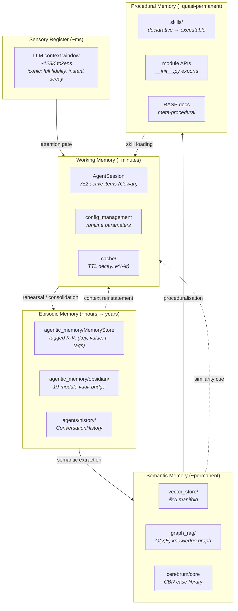

# Memory and Continuity: Persistent Knowledge as Foundation for Generality

**Series**: AGI Perspectives | **Document**: 7 of 10 | **Last Updated**: March 2026

## The Statefulness Requirement

A stateless function cannot be generally intelligent. Generality requires *temporal continuity*: learning from past experiences, accumulating knowledge, and retrieving relevant information when needed. Tulving (1972) distinguished episodic from semantic memory; Hassabis et al. (2017) argued that memory systems are the neural substrate for imagination and future planning; Lake et al. (2017) identified memory-augmented learning as a requirement for human-like intelligence.

The formal requirement is **Bayesian updating**: an agent with prior P₀(θ) and observations O must compute the posterior P(θ|O) and use it for future decisions. Without persistent memory, each invocation starts from P₀ — no information accumulates across sessions. The agent's effective intelligence is bounded by:

$$I_{effective} \leq I_{single\_session} + I_{memory}(O_1, O_2, \ldots, O_n)$$

where I_memory is the mutual information between stored observations and future tasks. Maximizing I_memory is the *memory design problem*.

## The Four-Tier Architecture



### Tier 0: Sensory Register — The LLM Context Window

Sperling's (1960) experiments established that iconic memory holds a complete, high-fidelity representation that decays within ~250ms. The LLM context window is the computational analogue: it holds the complete current state (~128K tokens) at full fidelity, but the information is *volatile* — it is discarded entirely when the session ends.

The capacity constraint: Cowan's (2001) revised estimate of 4±1 chunks for human working memory. LLM context windows are far larger in tokens but have an analogous *attention bottleneck*: the model can attend to ~all tokens but its effective information bandwidth (bits per token of useful output) is bounded by the transformer's fixed-depth computation.

### Tier 1: Working Memory — The Central Executive's Scratchpad

Baddeley's (2003) multicomponent model distinguishes:

| Component | Codomyrmex Implementation | Capacity Limit |
|:----------|:-------------------------|:--------------|
| **Central executive** | `orchestrator/` | 1 active DAG |
| **Phonological loop** | `AgentSession` state | Session-scoped |
| **Visuospatial sketchpad** | `spatial/` representations | Module-limited |
| **Episodic buffer** | `cache/` hot data | TTL-bounded |

The `cache` module implements exponential decay:

$$P(\text{retained}) = e^{-\lambda t}$$

where λ is the decay rate (inverse TTL). LRU and LFU eviction policies provide alternative decay kernels — recency-biased and frequency-biased respectively. These map to the two dominant theories of forgetting: *trace decay* (Thorndike, 1914) and *interference* (McGeoch, 1932).

### Tier 2: Episodic Memory — Mental Time Travel

Tulving (1984) defined episodic memory as *autonoetic consciousness* — the ability to mentally re-experience past events. The computationally essential feature is *temporal indexing*: events are stored with their temporal context, enabling retrieval by time, by association, or by content-addressable matching.

The `agentic_memory/MemoryStore` stores experiences as tuples (key, value, timestamp, tags):

```python
# Episodic encoding
memory.store(
    key="refactoring_attempt_auth_module",
    value={"approach": "extract_method", "outcome": "3_tests_failed", "root_cause": "circular_import"},
    tags=["refactoring", "auth", "failure", "circular_import"]
)
```

The Obsidian bridge (19 submodules: filesystem CLI, vault search, link graph, backlinks) provides *external episodic memory* — a knowledge graph that persists across sessions and even across agent instances. This implements what Donald (1991) calls **exographic memory**: externalized memory systems that transcend biological storage limits.

The **spacing effect** (Ebbinghaus, 1885) suggests that spaced retrieval strengthens memory more than massed rehearsal. The Obsidian vault's backlink structure creates implicit spaced retrieval: revisiting a concept through different incoming links provides natural spaced exposure.

### Tier 3: Semantic Memory — Crystallized Knowledge

Semantic memory stores general knowledge independent of specific episodes. The distinction from episodic: you remember *that* Paris is the capital of France (semantic) without remembering *when* you learned it (episodic).

Three complementary implementations:

1. **`vector_store`** — Dense embedding retrieval on a Riemannian manifold (see [world_models.md](./world_models.md)). Captures *analogical similarity*: problems with similar embeddings likely have similar solutions. The *curse of dimensionality* (Bellman, 1961) is mitigated by the manifold hypothesis: data concentrates on low-dimensional submanifolds.

2. **`graph_rag`** — Knowledge graph with typed edges. Captures *structural relations* irreducible to similarity. Graph operations:
   - **Traversal**: Find all entities related to entity_x by relation_r → O(degree(x))
   - **Path finding**: Shortest conceptual path between entities → O(V + E) BFS
   - **Subgraph extraction**: Local context around a query entity → O(k · avg_degree^k)

3. **`cerebrum/core` case library** — Abstract problem-solution patterns (Kolodner, 1993). Each case is a tuple (problem_features, solution, outcome, adaptation_rules). The **case-based reasoning cycle**:
   - **Retrieve**: Find cases with max sim(problem, case.features)
   - **Reuse**: Adapt the retrieved solution to the current context
   - **Revise**: Test the adapted solution; correct if needed
   - **Retain**: Store the new case for future use

### Tier 4: Procedural Memory — Knowing How

Procedural memory encodes *implicit knowledge* — how to do things without explicit recall. Anderson's (1982) **ACT* theory** models proceduralization as the transition from declarative knowledge (consciously accessible facts) to production rules (automatic condition-action pairs):

$$\text{Declarative} \xrightarrow{\text{practice}} \text{Procedural}$$

In codomyrmex:

- **`skills/`** — Declarative skill descriptions mapped to executable implementations via `SkillRegistry`. Once registered, invocation is automatic — the agent doesn't need to know *how* the skill works.
- **Module APIs** — `__init__.py` exports are the most deeply proceduralized knowledge: function signatures that agents invoke without understanding implementation.
- **RASP docs** — *Meta-procedural*: the system knows how to describe how to do things. This is the highest-order procedural knowledge — self-knowledge about procedures.

## The Consolidation Gap

Neuroscience identifies **memory consolidation** as the proess by which volatile hippocampal representations are transformed into stable neocortical memories. The two-stage model (McClelland et al., 1995):

1. **Fast learning** (hippocampus/working memory): Rapid, pattern-separated encoding of new experiences
2. **Slow consolidation** (neocortex/semantic memory): Gradual interleaving of new knowledge with existing knowledge via replay

Codomyrmex has a consolidation gap: promotion from working memory to long-term memory is **explicit** (agents must call `memory.store()`). Missing: an automatic, "sleep-like" consolidation process that:

1. **Monitors** working memory for high-value information (unusual outcomes, novel patterns, errors)
2. **Compresses** via lossy encoding: extract semantic essence, discard irrelevant detail
3. **Interleaves** with existing memory: compute embeddings, attach to knowledge graph
4. **Replays** for consolidation: periodic re-activation to strengthen connections (Diekelmann & Born, 2010)

The information-theoretic justification: consolidation reduces the redundancy between episodic and semantic stores. Without consolidation, the same information is stored twice in different formats. Optimal memory allocation minimizes total storage while maximizing retrieval quality:

$$\min_{E, S} I(E; S) \text{ subject to } I(E \cup S; \text{future tasks}) \geq \theta$$

where E is episodic store, S is semantic store, and I(E; S) is their mutual information (redundancy).

## The Forgetting Mechanism

Adaptive forgetting is not pathology but necessity. Anderson and Schooler (1991) showed that human forgetting curves match the statistical structure of environmental demands — information needed less frequently is forgotten more quickly, optimizing the *accuracy-accessibility trade-off*.

The **rational analysis of memory** (Anderson, 1990) models the probability of needing information again as:

$$P(\text{needed}) = a \cdot (1 - e^{-bt})^{-d}$$

where a is base-level activation, b and d are learning and decay parameters. Codomyrmex's planned TTL-based expiry (v1.2.0) should implement this: items with low base-level activation (infrequent access) decay faster than frequently accessed items.

## Metamemory: Memory About Memory

Nelson and Narens (1990) introduced **metamemory** — the system's knowledge about its own memory contents and capabilities. Two metacognitive judgments are critical:

1. **Feeling of Knowing** (FOK) — Estimating whether a memory exists before attempting retrieval: P(retrievable | query). The `vector_store` cosine similarity score approximates FOK: a high maximum similarity suggests the system "knows" something relevant.

2. **Judgment of Learning** (JOL) — Estimating whether newly stored information will be retrievable later: P(future_retrieval | encoding). Currently absent — the system stores information without estimating its future accessibility.

Metamemory enables **intelligent search strategies**: if FOK is high, the system should search harder (the information is there but not immediately found); if FOK is low, the system should give up and seek alternative sources. This maps directly to the `search` module's timeout and retry parameters.

## The Lethe Problem: Strategic Forgetting

Named for the river of forgetfulness in Hades, the **Lethe problem** asks: what should the system forget, and when?

Optimal forgetting follows from the **rate-distortion** theory (Shannon, 1959): given a memory capacity constraint R, minimize the distortion D between the full memory and the compressed version:

$$\min_{p(\hat{m}|m)} D(m, \hat{m}) \quad \text{subject to} \quad I(m; \hat{m}) \leq R$$

where m is the full memory, m̂ is the retained subset, and R is the capacity. The solution is the rate-distortion function — the minimum achievable distortion at a given rate. Information below the distortion threshold is expendable.

Practical forgetting criteria for codomyrmex memory stores:

| Criterion | Measure | Forget When |
|:----------|:--------|:-----------|
| **Recency** | Time since last access | t > TTL |
| **Frequency** | Access count in window | count < θ_freq |
| **Relevance** | Cosine similarity to active task | sim < θ_rel |
| **Redundancy** | Mutual information with other items | I(item; others) > θ_redund |
| **Confidence** | Uncertainty of stored value | entropy(value) > θ_conf |

## Gap Analysis

| Memory Capability | Status | Information-Theoretic Gap |
|:-----------------|:-------|:------------------------|
| Sensory register (context window) | ✅ | Bounded by model architecture |
| Working memory | ✅ | No capacity-limit enforcement |
| Episodic (short-term) | ✅ MemoryStore | — |
| Episodic (long-term) | ✅ Obsidian | — |
| Semantic (embeddings) | ✅ vector_store | — |
| Semantic (structured) | ✅ graph_rag | — |
| Procedural | ✅ skills/ | — |
| Automatic consolidation | ❌ | No hippocampal replay analogue |
| Adaptive forgetting | ❌ | No rational decay function (planned v1.2.0) |
| Cross-modal retrieval | ⚠️ | No unified Φ: V × G × E → ℝ^D |

## Cross-References

- **Biological**: [memory_and_forgetting.md](../bio/memory_and_forgetting.md) — Biological memory models
- **Cognitive**: [cognitive_modeling.md](../cognitive/cognitive_modeling.md) — Working memory in cognitive architectures
- **Previous**: [orchestration_as_cognition.md](./orchestration_as_cognition.md) — Executive function depends on working memory
- **Next**: [emergence_and_scale.md](./emergence_and_scale.md) — Emergent capabilities from memory-augmented composition

## References

- Anderson, J. R. (1982). "Acquisition of Cognitive Skill." *Psychological Review*, 89(4), 369–406.
- Anderson, J. R. (1990). *The Adaptive Character of Thought*. Lawrence Erlbaum.
- Anderson, J. R., & Schooler, L. J. (1991). "Reflections of the Environment in Memory." *Psychological Science*, 2(6), 396–408.
- Baddeley, A. (2003). "Working Memory." *Nature Reviews Neuroscience*, 4(10), 829–839.
- Bellman, R. (1961). *Adaptive Control Processes*. Princeton University Press.
- Cowan, N. (2001). "The Magical Number 4." *BBS*, 24(1), 87–114.
- Diekelmann, S., & Born, J. (2010). "The Memory Function of Sleep." *Nature Reviews Neuroscience*, 11(2), 114–126.
- Donald, M. (1991). *Origins of the Modern Mind*. Harvard University Press.
- Ebbinghaus, H. (1885). *Über das Gedächtnis*. Duncker & Humblot.
- Hassabis, D., et al. (2017). "Neuroscience-Inspired Artificial Intelligence." *Neuron*, 95(2), 245–258.
- Kolodner, J. L. (1993). *Case-Based Reasoning*. Morgan Kaufmann.
- Lake, B. M., et al. (2017). "Building Machines That Learn and Think Like People." *BBS*, 40.
- McClelland, J. L., McNaughton, B. L., & O'Reilly, R. C. (1995). "Why There Are Complementary Learning Systems." *Psychological Review*, 102(3), 419–457.
- Sperling, G. (1960). "The Information Available in Brief Visual Presentations." *Psychological Monographs*, 74(11), 1–29.
- Tulving, E. (1972). "Episodic and Semantic Memory." In *Organization of Memory*. Academic Press.
- Tulving, E. (1984). "Précis of Elements of Episodic Memory." *BBS*, 7(2), 223–238.

---

*[← Orchestration as Cognition](./orchestration_as_cognition.md) | [Next: Emergence & Scale →](./emergence_and_scale.md)*
