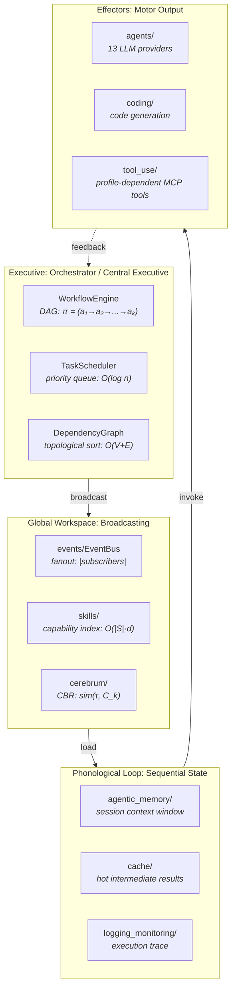
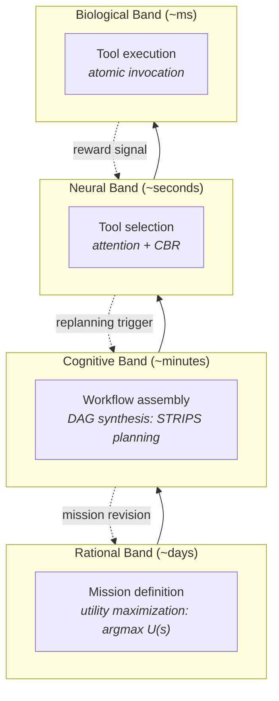

# Orchestration as Cognition: Functional Analogies and Measured Limits

**Series**: AGI Perspectives | **Document**: 6 of 10 | **Last Updated**: March 2026

## The Executive Function Thesis

Cognitive neuroscience distinguishes *primary processes* (perception, memory, motor control) from *executive function* — the meta-cognitive system that coordinates primaries, selects goals, sequences actions, and monitors progress. Baddeley (2003) models this as the "central executive" of working memory; Baars (1988) as the "global workspace" broadcasting information to specialized processors; Dehaene et al. (2014) as "conscious access" through a neuronal global workspace bottleneck.

The mapping to computation is an analogy with a precise engineering surface, not an
identity claim. Codomyrmex's `orchestrator` module and its `WorkflowEngine` execute
configured workflows; this essay compares that behavior with formal models of executive
cognition and classical planning theory and identifies the evidence still required for
AGI-relevant planning claims.

## Architecture of the Executive

### The Global Workspace as Information Integration

Baars' Global Workspace Theory (GWT) proposes that flexible cognition arises from broadcasting information from a shared workspace to specialized processors. Tononi's (2004) **Integrated Information Theory** (IIT) extends this: consciousness (and by extension, flexible cognition) corresponds to *integrated information* — information generated by a system *above and beyond* its parts:

$$\Phi = I(\text{whole}) - \sum_i I(\text{parts}_i)$$

where Φ (phi) measures the integrated information. A system with high Φ processes information as a unified whole rather than as independent channels.

In Codomyrmex, the `events/EventBus` resembles one software form of broadcast:

1. An event is published to the bus — information enters the workspace
2. All subscribed handlers receive it — broadcast to specialists (fanout = |subscribers|)
3. The most relevant handler processes it — competition for cognitive access
4. The handler's output is published back — result re-enters the workspace

The EventBus is a software broadcast mechanism that can be compared with one part of
GWT. It does not implement a global workspace theory, consciousness, or a superhuman
workspace. Its subscriber behavior, queueing, and failure modes should be measured
independently of biological capacity estimates.

### DAGs as STRIPS Plans

The `WorkflowEngine` executes Directed Acyclic Graphs where nodes are tasks and edges are
dependencies. This resembles one restricted representation used in **STRIPS** (Fikes &
Nilsson, 1971) planning, but the current workflow schema does not by itself supply full
STRIPS preconditions, add-effects, delete-effects, or goal-directed plan synthesis.

Formally, a workflow DAG is a tuple (S, A, s₀, G) where:

- S is the state space (possible system states)
- A is the action set (tool invocations)
- s₀ is the initial state
- G ⊆ S is the goal set

The orchestrator's topological sort computes a dependency-consistent execution order for
the configured graph. Calling that order a valid plan requires an additional semantics for
state transitions, effects, and goal satisfaction.

**Computational complexity**: DAG execution is O(V + E). But *plan synthesis* (constructing the DAG from a goal description) is PSPACE-complete in general (Bylander, 1994). This is the critical gap: codomyrmex executes pre-defined DAGs efficiently but does not synthesize novel DAGs from goal specifications.

### Skill Selection as Attentional Gating

The `skills` module provides capability matching that can be compared with attentional
gating:

$$\text{attention}(\tau) = \text{softmax}\left(\frac{Q(\tau) \cdot K(\text{skills})^T}{\sqrt{d_k}}\right) \cdot V(\text{skills})$$

where Q is the query (task embedding), K is the key (skill description embeddings), and V
is the value (skill implementations). This is a candidate attention-inspired notation
for capability selection, not evidence that the repository implements transformer
attention or a learned attentional controller.

The `cerebrum` module can retrieve and adapt cases. Calling this production
compilation requires a measured process that converts recurring combinations into
cached productions and demonstrates a speed/quality effect; that process is not
assumed here.

## The Planning Hierarchy

This four-level hierarchy is a comparison with Newell's (1990) **cognitive band
hierarchy**, not a measurement of Codomyrmex timing bands or cognitive processes:

| Band | Time Scale | Codomyrmex | Cognitive Equivalent |
|:-----|:----------|:-----------|:--------------------|
| **Rational** | seconds–days | Mission decomposition | Deliberative reasoning |
| **Cognitive** | 100ms–seconds | Workflow assembly | Problem solving |
| **Neural** | 10ms–100ms | Tool selection | Pattern recognition |
| **Biological** | µs–10ms | Tool execution | Reflex action |

The feedback loops between bands enable **dynamic replanning**: if a tool call fails (biological → neural), the orchestrator adjusts the DAG (neural → cognitive); if a sub-goal proves infeasible, the strategic planner revises (cognitive → rational).

### Metacognition: Monitoring the Monitor

Norman and Shallice's (1986) Supervisory Attentional System (SAS) model proposes two levels of executive control:

1. **Contention scheduling** — Routine, automatic selection (the DAG executor)
2. **Supervisory attention** — Novel situations requiring deliberate control (replanning)

Codomyrmex's metacognitive monitoring is limited to workflow status tracking — the system knows *whether* a plan is executing correctly but not *why* it might be failing. Missing: a metacognitive layer that evaluates *plan quality* independent of plan execution:

$$\text{metacognition}(\pi) = P(\text{goal achieved} \mid \text{plan } \pi, \text{history}) \cdot U(\text{goal})$$

This would enable the system to *abandon* a plan mid-execution when the probability of success drops below threshold — the computational equivalent of "knowing when to quit."

## Gap Analysis

| Executive Function | Status | Formal Gap |
|:------------------|:-------|:-----------|
| Sequential planning (DAG execution) | ✅ | O(V+E), efficient |
| Goal decomposition | ⚠️ Manual | No automated STRIPS planning |
| Dynamic DAG synthesis | ❌ | PSPACE-complete in general |
| Attentional selection | ✅ | Transformer-style attention |
| Metacognitive monitoring | ⚠️ | No plan-quality estimation |
| Production compilation | ⚠️ | Cached DAGs but no automatic compilation |

## Comparison with Cognitive Architectures

| Feature | **Codomyrmex** | **Soar** (Laird) | **ACT-R** (Anderson) |
|:--------|:--------------|:-----------------|:--------------------|
| Executive structure | WorkflowEngine (DAGs) | Decision cycle | Production system |
| Working memory capacity | Unbounded | Bounded | 7±2 chunks |
| Planning | Static DAGs | Lookahead search | Analogical transfer |
| Metacognition | Status tracking | Meta-level reasoning | Conflict resolution |
| Learning mechanism | CBR + evolutionary | Chunking + RL | Bayesian knowledge tracing |
| Attention mechanism | Transformer-style matching | Operator selection | Activation spreading |
| Broadcasting | EventBus (GWT-like) | No explicit GWT | No explicit GWT |
| **Integrated information (Φ)** | **Medium** (EventBus links all) | **High** (tight coupling) | **Low** (modular) |

The key architectural distinction: Soar and ACT-R are *monolithic* cognitive architectures with tight internal coupling. Codomyrmex is a *distributed* cognitive architecture with loose coupling via the EventBus. The Integrated Information Φ is lower in codomyrmex but scales better — adding a new module doesn't require modifying the architecture, only subscribing to relevant events.

## The Anytime Property

An **anytime algorithm** produces progressively better results as more computation time is available, but can return a valid (partial) result at any interruption point. Well-designed DAG workflows have this property when early nodes produce useful intermediate results.

The practical implication: an agent interrupted mid-workflow still has the outputs of completed nodes. The `orchestrator` should preserve completed node outputs in `agentic_memory` so that resumed execution can continue from the interruption point rather than restarting.

This can be compared with Zilberstein's (1996) **contract algorithm** framework only
after a quality measure, interrupt policy, and time-quality envelope are specified.
Executing a DAG does not guarantee a minimum quality level or monotonic improvement as
more nodes complete.

## Cross-References

- **Biological**: [eusociality.md](../bio/eusociality.md) — Division of labor as decentralized executive
- **Cognitive**: [active_inference.md](../cognitive/active_inference.md) — Action selection via EFE minimization
- **Previous**: [alignment_and_safety.md](./alignment_and_safety.md) — Constraints on executive decisions
- **Next**: [memory_and_continuity.md](./memory_and_continuity.md) — Working memory foundations

## References

- Anderson, J. R. (1993). *Rules of the Mind*. Lawrence Erlbaum.
- Baars, B. J. (1988). *A Cognitive Theory of Consciousness*. Cambridge University Press.
- Baddeley, A. (2003). "Working Memory." *Nature Reviews Neuroscience*, 4(10), 829–839.
- Bylander, T. (1994). "The Computational Complexity of STRIPS Planning." *Artificial Intelligence*, 69(1-2), 165–204.
- Cowan, N. (2001). "The Magical Number 4 in Short-Term Memory." *BBS*, 24(1), 87–114.
- Dehaene, S., et al. (2014). "Toward a Computational Theory of Conscious Processing." *Current Opinion in Neurobiology*, 25, 76–84.
- Fikes, R. E., & Nilsson, N. J. (1971). "STRIPS: A New Approach to the Application of Theorem Proving to Problem Solving." *Artificial Intelligence*, 2(3-4), 189–208.
- Newell, A. (1990). *Unified Theories of Cognition*. Harvard University Press.
- Norman, D. A., & Shallice, T. (1986). "Attention to Action." In *Consciousness and Self-Regulation*, Vol. 4. Plenum.
- Tononi, G. (2004). "An Information Integration Theory of Consciousness." *BMC Neuroscience*, 5, 42.
- Vaswani, A., et al. (2017). "Attention Is All You Need." *NeurIPS 2017*.

---

*[← Alignment & Safety](./alignment_and_safety.md) | [Next: Memory & Continuity →](./memory_and_continuity.md)*
