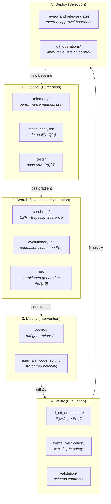

# Recursive Improvement: Search, Verification, and Claim Boundaries

**Series**: AGI Perspectives | **Document**: 4 of 10 | **Last Updated**: March 2026

## The Intelligence Explosion

Good's (1965) formulation remains the clearest: an ultraintelligent machine could design a better machine, which could design a still better one — an "intelligence explosion." Schmidhuber (2003) formalized this as the Gödel Machine: a self-referential universal problem solver that rewrites its own code whenever it can prove the rewrite improves expected reward. Bostrom (2014) extended the analysis to existential risk. Solomonoff (1964) provided the information-theoretic foundation: optimal inductive inference via the universal prior implies self-improvement as a natural consequence of compressing observed data.

Codomyrmex supports a *bounded change-evaluation workflow*. This essay traces the
workflow through five stages, states which mathematical descriptions are proposals,
and distinguishes repository gates from claims about recursive self-improvement.

## The Self-Improvement Loop

### Formal Characterization

Define the **system state** as a tuple ⟨C, T, M⟩ where C is the codebase, T is the test suite, and M is the self-model (RASP documentation + `system_discovery` output). The **fitness function** over system states:

$$F(C, T, M) = \alpha \cdot \frac{|T_{pass}|}{|T|} + \beta \cdot Q(C) + \gamma \cdot \text{Perf}(C) - \delta \cdot \text{Regressions}(C, C_{prev})$$

where Q(C) is the static quality metric (ruff violations, type coverage), Perf(C) is runtime performance, and the regression term penalizes capabilities lost during modification. The coefficients (α, β, γ, δ) encode human preferences — the *value function* of the improvement process.

A self-modification Δ is accepted iff:

$$F(C + \Delta C, T, M') > F(C, T, M) + \epsilon$$

where ε is a *noise margin* (prevents accepting trivially small improvements that may
be measurement noise), and M' is the updated self-model. This equation is not the
repository's current acceptance algorithm: the coefficients, noise margin, measured
performance function, and population semantics are not defined as one executable
contract. It is a candidate research model that becomes testable only after its
configuration and scoring implementation are added.

### The Fitness Landscape

Wright's (1932) fitness landscape metaphor provides geometric intuition. The system state C exists in a high-dimensional space where each coordinate represents a design decision. The fitness function F defines a surface over this space. Self-improvement is a walk on this landscape.

Three landscape properties determine the dynamics of improvement:

| Property | Formal Definition | Codomyrmex Instance |
|:---------|:-----------------|:-------------------|
| **Ruggedness** | # local optima / unit volume | High — many design trade-offs create local peaks |
| **Neutrality** | Fraction of mutations with ΔF ≈ 0 | Moderate — many changes are cosmetic (comments, formatting) |
| **Epistasis** | Non-additivity: F(AB) ≠ F(A) + F(B) - F(∅) | Strong — module interactions create non-linear effects |

Strong epistasis would imply that combinatorial changes can access regions unreachable
by single-module changes. The repository's multi-agent editing surface is compatible
with that hypothesis, but concurrent sessions are not a controlled evolutionary
experiment and no population-level fitness result is established here.

### Developmental Constraints

Kauffman's (1993) NK model predicts that ruggedness increases with epistasis (K), making search harder but potentially placing higher peaks available. Codomyrmex's modular architecture can be analyzed as a source of **developmental constraints** (Maynard Smith et al., 1985): module boundaries may channel modification along specific directions. This is an architectural interpretation, not evidence that the repository realizes the biological mechanism.

These constraints may reduce the effective dimensionality of some changes, but module
boundaries do not make modules independent. Cross-module effects, shared configuration,
and integration contracts must be measured for each change; no optimization-cell count
is inferred from the module inventory.

## The Gödel Machine Connection

Schmidhuber's (2003) Gödel Machine searches for *provably optimal* self-modifications. The search space is the set of all programs expressible in itself (self-referential). When it finds a modification whose improvement can be *formally proved*, it applies the modification.

Codomyrmex uses a weaker verification criterion: modifications may be accepted by
selected tests and validation checks, not by a single formal proof. Current test counts
are generated by the inventory script and must not be embedded in this essay. Passing a
finite suite is empirical evidence about exercised cases, not deductive proof of
universal correctness. The formalism-to-code crosswalk records that boundary; see
[formal_specification.md](./formal_specification.md) and
[the manuscript crosswalk](../manuscript/10_formalism_code_crosswalk.md).

The `evolutionary_ai` module adds a critical capability: **population-based search**. Rather than the Gödel Machine's exhaustive proof search, `evolutionary_ai` maintains a *population* of candidate modifications and applies selection pressure:

$$p(c' \text{ survives}) = \frac{e^{F(c') / T}}{\sum_{c'' \in \text{population}} e^{F(c'') / T}}$$

where T is the selection temperature (high T → exploration; low T → exploitation). This is the **Boltzmann selection** strategy from simulated annealing, adapted to codebase evolution.

## The Halting Problem for Self-Improvement

A subtle issue: self-improvement must *converge*. An improvement loop that never terminates is itself a kind of failure. The convergence condition:

$$\sum_{t=0}^{\infty} [F(C_{t+1}) - F(C_t)] < \infty$$

This sum converging implies that improvements become vanishingly small — the system approaches a fitness peak. The danger is **fitness landscape shifting**: as the system modifies itself, the landscape itself changes (because the evaluation criteria are partly internal). This creates a *Red Queen* dynamic (van Valen, 1973): the system must keep improving just to maintain its relative fitness.

Codomyrmex bounds one quality dimension through a coverage floor
(`fail_under=60` in `pyproject.toml`). That gate does not measure total fitness, does
not compare every regression dimension, and does not guarantee monotonic improvement or
convergence to a local optimum.

## Five Safety Bounds

| Bound | Mechanism | Formal Property |
|:------|:----------|:---------------|
| **Test constitution** | Selected suites and coverage gate may be required | Evidence for exercised cases; not F(C') ≥ F(C) over all dimensions |
| **Trust governor** | Policy and profile checks where configured | A bounded access mechanism; effectiveness requires threat tests |
| **Human approval** | Review and release controls | External accountability boundary, not a proof oracle |
| **Formal verification** | Generic or selected invariant obligations | Proof of supplied obligations only; no universal kernel proof |
| **Containment** | Sandboxing/container controls where enabled | Resource bounds only when configured and tested |

Together these mechanisms provide a reviewable change-control process. They do not
establish safe autopoiesis, autonomous self-improvement, or that all constraints are
outside the system's modification scope.

## Lyapunov Stability of the Improvement Loop

A formal stability analysis of the self-improvement loop uses **Lyapunov's direct method**. Define a Lyapunov function:

$$V(C_t) = F^* - F(C_t, T, M_t) \geq 0$$

where F* is the (unknown) global fitness optimum. V(C_t) measures the "distance from optimal" — always non-negative, zero only at the optimum.

For the self-improvement loop to be **Lyapunov stable**, we need:

$$\dot{V}(C_t) = V(C_{t+1}) - V(C_t) = F(C_t) - F(C_{t+1}) \leq 0$$

If a future executable protocol established F(C') ≥ F(C) for every accepted change,
then this conditional Lyapunov argument would apply. The current coverage gate is not
such a total-order ratchet, so monotonic convergence is unestablished.

**Asymptotic stability** requires the stricter condition: V → 0 as t → ∞. This is *not guaranteed* — the system may stall at a local optimum where F < F*. The gap F* - F(C_local) is the **optimality gap** — the price of bounded self-improvement.

Population-based search is a possible route to testing the diversity hypothesis. The
presence of an `evolutionary_ai` module alone does not establish that it is connected
to repository change selection or that it increases the probability of a global
optimum.

## Information-Theoretic Speed Limits on Self-Improvement

There are fundamental limits on how fast a system can self-improve, independent of computational resources. Bremermann (1962) derived a limit on the rate of information processing:

$$R_{max} = \frac{mc^2}{h \ln 2} \approx 1.36 \times 10^{50} \text{ bits/s/kg}$$

More practically, the **algorithmic speed limit** for self-improvement is bounded by the mutual information between the system's current state and its potential improvements:

$$\Delta F / \Delta t \leq I(C_t; C^*) \cdot R_{compute}$$

where I(C_t; C*) is the algorithmic mutual information between the current codebase and the optimal one, and R_compute is the computational rate. As the system improves and approaches C*, the mutual information I decreases — improvements become harder to find. This predicts *diminishing returns* on self-improvement, consistent with the empirical observation that the first improvements are largest and subsequent improvements converge.

## Cross-References

- **Biological**: [evolution.md](../bio/evolution.md) — Selection pressure and fitness landscapes
- **Cognitive**: [industrialization.md](../cognitive/industrialization.md) — Quality gates as developmental constraints
- **Previous**: [world_models.md](./world_models.md) — World models enable prediction of modification effects
- **Next**: [alignment_and_safety.md](./alignment_and_safety.md) — Safety constraints on self-improvement

## References

- Bostrom, N. (2014). *Superintelligence*. Oxford University Press.
- Good, I. J. (1965). "Speculations Concerning the First Ultraintelligent Machine." *Advances in Computers*, 6, 31–88.
- Kauffman, S. A. (1993). *The Origins of Order*. Oxford University Press.
- Maynard Smith, J., et al. (1985). "Developmental Constraints and Evolution." *Q. Rev. Biol.*, 60(3), 265–287.
- Schmidhuber, J. (2003). "Gödel Machines." arXiv:cs/0309048.
- Solomonoff, R. J. (1964). "A Formal Theory of Inductive Inference." *Information and Control*, 7(1), 1–22.
- van Valen, L. (1973). "A New Evolutionary Law." *Evolutionary Theory*, 1, 1–30.
- Wright, S. (1932). "The Roles of Mutation, Inbreeding, Crossbreeding and Selection in Evolution." *Proceedings of the 6th International Congress of Genetics*, 1, 356–366.

---

*[← World Models](./world_models.md) | [Next: Alignment & Safety →](./alignment_and_safety.md)*
