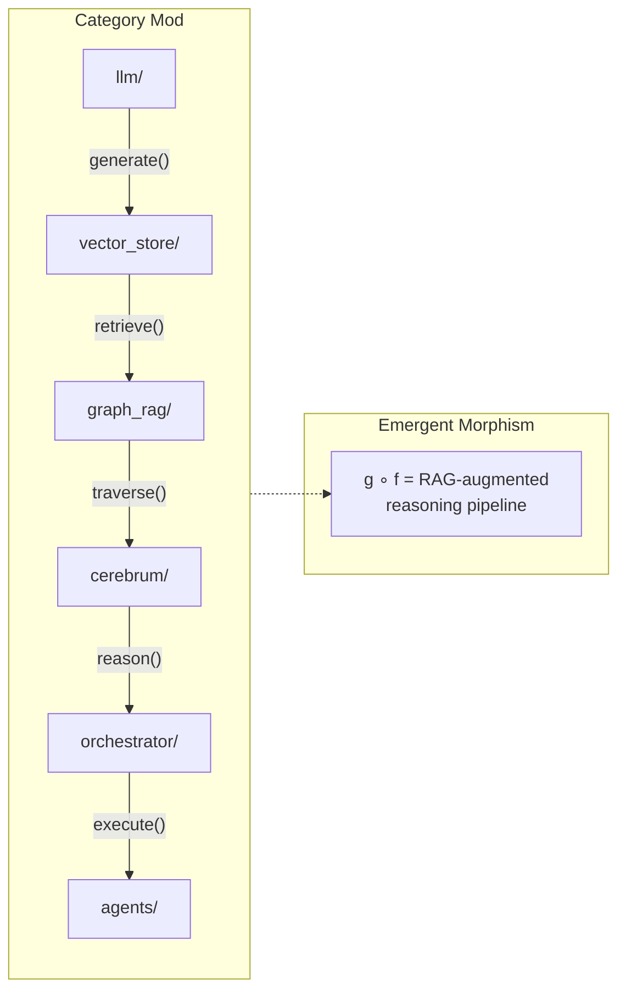
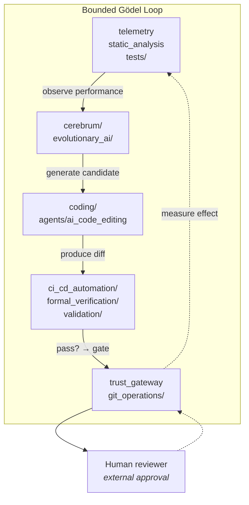

# Architectural Scaffolding: Composability Hypotheses and Code Anchors

**Series**: AGI Perspectives | **Document**: 1 of 10 | **Last Updated**: March 2026

## The Scaffolding Hypothesis

The AGI literature converges on a structural observation: general intelligence does not emerge from a single algorithm but from an *architecture* that allows many algorithms to interoperate, share representations, and be composed in novel ways. Newell (1990) formalized this in his unified theories of cognition; Goertzel (2014) operationalized it in the OpenCog AGI framework; Laird (2012) implemented it in Soar. The common thread is that generality requires *scaffolding* — a set of architectural properties that enable the system to acquire new capabilities without fundamental redesign.

This essay treats five architectural properties as scaffolding hypotheses. Codomyrmex
contains mechanisms relevant to those properties, but their presence does not establish
generality or AGI capability. Each mapping is therefore separated into a code anchor, a
formal interpretation, and an evidence gap.

## Formal Preconditions

### Hypothesis 1: Composability — A Category-Inspired View

Goertzel's analysis of OpenCog identifies *combinatorial composability* as the first requirement. Category theory provides a useful notation, but the repository does not currently define the objects and morphisms needed to claim a category. A proposed **Mod** abstraction would treat:

- **Objects** as Codomyrmex modules and their declared interfaces
- **Morphisms** as validated module invocations or adapter functions
- **Composition** as a typed sequential workflow, when the output of `f: A → B` is accepted by `g: B → C`

MCP transport alone does not guarantee associativity, identity morphisms, or semantic
preservation. Those properties would require typed composition tests and a specification
of failure, cancellation, and side effects.

The MCP tool inventory is a capability surface, not a hom-set cardinality. Counting
decorators does not measure valid compositions, semantic compatibility, or emergent
capability. The formalism-to-code crosswalk in the manuscript records this distinction.

**Measurement requirement**: the repository inventory and dependency graph can quantify
available modules, edges, and *enumerated* compatible paths. Those counts are not
reported here as evidence of useful composition: a path is only a candidate until its
types, effects, failure semantics, and tests are checked. A reproducible composition
benchmark should report valid-path yield, failure modes, and task performance rather
than infer capability from graph size.

### Hypothesis 2: Self-Description — A Discoverable Capability Surface

Legg and Hutter's (2007) formal definition of universal intelligence requires that an agent model its own capabilities:

$$\Upsilon(\pi) = \sum_{\mu \in E} 2^{-K(\mu)} V_\mu^\pi$$

where Υ is the intelligence measure, π is the agent's policy, μ ranges over environments, K(μ) is the Kolmogorov complexity of the environment, and V is the value achieved. Critically, an agent maximizing Υ must *know what it can do* — self-description is prerequisite to policy optimization over diverse environments.

Maturana and Varela's (1980) autopoiesis formalizes a biological notion of
organizational closure. The repository should not be described as autopoietic merely
because it can inspect itself. A narrower, testable claim is that Codomyrmex exposes a
partial capability-discovery surface:

- **`system_discovery`** — Dynamically scans all top-level modules via `scan_all_modules()`, producing a typed `ModuleHealthReport` for each. This is the system's *proprioceptive loop*.
- **RASP documentation** — module metadata can serve as a maintained description for
  humans and tooling; it is not automatically a coherent self-model used for planning.
- **`@mcp_tool` registration** — selected profiles can enumerate registered tools and
  schemas. This is a discoverable interface surface, not a complete morphism set or a
  model of the system's competence.

The self-reference observation is useful as a test design: verify whether discovery
can describe its own registration, documentation, and health status without special
cases. Passing such a fixed-point-shaped test would establish self-description under
that test, not autopoiesis, a quine, or autonomous self-knowledge.

### Precondition 3: Open-Ended Tool Acquisition — Algorithmic Information Gain

Hernández-Orallo's (2017) framework for evaluating intelligence emphasizes *open-ended task competence*. Formally, a system's generality G can be approximated by the diversity of environments in which it achieves non-trivial performance:

$$G(\pi) = |\{i \in \mathcal{E} : V_i^\pi > V_i^{random}\}|$$

Increasing G requires acquiring new capabilities. Codomyrmex supports open-ended acquisition through three mechanisms:

- **`plugin_system`** — Runtime loading via `PluginManager.load_plugin(path)`. The `PluginRegistry` maintains a capability index updated without system restart.
- **`skills`** — Declarative skill descriptors mapping natural-language capability descriptions to executable implementations via `SkillRegistry.match(query)`.
- **MCP dynamic discovery** — New modules with `mcp_tools.py` are automatically discovered by `scan_module_tools()` and registered without core code changes.

The information-theoretic interpretation: each new module increases the system's Kolmogorov complexity K(system) and the conditional algorithmic mutual information I(system; environment) — the system becomes capable of compressing a wider class of environments.

### Precondition 4: Persistent Memory — The Temporal Binding Problem

Lake et al.'s (2017) "Building Machines That Learn and Think Like People" identifies *learning-to-learn* as essential, which presupposes persistent memory spanning individual executions. Without memory, each invocation is a fresh draw from the prior — no Bayesian updating is possible.

The `agentic_memory` module provides multi-tier persistence implementing Atkinson and Shiffrin's (1968) modal model:

| Store | Implementation | Biological Analogue | Decay Rate |
|:------|:--------------|:-------------------|:-----------|
| Sensory register | LLM context window | Iconic / echoic memory | ~ms |
| Short-term | `MemoryStore` session state | Phonological loop | Session-scoped |
| Long-term (episodic) | Obsidian vault (19-submodule bridge) | Hippocampal formation | Persistent |
| Long-term (semantic) | `vector_store` embeddings | Neocortical consolidation | Persistent |
| Procedural | `skills` registry | Basal ganglia | Quasi-permanent |

The temporal binding problem: how does information transfer between stores? Currently, consolidation is explicit (agents call `memory.store()`). Missing: an automatic consolidation process analogous to hippocampal replay during sleep (Diekelmann & Born, 2010).

### Hypothesis 5: Recursive Improvement — Bounded Change Evaluation

Good's (1965) intelligence explosion and Schmidhuber's (2003) Gödel Machine formalize recursive self-improvement: a system S that can construct S' > S. The Gödel Machine provably self-improves by searching for self-modifications whose benefits can be formally proved.

Codomyrmex supports parts of a bounded change-evaluation workflow:

The human reviewer is an external approval and accountability boundary, not a literal
oracle that discharges a Gödelian proof obligation. The workflow can propose a change,
run selected structural and behavioral checks, and require review before release. That
is evidence for bounded change evaluation and corrigibility-oriented process design;
it is not an implementation of a Gödel Machine, autonomous recursive improvement, or
convergence guarantee.

## A Category-Inspired Observation About Module Identity

A deep structural observation: the Yoneda lemma from category theory states that an object is fully characterized by its relationships to all other objects. In **Mod**, a module M is fully characterized by the set of all morphisms into and out of M:

$$M \cong \text{Nat}(\text{Hom}(-, M), F)$$

This suggests a useful engineering question: which observable interfaces distinguish
one module from another? Codomyrmex records APIs, dependencies, dependents, tests, and
documentation, but that record is not the full presheaf required by Yoneda and the
repository does not define **Mod** as a category. Documentation is therefore evidence
about a module's public description, not the module itself or an informationally
equivalent representation. A future category-level treatment must define objects,
morphisms, identities, composition, and observational equivalence before invoking the
lemma as more than an analogy.

## A Prospective Topos-Theoretic Research Hypothesis

Pushing the category-theoretic view further is a research hypothesis, not a property
of the current implementation. No category **Mod**, sheaf of valid states, or topos is
implemented. The formal-specification document can motivate a future construction,
but the required closure and gluing definitions are still missing.

In a topos, there exists a **subobject classifier** Ω that generalizes the Boolean values {true, false}. A possible future Codomyrmex model could associate an observation-valued trust state with each module-action pair:

$$\Omega = \{\text{UNTRUSTED}, \text{VERIFIED}, \text{TRUSTED}\}$$

The existing trust labels must not be called a subobject classifier: three labels do
not supply the categorical structure or internal logic required by that term. A future
model would need to define the order, predicates, pullbacks, and composition laws, then
test them against counterexamples. Until then, the trust gateway is an engineering
policy boundary, not a logical functor between sub-toposes.

The notation below is a candidate interface for that future model, not an implemented
theorem or safety criterion:

$$\chi_{safe} : \text{candidate action observations} \to \Omega$$

The current system can enforce selected policy checks and expose restricted tool
profiles. It does not establish continuous safety, an internal language, or a functor
between sub-toposes.

## Evidence Rubric, Not a Capability Score

A scalar scaffolding score would imply commensurable dimensions, defensible weights,
validated measurements, and a comparison protocol that this repository does not yet
provide. I therefore do not report an index or rank Codomyrmex against other
architectures. The crosswalk uses an auditable status and an explicit missing-evidence
field instead:

| Property | Current evidence | What would justify a stronger claim |
|:---------|:-----------------|:------------------------------------|
| Composability | Typed proposals, tool schemas, and selected workflow tests | A defined composition calculus with effect/failure laws and task-level yield |
| Self-description | Module discovery, inventories, and profile enumeration | A tested self-model used for planning and robustly updated after change |
| Tool acquisition | Plugin and skill registration surfaces | Reproducible acquisition tasks, synthesis boundaries, compatibility, and rollback |
| Persistent memory | Durable stores and explicit recall APIs | Paired retention/forgetting experiments with retrieval and transfer metrics |
| Recursive improvement | Proposal, verification, review, and release gates | Pre-registered change benchmarks with rollback, safety, and human-oversight outcomes |

The table is a research rubric, not a capability measurement. It should be replaced by
measured results only after the corresponding protocols, seeds, artifacts, and failure
criteria are implemented.

## Gap Analysis

| Precondition | Status | Formal Gap |
|:-------------|:-------|:-----------|
| Composability (category-inspired) | Partial | Define typed composition, effects, identity, failure semantics, and task-level yield |
| Self-description | Partial | Use discovery data in planning and test updates after module changes |
| Tool acquisition | Surface exists; outcome unmeasured | Benchmark acquisition, synthesis, compatibility, and rollback |
| Persistent memory | Persistence APIs exist | Measure consolidation, forgetting, retrieval, and transfer under paired runs |
| Recursive improvement | Bounded evaluation workflow | Measure proposed changes under explicit review, rollback, and safety criteria |

## Cross-References

- **Biological**: [superorganism.md](../bio/superorganism.md) — Composability from a biological systems perspective
- **Cognitive**: [cognitive_modeling.md](../cognitive/cognitive_modeling.md) — The cognitive architecture that self-description enables
- **Next**: [tool_use_and_agency.md](./tool_use_and_agency.md) — How tool composition creates agency

## References

- Atkinson, R. C., & Shiffrin, R. M. (1968). "Human Memory: A Proposed System." In *Psychology of Learning and Motivation*, 2, 89–195.
- Diekelmann, S., & Born, J. (2010). "The Memory Function of Sleep." *Nature Reviews Neuroscience*, 11(2), 114–126.
- Fallenstein, B., & Soares, N. (2017). "Agent Foundations for Aligning Machine Intelligence." *MIRI Technical Report*.
- Goertzel, B. (2014). *Artificial General Intelligence*. Springer.
- Good, I. J. (1965). "Speculations Concerning the First Ultraintelligent Machine." *Advances in Computers*, 6, 31–88.
- Hernández-Orallo, J. (2017). *The Measure of All Minds*. Cambridge University Press.
- Laird, J. E. (2012). *The Soar Cognitive Architecture*. MIT Press.
- Lake, B. M., et al. (2017). "Building Machines That Learn and Think Like People." *BBS*, 40, e253.
- Legg, S., & Hutter, M. (2007). "Universal Intelligence." *Minds and Machines*, 17(4), 391–444.
- Maturana, H. R., & Varela, F. J. (1980). *Autopoiesis and Cognition*. D. Reidel.
- Newell, A. (1990). *Unified Theories of Cognition*. Harvard University Press.
- Russell, S. (2019). *Human Compatible*. Viking.
- Schmidhuber, J. (2003). "Gödel Machines." arXiv:cs/0309048.

---

*[← README](./README.md) | [Next: Tool Use & Agency →](./tool_use_and_agency.md)*
