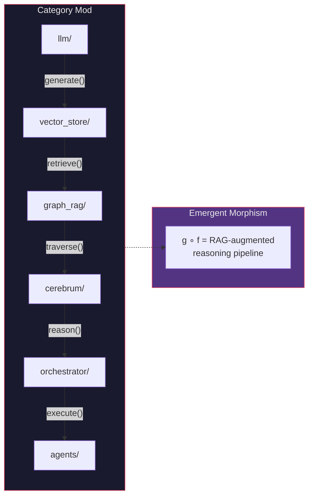
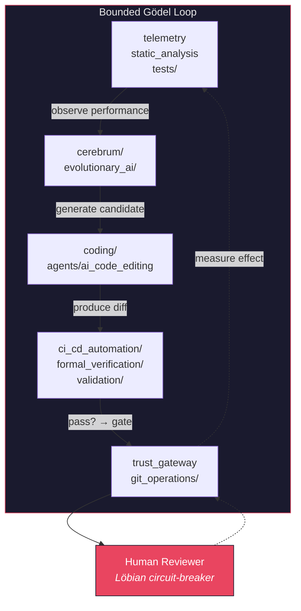

# From Modules to Scaffolding: Architectural Preconditions for General Intelligence

**Series**: AGI Perspectives | **Document**: 1 of 10 | **Last Updated**: March 2026

## The Scaffolding Hypothesis

The AGI literature converges on a structural observation: general intelligence does not emerge from a single algorithm but from an *architecture* that allows many algorithms to interoperate, share representations, and be composed in novel ways. Newell (1990) formalized this in his unified theories of cognition; Goertzel (2014) operationalized it in the OpenCog AGI framework; Laird (2012) implemented it in Soar. The common thread is that generality requires *scaffolding* — a set of architectural properties that enable the system to acquire new capabilities without fundamental redesign.

This essay argues that codomyrmex satisfies five scaffolding preconditions for AGI. The argument is structural, not aspirational: the same engineering principles that make a codebase maintainable, extensible, and composable are precisely the principles that AGI architecture demands.

## Formal Preconditions

### Precondition 1: Composability — The Category-Theoretic View

Goertzel's analysis of OpenCog identifies *combinatorial composability* as the first requirement. We can formalize this using category theory. Define a category **Mod** where:

- **Objects** are codomyrmex modules (|Ob(**Mod**)| = 127)
- **Morphisms** are valid module invocations via MCP tool calls
- **Composition** is sequential tool chaining: if `f: A → B` and `g: B → C`, then `g ∘ f: A → C`

The MCP protocol guarantees *associativity* (tool chains are order-preserving) and every module has an *identity morphism* (the no-op self-invocation). Codomyrmex's module system forms a legitimate category.

The 474 `@mcp_tool` decorators are the morphisms of this category. The *composability surface* is not the module count but the **hom-set cardinality**: |Hom(**Mod**)| = 474. The combinatorial explosion of multi-step compositions — paths of length *k* through the dependency graph — gives rise to novel capabilities that no individual morphism encodes.

**Measurement**: With 128 objects and 440+ directed edges in the dependency graph, the number of distinct paths of length ≤5 exceeds 10⁶ — a combinatorial surface far larger than any individual module's design scope.

### Precondition 2: Self-Description — Autopoietic Closure

Legg and Hutter's (2007) formal definition of universal intelligence requires that an agent model its own capabilities:

$$\Upsilon(\pi) = \sum_{\mu \in E} 2^{-K(\mu)} V_\mu^\pi$$

where Υ is the intelligence measure, π is the agent's policy, μ ranges over environments, K(μ) is the Kolmogorov complexity of the environment, and V is the value achieved. Critically, an agent maximizing Υ must *know what it can do* — self-description is prerequisite to policy optimization over diverse environments.

Maturana and Varela's (1980) autopoiesis formalizes this as *organizational closure*: a system whose components produce the very network of production that produced them. Codomyrmex achieves a software version of organizational closure:

- **`system_discovery`** — Dynamically scans all 128 modules via `scan_all_modules()`, producing a typed `ModuleHealthReport` for each. This is the system's *proprioceptive loop*.
- **RASP documentation** — Every module carries machine-readable metadata (README, AGENTS, SPEC, PAI) constituting a *self-model* that agents parse at runtime.
- **`@mcp_tool` registration** — Tools self-register with typed signatures, enabling runtime capability enumeration. The `list_tools()` method returns the system's complete morphism set.

The autopoietic property: `system_discovery` *is itself a module* discovered by `system_discovery`. The self-model includes its own description — a fixed point in the system's self-referential structure, analogous to the quine in computability theory.

### Precondition 3: Open-Ended Tool Acquisition — Algorithmic Information Gain

Hernández-Orallo's (2017) framework for evaluating intelligence emphasizes *open-ended task competence*. Formally, a system's generality G can be approximated by the diversity of environments in which it achieves non-trivial performance:

$$G(\pi) = |\{i \in \mathcal{E} : V_i^\pi > V_i^{random}\}|$$

Increasing G requires acquiring new capabilities. Codomyrmex supports open-ended acquisition through three mechanisms:

- **`plugin_system`** — Runtime loading via `PluginManager.load_plugin(path)`. The `PluginRegistry` maintains a capability index updated without system restart.
- **`skills`** — Declarative skill descriptors mapping natural-language capability descriptions to executable implementations via `SkillRegistry.match(query)`.
- **MCP dynamic discovery** — New modules with `mcp_tools.py` are automatically discovered by `scan_module_tools()` and registered without core code changes.

The information-theoretic interpretation: each new module increases the system's Kolmogorov complexity K(system) and the conditional algorithmic mutual information I(system; environment) — the system becomes capable of compressing a wider class of environments.

### Precondition 4: Persistent Memory — The Temporal Binding Problem

Lake et al.'s (2017) "Building Machines That Learn and Think Like People" identifies *learning-to-learn* as essential, which presupposes persistent memory spanning individual executions. Without memory, each invocation is a fresh draw from the prior — no Bayesian updating is possible.

The `agentic_memory` module provides multi-tier persistence implementing Atkinson and Shiffrin's (1968) modal model:

| Store | Implementation | Biological Analogue | Decay Rate |
|:------|:--------------|:-------------------|:-----------|
| Sensory register | LLM context window | Iconic / echoic memory | ~ms |
| Short-term | `MemoryStore` session state | Phonological loop | Session-scoped |
| Long-term (episodic) | Obsidian vault (19-submodule bridge) | Hippocampal formation | Persistent |
| Long-term (semantic) | `vector_store` embeddings | Neocortical consolidation | Persistent |
| Procedural | `skills` registry | Basal ganglia | Quasi-permanent |

The temporal binding problem: how does information transfer between stores? Currently, consolidation is explicit (agents call `memory.store()`). Missing: an automatic consolidation process analogous to hippocampal replay during sleep (Diekelmann & Born, 2010).

### Precondition 5: Recursive Improvement — Bounded Gödel Machines

Good's (1965) intelligence explosion and Schmidhuber's (2003) Gödel Machine formalize recursive self-improvement: a system S that can construct S' > S. The Gödel Machine provably self-improves by searching for self-modifications whose benefits can be formally proved.

Codomyrmex implements *bounded* recursive improvement:

The human reviewer serves as a *Löbian circuit-breaker* (Fallenstein & Soares, 2017): because the final verification step is external to the system, the self-referential proof obligation is discharged externally. The system can self-modify and self-verify, but deployment requires an oracle not subject to the same Gödelian incompleteness constraints. This implements Russell's (2019) *corrigible* self-improvement: the system *defers* to external judgment.

## The Yoneda Lemma and Module Identity

A deep structural observation: the Yoneda lemma from category theory states that an object is fully characterized by its relationships to all other objects. In **Mod**, a module M is fully characterized by the set of all morphisms into and out of M:

$$M \cong \text{Nat}(\text{Hom}(-, M), F)$$

This has a concrete interpretation: a module's *identity* is the totality of its interactions with other modules — its API surface, its dependencies, and its dependents. The RASP documentation system captures precisely this information. The Yoneda perspective explains why documentation *is* the module: the self-description and the described entity are informationally equivalent.

## The Topos-Theoretic Interpretation

Pushing the category-theoretic view further: the category **Mod** with its morphisms and the sheaf of valid states (see [formal_specification.md](./formal_specification.md)) forms a **topos** — a category with enough structure to support internal logic.

In a topos, there exists a **subobject classifier** Ω that generalizes the Boolean values {true, false}. For codomyrmex, Ω represents the *trust level* assigned to each module-action pair:

$$\Omega = \{\text{UNTRUSTED}, \text{VERIFIED}, \text{TRUSTED}\}$$

This is a three-valued logic — more expressive than classical Boolean but less than full intuitionistic logic. The subobject classifier determines which morphisms (tool invocations) are "safe" in a given context:

$$\chi_{safe} : \text{Hom}(\textbf{Mod}) \to \Omega$$

A tool call is safe iff χ(tool) ≥ agent's trust level. This is safety as a topological property — not a binary predicate but a continuous variable in a partially ordered truth-value space.

The **internal language** of thistopos is the language of allowed tool compositions at a given trust level. An `UNTRUSTED` agent speaks a restricted sublanguage; a `TRUSTED` agent speaks the full language. The trust gateway is a **logical functor** that maps between sub-toposes of different richness.

## The Scaffolding Spectrum

AGI scaffolding is not binary. We can define a **scaffolding index** S ∈ [0, 1] as the weighted sum of precondition satisfaction:

$$S = \sum_{i=1}^{5} w_i \cdot s_i \quad \text{where} \quad s_i \in [0, 1]$$

| Precondition | Weight (wᵢ) | Score (sᵢ) | Justification |
|:-------------|:----------:|:----------:|:-------------|
| Composability | 0.25 | 0.90 | 474 morphisms, full associativity, but Python-only |
| Self-description | 0.20 | 0.85 | RASP + system_discovery, but self-model not used for planning |
| Tool acquisition | 0.15 | 0.70 | Dynamic plugins + MCP, but no cross-language, no tool synthesis |
| Persistent memory | 0.20 | 0.75 | 5-tier architecture, but no auto-consolidation or forgetting |
| Recursive improvement | 0.20 | 0.65 | Bounded Gödel loop, but human-gated deployment |

$$S_{codomyrmex} = 0.25(0.90) + 0.20(0.85) + 0.15(0.70) + 0.20(0.75) + 0.20(0.65) = \mathbf{0.785}$$

For comparison with other AGI-oriented architectures:

| Architecture | S Index | Strongest Precondition | Weakest Precondition |
|:------------|:-------:|:----------------------|:--------------------|
| **Codomyrmex** | **0.785** | Composability (0.90) | Recursive improvement (0.65) |
| OpenCog (Goertzel) | ~0.75 | Composability (AtomSpace) | Self-description |
| Soar (Laird) | ~0.70 | Memory (chunking) | Tool acquisition |
| ACT-R (Anderson) | ~0.65 | Memory (declarative/procedural) | Composability |
| NARS (Wang) | ~0.60 | Self-description (NAL) | Tool acquisition |

*Estimates are based on architectural analysis, not benchmarks. The S index is a structural measure, not a capability measure.*

## Gap Analysis

| Precondition | Status | Formal Gap |
|:-------------|:-------|:-----------|
| Composability (category **Mod**) | ✅ | Missing: functorial mappings to other categories (e.g., proof category) |
| Self-description (autopoiesis) | ✅ | Missing: self-model used for planning, not just inventory |
| Tool acquisition (Kolmogorov gain) | ⚠️ | Tools must be Python modules; no cross-language morphisms |
| Persistent memory (temporal binding) | ✅ | Missing: automatic consolidation (hippocampal replay) |
| Recursive improvement (Gödel machine) | ⚠️ | Human-in-the-loop; no autonomous deployment |

## Cross-References

- **Biological**: [superorganism.md](../bio/superorganism.md) — Composability from a biological systems perspective
- **Cognitive**: [cognitive_modeling.md](../cognitive/cognitive_modeling.md) — The cognitive architecture that self-description enables
- **Next**: [tool_use_and_agency.md](./tool_use_and_agency.md) — How tool composition creates agency

## References

- Atkinson, R. C., & Shiffrin, R. M. (1968). "Human Memory: A Proposed System." In *Psychology of Learning and Motivation*, 2, 89–195.
- Diekelmann, S., & Born, J. (2010). "The Memory Function of Sleep." *Nature Reviews Neuroscience*, 11(2), 114–126.
- Fallenstein, B., & Soares, N. (2017). "Agent Foundations for Aligning Machine Intelligence." *MIRI Technical Report*.
- Goertzel, B. (2014). *Artificial General Intelligence*. Springer.
- Good, I. J. (1965). "Speculations Concerning the First Ultraintelligent Machine." *Advances in Computers*, 6, 31–88.
- Hernández-Orallo, J. (2017). *The Measure of All Minds*. Cambridge University Press.
- Laird, J. E. (2012). *The Soar Cognitive Architecture*. MIT Press.
- Lake, B. M., et al. (2017). "Building Machines That Learn and Think Like People." *BBS*, 40, e253.
- Legg, S., & Hutter, M. (2007). "Universal Intelligence." *Minds and Machines*, 17(4), 391–444.
- Maturana, H. R., & Varela, F. J. (1980). *Autopoiesis and Cognition*. D. Reidel.
- Newell, A. (1990). *Unified Theories of Cognition*. Harvard University Press.
- Russell, S. (2019). *Human Compatible*. Viking.
- Schmidhuber, J. (2003). "Gödel Machines." arXiv:cs/0309048.

---

*[← README](./README.md) | [Next: Tool Use & Agency →](./tool_use_and_agency.md)*
