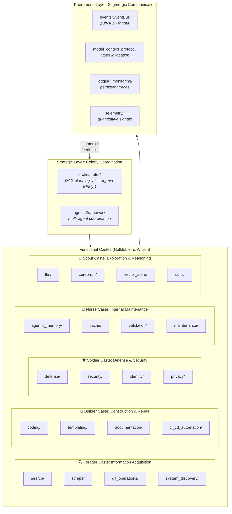
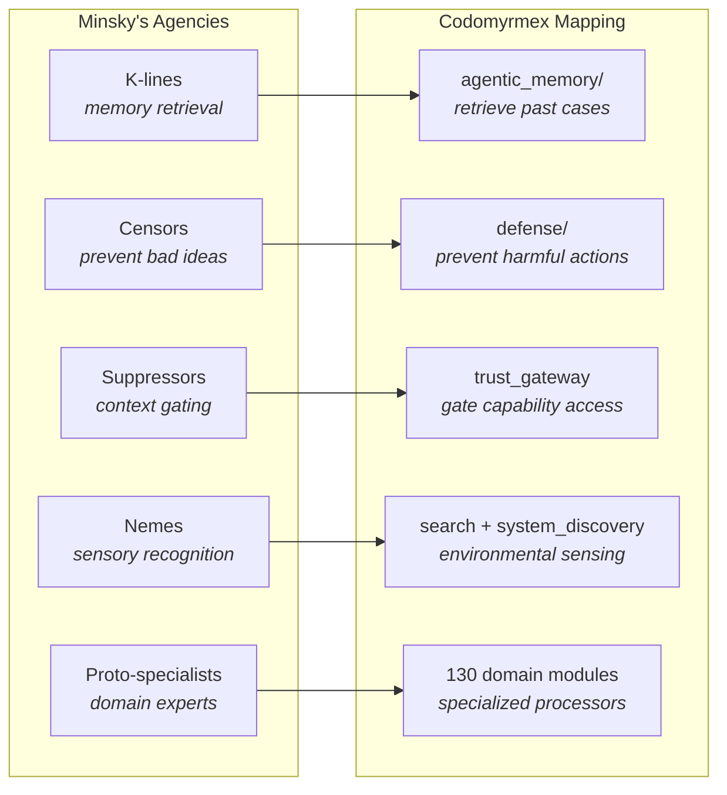

# The Colony Thesis: Distributed AGI as Superorganism

**Series**: AGI Perspectives | **Document**: 10 of 10 (Capstone) | **Last Updated**: March 2026

## The Central Argument

This essay presents the *Colony Thesis*: general intelligence need not reside in a single agent. It can emerge from a colony of specialized agents operating over a shared substrate — and codomyrmex's architecture is precisely this colony model.

The intellectual lineage runs through three traditions:

1. **Society of Mind** (Minsky, 1986): Intelligence from many individually unintelligent "agents." The mind is a committee, not a dictator.
2. **Subsumption Architecture** (Brooks, 1991): Complex behavior from layered reactive agents without central planning. Intelligence is embodied and distributed — "intelligence without representation."
3. **Comprehensive AI Services** (Drexler, 2019): AGI-level capabilities achieved via composition of narrow services, avoiding the creation of a unified superintelligent agent — making the system both more controllable and more incrementally deployable.

The Colony Thesis synthesizes these: codomyrmex is a **society** of 130 modules (Minsky), organized in **subsumption layers** (Brooks), composed through a **service protocol** (Drexler/MCP), without any module — or combination of modules — constituting a general intelligence. The generality emerges from the colony's interaction dynamics, not from any component's individual capability.

## The Colony Model

### The Queen Paradox

In ant colonies, the queen does not command — she provides *reproductive coherence*. The colony's behavior emerges from individual worker decisions governed by local rules and pheromone gradients. Similarly, codomyrmex's `orchestrator` does not micromanage modules — it defines *workflow DAGs* that coordinate module invocations without controlling internal logic.

The "queen paradox" is deeper: the orchestrator is *itself a module* in the colony. It does not stand above the system — it participates in it. The colony has no external control point; coordination emerges from the same substrate as computation. This is Hofstadter's (1979) **strange loop**: the controller is contained within the controlled, and the system's coherence arises from this self-referential architecture.

## The Tangled Hierarchy

Hofstadter's (1979) concept of a **tangled hierarchy** (or "strange loop") describes a system where moving through the hierarchy's levels brings you back to where you started. In Gödel's incompleteness, the statements "talk about" the formal system that contains them, creating a self-referential loop.

Codomyrmex exhibits multiple tangled hierarchies:

1. **`system_discovery` discovers itself** — It is a module that scans modules, including itself. The scanner is part of the scanned set.

2. **RASP documents describe the RASP convention** — `docs/agi/SPEC.md` specifies how SPEC files should be written, including itself.

3. **`defense` defends against attacks on `defense`** — The security module must protect itself from compromise.

4. **`ci_cd_automation` tests `ci_cd_automation`** — The CI pipeline is tested by the CI pipeline.

Each strange loop creates what Hofstadter calls an "I" — a pattern in a system that perceives itself as a pattern. The multiplicity of strange loops in codomyrmex is not a bug but a *structural necessity*: self-reference is required for self-improvement, self-monitoring, and self-documentation.

The key insight: these are not merely analogies. The `system_discovery → system_discovery` loop implements *literal computational self-reference*, and its properties (fixed-point behavior, potential for paradox, Gödelian limitations) are formally identical to those analyzed in mathematical logic.

## System 1 / System 2 in Codomyrmex

Kahneman's (2011) **dual-process theory** distinguishes two modes of cognition:

- **System 1**: Fast, automatic, intuitive, low-effort
- **System 2**: Slow, deliberate, analytical, high-effort

Codomyrmex implements both systems:

| Property | System 1 (Fast) | System 2 (Slow) |
|:---------|:---------------|:---------------|
| **Module** | `vector_store` similarity search | `cerebrum` case-based reasoning |
| **Mechanism** | kNN lookup in embedding space | Active inference with expected free energy |
| **Latency** | O(log n) with HNSW index | O(cases × complexity) |
| **Accuracy** | Good for familiar patterns | Better for novel situations |
| **Energy** | Low (single embedding lookup) | High (multiple LLM calls) |
| **When used** | Cached, familiar queries | Novel, complex tasks |

The `orchestrator` implements what Kahneman calls the "lazy controller" — it defaults to System 1 (retrieve cached DAG, apply known pattern) and escalates to System 2 (generate new plan, invoke reasoning) only when System 1 fails or confidence is low.

This dual-process architecture explains why the system can handle routine tasks efficiently (System 1 cached lookups) while maintaining the capacity for novel problem-solving (System 2 reasoning chains). The boundary between systems is not fixed but adaptive — tasks that initially require System 2 are gradually compiled into System 1 patterns through `skills` registry learning.

### Caste Differentiation and Response Thresholds

Bonabeau et al. (1996) formalized caste differentiation via the **response threshold model**: each worker has a threshold θᵢ for each stimulus type s. The probability of responding to stimulus s is:

$$P(\text{response}) = \frac{s^n}{s^n + \theta_i^n}$$

A worker with low threshold θᵢ for stimulus type s responds to weak stimuli — a specialist. One with high threshold responds only to strong stimuli — a generalist backup.

In codomyrmex, modules are extreme specialists (θᵢ ≈ 0 for their domain, θᵢ → ∞ elsewhere):

| Caste | Stimulus | Responding Modules | θ |
|:------|:---------|:-------------------|:---|
| Forager | "information needed" | search, scrape, git_operations | ~0 |
| Builder | "code change requested" | coding, templating, ci_cd | ~0 |
| Soldier | "threat detected" | defense, security, identity | ~0 |
| Nurse | "state maintenance" | cache, validation, maintenance | ~0 |
| Scout | "reasoning required" | llm, cerebrum, vector_store | ~0 |

Total specialization (θ = 0 or ∞) means modules respond *only* to their domain stimuli. This creates maximal division of labor — the colony extreme in Oster and Wilson's (1978) ergonomic optimization framework.

### The Pheromone Layer: Algorithmic Stigmergy

Grassé's (1959) stigmergy (**σ**τίγμα + ἔ**ρ**γον = "mark-work") provides the communication theory. In codomyrmex, four modules implement algorithmically distinct forms:

| Stigmergy Type | Module | Signal Lifetime | Reinforcement |
|:--------------|:-------|:---------------|:-------------|
| **Sematectonic** (structural) | `logging_monitoring/` | Persistent (append-only) | N/A (fossilized) |
| **Quantitative** (graded) | `telemetry/` | TTL-decaying | Frequency-dependent |
| **Sign-based** (qualitative) | `events/EventBus` | Ephemeral (consumed) | None |
| **Marker-based** (semantic) | `model_context_protocol/` | Session-scoped | Typed schemas |

The crucial insight from Heylighen (2016): stigmergy is **coordination without communication**. Modules don't send messages *to* each other — they modify the shared environment, and other modules detect these modifications. This is why adding new modules doesn't require changes to existing ones: the new module simply starts responding to (and depositing) environmental signals.

## Minsky's Society Applied

Minsky's (1986) *Society of Mind* proposes "agencies" — groups of agents that collaborate to produce cognitive functions. Codomyrmex's caste structure maps directly:

Minsky's **K-lines** (knowledge lines) are particularly relevant: a K-line is a "wire" that, when activated, partially reactivates the mental state that was active when it was formed. `agentic_memory`'s tag-based retrieval implements exactly this: a tag is a K-line that, when queried, retrieves the stored experience — partially reinstating the context in which the experience was recorded.

## Drexler's CAIS and the Safety Advantage

Drexler (2019) argues that Comprehensive AI Services (CAIS) is *inherently safer* than monolithic AGI. Three properties:

1. **No unified agent with persistent goals** — The system doesn't "want" anything. It responds to requests. No module has a utility function over world-states.
2. **Compositional transparency** — Each module is auditable in isolation. The RASP documentation provides a *self-explanatory component model* — every module explains itself.
3. **Substitutable components** — Any module can be replaced. The `plugin_system` enables hot-swapping without cascade failures.

The safety argument in formal terms: the system's *effective optimization power* (Bostrom, 2014) is bounded by the optimization power of its most capable component, not the sum. Individual modules optimize within narrow domains; no module (and no composition of modules) optimizes over the full environment-state space.

The biological parallel reinforces this: ant colonies are robust because they are distributed. The death of any individual — even the queen — does not immediately destroy the colony. `defense` module circuit breakers isolate failures; the orchestrator reroutes around broken components.

## The Threshold of Generality

When does a colony of specialists become a generalist? An ant colony does not solve differential equations — but it solves *every* problem in its ecological niche: shelter, food acquisition, defense, waste, climate, reproduction, disease. The colony is *general within its niche* — what Chollet (2019) calls **task-specific generality** (as opposed to universal generality).

Codomyrmex is general within the software development niche. The critical question: can niche-generality extend to broader domains through colony expansion?

The Colony Thesis predicts yes — through **ontogenic growth**, not phylogenetic change:

| Expansion Strategy | Biological Analogue | Codomyrmex Mechanism |
|:------------------|:-------------------|:--------------------|
| Add modules | Add workers | `plugin_system/`, new `src/codomyrmex/<module>/` |
| Specialize existing modules | Caste differentiation | Module-internal submodule creation |
| Create inter-colony bridges | Supercolony formation | MCP cross-instance federation |
| Import foreign modules | Symbiosis / parasitism | External API integration |

The generality of the colony grows *monotonically* with module count — each new module adds capabilities without removing existing ones, provided the pheromone layer scales. The EventBus fanout is O(|subscribers|) per event; telemetry overhead is O(1) per metric per module. Both scale linearly — the colony architecture supports indefinite growth.

## The Hard Problem of Colony Intelligence

There is an analogue to Chalmers' (1995) "hard problem of consciousness": even if we explain every causal mechanism in the colony — every tool invocation, every event, every trust-level transition — we have not explained *why the colony seems to understand software development*. The hard problem of colony intelligence:

**Why does the interaction of 130 specialized modules, none of which understands software, produce a system that appears to understand software?**

This is the emergence question from [emergence_and_scale.md](./emergence_and_scale.md) restated in the starkest terms. The Colony Thesis does not answer it — it simply observes that the same question applies to ant colonies, to brains, and to economies. In each case, the answer appears to be: *there is no understanding inside*. There is only interaction. The colony's "understanding" of software is the colony-level pattern of tool invocations over time — a pattern that an external observer interprets as understanding but that has no internal locus.

## Conclusion: The Colony Is the Agent

The Colony Thesis reframes the AGI question. Instead of "how do we build a general intelligence?", ask "how do we grow a colony of specialists whose coordination produces generality?"

Codomyrmex answers: composable modules, indirect coordination via shared protocols, multi-tier memory for colony-level learning, trust-gated self-improvement, formal verification where possible, and human oracle for what cannot be verified. The colony-level intelligence exceeds any component's capability — not because any module is intelligent, but because their **interaction across the pheromone layer produces emergent generality**.

The ant is not intelligent. The colony is.

## Cross-References

- **Biological**: [superorganism.md](../bio/superorganism.md) — The biological superorganism concept
- **Biological**: [eusociality.md](../bio/eusociality.md) — Caste systems and division of labor
- **Biological**: [stigmergy.md](../bio/stigmergy.md) — Indirect coordination mechanisms
- **Cognitive**: [stigmergy.md](../cognitive/stigmergy.md) — Algorithmic stigmergy formalization
- **Previous**: [formal_specification.md](./formal_specification.md) — Verification for distributed systems
- **Start**: [scaffolding.md](./scaffolding.md) — Return to foundations

## References

- Bonabeau, E., Theraulaz, G., & Deneubourg, J.-L. (1996). "Quantitative Study of the Fixed Threshold Model for the Regulation of Division of Labour." *Proc. R. Soc. Lond. B*, 263, 1565–1569.
- Bostrom, N. (2014). *Superintelligence*. Oxford University Press.
- Brooks, R. A. (1991). "Intelligence Without Representation." *Artificial Intelligence*, 47(1-3), 139–159.
- Chalmers, D. (1995). "Facing Up to the Problem of Consciousness." *J. Consciousness Studies*, 2(3), 200–219.
- Chollet, F. (2019). "On the Measure of Intelligence." arXiv:1911.01547.
- Drexler, K. E. (2019). "Reframing Superintelligence: Comprehensive AI Services as General Intelligence." *FHI Technical Report*.
- Grassé, P.-P. (1959). "La reconstruction du nid et les coordinations inter-individuelles." *Insectes Sociaux*, 6, 41–80.
- Heylighen, F. (2016). "Stigmergy as a Universal Coordination Mechanism I." *Cognitive Systems Research*, 38, 4–13.
- Hofstadter, D. R. (1979). *Gödel, Escher, Bach*. Basic Books.
- Hölldobler, B., & Wilson, E. O. (1990). *The Ants*. Harvard University Press.
- Minsky, M. (1986). *The Society of Mind*. Simon & Schuster.
- Oster, G. F., & Wilson, E. O. (1978). *Caste and Ecology in the Social Insects*. Princeton University Press.

---

*[← Formal Specification](./formal_specification.md) | [Back to README →](./README.md)*
