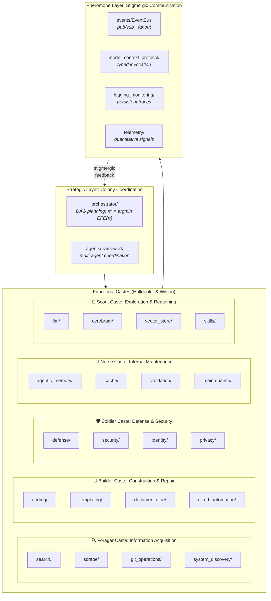

# The Colony Thesis: A Systems Metaphor for Modular Coordination

**Series**: AGI Perspectives | **Document**: 10 of 10 (Capstone) | **Last Updated**: March 2026

## The Central Argument

This essay presents the *Colony Thesis* as a research hypothesis: generality might be
studied as a property of specialized components coordinating over a shared substrate.
Codomyrmex is a useful software case for examining that hypothesis, but its modular
architecture does not by itself establish general intelligence or emergent cognition.

The intellectual lineage runs through three traditions:

1. **Society of Mind** (Minsky, 1986): Intelligence from many individually unintelligent "agents." The mind is a committee, not a dictator.
2. **Subsumption Architecture** (Brooks, 1991): Complex behavior from layered reactive agents without central planning. Intelligence is embodied and distributed — "intelligence without representation."
3. **Comprehensive AI Services** (Drexler, 2019): a proposal that broad capability could
   arise from composition of narrow services, avoiding a unified superintelligent agent;
   the safety and generality advantages remain empirical questions.

The Colony Thesis synthesizes these as an analytical mapping: Codomyrmex is a society-like
collection of modules, with layered services and protocol-mediated composition. The
current implementation does not demonstrate subsumption behavior, colony-level
generality, or emergence; those are outcomes for controlled experiments, not premises
of the architecture.

## The Colony Model

### The Queen Paradox

In ant colonies, the queen does not command — she provides *reproductive coherence*. The colony's behavior emerges from individual worker decisions governed by local rules and pheromone gradients. Similarly, codomyrmex's `orchestrator` does not micromanage modules — it defines *workflow DAGs* that coordinate module invocations without controlling internal logic.

The "queen paradox" is deeper: the orchestrator is *itself a module* in the colony. It
does not stand above the system—it participates in it. This is a useful comparison with
Hofstadter's (1979) **strange loop**, but the repository also has external operators,
reviewers, and deployment boundaries; recursive inspection is not evidence of experience
or self-originating coherence. (Hofstadter distinguishes: the *strange loop* is the
experiential phenomenon, while the *tangled hierarchy* is the underlying recursive
structure that generates it.)

## The Tangled Hierarchy

Hofstadter's (1979) concept of a **tangled hierarchy** (or "strange loop") describes a system where moving through the hierarchy's levels brings you back to where you started. In Gödel's incompleteness, the statements "talk about" the formal system that contains them, creating a self-referential loop.

Codomyrmex contains several recursive inspection patterns that can be analyzed against
the tangled-hierarchy metaphor:

1. **`system_discovery` discovers itself** — It is a module that scans modules, including itself. The scanner is part of the scanned set.

2. **RASP documents describe the RASP convention** — `docs/agi/SPEC.md` specifies how SPEC files should be written, including itself.

3. **`defense` defends against attacks on `defense`** — The security module must protect itself from compromise.

4. **`ci_cd_automation` tests `ci_cd_automation`** — The CI pipeline is tested by the CI pipeline.

These patterns can support self-monitoring and self-documentation, but they do not create
an experiencing "I" or show that self-reference is necessary for every form of
self-improvement.

The key insight is a structural analogy with a testable software correspondence. The
`system_discovery → system_discovery` path is recursive inspection, but it is not a
formal fixed-point construction. Its behavior should be characterized with executable
tests and traces before importing claims about paradoxes or Gödelian limitations.

## System 1 / System 2 in Codomyrmex

Kahneman's (2011) **dual-process theory** distinguishes two modes of cognition:

- **System 1**: Fast, automatic, intuitive, low-effort
- **System 2**: Slow, deliberate, analytical, high-effort

Codomyrmex offers components that can be compared with these functional descriptions;
it does not implement a validated human dual-process model:

| Property | System 1 (Fast) | System 2 (Slow) |
|:---------|:---------------|:---------------|
| **Module** | `vector_store` similarity search | `cerebrum` case-based reasoning |
| **Mechanism** | Similarity lookup when configured | Standalone inference components and explicit planning code |
| **Latency** | Depends on backend and index | Depends on model, horizon, and configuration |
| **Accuracy** | Must be measured on retrieval tasks | Must be measured on inference/planning tasks |
| **Energy** | Must be measured for the selected backend | Must be measured for the selected backend |
| **When used** | Cached, familiar queries | Novel, complex tasks |

The `orchestrator` can be configured as a retrieval-first or reasoning-first controller;
calling it Kahneman's "lazy controller" would require an explicit escalation policy and
measurements of when and why escalation occurs.

This mapping suggests an evaluation design: compare retrieval-first and reasoning-first
routes on paired routine and novel tasks. No result is claimed here, and the current
`skills` registry should not be described as automatically compiling System 2 work into
System 1 patterns without a measured learning protocol.

### Caste Differentiation and Response Thresholds

Bonabeau et al. (1996) formalized caste differentiation via the **response threshold model**: each worker has a threshold θᵢ for each stimulus type s. The probability of responding to stimulus s is:

$$P(\text{response}) = \frac{s^n}{s^n + \theta_i^n}$$

A worker with low threshold θᵢ for stimulus type s responds to weak stimuli — a specialist. One with high threshold responds only to strong stimuli — a generalist backup.

In codomyrmex, modules are extreme specialists (θᵢ ≈ 0 for their domain, θᵢ → ∞ elsewhere):

| Caste | Stimulus | Responding Modules | θ |
|:------|:---------|:-------------------|:---|
| Forager | "information needed" | search, scrape, git_operations | Not calibrated |
| Builder | "code change requested" | coding, templating, ci_cd | Not calibrated |
| Soldier | "threat detected" | defense, security, identity | Not calibrated |
| Nurse | "state maintenance" | cache, validation, maintenance | Not calibrated |
| Scout | "reasoning required" | llm, cerebrum, vector_store | Not calibrated |

The threshold equation is a biological analogy for role specialization. Modules do not
currently expose calibrated response thresholds θ, and the repository provides no
evidence for total specialization or an ergonomic optimum.

### The Pheromone Layer: Algorithmic Stigmergy

Grassé's (1959) stigmergy (**σ**τίγμα + ἔ**ρ**γον = "mark-work") provides the communication theory. In codomyrmex, four modules implement algorithmically distinct forms:

| Stigmergy Type | Module | Signal Lifetime | Reinforcement |
|:--------------|:-------|:---------------|:-------------|
| **Sematectonic** (structural) | `logging_monitoring/` | Persistent (append-only) | N/A (fossilized) |
| **Quantitative** (graded) | `telemetry/` | TTL-decaying | Frequency-dependent |
| **Sign-based** (qualitative) | `events/EventBus` | Ephemeral (consumed) | None |
| **Marker-based** (semantic) | `model_context_protocol/` | Session-scoped | Typed schemas |

The crucial insight from Heylighen (2016): stigmergy is **coordination without communication**. Modules don't send messages *to* each other — they modify the shared environment, and other modules detect these modifications. This is why adding new modules doesn't require changes to existing ones: the new module simply starts responding to (and depositing) environmental signals.

## Minsky's Society Applied

Minsky's (1986) *Society of Mind* proposes "agencies" — groups of agents that collaborate to produce cognitive functions. Codomyrmex's caste structure maps directly:

Minsky's **K-lines** (knowledge lines) offer a comparison point: a K-line is a
conceptual mechanism for reinstating a prior mental configuration. Tag-based retrieval
in `agentic_memory` can be tested against that analogy, but a tag is not thereby a
K-line and no reinstatement or transfer result is claimed.

## Drexler's CAIS and the Safety Advantage

Drexler (2019) argues that Comprehensive AI Services (CAIS) may offer safety advantages
through service decomposition. The following are design hypotheses, not guarantees:

1. **No unified agent with persistent goals** — The system doesn't "want" anything. It responds to requests. No module has a utility function over world-states.
2. **Compositional transparency** — smaller modules can make review easier, while the
   RASP documentation provides a maintained component description; neither implies
   isolated auditability of compositions.
3. **Substitutable components** — interfaces may support replacement in selected cases;
   `plugin_system` does not establish hot-swapping without cascade failures.

The safety argument requires an explicit threat model. Decomposition can reduce some
blast radii, but composition can also increase capability and create new failure paths.
The repository does not measure an effective optimization-power bound or prove that no
composition optimizes over a broader state space.

The biological parallel is illustrative only. In software, resilience must be shown by
fault-injection and recovery tests; the presence of circuit-breaker or orchestration
code does not prove isolation or rerouting for every component.

## The Threshold of Generality

When does a colony of specialists become a generalist? An ant colony does not solve differential equations — but it solves *every* problem in its ecological niche: shelter, food acquisition, defense, waste, climate, reproduction, disease. The colony is *general within its niche* — what Chollet (2019) calls **task-specific generality** (as opposed to universal generality).

Codomyrmex targets a software-development niche. Whether its interfaces transfer to
other domains is an open empirical question, not an established form of generality.

The Colony Thesis predicts yes — through **ontogenic growth**, not phylogenetic change:

| Expansion Strategy | Biological Analogue | Codomyrmex Mechanism |
|:------------------|:-------------------|:--------------------|
| Add modules | Add workers | `plugin_system/`, new `src/codomyrmex/<module>/` |
| Specialize existing modules | Caste differentiation | Module-internal submodule creation |
| Create inter-colony bridges | Supercolony formation | MCP cross-instance federation |
| Import foreign modules | Symbiosis / parasitism | External API integration |

Adding modules may expand available operations, but it can also add dependency,
security, and coordination costs. The EventBus and telemetry complexity statements are
local implementation analyses, not evidence of indefinite colony scaling. A scaling
study should measure valid compositions, latency, failure propagation, and task
performance as the inventory changes.

## The Hard Problem of Colony Intelligence

There is an analogue to Chalmers' (1995) "hard problem of consciousness": even if we explain every causal mechanism in the colony — every tool invocation, every event, every trust-level transition — we have not explained *why the colony seems to understand software development*. The hard problem of colony intelligence:

**Why might interaction among specialized modules produce useful software workflows?**

This is the emergence question from [emergence_and_scale.md](./emergence_and_scale.md) restated in the starkest terms. The Colony Thesis does not answer it — it simply observes that the same question applies to ant colonies, to brains, and to economies. In each case, the answer appears to be: *there is no understanding inside*. There is only interaction. The colony's "understanding" of software is the colony-level pattern of tool invocations over time — a pattern that an external observer interprets as understanding but that has no internal locus.

## Conclusion: A Testable Colony Hypothesis

The Colony Thesis reframes the AGI question. Instead of asking only whether one model is
general, ask whether a colony of specialists can coordinate to produce measured
cross-task transfer and robust performance.

Codomyrmex supplies a test surface for this question: composable modules, shared
protocols, persistent stores, policy gates, selected formal obligations, and external
review. It does not yet establish colony-level intelligence or emergent generality;
those claims require preregistered tasks, baselines, ablations, and reproducible traces.

The stronger claim—that a coordinated colony is intelligent in a scientifically meaningful
sense—remains open. The next step is a controlled comparison of composition, ablation,
failure propagation, and transfer, with claims bounded by the retained traces.

## Cross-References

- **Biological**: [superorganism.md](../bio/superorganism.md) — The biological superorganism concept
- **Biological**: [eusociality.md](../bio/eusociality.md) — Caste systems and division of labor
- **Biological**: [stigmergy.md](../bio/stigmergy.md) — Indirect coordination mechanisms
- **Cognitive**: [stigmergy.md](../cognitive/stigmergy.md) — Algorithmic stigmergy formalization
- **Previous**: [formal_specification.md](./formal_specification.md) — Verification for distributed systems
- **Start**: [scaffolding.md](./scaffolding.md) — Return to foundations

## References

- Bonabeau, E., Theraulaz, G., & Deneubourg, J.-L. (1996). "Quantitative Study of the Fixed Threshold Model for the Regulation of Division of Labour." *Proc. R. Soc. Lond. B*, 263, 1565–1569.
- Bostrom, N. (2014). *Superintelligence*. Oxford University Press.
- Brooks, R. A. (1991). "Intelligence Without Representation." *Artificial Intelligence*, 47(1-3), 139–159.
- Chalmers, D. (1995). "Facing Up to the Problem of Consciousness." *J. Consciousness Studies*, 2(3), 200–219.
- Chollet, F. (2019). "On the Measure of Intelligence." arXiv:1911.01547.
- Drexler, K. E. (2019). "Reframing Superintelligence: Comprehensive AI Services as General Intelligence." *FHI Technical Report*.
- Grassé, P.-P. (1959). "La reconstruction du nid et les coordinations inter-individuelles." *Insectes Sociaux*, 6, 41–80.
- Heylighen, F. (2016). "Stigmergy as a Universal Coordination Mechanism I." *Cognitive Systems Research*, 38, 4–13.
- Hofstadter, D. R. (1979). *Gödel, Escher, Bach*. Basic Books.
- Hölldobler, B., & Wilson, E. O. (1990). *The Ants*. Harvard University Press.
- Minsky, M. (1986). *The Society of Mind*. Simon & Schuster.
- Oster, G. F., & Wilson, E. O. (1978). *Caste and Ecology in the Social Insects*. Princeton University Press.

---

*[← Formal Specification](./formal_specification.md) | [Back to README →](./README.md)*
