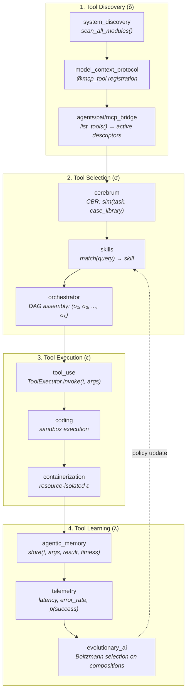
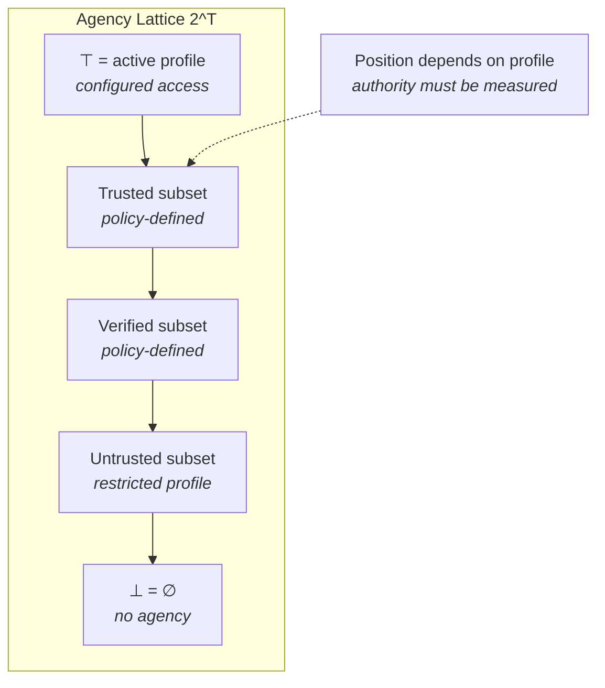
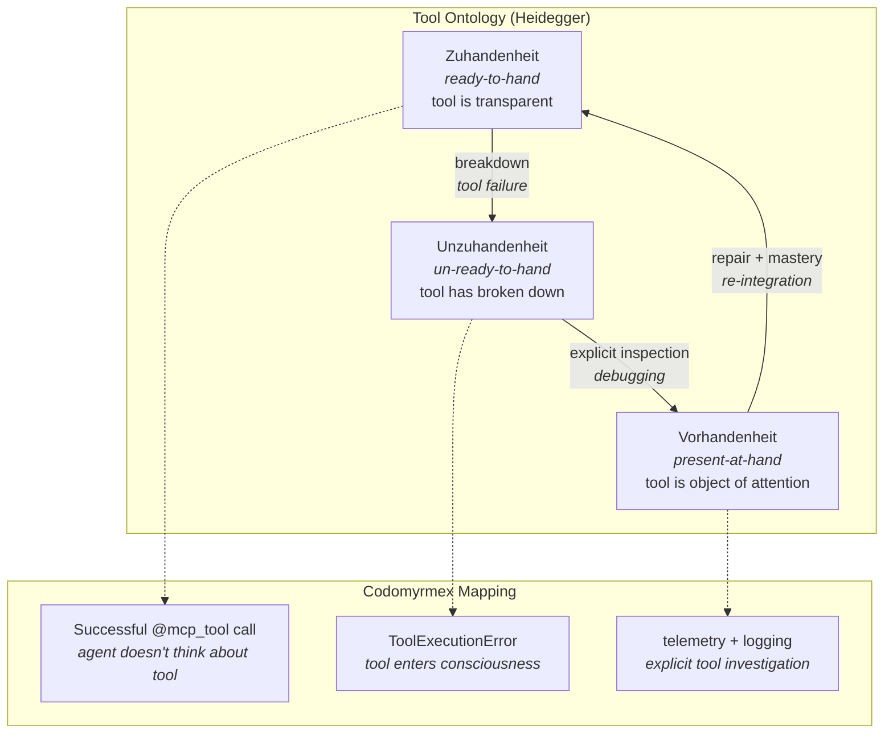

# Tool Use and Agency: Capability Surfaces and Control Boundaries

**Series**: AGI Perspectives | **Document**: 2 of 10 | **Last Updated**: March 2026

## The Tool-Use Thesis

The capacity for autonomous tool use — selecting, composing, and invoking tools without human instruction for each step — is increasingly recognized as a *necessary condition* for general intelligence. Schick et al. (2023) formalized this in their Toolformer work; Mialon et al. (2023) extended it to "augmented language models" whose capabilities are fundamentally defined by their tool access; Yao et al. (2023) demonstrated with ReAct that interleaving reasoning with tool actions produces qualitatively more capable agents.

But tool use is not merely an engineering convenience. It is an instance of **extended cognition** (Clark & Chalmers, 1998): the tools become part of the cognitive system's functional organization. The boundary between "the agent" and "the tool" dissolves when tool invocation is seamless and automatic — precisely as it does in skilled human tool use, where the hammer becomes a transparent extension of the carpenter's motor system (Heidegger's *Zuhandenheit*, readiness-to-hand).

Codomyrmex exposes a configuration- and inventory-dependent MCP tool surface. Current
counts are generated in [reference/inventory.md](../reference/inventory.md), not copied
into this essay, and tool count is a measure of available interface surface rather than
agency, quality, or autonomy.

## Tool Anatomy: The Four-Phase Lifecycle

### Phase 1: Discovery — Enumerating the Morphism Set

The `system_discovery` module scans `src/codomyrmex/*/mcp_tools.py` files, introspects `@mcp_tool` decorators, and registers them with `model_context_protocol`. This is *dynamic*: modules added at runtime are discovered without restart.

Formally, discovery can be described as a partial mapping δ from module profiles to
tool descriptors. Each descriptor may carry a typed signature. The active MCP profile
determines which subset is exposed; there is no assumption that every registered tool
is available to every agent.

This creates a surface on which tool-retrieval experiments can be run. A lower bound of
log₂(|T|) applies only to a specified uniform identification problem; real selection
cost depends on priors, schemas, profiles, and task structure.

### Phase 2: Selection — The Bandits Problem

Given task τ, selecting among an active tool profile can be studied as a **contextual
multi-armed bandit** problem (Li et al., 2010). The repository does not establish that
its current selection path performs bandit learning or optimizes task reward.

Three modules contribute complementary selection strategies:

- **`cerebrum`** — **Case-Based Reasoning**: can retrieve and adapt cases; whether this
  improves selection is an evaluation question.
- **`skills`** — **Semantic matching**: `SkillRegistry.match(query)` computes cosine similarity between the query embedding and skill description embeddings. Time complexity: O(|skills| · d) where d is embedding dimension.
- **`orchestrator`** — **DAG composition**: can execute configured workflow graphs;
  reuse and quality effects require paired measurements.

The exploration-exploitation trade-off: cases from `cerebrum` bias toward past success (exploitation); `evolutionary_ai`'s mutation operator introduces random tool substitutions (exploration). The balance is governed by the selection temperature T in Boltzmann selection — see [recursive_self_improvement.md](./recursive_self_improvement.md).

### Phase 3: Execution — Sandboxed Effector Invocation

Selected tools are invoked through a layered execution environment:

- **`tool_use`** — The `ToolRegistry` manages invocation, argument marshaling via
  configured schemas, and result collection. Atomicity and rollback are properties to
  verify for each registered tool, not assumptions of the registry abstraction.
- **`coding/sandbox`** — Code execution may be isolated by configured limits. A strict
  capability-model claim requires an audit of every reachable resource and escape path.
- **`containerization`** — Docker-based isolation for heavy operations. A container can
  be analyzed as an effect boundary, but calling it a strict monad requires a typed
  semantics for effects, projection, failure, and resource escape; the repository does
  not currently provide that proof.

### Phase 4: Learning — Posterior Policy Update

After execution, outcomes update the tool selection policy:

$$P(t_{i} \mid \tau, \text{history}) \propto P(t_{i} \mid \tau) \cdot \prod_{j} P(\text{outcome}_{j} \mid t_{i}, \tau)$$

where the likelihood term would account for past outcomes of tool tᵢ on similar tasks.
This is a candidate Bayesian policy model, not a description of a deployed Thompson
sampling implementation; the current repository does not establish posterior updates or
bandit regret behavior for its tool surface.

## The Agency Boundary

Mialon et al.'s (2023) insight motivates treating tool access as one agency boundary.
The active profile, authority, side effects, and composition semantics matter as much as
the number of descriptors; no agency volume is calculated here.

Formally, the **agency lattice** L is the power set 2ᵀ of all tools, partially ordered by subset inclusion. The current agent operates at a position in this lattice determined by its trust level. The trust gateway restricts the lattice position:

The tool set is an interface-surface descriptor, not a measure of realized agency. The
autonomy spectrum can be specified as authorization positions:

| Level | Agency Lattice Position | Human Role |
|:------|:----------------------|:-----------|
| L1 | Human selects ⊂ 2ᵀ | Agent = executor |
| L2 | Agent suggests ⊂ 2ᵀ; human filters | Agent = advisor |
| L3 | Agent selects from Trusted ⊂ 2ᵀ | Human = monitor |
| L4 | Agent chains from Trusted ⊂ 2ᵀ | Human = reviewer |
| L5 | Agent operates at ⊤ | Human = goal-setter |

The autonomy level is deployment- and profile-dependent. It should be reported from
observed authorization and human-approval traces, not assigned from tool inventory.

## Game-Theoretic Multi-Agent Tool Access

When multiple agents operate concurrently (the Jules AI swarm pattern with 113+ sessions), tool selection becomes a **multi-player game**. Define the game:

- **Players**: N agents {a₁, ..., aₙ}
- **Strategies**: Each agent selects a subset of tools from the shared pool T
- **Payoffs**: U(aᵢ) = quality(result) - cost(contention) - cost(latency)

The **contention cost** arises when multiple agents invoke the same tool simultaneously (e.g., concurrent `git_operations/commit` calls). The system exhibits **tragedy of the commons** dynamics: each agent benefits from tool invocation, but concurrent invocations degrade shared resources.

The `containerization` module provides the resolution: isolated execution environments partition the resource space, converting a *common-pool resource* game into a *private goods* game. Each agent operates in its own container, eliminating contention at the cost of resource duplication.

The following is a candidate **Nash equilibrium** condition for a specified tool-access
game:

$$\sigma_i^* = \argmax_{s_i \in S_i} U_i(s_i, \sigma_{-i}^*) \quad \forall i$$

Containerization may reduce some contention, but it does not make strategy spaces
independent or make the game dominance-solvable without assumptions about shared state,
budgets, scheduling, and payoffs.

The **Pareto efficiency** question asks whether agents could do better by coordinating.
`orchestrator` DAGs can be studied as coalitional coordination strategies, but a DAG is
not automatically a **correlated equilibrium** (Aumann, 1974). That claim requires a
defined game, a recommendation distribution, and incentive constraints verified from
observed payoffs.

## The Tool Ontology: Ready-to-Hand and Present-at-Hand

Heidegger's (1927) phenomenological analysis of *Zuhandenheit* (readiness-to-hand) and *Vorhandenheit* (presence-at-hand) provides a deep framework for the tool lifecycle:

When a tool works, it can be described as *transparent* in this analogy—the caller need
not attend to its internal mechanics. When it fails, it becomes the object of explicit
inspection (Unzuhandenheit → Vorhandenheit). The `telemetry` and `logging_monitoring`
modules provide diagnostic surfaces that could support this transition; they do not imply
an experiencing agent or successful repair.

Dreyfus (1992) argued that this breakdown/repair cycle is relevant to *skill
acquisition*. The `agentic_memory` module can retain failure and repair records, but those
records constitute a developmental history of tool use only after retrieval, adaptation,
and improved task performance are measured.

## Gap Analysis

| Capability | Status | Information-Theoretic Gap |
|:-----------|:-------|:------------------------|
| Tool discovery | ✅ Dynamic | — |
| Tool selection | ⚠️ Heuristic | No learned selection policy via RL bandit |
| Tool composition | ✅ DAG-based | No dynamic DAG generation (static only) |
| Tool creation | ❌ | System cannot synthesize new tools at runtime |
| Cross-language tools | ❌ | All morphisms are Python → Python |

The most significant gap: **tool creation**. A truly general system would synthesize new tools when existing ones are insufficient. The `coding` module provides the substrate, but the loop "detect capability gap → generate tool → validate → register" is not automated.

## Cross-References

- **Biological**: [eusociality.md](../bio/eusociality.md) — Division of labor as tool specialization
- **Cognitive**: [stigmergy.md](../cognitive/stigmergy.md) — Indirect coordination through shared tool environments
- **Previous**: [scaffolding.md](./scaffolding.md) — Composability as tool prerequisite
- **Next**: [world_models.md](./world_models.md) — Internal representations for tool planning

## References

- Clark, A., & Chalmers, D. (1998). "The Extended Mind." *Analysis*, 58(1), 7–19.
- Dennis, J. B., & Van Horn, E. C. (1966). "Programming Semantics for Multiprogrammed Computations." *CACM*, 9(3), 143–155.
- Li, L., Chu, W., Langford, J., & Schapire, R. E. (2010). "A Contextual-Bandit Approach to Personalized News Article Recommendation." *WWW 2010*.
- Mialon, G., et al. (2023). "Augmented Language Models: A Survey." *TMLR*.
- Patil, S. G., et al. (2023). "Gorilla: Large Language Model Connected with Massive APIs." arXiv:2305.15334.
- Schick, T., et al. (2023). "Toolformer: Language Models Can Teach Themselves to Use Tools." *NeurIPS 2023*.
- Yao, S., et al. (2023). "ReAct: Synergizing Reasoning and Acting in Language Models." *ICLR 2023*.

---

*[← Scaffolding](./scaffolding.md) | [Next: World Models →](./world_models.md)*
