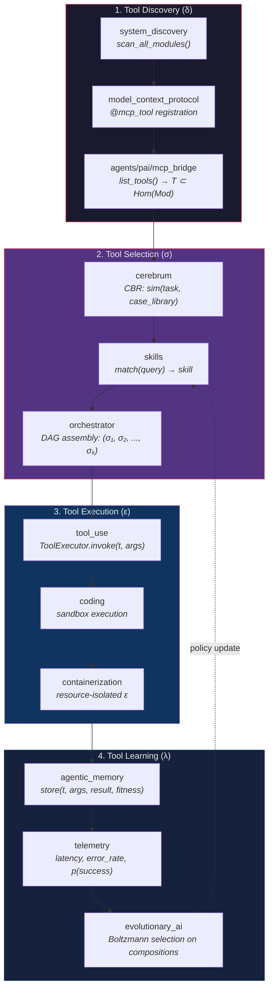
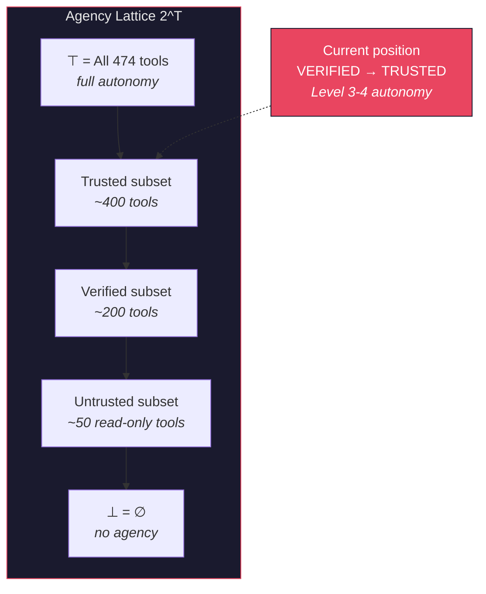
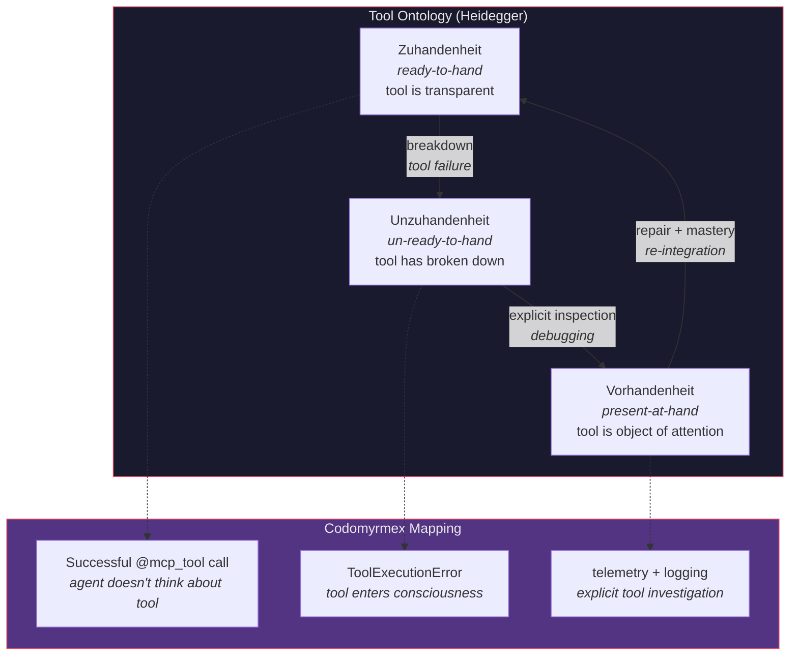

# Autonomous Tool Use as Proto-AGI Capability

**Series**: AGI Perspectives | **Document**: 2 of 10 | **Last Updated**: March 2026

## The Tool-Use Thesis

The capacity for autonomous tool use — selecting, composing, and invoking tools without human instruction for each step — is increasingly recognized as a *necessary condition* for general intelligence. Schick et al. (2023) formalized this in their Toolformer work; Mialon et al. (2023) extended it to "augmented language models" whose capabilities are fundamentally defined by their tool access; Yao et al. (2023) demonstrated with ReAct that interleaving reasoning with tool actions produces qualitatively more capable agents.

But tool use is not merely an engineering convenience. It is an instance of **extended cognition** (Clark & Chalmers, 1998): the tools become part of the cognitive system's functional organization. The boundary between "the agent" and "the tool" dissolves when tool invocation is seamless and automatic — precisely as it does in skilled human tool use, where the hammer becomes a transparent extension of the carpenter's motor system (Heidegger's *Zuhandenheit*, readiness-to-hand).

Codomyrmex's 474 `@mcp_tool`-decorated functions across 130 modules constitute one of the largest compositional tool surfaces in any open-source AI development platform. This essay examines how this tool ecosystem relates to the AGI requirement for autonomous agency.

## Tool Anatomy: The Four-Phase Lifecycle

### Phase 1: Discovery — Enumerating the Morphism Set

The `system_discovery` module scans `src/codomyrmex/*/mcp_tools.py` files, introspects `@mcp_tool` decorators, and registers them with `model_context_protocol`. This is *dynamic*: modules added at runtime are discovered without restart.

Formally, discovery computes: δ: **Mod** → Set(T) where T is the set of tool descriptors. Each descriptor is a typed signature: `t: (τ₁ × τ₂ × ... × τₙ) → τᵣ`. The MCP bridge exposes the full tool set |T| = 474 to agents.

This implements Patil et al.'s (2023) "tool retrieval" — the first bottleneck in tool-augmented AI. The information-theoretic cost: selecting from |T| tools requires ≥ log₂(474) ≈ 8.89 bits of decision per invocation. Reducing this cost is the function of Phase 2.

### Phase 2: Selection — The Bandits Problem

Given task τ, the agent must select tools from the 474 available. This is a **contextual multi-armed bandit** problem (Li et al., 2010): each tool is an arm, the context is the task description, and the reward is task completion quality.

Three modules contribute complementary selection strategies:

- **`cerebrum`** — **Case-Based Reasoning**: given task τ, retrieve k-nearest cases from the case library using embedding similarity, adapt their tool sequences to the current context. This implements *exploitation* — reusing past successful strategies.
- **`skills`** — **Semantic matching**: `SkillRegistry.match(query)` computes cosine similarity between the query embedding and skill description embeddings. Time complexity: O(|skills| · d) where d is embedding dimension.
- **`orchestrator`** — **DAG composition**: known-good tool sequences are encoded as workflow DAGs. This implements *static exploitation* — reusing expert-designed compositions.

The exploration-exploitation trade-off: cases from `cerebrum` bias toward past success (exploitation); `evolutionary_ai`'s mutation operator introduces random tool substitutions (exploration). The balance is governed by the selection temperature T in Boltzmann selection — see [recursive_self_improvement.md](./recursive_self_improvement.md).

### Phase 3: Execution — Sandboxed Effector Invocation

Selected tools are invoked through a layered execution environment:

- **`tool_use`** — The `ToolRegistry` manages invocation, argument marshaling via `marshmallow` schemas, and result collection. Each invocation is an atomic transaction with rollback on failure.
- **`coding/sandbox`** — Code execution in isolated environments with resource limits. The sandbox implements a *capability model* (Dennis & Van Horn, 1966): the executing code can access only the capabilities explicitly granted.
- **`containerization`** — Docker-based isolation for heavy operations. The container is a *strict monad* in the categorical sense: computation inside cannot affect the outside without explicit projection.

### Phase 4: Learning — Posterior Policy Update

After execution, outcomes update the tool selection policy:

$$P(t_{i} \mid \tau, \text{history}) \propto P(t_{i} \mid \tau) \cdot \prod_{j} P(\text{outcome}_{j} \mid t_{i}, \tau)$$

where the likelihood term accounts for all past outcomes of tool tᵢ on similar tasks. This is **Thompson sampling** — a Bayesian approach to the bandit problem that naturally balances exploration and exploitation.

## The Agency Boundary

Mialon et al.'s (2023) insight: **the boundary of agency is the boundary of tool access**. An agent with 474 tools spanning code editing, security scanning, database management, LLM inference, and container orchestration has an *agency volume* proportional to the product of its capability dimensions.

Formally, the **agency lattice** L is the power set 2ᵀ of all tools, partially ordered by subset inclusion. The current agent operates at a position in this lattice determined by its trust level. The trust gateway restricts the lattice position:

The tool count is not vanity — it is a *measure of potential agency*. The autonomy spectrum maps to lattice positions:

| Level | Agency Lattice Position | Human Role |
|:------|:----------------------|:-----------|
| L1 | Human selects ⊂ 2ᵀ | Agent = executor |
| L2 | Agent suggests ⊂ 2ᵀ; human filters | Agent = advisor |
| L3 | Agent selects from Trusted ⊂ 2ᵀ | Human = monitor |
| L4 | Agent chains from Trusted ⊂ 2ᵀ | Human = reviewer |
| L5 | Agent operates at ⊤ | Human = goal-setter |

Codomyrmex operates at **L3–L4**: agents select and chain tools autonomously within trust-bounded sublattices.

## Game-Theoretic Multi-Agent Tool Access

When multiple agents operate concurrently (the Jules AI swarm pattern with 113+ sessions), tool selection becomes a **multi-player game**. Define the game:

- **Players**: N agents {a₁, ..., aₙ}
- **Strategies**: Each agent selects a subset of tools from the shared pool T
- **Payoffs**: U(aᵢ) = quality(result) - cost(contention) - cost(latency)

The **contention cost** arises when multiple agents invoke the same tool simultaneously (e.g., concurrent `git_operations/commit` calls). The system exhibits **tragedy of the commons** dynamics: each agent benefits from tool invocation, but concurrent invocations degrade shared resources.

The `containerization` module provides the resolution: isolated execution environments partition the resource space, converting a *common-pool resource* game into a *private goods* game. Each agent operates in its own container, eliminating contention at the cost of resource duplication.

The **Nash equilibrium** for tool selection in the partitioned game:

$$\sigma_i^* = \argmax_{s_i \in S_i} U_i(s_i, \sigma_{-i}^*) \quad \forall i$$

Under containerized isolation, agents' strategy spaces are independent — the game becomes **dominance solvable**: each agent selects tools optimally without considering others' choices.

The **Pareto efficiency** question: could agents do better by coordinating? Yes — `orchestrator` DAGs implement *coalitional* strategies where agents divide work to avoid redundancy. A DAG is a **correlated equilibrium** (Aumann, 1974): a coordination device that tells each agent which action to take, with each agent willing to comply.

## The Tool Ontology: Ready-to-Hand and Present-at-Hand

Heidegger's (1927) phenomenological analysis of *Zuhandenheit* (readiness-to-hand) and *Vorhandenheit* (presence-at-hand) provides a deep framework for the tool lifecycle:

When a tool works, it is *transparent* — the agent uses it without attending to it (Zuhandenheit). When it fails, it *breaks down* and becomes the object of explicit attention (Unzuhandenheit → Vorhandenheit). The `telemetry` and `logging_monitoring` modules implement the transition to explicit inspection: the tool that was invisible becomes the focus of diagnostic analysis.

Dreyfus (1992) argued that this breakdown/repair cycle is essential to *skill acquisition*: expertise develops precisely through the cycle of transparent use, breakdown, explicit analysis, and re-integration at a higher level. The `agentic_memory` module's recording of tool failures and repair strategies constitutes a *developmental history* of tool mastery.

## Gap Analysis

| Capability | Status | Information-Theoretic Gap |
|:-----------|:-------|:------------------------|
| Tool discovery | ✅ Dynamic | — |
| Tool selection | ⚠️ Heuristic | No learned selection policy via RL bandit |
| Tool composition | ✅ DAG-based | No dynamic DAG generation (static only) |
| Tool creation | ❌ | System cannot synthesize new tools at runtime |
| Cross-language tools | ❌ | All morphisms are Python → Python |

The most significant gap: **tool creation**. A truly general system would synthesize new tools when existing ones are insufficient. The `coding` module provides the substrate, but the loop "detect capability gap → generate tool → validate → register" is not automated.

## Cross-References

- **Biological**: [eusociality.md](../bio/eusociality.md) — Division of labor as tool specialization
- **Cognitive**: [stigmergy.md](../cognitive/stigmergy.md) — Indirect coordination through shared tool environments
- **Previous**: [scaffolding.md](./scaffolding.md) — Composability as tool prerequisite
- **Next**: [world_models.md](./world_models.md) — Internal representations for tool planning

## References

- Clark, A., & Chalmers, D. (1998). "The Extended Mind." *Analysis*, 58(1), 7–19.
- Dennis, J. B., & Van Horn, E. C. (1966). "Programming Semantics for Multiprogrammed Computations." *CACM*, 9(3), 143–155.
- Li, L., Chu, W., Langford, J., & Schapire, R. E. (2010). "A Contextual-Bandit Approach to Personalized News Article Recommendation." *WWW 2010*.
- Mialon, G., et al. (2023). "Augmented Language Models: A Survey." *TMLR*.
- Patil, S. G., et al. (2023). "Gorilla: Large Language Model Connected with Massive APIs." arXiv:2305.15334.
- Schick, T., et al. (2023). "Toolformer: Language Models Can Teach Themselves to Use Tools." *NeurIPS 2023*.
- Yao, S., et al. (2023). "ReAct: Synergizing Reasoning and Acting in Language Models." *ICLR 2023*.

---

*[← Scaffolding](./scaffolding.md) | [Next: World Models →](./world_models.md)*
