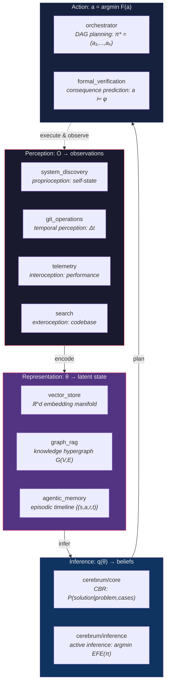
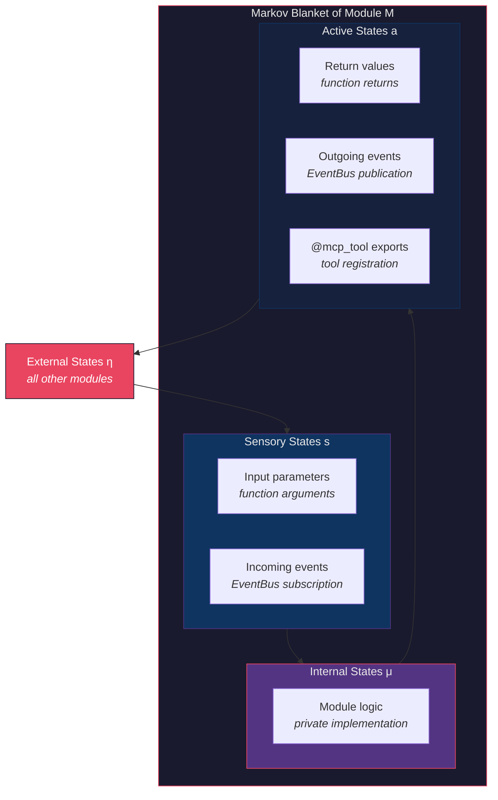

# Internal World Models: Representation, Grounding, and the Binding Problem

**Series**: AGI Perspectives | **Document**: 3 of 10 | **Last Updated**: March 2026

## The World Model Requirement

LeCun (2022) argues that the central missing piece in current AI is a *world model* — an internal representation enabling action-consequence prediction, counterfactual reasoning, and long-horizon planning. Ha and Schmidhuber (2018) demonstrated the power of learned world models with agents that dream in latent space. Friston's (2010) Free Energy Principle formalizes this: an intelligent system maintains a *generative model* μ of its environment and acts to minimize the divergence between predictions and observations — variational free energy minimization:

$$F = D_{KL}[q(\theta) \| p(\theta \mid o)] = \underbrace{\langle \log q(\theta) - \log p(o, \theta) \rangle_q}_{\text{energy}} + \underbrace{\log p(o)}_{\text{surprise}}$$

where q(θ) is the approximate posterior (the model's beliefs), p(θ|o) is the true posterior, and p(o) is the evidence. Minimizing F simultaneously maximizes model accuracy and minimizes surprise — the dual imperative of perception (updating beliefs) and action (seeking expected outcomes).

Codomyrmex implements aspects of a world model not for physical environments but for the *software development environment*: codebases, repositories, documentation, test results, and agent interactions.

## World Model Architecture

### Perception: The Four Senses

A world model must be grounded in observations. Codomyrmex's perception layer provides four information-theoretically distinct channels:

- **Proprioception** (`system_discovery`) — The system's awareness of its own structure. `scan_all_modules()` returns a `ModuleHealthReport` for each of 128 modules — a typed self-state vector. This is the computational equivalent of the proprioceptive nervous system: awareness of limb position without looking.

- **Temporal perception** (`git_operations`) — Repository-state tracking: branches, commits, diffs. Each commit is a timestamped snapshot, enabling *temporal difference learning*: computing `Δstate = state(t) - state(t-1)`. The git graph provides a *causal history* that Pearl's (2009) do-calculus could potentially exploit for intervention reasoning.

- **Interoception** (`telemetry`) — Runtime performance: latency distributions, error rates, resource consumption. This is the system's *internal milieu* (Bernard, 1865): the physiological signals that indicate whether the organism is functioning correctly, independent of external environment.

- **Exteroception** (`search`) — On-demand codebase observation. Unlike the other channels (which are push-based or periodic), search is *active perception*: the system decides where to look. This implements Friston's concept of **epistemic foraging** — actions taken to reduce uncertainty rather than achieve immediate reward.

### Representation: The Tripartite Manifold

Three modules provide structurally distinct representations of the same underlying reality:

| Module | Mathematical Structure | Topology | Query Complexity |
|:-------|:---------------------|:---------|:----------------|
| `vector_store` | Riemannian manifold ℝ^d | Metric space with cosine distance | O(n·d) brute force; O(log n) with HNSW |
| `graph_rag` | Hypergraph G = (V, E) where E ⊆ 2^V | Discrete topology | O(V + E) traversal |
| `agentic_memory` | Ordered set {(s, a, r, t)} with temporal index | Order topology | O(log n) binary search on timestamp |

These three representations address different information-geometric requirements:

1. **Vector embeddings** — The `InMemoryVectorStore` maps text to dense vectors on a Riemannian manifold. Similarity is geodesic distance. This captures *analogical similarity*: things that are "like" each other are geometrically close. The manifold hypothesis (Bengio et al., 2013) states that high-dimensional data concentrates near low-dimensional manifolds — embeddings exploit this concentration.

2. **Knowledge graphs** — `KnowledgeGraph` stores entity-relation triples forming a hypergraph. This captures *structural similarity*: things related by the same predicate share structure. The graph's adjacency spectrum (eigenvalues of the Laplacian) encodes topological invariants that persist under perturbation — robust to noise.

3. **Episodic traces** — Timestamped experience records (state, action, reward, time). This captures *temporal similarity*: things that happened in related contexts are co-indexed. The temporal index provides causal ordering that the other two representations lack.

### The Binding Problem

The binding problem in cognitive science asks how different modalities are integrated into unified percepts. Treisman's (1996) feature integration theory proposes that *attention* is the binding mechanism: features detected by separate channels are unified only when attention is directed to their shared spatial location.

In codomyrmex, the three representations of the same codebase are **not automatically aligned**. A function `f()` has a vector embedding in `vector_store`, a node in `graph_rag`, and episodic traces in `agentic_memory` — but no mechanism binds these into a unified representation "f() as understood across all modalities."

The `cerebrum` module's case-based reasoning provides a partial solution: cases can reference all three representation types. But there is no unified **multimodal embedding space** — no function Φ: vector_store × graph_rag × agentic_memory → ℝ^D that maps all three into a common space.

This is the most significant theoretical gap. Granger (2006) identifies the cortical binding problem as solved in biology by the hippocampus — which performs rapid binding of cortical representations into integrated episodes. A *computational hippocampus* for codomyrmex would:

1. Detect co-occurring activations across the three representation stores
2. Create bound representations linking them by content hash
3. Enable cross-modal retrieval: given a vector, find the graph node and episodic traces

### The Spatial Dimension and JEPA

The `spatial` module provides 3D/4D scene representation — not for robotics but for geometric reasoning about abstract structures:

- `three_d/` — 3D mesh generation, scene graph construction
- `four_d/` — Temporal 4D representation (space + time)
- `world_models/` — Explicit subscene/world model construction

LeCun's **JEPA** (Joint Embedding Predictive Architecture) framework argues that world models should operate over *learned abstract representations*, not raw observations. The loss function:

$$\mathcal{L}_{JEPA} = \| s_y - \text{Pred}(s_x, a) \|^2$$

where s_x and s_y are encoder outputs for observation and prediction, a is action, and Pred is a predictor in latent space. The `spatial/world_models/` submodule provides infrastructure for building exactly these abstract geometric predictors.

## Causal Models: The Missing Pearl

The most significant gap is **causal reasoning**. The system can reason about *correlations* (vector similarity) and *logical entailment* (formal verification) but cannot reason about *interventions*.

Pearl's (2009) three-level causal hierarchy:

| Level | Question | Module Support |
|:------|:---------|:-------------|
| **Association** (seeing) | P(y\|x) = ? | ✅ vector_store similarity |
| **Intervention** (doing) | P(y\|do(x)) = ? | ❌ No causal graph module |
| **Counterfactual** (imagining) | P(y_x\|x', y') = ? | ❌ No structural causal model |

A causal reasoning module would require:

1. A structural causal model (SCM) representing module dependencies as causal edges (not mere correlations)
2. The do-calculus to compute interventional distributions from observational data
3. Counterfactual inference for "what if" reasoning about architectural changes

The dependency graph in `ARCHITECTURE.md` provides the *skeleton* of such an SCM — the causal graph structure exists, but the quantitative causal mechanisms are not modeled.

## Information Geometry of Representation Spaces

The three representation modules operate on fundamentally different **information geometries** (Amari, 2016). Each module's state space is a statistical manifold — a manifold where points represent probability distributions:

- **`vector_store`** — Points on a Riemannian manifold with **Fisher-Rao metric**: the natural distance measure between embeddings respects the information content of the underlying text. The Fisher information matrix:

$$g_{ij}(\theta) = E\left[\frac{\partial \log p(x|\theta)}{\partial \theta_i} \frac{\partial \log p(x|\theta)}{\partial \theta_j}\right]$$

defines a Riemannian metric on the parameter space. Gradient descent on this manifold — the **natural gradient** (Amari, 1998) — converges faster than ordinary gradient descent because it respects the information geometry rather than the Euclidean geometry of the parameter space.

- **`graph_rag`** — The knowledge graph operates on a **discrete manifold** where distance is graph-theoretic (shortest path length). The graph Laplacian L = D - A (where D is degree matrix, A is adjacency) has eigenvalues that encode the manifold's spectral geometry. The **Fiedler value** (second-smallest eigenvalue of L) measures graph connectivity — a low Fiedler value indicates the graph is close to disconnecting, signaling structural fragility in the knowledge representation.

- **`agentic_memory`** — The episodic timeline operates on an **order topology** where the natural metric is temporal distance. The kernel function k(t₁, t₂) = exp(-|t₁ - t₂|/τ) defines a temporal similarity that decays exponentially — recent experiences are "closer" than distant ones.

The fundamental incompatibility: these three metrics cannot be naively combined. A function at graph distance 1 (directly related) might be at cosine distance 0.8 (semantically distant) and temporal distance 100 (hours ago). **Multimodal binding** (the gap identified above) requires a principled way to combine these incompatible metrics — potentially via **optimal transport** (Villani, 2009): finding the minimum-cost mapping between representation spaces.

## Markov Blankets and Module Boundaries

Friston's (2013) **Markov blanket** formalism provides a principled account of module boundaries. A Markov blanket of a system partitions variables into:

- **Internal states** (μ) — the module's private state
- **External states** (η) — everything outside the module
- **Blanket states** = sensory (s) + active (a) — the interface

The key property: conditional on the blanket states (s, a), the internal states μ are **statistically independent** of the external states η:

$$p(\mu, \eta \mid s, a) = p(\mu \mid s, a) \cdot p(\eta \mid s, a)$$

This is exactly the encapsulation principle of software engineering, given a formal statistical interpretation. A well-designed module's behavior is determined entirely by its inputs (sensory states) and outputs (active states) — its internal implementation is independent of the external world given the interface.

The `__init__.py` exports + `@mcp_tool` decorators constitute the **active states**; function parameters and event subscriptions constitute the **sensory states**. The module's internal implementation is the **internal state** — hidden behind the Markov blanket.

The world modeling implication: each module maintains its own *local world model* (beliefs about its inputs), and the system's global world model is the *composition* of all local models mediated by Markov blankets. This is the **free energy minimization** principle applied at the architectural level: each module minimizes its own surprise by updating its internal states to better predict its sensory states.

## Gap Analysis

| World Model Capability | Status | Information-Theoretic Gap |
|:----------------------|:-------|:------------------------|
| Multi-channel perception | ✅ | — |
| Riemannian embeddings | ✅ | — |
| Knowledge hypergraph | ✅ | — |
| Episodic timeline | ✅ | — |
| Multimodal binding | ❌ | No Φ: V × G × E → ℝ^D |
| Forward simulation (JEPA) | ⚠️ | spatial/world_models/ exists but not integrated |
| Causal reasoning (do-calculus) | ❌ | No SCM; no interventional distributions |
| Epistemic foraging | ⚠️ | search is active but not uncertainty-directed |

## Cross-References

- **Biological**: [free_energy.md](../bio/free_energy.md) — Active inference as biological world modeling
- **Cognitive**: [cognitive_modeling.md](../cognitive/cognitive_modeling.md) — Cognitive architecture for world models
- **Previous**: [tool_use_and_agency.md](./tool_use_and_agency.md) — Tools as world model effectors
- **Next**: [recursive_self_improvement.md](./recursive_self_improvement.md) — Self-modification via predictions

## References

- Bengio, Y., Courville, A., & Vincent, P. (2013). "Representation Learning." *IEEE TPAMI*, 35(8), 1798–1828.
- Friston, K. (2010). "The Free-Energy Principle." *Nature Reviews Neuroscience*, 11(2), 127–138.
- Granger, R. (2006). "Engines of the Brain." *AI Magazine*, 27(2), 15–32.
- Ha, D., & Schmidhuber, J. (2018). "World Models." arXiv:1803.10122.
- LeCun, Y. (2022). "A Path Towards Autonomous Machine Intelligence." OpenReview preprint.
- Pearl, J. (2009). *Causality*. 2nd ed. Cambridge University Press.
- Treisman, A. (1996). "The Binding Problem." *Current Opinion in Neurobiology*, 6(2), 171–178.

---

*[← Tool Use & Agency](./tool_use_and_agency.md) | [Next: Recursive Self-Improvement →](./recursive_self_improvement.md)*
