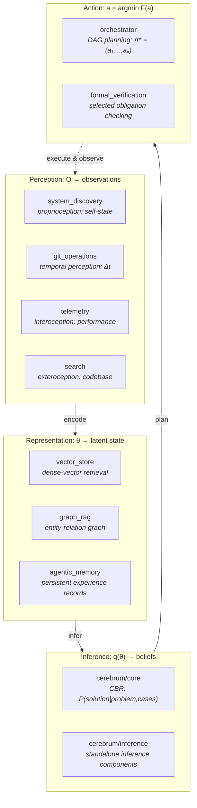
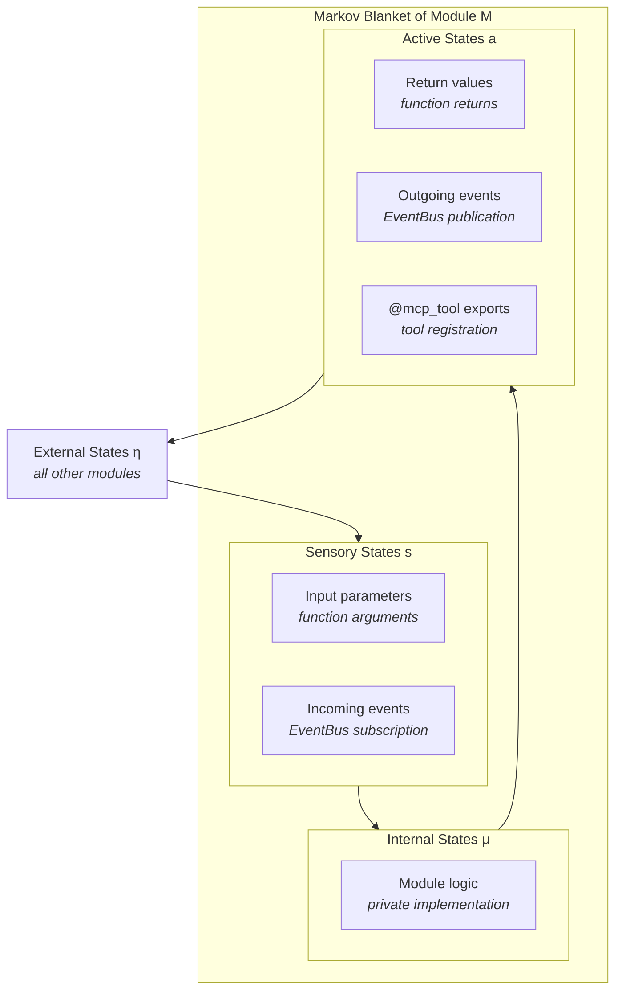

# Software World Models: Representations, Interfaces, and Open Gaps

**Series**: AGI Perspectives | **Document**: 3 of 10 | **Last Updated**: March 2026

## The World Model Requirement

LeCun (2022) argues that the central missing piece in current AI is a *world model* — an internal representation enabling action-consequence prediction, counterfactual reasoning, and long-horizon planning. Ha and Schmidhuber (2018) demonstrated the power of learned world models with agents that dream in latent space. Friston's (2010) Free Energy Principle formalizes this: an intelligent system maintains a *generative model* μ of its environment and acts to minimize the divergence between predictions and observations — variational free energy minimization:

$$F = D_{KL}[q(\theta) \| p(\theta \mid o)] = \underbrace{\langle \log q(\theta) - \log p(o, \theta) \rangle_q}_{\text{energy}} + \underbrace{\log p(o)}_{\text{surprise}}$$

where q(θ) is the approximate posterior (the model's beliefs), p(θ|o) is the true posterior, and p(o) is the evidence. Minimizing F simultaneously maximizes model accuracy and minimizes surprise — the dual imperative of perception (updating beliefs) and action (seeking expected outcomes).

Codomyrmex contains representations and observation interfaces that could contribute to
a software-development world model. The current components do not form a validated
generative model with demonstrated action-consequence prediction or counterfactual
planning.

## World Model Architecture

### Perception: The Four Senses

A world model must be grounded in observations. Codomyrmex's perception layer provides four information-theoretically distinct channels:

- **Proprioception** (`system_discovery`) — The system's structural inventory and health
  observations. This is a software analogy for self-state sensing, not a validated
  proprioceptive or self-awareness mechanism. Counts belong to generated inventory
  reports, not this essay.

- **Temporal perception** (`git_operations`) — Repository-state tracking through
  branches, commits, and diffs. These observations provide temporal order; they do not
  by themselves establish temporal-difference learning or causal history suitable for
  do-calculus.

- **Interoception** (`telemetry`) — Runtime performance: latency distributions, error rates, resource consumption. This is the system's *internal milieu* (Bernard, 1865): the physiological signals that indicate whether the organism is functioning correctly, independent of external environment.

- **Exteroception** (`search`) — On-demand codebase observation. Unlike the other
  channels (which may be push-based or periodic), search is an active-query surface: a
  caller chooses where to look. This can be compared with Friston's concept of
  **epistemic foraging**, but the current search path does not establish uncertainty
  reduction or an epistemic objective.

### Representation: The Tripartite Manifold

Three modules provide structurally distinct representations of the same underlying reality:

| Module | Mathematical Structure | Topology | Query Complexity |
|:-------|:---------------------|:---------|:----------------|
| `vector_store` | Dense vectors | Backend-defined similarity space | Depends on index/backend |
| `graph_rag` | Entity-relation graph | Discrete graph structure | Depends on traversal/index |
| `agentic_memory` | Persistent records | Application-defined temporal metadata | Depends on store/query |

These three representations address different information-geometric requirements:

1. **Vector embeddings** — A vector store can support dense-vector similarity. Calling
   its space Riemannian or its distance geodesic would require a specified metric and
   implementation; similarity does not by itself establish analogical reasoning.

2. **Knowledge graphs** — `KnowledgeGraph` stores entity-relation structures that can
   support graph retrieval. Spectral invariants, robustness, and structural analogy
   require an explicit graph analysis and are not implied by storage.

3. **Episodic traces** — Records may include time and context. Temporal ordering is not
   causal ordering, and retrieval does not establish episodic binding or transfer.

### The Binding Problem

The binding problem in cognitive science asks how different modalities are integrated into unified percepts. Treisman's (1996) feature integration theory proposes that *attention* is the binding mechanism: features detected by separate channels are unified only when attention is directed to their shared spatial location.

In codomyrmex, the three representations of the same codebase are **not automatically aligned**. A function `f()` has a vector embedding in `vector_store`, a node in `graph_rag`, and episodic traces in `agentic_memory` — but no mechanism binds these into a unified representation "f() as understood across all modalities."

The `cerebrum` module's case-based reasoning provides a partial solution: cases can reference all three representation types. But there is no unified **multimodal embedding space** — no function Φ: vector_store × graph_rag × agentic_memory → ℝ^D that maps all three into a common space.

This is the most significant theoretical gap. Granger (2006) identifies the cortical binding problem as solved in biology by the hippocampus — which performs rapid binding of cortical representations into integrated episodes. A *computational hippocampus* for codomyrmex would:

1. Detect co-occurring activations across the three representation stores
2. Create bound representations linking them by content hash
3. Enable cross-modal retrieval: given a vector, find the graph node and episodic traces

### The Spatial Dimension and JEPA

The `spatial` module provides 3D/4D scene representation — not for robotics but for geometric reasoning about abstract structures:

- `three_d/` — 3D mesh generation, scene graph construction
- `four_d/` — Temporal 4D representation (space + time)
- `world_models/` — Explicit subscene/world model construction

LeCun's **JEPA** (Joint Embedding Predictive Architecture) framework argues that world models should operate over *learned abstract representations*, not raw observations. The loss function:

$$\mathcal{L}_{JEPA} = \| s_y - \text{Pred}(s_x, a) \|^2$$

where s_x and s_y are encoder outputs for observation and prediction, a is action, and Pred is a predictor in latent space. The `spatial/world_models/` submodule provides infrastructure for building exactly these abstract geometric predictors.

## Causal Models: The Missing Pearl

The most significant gap is **causal reasoning**. The system can reason about *correlations* (vector similarity) and *logical entailment* (formal verification) but cannot reason about *interventions*.

Pearl's (2009) three-level causal hierarchy:

| Level | Question | Module Support |
|:------|:---------|:-------------|
| **Association** (seeing) | P(y\|x) = ? | ✅ vector_store similarity |
| **Intervention** (doing) | P(y\|do(x)) = ? | ❌ No causal graph module |
| **Counterfactual** (imagining) | P(y_x\|x', y') = ? | ❌ No structural causal model |

A causal reasoning module would require:

1. A structural causal model (SCM) representing module dependencies as causal edges (not mere correlations)
2. The do-calculus to compute interventional distributions from observational data
3. Counterfactual inference for "what if" reasoning about architectural changes

The dependency graph in `ARCHITECTURE.md` provides the *skeleton* of such an SCM — the causal graph structure exists, but the quantitative causal mechanisms are not modeled.

## Information Geometry of Representation Spaces

The three representation modules have different data structures and query semantics.
Information geometry (Amari, 2016) is a possible analysis framework, but the current
implementations do not establish statistical manifolds or a shared metric:

- **`vector_store`** — A future probabilistic embedding model could use a **Fisher-Rao
  metric**. The equation below is background mathematics, not the metric used by the
  current vector store:

$$g_{ij}(\theta) = E\left[\frac{\partial \log p(x|\theta)}{\partial \theta_i} \frac{\partial \log p(x|\theta)}{\partial \theta_j}\right]$$

defines a metric for a specified statistical model. No natural-gradient optimization or
convergence result is claimed for the repository's embeddings.

- **`graph_rag`** — A graph can be analyzed with graph distances and Laplacians. No
  Fiedler-value monitoring or robustness claim follows until that analysis is implemented
  and linked to an operational decision.

- **`agentic_memory`** — Temporal metadata can support an order-based analysis. The
  exponential kernel shown above is a candidate decay model, not evidence that all
  memory paths use exponential decay.

The fundamental incompatibility: these three metrics cannot be naively combined. A function at graph distance 1 (directly related) might be at cosine distance 0.8 (semantically distant) and temporal distance 100 (hours ago). **Multimodal binding** (the gap identified above) requires a principled way to combine these incompatible metrics — potentially via **optimal transport** (Villani, 2009): finding the minimum-cost mapping between representation spaces.

## Markov Blankets and Module Boundaries

Friston's (2013) **Markov blanket** formalism provides a comparison for module
boundaries. A software interface resembles a blanket diagrammatically, but the
conditional-independence equation requires a probabilistic model and is not implied by
encapsulation:

- **Internal states** (μ) — the module's private state
- **External states** (η) — everything outside the module
- **Blanket states** = sensory (s) + active (a) — the interface

The key property: conditional on the blanket states (s, a), the internal states μ are **statistically independent** of the external states η:

$$p(\mu, \eta \mid s, a) = p(\mu \mid s, a) \cdot p(\eta \mid s, a)$$

Software encapsulation can motivate this interpretation, but it is not exactly the
Markov-blanket property. Hidden implementation state may affect side effects, timing,
errors, global resources, and event delivery even when the interface is fixed.

Exports, tool registrations, parameters, and event subscriptions are candidate
interface observations. They should be treated as software boundary metadata, not as
active/sensory states in a validated probabilistic model.

The research implication is a proposed experiment: test whether local module state and
interface observations support prediction of downstream outcomes. The repository does
not currently establish local generative models, free-energy minimization, or a global
world model formed by Markov-blanket composition.

## Gap Analysis

| World Model Capability | Status | Information-Theoretic Gap |
|:----------------------|:-------|:------------------------|
| Multi-channel observation | Surface exists | Need a shared event/observation schema |
| Riemannian embeddings | Not established | Specify and implement a probabilistic metric |
| Knowledge graph | Graph retrieval surface | Link graph analysis to measured tasks |
| Episodic persistence | Persistence surface | Measure binding, retention, and recall |
| Multimodal binding | Not implemented | Define Φ and content-identity/trace contract |
| Forward simulation (JEPA) | Research hypothesis | Add predictor, actions, held-out transitions |
| Causal reasoning (do-calculus) | Not implemented | Add SCM and interventional evaluations |
| Epistemic foraging | Unmeasured | Link search choice to uncertainty reduction |

## Cross-References

- **Biological**: [free_energy.md](../bio/free_energy.md) — Active inference as biological world modeling
- **Cognitive**: [cognitive_modeling.md](../cognitive/cognitive_modeling.md) — Cognitive architecture for world models
- **Previous**: [tool_use_and_agency.md](./tool_use_and_agency.md) — Tools as world model effectors
- **Next**: [recursive_self_improvement.md](./recursive_self_improvement.md) — Self-modification via predictions

## References

- Bengio, Y., Courville, A., & Vincent, P. (2013). "Representation Learning." *IEEE TPAMI*, 35(8), 1798–1828.
- Friston, K. (2010). "The Free-Energy Principle." *Nature Reviews Neuroscience*, 11(2), 127–138.
- Granger, R. (2006). "Engines of the Brain." *AI Magazine*, 27(2), 15–32.
- Ha, D., & Schmidhuber, J. (2018). "World Models." arXiv:1803.10122.
- LeCun, Y. (2022). "A Path Towards Autonomous Machine Intelligence." OpenReview preprint.
- Pearl, J. (2009). *Causality*. 2nd ed. Cambridge University Press.
- Treisman, A. (1996). "The Binding Problem." *Current Opinion in Neurobiology*, 6(2), 171–178.

---

*[← Tool Use & Agency](./tool_use_and_agency.md) | [Next: Recursive Self-Improvement →](./recursive_self_improvement.md)*
