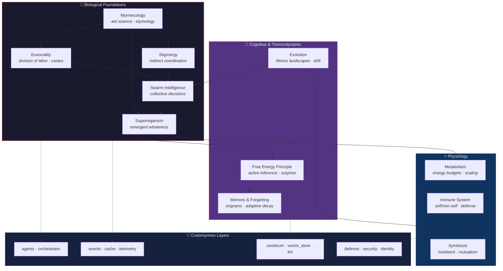
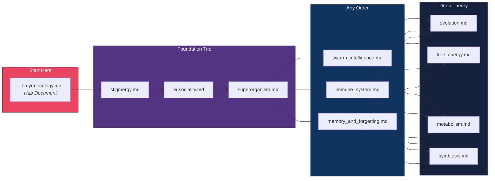

# Biological & Cognitive Perspectives

**Series**: Codomyrmex Bio Docs | **Status**: Active | **Last Updated**: March 2026

## Introduction

The name *codomyrmex* is a portmanteau of the Latin *codo* (to arrange, to order — here signifying code) and the Greek *myrmex* (ant). This naming is not decorative. Ant colonies are among the most intensively studied examples of distributed computation in nature, and the architectural decisions embedded in codomyrmex draw repeatedly on principles first characterized in myrmecology, behavioral ecology, cognitive science, and theoretical biology.

This document series uses biological and cognitive science as **analytical lenses** to illuminate the design of codomyrmex. Each essay takes a specific concept from the life sciences — stigmergy, eusociality, active inference, immune function — and traces its structural analogues through the platform's module system. The goal is not loose metaphor but **precise mapping**: identifying where codomyrmex modules implement patterns that biologists have formalized, and where those formalisms suggest design improvements or extensions.

The series assumes familiarity with the codomyrmex module architecture described in the [project README](../../README.md) and with the AI integration patterns documented in [PAI.md](../../PAI.md).

## Conceptual Map

The following diagram traces how the eleven biological concepts relate to one another and to the core system layers of codomyrmex.

## Document Index

| Document | Core Concept | Primary Modules | Key Theorists |
|----------|-------------|-----------------|---------------|
| [myrmecology.md](./myrmecology.md) | Study of ants, etymology | bio_simulation, spatial, embodiment, relations, governance | Wheeler, Hölldobler & Wilson, Gordon, Dorigo |
| [stigmergy.md](./stigmergy.md) | Indirect coordination via environmental traces | events, cache, logging_monitoring, agentic_memory, bio_simulation | Grassé, Deneubourg, Theraulaz, Heylighen |
| [eusociality.md](./eusociality.md) | Division of labor, caste systems | agents, orchestrator, plugin_system, identity, system_discovery | Hamilton, Bonabeau, Seeley |
| [swarm_intelligence.md](./swarm_intelligence.md) | Collective decision-making | meme, concurrency, evolutionary_ai, market, graph_rag | Dorigo, Pratt, Bonabeau, Reynolds |
| [superorganism.md](./superorganism.md) | Colony as organism | system_discovery, telemetry, model_context_protocol, bio_simulation | Wheeler, Hölldobler & Wilson, Seeley |
| [immune_system.md](./immune_system.md) | Digital defense, self/non-self | defense, security, identity, privacy, validation, chaos_engineering | Matzinger, Cremer, Forrest |
| [memory_and_forgetting.md](./memory_and_forgetting.md) | Memory models, adaptive decay | agentic_memory, cache, cerebrum, vector_store, telemetry | Ebbinghaus, Hebb, Anderson & Schooler |
| [evolution.md](./evolution.md) | Selection, fitness landscapes | evolutionary_ai, meme, prompt_engineering, model_ops, vector_store | Dawkins, Wright, Kimura, Gould |
| [free_energy.md](./free_energy.md) | Active inference, prediction error | cerebrum, performance, telemetry, logging_monitoring, model_ops | Friston, Clark, Knill & Pouget |
| [metabolism.md](./metabolism.md) | Resource flow, scaling laws | performance, rate_limiting, cache, streaming | Kleiber, West, Oster & Wilson |
| [symbiosis.md](./symbiosis.md) | Mutualism, holobiont | model_context_protocol, plugin_system, agents, llm, wallet | Margulis, Bordenstein, Schultz & Brady |

## Suggested Reading Order

**Start here:**

1. **[myrmecology.md](./myrmecology.md)** — The hub document. Introduces the etymological roots of codomyrmex, surveys the science of ants, and provides a navigational overview of the entire series. Every other document is linked and summarized here.

**Foundation trio** (read in order):

1. **[stigmergy.md](./stigmergy.md)** — The most fundamental coordination mechanism: indirect communication through environmental modification. This concept underpins event systems, caching, and logging throughout the platform.
2. **[eusociality.md](./eusociality.md)** — How labor divides into specialized roles. Maps directly to the agent framework, orchestrator, and plugin architecture.
3. **[superorganism.md](./superorganism.md)** — How a distributed system of semi-autonomous components can exhibit organism-level coherence. Connects system discovery, telemetry, and the Model Context Protocol.

**Remaining documents** (any order):

1. **[swarm_intelligence.md](./swarm_intelligence.md)** — Collective decision-making without centralized control.
2. **[immune_system.md](./immune_system.md)** — Defense, threat detection, and adaptive security.
3. **[memory_and_forgetting.md](./memory_and_forgetting.md)** — How information persists, decays, and is selectively retrieved.
4. **[evolution.md](./evolution.md)** — Selection pressure, fitness landscapes, and iterative improvement.
5. **[free_energy.md](./free_energy.md)** — Active inference and the minimization of prediction error.
6. **[metabolism.md](./metabolism.md)** — Resource acquisition, allocation, and expenditure.
7. **[symbiosis.md](./symbiosis.md)** — Mutualistic partnerships and the holobiont concept.

## Theoretical Lineage

The biological thinking in this series draws on several intellectual traditions:

| Tradition | Key Figures | Core Insight | Codomyrmex Relevance |
|-----------|------------|--------------|---------------------|
| **Cybernetics** | Wiener, Ashby, Beer | Circular causation, requisite variety, viable system model | System architecture, homeostatic regulation |
| **Complexity Science** | Kauffman, Holland, Wolfram | Emergent order at the edge of chaos, self-organization | Multi-agent coordination, swarm behavior |
| **Autopoiesis** | Maturana, Varela | Self-producing systems, operational closure | Module boundaries, MCP as organizational closure |
| **Enactivism** | Varela, Thompson, Di Paolo | Cognition as embodied action, sense-making | Active inference agents, embodiment module |
| **Niche Construction** | Odling-Smee, Laland | Organisms modify their own selective environment | Stigmergy, agentic memory as environmental modification |

## Related Resources

- [Project README](../../README.md) — Platform overview, module architecture, and quick start
- [PAI Integration](../../PAI.md) — AI agent integration and the PAI Algorithm mapping
- [SPEC.md](./SPEC.md) — Functional specification for this document series
- [AGENTS.md](./AGENTS.md) — Agent coordination guidelines
- [PAI.md](./PAI.md) — PAI integration context
