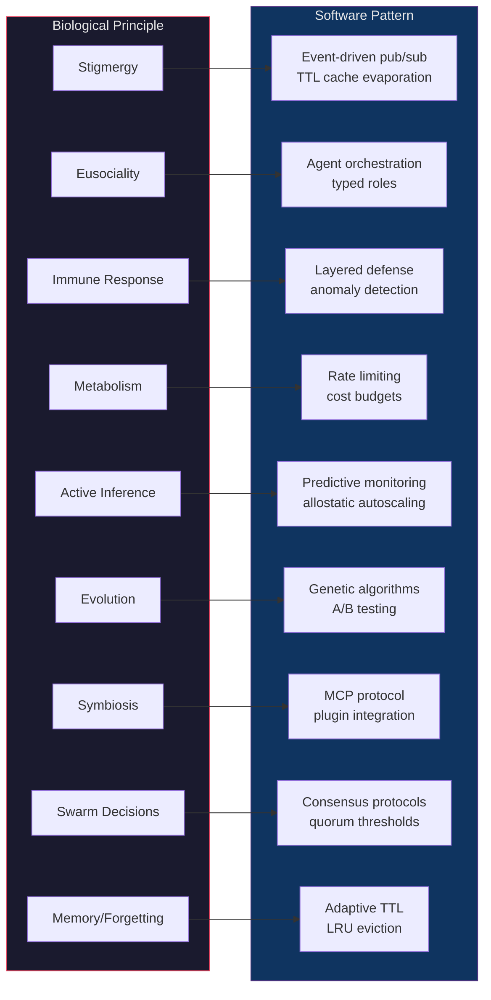

# Bio-Inspired Design — Functional Specification

**Section**: `docs/bio` | **Version**: v1.1.9 | **Status**: Active | **Last Updated**: March 2026

## 1. Purpose & Scope

This documentation suite explores biological and cognitive principles — from myrmecology to active inference — that inform the architectural design of Codomyrmex. Each essay maps a specific life-science concept to concrete platform modules, producing not metaphor but **structural correspondence**: identifying design patterns that biologists have formalized and that codomyrmex implements computationally.

## 2. Document Inventory

| Document | Topic | Biological Domain | Key Formalisms |
|----------|-------|-------------------|----------------|
| `myrmecology.md` | Ant science, etymology, hub | Myrmecology | ACO metaheuristic, agent-based modeling |
| `stigmergy.md` | Indirect coordination | Behavioral ecology | Pheromone dynamics, positive feedback, evaporation |
| `eusociality.md` | Division of labor | Sociobiology | Hamilton's rule (*rb > c*), response-threshold model |
| `swarm_intelligence.md` | Collective decisions | Swarm robotics | ACO, quorum sensing, flocking (separation-alignment-cohesion) |
| `superorganism.md` | Colony as organism | Superorganism theory | Multilevel selection, emergent homeostasis |
| `immune_system.md` | Defense, self/non-self | Immunology | Danger model (Matzinger), social immunity, clonal selection |
| `memory_and_forgetting.md` | Adaptive memory | Cognitive psychology | Forgetting curve, Hebbian learning, hippocampal replay |
| `evolution.md` | Selection & fitness | Evolutionary biology | Fitness landscapes, neutral theory, Baldwin effect |
| `free_energy.md` | Active inference | Theoretical neuroscience | Free energy principle, Markov blankets, predictive processing |
| `metabolism.md` | Resource flow | Metabolic ecology | Kleiber's law, allometric scaling, trophallaxis |
| `symbiosis.md` | Holobiont, mutualism | Symbiosis & microbiology | Endosymbiotic theory, hologenome, myrmecophily |

## 3. Biological → Software Mapping

## 4. Formal Analogies

Each mapping satisfies a **structure-preserving correspondence** — not just surface resemblance but shared mathematical or algorithmic structure:

| Biological Mechanism | Mathematical Structure | Software Implementation |
|---------------------|----------------------|------------------------|
| Pheromone trail reinforcement | Positive feedback loop with exponential decay | `EventBus` publish + `Cache` TTL refresh |
| Hamilton's rule (*rb > c*) | Cost-benefit inequality under relatedness weighting | Agent role assignment with capability scoring |
| Clonal selection | Selective amplification of matching detectors | Adaptive rule engines in `defense/` |
| Kleiber's law (M ∝ M^0.75) | Sublinear scaling of metabolic rate | Throughput monitoring in `performance/` |
| Fitness landscape | NK model, rugged optimization surface | Population-based search in `evolutionary_ai/` |
| Markov blanket | Conditional independence boundary | Module encapsulation via MCP interfaces |
| Forgetting curve | Exponential decay R = e^(-t/S) | TTL-based cache eviction policies |
| Quorum sensing | Threshold-triggered state transition | Consensus algorithms in multi-agent orchestration |

## 5. Quality Criteria

Each essay in this series must satisfy:

1. **Biological rigor** — Cite primary literature; name specific theorists, organisms, and experimental results
2. **Architectural precision** — Map to specific Codomyrmex modules by path, not vague "architecture"
3. **Formal structure** — Identify the mathematical or algorithmic invariant the mapping preserves
4. **Design implications** — Extract actionable engineering principles from the biological insight
5. **Cross-references** — Link to related essays and to the project's code and documentation

## 6. Non-Goals

- This series does not replace technical documentation (SPEC.md, README.md) in individual modules
- Biological accuracy takes priority over optimistic analogy — where the mapping breaks down, say so
- Not a tutorial — assumes familiarity with both biology and software architecture

## References

- [README.md](README.md) — Series overview and reading order
- [AGENTS.md](AGENTS.md) — Agent coordination guidelines
- [PAI.md](PAI.md) — PAI integration context
- [Project README](../../README.md) — Platform overview
