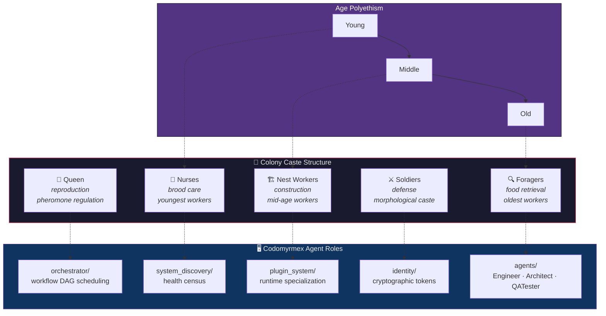

# Eusociality and the Division of Labor

**Series**: [Biological & Cognitive Perspectives](./README.md) | **Hub**: [myrmecology.md](./myrmecology.md)

Eusociality represents the most complex form of social organization in the animal kingdom. Its structural principles — cooperative brood care, overlapping generations, and reproductive division of labor — provide a rigorous biological framework for reasoning about multi-agent software architectures.

## The Biology

Eusociality is characterized by three criteria: cooperative care of offspring by non-parents, overlapping adult generations, and a division of labor in which some individuals forgo reproduction to assist reproductive nestmates. This organization has evolved independently at least eleven times across Hymenoptera, Isoptera, and other taxa (Wilson & Holldobler, 2005).

### Hamilton's Rule and the Genetics of Altruism

Hamilton's inclusive fitness theory (Hamilton, 1964) provided the first genetic explanation. Hamilton's rule, **rb > c**, states that altruism is favored when relatedness (*r*) weighted by benefit (*b*) exceeds cost (*c*). In haplodiploid Hymenoptera, sisters share 75% of alleles on average, creating asymmetric relatedness that can favor worker sterility. This is not the only explanation — multilevel selection (Nowak, Tarnita & Wilson, 2010) and direct benefits models also contribute — but Hamilton's rule remains the foundational formalism.

The computational parallel is striking: in a multi-agent system, an agent "altruistically" performing infrastructure work (monitoring, caching, logging) rather than direct task execution benefits the system at personal cost. The "relatedness" analogue is shared codebase — agents built on the same framework share more "genetic material" and thus benefit more from each other's infrastructure investments.

### Response-Threshold Model

The division of labor within colonies is not rigid. The response-threshold model (Bonabeau, Theraulaz & Deneubourg, 1996) explains this: each worker has an internal threshold θᵢ for a given task stimulus *s*. The probability of engaging in the task follows a sigmoid:

$$P(\text{engage}) = \frac{s^n}{s^n + \theta_i^n}$$

When environmental stimulus exceeds that threshold, the worker engages. Thresholds vary among individuals, producing probabilistic task allocation without centralized coordination. Age polyethism further structures this: young ants nurse brood, middle-aged workers maintain the nest, and the oldest forage (the temporal polyethism model of Seeley, 1982).

### Caste Determination: Genetics vs. Epigenetics

A critical insight for software architecture: caste determination in most ant species is **epigenetic**, not genetic. Workers and queens share the same genome; their fate diverges through nutritional, hormonal, and social signals during larval development. In *Apis mellifera*, royal jelly triggers queen development by modifying gene expression via DNA methylation. This means the "program" is the same — the **environment** determines specialization.

This is the biological argument for **runtime configuration over compile-time specialization**: an agent's role should be determined by context (available plugins, workload, system state), not hardcoded at build time.

## Architectural Mapping

- **[`agents`](../../src/codomyrmex/agents/)** — Typed agent interfaces (Engineer, Architect, QATester) parallel morphological castes. Just as colonies partition labor among workers, soldiers, and foragers, codomyrmex partitions computation among agents with distinct capabilities and behavioral policies. But castes are not ranks — they differ in capability, not authority.

- **[`orchestrator`](../../src/codomyrmex/orchestrator/)** — Workflow DAGs function as colony-level task allocation. DAG scheduling determines task availability and agent eligibility, mirroring how stimulus fields and response thresholds assign workers without central command. The orchestrator is not a queen — it is the *task environment itself*, the set of stimuli to which agents probabilistically respond.

- **[`plugin_system`](../../src/codomyrmex/plugin_system/)** — Plugins implement developmental plasticity. Caste determination in many species depends on nutritional and hormonal signals during development, not strict genetics. Analogously, plugins differentiate generic agents into specialists at runtime — a `BaseAgent` becomes a code reviewer, a security auditor, or a documentation writer depending on which plugins are loaded.

- **[`identity`](../../src/codomyrmex/identity/)** — Nestmate recognition relies on cuticular hydrocarbon profiles — chemical identity tokens distinguishing colony members from intruders. Lahav et al. (1999) showed that these profiles are colony-specific mixtures of long-chain hydrocarbons continuously exchanged through trophallaxis. The identity module provides cryptographic tokens serving the same function: determining agent access and role within the system.

- **[`system_discovery`](../../src/codomyrmex/system_discovery/)** — Colonies continuously assess workforce composition. Task allocation in *Atta sexdens* adjusts to worker removals within minutes. System_discovery performs an analogous census: monitoring module health and agent availability so orchestration can adapt to changes without manual intervention.

## Design Implications

**Type agents by function, not hierarchy.** Ant castes are defined by capability, not rank. Worker ants are not subordinate to the queen — they have different functions. Agent types should differ in tool access and behavioral repertoire, not authority level.

**Use response thresholds for dynamic task switching.** Implement threshold-based activation rather than static assignment. Agents monitor task queues and engage when stimulus exceeds their threshold, producing self-organizing allocation that degrades gracefully under agent loss. This is fundamentally different from load balancing — it is *self-allocation* driven by environmental state.

**Let the environment drive specialization.** Caste determination is largely epigenetic. An agent's specialization should be driven by runtime environment — available plugins, workload, system state — not hardcoded at compile time. The same agent binary, placed in different environments, should develop different specializations.

**Expect and design for age-based role transitions.** Workers shift roles as they age. Long-running agents may similarly accumulate state, context, and calibration that makes them better suited for different tasks over time. Session management should support graceful role transitions rather than stateless restarts.

## Further Reading

- Hamilton, W.D. (1964). The genetical evolution of social behaviour. I & II. *Journal of Theoretical Biology*, 7(1), 1–52.
- Bonabeau, E., Theraulaz, G. & Deneubourg, J.-L. (1996). Quantitative study of the fixed threshold model for the regulation of division of labour in insect societies. *Proceedings of the Royal Society B*, 263(1376), 1565–1569.
- Wilson, E.O. & Holldobler, B. (2005). Eusociality: origin and consequences. *Proceedings of the National Academy of Sciences*, 102(38), 13367–13371.
- Nowak, M.A., Tarnita, C.E. & Wilson, E.O. (2010). The evolution of eusociality. *Nature*, 466, 1057–1062.
- Lahav, S. et al. (1999). Nestmate recognition in the ant *Cataglyphis niger*. *Animal Behaviour*, 57(4), 813–819.
- Seeley, T.D. (1982). Adaptive significance of the age polyethism schedule in honeybee colonies. *Behavioral Ecology and Sociobiology*, 11, 287–293.

## See Also

- [Myrmecology and Software Architecture](./myrmecology.md) — The foundational colony metaphor
- [The Superorganism](./superorganism.md) — Colony-level coherence from individual agents
- [Swarm Intelligence and Collective Decision-Making](./swarm_intelligence.md) — Emergent optimization
- [Immune System Analogies](./immune_system.md) — Defense as specialized caste behavior
- [Stigmergy and Indirect Coordination](./stigmergy.md) — How tasks are communicated without hierarchy
- [Project README](../../README.md) | [PAI Integration](../../PAI.md)
