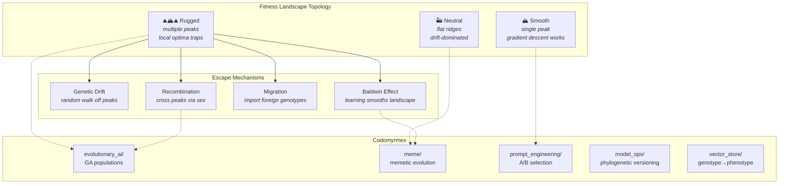

# Evolution, Selection, and Fitness Landscapes

**Series**: [Biological & Cognitive Perspectives](./README.md) | **Hub**: [myrmecology.md](./myrmecology.md)

Evolution by natural selection is the only known process that reliably produces complex adaptive systems without centralized design. Its core logic — **variation, selection, inheritance** — applies wherever entities replicate with modification under differential survival, making evolutionary theory both an architectural metaphor and a direct algorithmic framework.

## The Biology

### The Blind Watchmaker

Richard Dawkins (1986) characterized natural selection as the "blind watchmaker": cumulative retention of small improvements produces the appearance of design without foresight. The requirements are heritable variation, differential reproductive success correlated with traits, and sufficient time.

### Fitness Landscapes

Sewall Wright (1932) introduced **fitness landscapes**: multidimensional spaces where each point represents a genotype and its height represents fitness. Populations climb toward adaptive peaks via selection. Rugged landscapes with multiple peaks create the problem of **local optima** — the fundamental challenge of all optimization.

### Neutral Theory

Motoo Kimura's **neutral theory** (1968) demonstrated that much molecular evolution is driven by random drift of selectively neutral mutations, not adaptation. Not all change is functional — a corrective to interpreting every feature as optimized. In software terms: not every code change is an improvement. Some variation is neutral, and **maintaining neutral diversity** is valuable because neutral variants may prove adaptive when conditions shift.

### The Extended Phenotype

Dawkins's **extended phenotype** (1982) expanded selection beyond the organism's body. Genes affect the world beyond their carrier: beaver dams and spider webs are gene expression. This dissolves the boundary between organism and environment. In codomyrmex: a module's effects extend beyond its own code — its configuration files, log outputs, cached artifacts, and API schemas are all part of its "extended phenotype," shaping the selective environment for other modules.

### The Baldwin Effect

The **Baldwin effect** describes how learning guides genetic evolution: organisms that learn to cope with challenges survive to reproduce, and over generations, genetic variants that reduce learning cost are favored. Learning smooths the fitness landscape, turning "impossible" jumps between peaks into gradual transitions. In codomyrmex, prompt engineering (learned behavior) guides model fine-tuning (genetic change) — prompts that work well are eventually incorporated into model training data.

### Punctuated Equilibrium

Eldredge and Gould (1972) proposed **punctuated equilibrium**: long stasis interrupted by rapid change, suggesting evolution concentrates at speciation events driven by ecological disruption. Software systems exhibit the same pattern — long periods of stability punctuated by architecture-breaking refactors. The implication: design for **evolvability**, not just current fitness. Make the system easy to refactor when the punctuation arrives.

## Architectural Mapping

- **[`evolutionary_ai`](../../src/codomyrmex/evolutionary_ai/)** — Direct implementation: genetic algorithms maintain candidate populations, apply mutation and crossover, and select on fitness. The module navigates Wright's landscapes and contends with local optima through diversity-maintenance mechanisms (tournament selection, niching, island models).

- **[`meme`](../../src/codomyrmex/meme/)** — Cultural evolution: Dawkins's memes as units of cultural selection. Memetic algorithms combine genetic search with local optimization, implementing the Baldwin effect. Solutions are both inherited (crossover) and learned (local search), and the interaction between inheritance and learning smooths the fitness landscape.

- **[`prompt_engineering`](../../src/codomyrmex/prompt_engineering/)** — Artificial selection: A/B testing prompts is selective breeding for outputs. Selection pressure is explicit and human-directed, but the logic is identical to natural selection. The fitness function is human judgment; the variation source is prompt mutation.

- **[`model_ops`](../../src/codomyrmex/model_ops/)** — Phylogenetic versioning: model versions form a **tree of descent with modification**. The registry preserves lineage, enabling rollback and branch comparison. This is cladistics applied to ML models — every version has an ancestor, and the branching structure records the evolutionary history of the system.

- **[`vector_store`](../../src/codomyrmex/vector_store/)** — Genotype-phenotype mapping: raw data (genotype) is transformed through feature engineering into representations (phenotype) that models consume. This mapping determines which variation is visible to selection — the representation constrains what evolution can optimize, just as developmental constraints limit morphological variation.

## Design Implications

**Use evolutionary search for poorly understood landscapes.** When the objective function is rugged or high-dimensional, evolutionary methods require only fitness evaluation, not gradient computation. They are robust to noise, multimodality, and discontinuity.

**Version models phylogenetically.** Treating versions as lineage preserves adaptation history. Branching enables exploring multiple strategies; ancestry tracking enables principled comparison. A model registry without lineage tracking is like a fossil record without stratigraphy.

**Maintain diversity to avoid local optima.** Multiple approaches — architectures, prompt strategies, feature sets — preserve the ability to escape suboptimal peaks. Neutral variation may prove adaptive when conditions shift. **Premature convergence is the evolutionary death of a system.**

**Test prompts as artificial selection.** Systematic A/B testing applies selection pressure to prompt variants, producing adapted prompts through the same logic that produces adapted organisms. The evaluation metric is the fitness function; the prompt variants are the population.

**Design for evolvability.** The most successful biological lineages are not those that are best adapted to current conditions but those whose architecture permits rapid adaptation when conditions change. Modularity, well-defined interfaces, and composability are the software engineering equivalents of genetic modularity and developmental flexibility.

## Further Reading

- Dawkins, R. (1982). *The Extended Phenotype*. Oxford University Press.
- Wright, S. (1932). The roles of mutation, inbreeding, crossbreeding and selection in evolution. *Proceedings of the Sixth International Congress of Genetics*, 1, 356–366.
- Eiben, A.E. & Smith, J.E. (2003). *Introduction to Evolutionary Computing*. Springer.
- Kimura, M. (1968). Evolutionary rate at the molecular level. *Nature*, 217, 624–626.
- Eldredge, N. & Gould, S.J. (1972). Punctuated equilibria: An alternative to phyletic gradualism. In T.J.M. Schopf (Ed.), *Models in Paleobiology*, 82–115. Freeman, Cooper.
- Kauffman, S.A. (1993). *The Origins of Order: Self-Organization and Selection in Evolution*. Oxford University Press.

## Cross-References

- [Myrmecology and Software Architecture](./myrmecology.md) — Ant colonies as products of social evolution
- [Swarm Intelligence and Collective Computation](./swarm_intelligence.md) — Emergent optimization from evolutionary-tuned local rules
- [Memory, Forgetting, and the Engram](./memory_and_forgetting.md) — Memory as the substrate of within-lifetime adaptation
- [Symbiosis and System Integration](./symbiosis.md) — Co-evolution between symbiotic partners
- [Free Energy and Active Inference](./free_energy.md) — Active inference as within-lifetime Bayesian evolution
- [Project README](../../README.md) | [PAI Integration](../../PAI.md)
