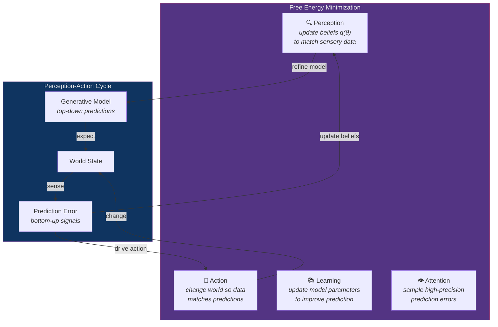
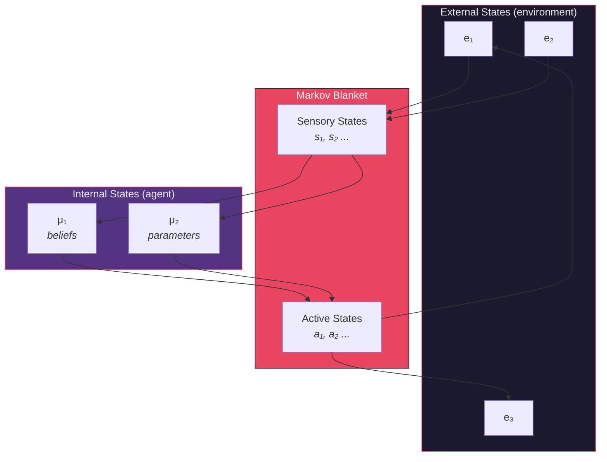

# The Free Energy Principle and Active Inference

**Series**: [Biological & Cognitive Perspectives](./README.md) | **Hub**: [myrmecology.md](./myrmecology.md) | **Topic**: Predictive Processing and Surprise Minimization

## The Biology

### The Free Energy Principle

The free energy principle proposes that biological systems maintain their integrity by minimizing **variational free energy** — an information-theoretic quantity that bounds surprise, the improbability of sensory observations given an internal generative model (Friston, 2006). An organism that persists must occupy a restricted set of viable states; minimizing free energy is equivalent to minimizing the divergence between the organism's beliefs about the world and the actual causes of its sensory input.

Mathematically, free energy F provides an upper bound on surprise:

$$F = \underbrace{D_{KL}[q(\theta) \| p(\theta | o)]}_{\text{complexity}} + \underbrace{(-\ln p(o))}_{\text{surprise}} \geq -\ln p(o)$$

where *q(θ)* is the approximate posterior (the agent's beliefs), *p(θ|o)* is the true posterior, and *p(o)* is the evidence. Minimizing F forces beliefs toward accuracy (perceptual inference) while minimizing complexity (Occam's razor).

### Active Inference

Friston (2010) elevated this to a candidate unified brain theory, arguing that perception, action, learning, and attention are all forms of free energy minimization:

Perception updates beliefs to better predict sensory data. Action changes the world so data conforms to predictions — this is **active inference**, in which organisms act to confirm their expectations rather than passively correcting errors. The Bayesian brain hypothesis (Knill & Pouget, 2004) established that neural populations encode probability distributions, and Clark (2013) synthesized this into the **predictive processing framework**: the brain generates top-down expectations and processes bottom-up prediction errors hierarchically.

### Markov Blankets

A central construct is the **Markov blanket** — the set of states separating a system's internals from its environment, mediating all statistical interactions (Pearl, 1988). In a cell the blanket is the membrane; in a colony it is the nest boundary and the sensory repertoire of foragers. Markov blankets define "self" in a principled statistical sense — a system is whatever lies inside its blanket.

The connection to homeostasis is direct: minimizing free energy keeps internal states viable. **Allostasis** — anticipatory regulation before predicted need — is naturally expressed as active inference. The organism doesn't wait for stress to respond; it predicts stress and preemptively adjusts.

## Architectural Mapping

| Biological Concept | Module | Implementation |
|-------------------|--------|---------------|
| Active inference agents | `cerebrum/` | Maintain beliefs, predict, compute errors, select actions |
| Amortized inference | `performance/` | Trained recognition models bypass iterative optimization |
| Sensory-motor loop | `telemetry/` | Telemetry data = sensory input; system responses = motor output |
| Interoception | `logging_monitoring/` | Internal state monitoring (CPU, memory, error rates) |
| Model evidence | `model_ops/` | Model versioning as Bayesian model comparison |

**[`cerebrum`](../../src/codomyrmex/cerebrum/)** directly implements active inference agents that maintain probabilistic beliefs, generate predictions, compute prediction errors, and select actions minimizing expected free energy. This module operationalizes the mathematics as executable code.

**[`performance`](../../src/codomyrmex/performance/)** implements **amortized inference**: training recognition models that map observations directly to approximate posteriors, bypassing expensive iterative optimization. This parallels the brain learning fast perceptual shortcuts that reduce computational surprise — the "compiled" version of inference.

**[`telemetry`](../../src/codomyrmex/telemetry/)** closes the perception-action loop. Telemetry data constitutes sensory input; system responses (scaling, rerouting, alerting) constitute motor output. Active inference requires this closed loop between sensing and acting. Without telemetry, the system is sensory-deprived — blind inference.

**[`logging_monitoring`](../../src/codomyrmex/logging_monitoring/)** serves as **interoception** — monitoring internal state (CPU, memory, error rates, queue depths). Deviations from expected internal states generate interoceptive prediction errors, signaling that the system's self-model has diverged from reality. Interoceptive prediction error is the computational equivalent of pain.

**[`model_ops`](../../src/codomyrmex/model_ops/)** tracks **model evidence** — the quantity free energy bounds. Model versioning, evaluation, and A/B testing are forms of Bayesian model comparison: which generative model best explains observed data? Models with poor predictive performance are retired, mirroring selection on internal models.

## Design Implications

**Prediction error as health metric.** Large sustained prediction errors indicate the system's internal model has become inaccurate — the computational equivalent of physiological distress. Dashboards should foreground prediction error magnitude, not just raw metrics.

**Active over reactive.** Prefer actions that preemptively reshape inputs to match predictions (allostatic regulation) over corrections after deviation. Autoscaling on **predicted** load rather than **observed** load exemplifies this. The system should act to prevent surprise, not merely react to it.

**Markov blankets as module boundaries.** A well-designed module interacts with the system only through a clearly defined interface. Internal state changes should be conditionally independent of the external environment given that interface — encapsulation formalized statistically. This is not just good software engineering; it is a *mathematical property* of viable self-organizing systems.

**Generative over discriminative.** Generative models that explain causes support simulation, counterfactual reasoning, and planning by imagination. Discriminative models that merely classify lack these capabilities. Prefer generative architectures where possible.

**Complexity is costly.** Free energy penalizes model complexity (the D_KL term). Unnecessarily complex models incur an Occam penalty even if they fit data well. This provides a principled argument for simplicity in architecture: **the simplest model that generates accurate predictions is the best model.**

## Further Reading

- Friston, K. (2006). A free energy principle for the brain. *Journal of Physiology–Paris*, 100(1–3), 70–87.
- Friston, K. (2010). The free-energy principle: a unified brain theory? *Nature Reviews Neuroscience*, 11, 127–138.
- Clark, A. (2013). Whatever next? Predictive brains, situated agents, and the future of cognitive science. *Behavioral and Brain Sciences*, 36(3), 181–204.
- Knill, D.C. & Pouget, A. (2004). The Bayesian brain: the role of uncertainty in neural coding and computation. *Trends in Neurosciences*, 27(12), 712–719.
- Pearl, J. (1988). *Probabilistic Reasoning in Intelligent Systems*. Morgan Kaufmann.
- Parr, T., Pezzulo, G. & Friston, K.J. (2022). *Active Inference: The Free Energy Principle in Mind, Brain, and Behavior*. MIT Press.

## See Also

- [Myrmecology and Software Architecture](./myrmecology.md) — The foundational colony metaphor
- [Memory and Forgetting](./memory_and_forgetting.md) — How information persists and decays in predictive systems
- [Metabolism, Energy Budgets, and Resource Flow](./metabolism.md) — Free energy minimization has metabolic costs
- [The Superorganism](./superorganism.md) — Active inference at the colony level
- [Evolution, Selection, and Fitness Landscapes](./evolution.md) — Natural selection as free energy minimization across generations

---

*Return to [series index](./README.md) | [Project README](../../README.md) | [PAI Integration](../../PAI.md)*
