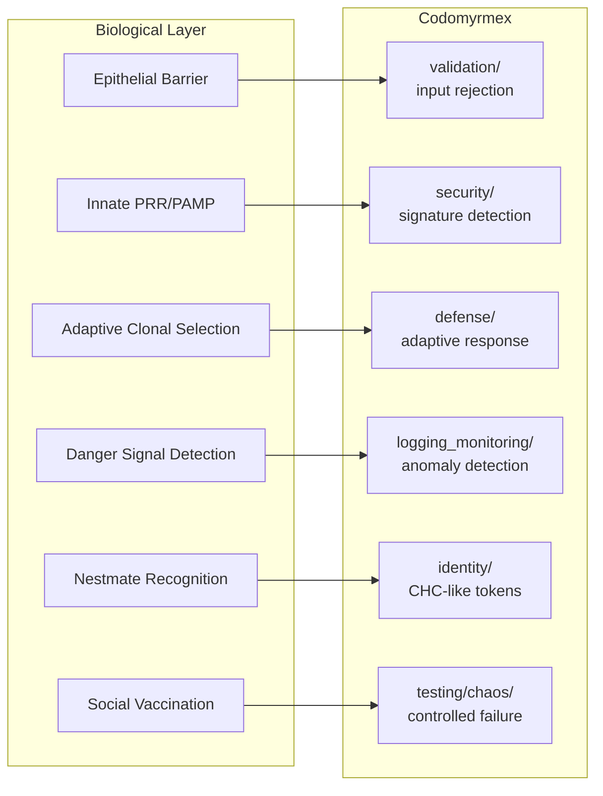

# Immune Systems and Digital Defense

**Series**: [Biological & Cognitive Perspectives](./README.md) | **Hub**: [myrmecology.md](./myrmecology.md)

The immune system must detect and neutralize an unbounded space of pathogens while tolerating the body's own tissues and commensal microbiota. This discrimination problem — distinguishing dangerous from benign — maps directly onto central challenges in software security.

## The Biology

### Innate and Adaptive Immunity

Vertebrate immunity operates through two subsystems with fundamentally different computational architectures:

```mermaid
graph TB
    subgraph INNATE["🛡️ Innate Immunity (fast, general)"]
        direction TB
        PRR["Pattern Recognition Receptors<br/><i>Toll-like receptors</i>"]
        PAMP["PAMPs<br/><i>lipopolysaccharide<br/>flagellin · dsRNA</i>"]
        BARRIER["Epithelial Barriers<br/><i>skin · mucosa</i>"]
        INFLAM["Inflammation<br/><i>non-specific response</i>"]
    end

    subgraph ADAPTIVE["🧬 Adaptive Immunity (slow, specific)"]
        direction TB
        CLONAL["Clonal Selection<br/><i>antigen-specific expansion</i>"]
        TCELL["T Cells<br/><i>cytotoxic · helper</i>"]
        BCELL["B Cells<br/><i>antibody production</i>"]
        MEMORY_CELL["Memory Cells<br/><i>long-lived · rapid re-response</i>"]
    end

    subgraph SOCIAL["🐜 Social Immunity (colony-level)"]
        direction TB
        GROOM["Allogrooming<br/><i>spore removal</i>"]
        ANTIMICRO["Metapleural Gland<br/><i>antimicrobial secretions</i>"]
        HYGIENE["Hygienic Behavior<br/><i>infected brood removal</i>"]
        SPATIAL_DEF["Spatial Compartments<br/><i>waste zones · quarantine</i>"]
    end

    INNATE --> |"ancient · hardcoded · fast"| RESPONSE["Immune Response"]
    ADAPTIVE --> |"vertebrate · learned · slow"| RESPONSE
    SOCIAL --> |"behavioral · organizational"| RESPONSE
```

**Innate immunity** provides rapid defense via pattern recognition receptors (PRRs) such as Toll-like receptors, which detect pathogen-associated molecular patterns (PAMPs) — conserved signatures like lipopolysaccharide that are common across pathogen classes but absent from host cells. This system is ancient, hardcoded, and fast. It is a **signature-based classifier** — the biological equivalent of regex matching against a known-bad list.

**Adaptive immunity** is slower but specific. Upon encountering a novel antigen, lymphocytes undergo clonal selection: cells whose receptors bind the antigen proliferate into effector cells and long-lived memory cells, enabling faster responses upon re-exposure. This is a **self-modifying classifier** that learns from encounter history — the biological analogue of an IDS that builds detection rules from novel attacks.

### The Danger Model

Polly Matzinger's **danger model** (1994) proposed that immune response is triggered not merely by foreignness but by **tissue damage signals**. Damaged cells release danger-associated molecular patterns (DAMPs) that prime adaptive responses. This explains tolerance of food antigens (no damage signal) and rejection of transplants (surgical damage provides context).

The computational implication is profound: **anomaly detection should respond to damage signals, not just foreign signatures.** A system that only blocks known-bad inputs will miss novel attacks. A system that monitors for damage — elevated error rates, unusual resource consumption, data corruption — detects attacks by their effects regardless of attack vector.

### Social Immunity in Ants

Cremer, Armitage, and Schmid-Hempel (2007) described **social immunity** in ants: allogrooming to remove fungal spores, prophylactic antimicrobial secretions from the metapleural gland, hygienic removal of infected brood, and spatial compartmentalization. Colony immune response is distributed, behavioral, and organizational — it operates at the **superorganism level** (see [superorganism.md](./superorganism.md)).

Konrad et al. (2012) discovered **social vaccination**: low-level pathogen exposure during allogrooming primes nestmates' immune systems without causing disease. The colony distributes immunity through controlled transmission — a biological form of chaos engineering.

## Architectural Mapping

- **[`defense`](../../src/codomyrmex/defense/)** — Adaptive immunity: learns from attacks, builds a response repertoire. Like clonal selection, encounter with a novel threat generates persistent countermeasures. Memory cells → persistent defense rules.

- **[`security`](../../src/codomyrmex/security/)** — Innate immunity: signature-based detection analogous to PRR/PAMP recognition. Firewalls function as epithelial barriers separating interior from exterior. Fast, general, hardcoded.

- **[`identity`](../../src/codomyrmex/identity/)** — Self/non-self discrimination: authentication tokens serve the same function as cuticular hydrocarbons in ant nestmate recognition. A foreign agent lacking the correct token is identified as non-self and rejected — the computational equivalent of attack by guards on an intruder lacking colony odor.

- **[`privacy`](../../src/codomyrmex/privacy/)** — Immune evasion countermeasures: counters identity spoofing, the digital analogue of social parasites like *Polyergus* slave-making ants that chemically mimic host colony hydrocarbon profiles to avoid detection.

- **[`validation`](../../src/codomyrmex/validation/)** — Epithelial barriers: input validation rejects malformed inputs before they reach deeper layers, like skin preventing pathogen entry. The gut epithelium is instructive — it must be selectively permeable, admitting nutrients while excluding pathogens. Validation similarly must distinguish legitimate from malicious input, not reject everything.

- **[`testing/chaos`](../../src/codomyrmex/testing/chaos/)** — Social vaccination: controlled exposure to failure builds resilience, like attenuated vaccines priming immunity without causing disease. Konrad et al.'s social vaccination demonstrates that controlled, survivable exposure produces stronger collective immunity than isolation.

## Design Implications

**Layer defenses.** Epithelial barriers, innate recognition, and adaptive responses form overlapping layers. Software defense should similarly stack validation, signature scanning, behavioral analysis, and adaptive response. **Defense in depth** is not paranoia — it is how every immune system that survived natural selection is organized.

**Respond to danger signals, not just signatures.** Matzinger's model implies anomaly detection — monitoring for damage indicators like elevated error rates or unusual resource consumption — is more robust than pure signature matching against known attacks. The question is not "is this input foreign?" but "is this input causing damage?"

**Build organizational immunity.** Ant colonies distribute immune function across behavioral, chemical, and spatial mechanisms. Software systems should likewise distribute defense through redundancy, isolation, and collective monitoring. No single defense layer should be a single point of failure.

**Autoimmunity is a real risk.** Overly aggressive immune responses attack healthy tissue. Overly aggressive security systems block legitimate operations. Design tolerance mechanisms — the computational equivalent of regulatory T cells — that calibrate defense intensity to actual threat level.

## Further Reading

- Matzinger, P. (1994). Tolerance, danger, and the extended family. *Annual Review of Immunology*, 12, 991–1045.
- Cremer, S., Armitage, S.A.O. & Schmid-Hempel, P. (2007). Social immunity. *Current Biology*, 17(16), R693–R702.
- Konrad, M. et al. (2012). Social transfer of pathogenic fungus promotes active immunisation in ant colonies. *PLOS Biology*, 10(4), e1001300.
- Forrest, S., Perelson, A.S., Allen, L. & Cherukuri, R. (1994). Self-nonself discrimination in a computer. *Proceedings of the IEEE Symposium on Security and Privacy*, 202–212.
- Janeway, C.A. (1989). Approaching the asymptote? Evolution and revolution in immunology. *Cold Spring Harbor Symposia on Quantitative Biology*, 54, 1–13.

## Cross-References

- [Myrmecology and Software Architecture](./myrmecology.md) — Ant colony organization as architectural metaphor
- [The Superorganism Metaphor](./superorganism.md) — Colony-level properties emergent from individual behaviors
- [Eusociality and Division of Labor](./eusociality.md) — How specialization enables collective defense
- [Symbiosis and the Holobiont](./symbiosis.md) — Distinguishing mutualists from parasites
- [Evolution, Selection, and Fitness Landscapes](./evolution.md) — Arms races between hosts and pathogens
- [Project README](../../README.md) | [PAI Integration](../../PAI.md)
