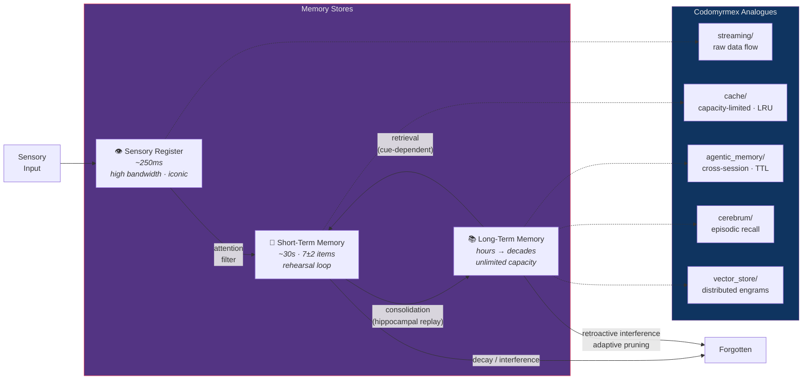
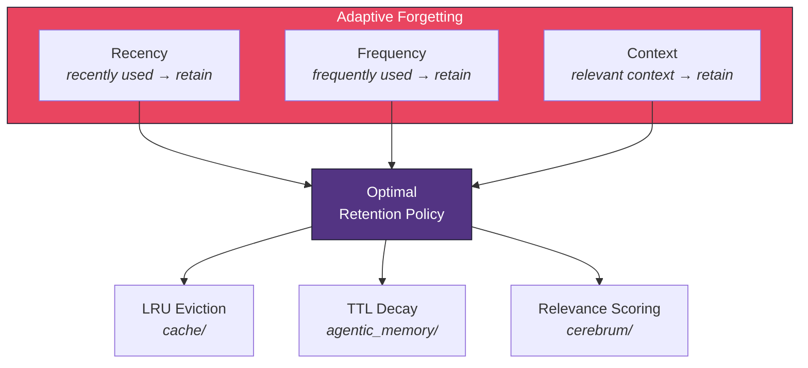

# Memory, Forgetting, and the Engram

**Series**: [Biological & Cognitive Perspectives](./README.md) | **Hub**: [myrmecology.md](./myrmecology.md)

Memory is not passive recording. It is an active, reconstructive process shaped by encoding conditions, interference, and retrieval context. Equally important, **forgetting is not failure** — it is an adaptive mechanism that maintains the relevance and efficiency of stored information.

## The Biology

### Multi-Store Architecture

The **Atkinson-Shiffrin model** (1968) proposed a multi-store architecture: sensory registers hold raw input for fractions of a second, short-term memory (STM) maintains ~7±2 items for seconds to minutes through rehearsal, and long-term memory (LTM) provides effectively unlimited storage over hours to decades. Transfer from STM to LTM requires active **consolidation** — not mere persistence, but reorganization and integration.

### The Forgetting Curve and Spacing Effect

Hermann Ebbinghaus (1885) established the **forgetting curve**: retention declines exponentially as R = e^(-t/S), where *t* is time and *S* is memory strength. The steepest loss occurs in the first hours. He also demonstrated the **spacing effect** — distributed practice produces more durable memory than massed practice, because each retrieval strengthens the trace.

### The Engram: Distributed Memory Traces

Karl Lashley's search for the **engram** — the physical trace of memory — led to the principle that memories are distributed across neural populations rather than stored at single locations. Donald Hebb (1949) proposed the associative rule: "neurons that fire together wire together." When a presynaptic neuron repeatedly helps fire a postsynaptic neuron, the connection strengthens — the basis of **long-term potentiation** (LTP). During sleep, **hippocampal replay** reactivates waking activity patterns, driving cortical consolidation — the brain rehearses memories offline.

The computational parallel: `vector_store/` distributes semantic content across high-dimensional vector spaces. Retrieval is content-addressable — present a pattern fragment, and the system completes it through similarity search. This is the computational version of associative pattern completion in Hopfield networks.

### Adaptive Forgetting

Anderson and Schooler (1991) demonstrated that **adaptive forgetting** mirrors environmental statistics. The probability of needing information declines with time since last use and increases with past frequency — precisely the pattern of human forgetting. This is not noise; it is an **optimal cache policy** evolved to match the statistical structure of real-world information needs.

## Architectural Mapping

- **[`agentic_memory`](../../src/codomyrmex/agentic_memory/)** — Long-term memory with adaptive forgetting: retains information across sessions, applies time-decay and frequency-weighted relevance to prune stale entries. The triple retrieval strategy (recency, relevance, importance) mirrors the three factors Anderson and Schooler identified in human recall.

- **[`cache`](../../src/codomyrmex/cache/)** — Working memory: capacity-limited, recency-biased (LRU eviction mirrors the recency effect), fast to access. Items not re-accessed are evicted — the analogue of decay without consolidation. The capacity limit (~7±2 items in human STM) maps to configurable cache size.

- **[`cerebrum`](../../src/codomyrmex/cerebrum/)** — Hippocampal-like episodic recall: retrieves past cases to inform current decisions through similarity-driven, context-sensitive search. The hippocampus binds disparate cortical representations into coherent episodes; `cerebrum/` binds disparate data fragments into coherent retrieved cases.

- **[`vector_store`](../../src/codomyrmex/vector_store/)** — Distributed engrams: vector embeddings distribute semantic content across high-dimensional representations. Like Lashley's engrams, memory is not stored at a single address but distributed across the embedding space. Retrieval is content-addressable, like pattern completion in associative networks — present a fragment, get the whole.

- **[`telemetry`](../../src/codomyrmex/telemetry/)** — Provenance memory: records where information came from and how it was transformed, paralleling **source monitoring** in human memory. Source monitoring failures (confusing imagination with perception) cause false memories; telemetry provenance failures cause data lineage errors.

## Design Implications

**Forgetting is a feature.** Systems that retain everything become slow and cluttered — the computational equivalent of hyperthymesia (total recall), which is disabling rather than empowering. Design memory with explicit decay policies — pruning by recency, frequency, and relevance — not unbounded accumulation.

**Use multiple stores with different timescales.** Fast, small, volatile caches handle immediate context; slower, larger, durable stores handle long-term retention. Not all cached items should be persisted; promotion criteria should reflect importance. This is the multi-store architecture implemented computationally.

**Consolidation requires active processing.** Writing to disk is not consolidation. Like hippocampal replay, computational consolidation should involve **summarization, indexing, and integration** with existing knowledge. Background consolidation can run during low-demand periods — the system's "sleep."

**Memory is reconstructive, not reproductive.** Every retrieval reconstructs, and reconstruction introduces distortion. Systems depending on exact recall should not rely on memory alone — verify against ground truth. Systems tolerating approximate recall (search, recommendation) can exploit the statistical efficiency of reconstructive memory.

**The spacing effect applies to caching.** Repeatedly accessing an item at spaced intervals produces stronger retention than a single burst of accesses followed by silence. Cache warming strategies should mimic distributed practice, not massed loading.

## Further Reading

- Atkinson, R.C. & Shiffrin, R.M. (1968). Human memory: A proposed system and its control processes. *Psychology of Learning and Motivation*, 2, 89–195.
- Ebbinghaus, H. (1885/1913). *Memory: A Contribution to Experimental Psychology*. Teachers College, Columbia University.
- Anderson, J.R. & Schooler, L.J. (1991). Reflections of the environment in memory. *Psychological Science*, 2(6), 396–408.
- Hebb, D.O. (1949). *The Organization of Behavior*. Wiley.
- Lashley, K.S. (1950). In search of the engram. *Symposia of the Society for Experimental Biology*, 4, 454–482.
- Dudai, Y. (2004). The neurobiology of consolidations, or, how stable is the engram? *Annual Review of Psychology*, 55, 51–86.

## Cross-References

- [Myrmecology and Software Architecture](./myrmecology.md) — Colony organization as distributed memory
- [Stigmergy and Indirect Communication](./stigmergy.md) — Environmental modification as external memory
- [Free Energy and Predictive Systems](./free_energy.md) — Memory in the service of prediction
- [Evolution, Selection, and Fitness Landscapes](./evolution.md) — Phylogenetic memory across generations
- [Metabolism and Resource Flow](./metabolism.md) — The energetic cost of memory maintenance
- [Project README](../../README.md) | [PAI Integration](../../PAI.md)
