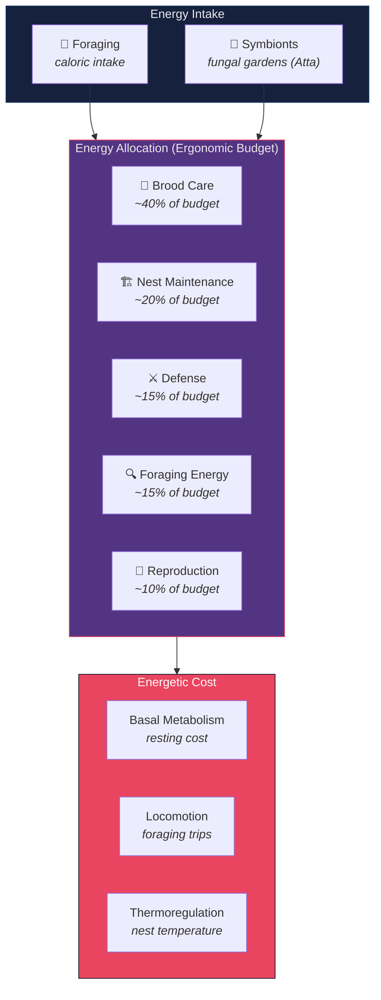
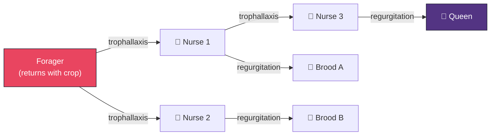

# Metabolism, Energy Budgets, and Resource Flow

**Series**: [Biological & Cognitive Perspectives](./README.md) | **Hub**: [myrmecology.md](./myrmecology.md) | **Topic**: Energy Economics and Scaling Laws

## The Biology

### Allometric Scaling

Metabolism — the totality of biochemical reactions sustaining life — is the most fundamental constraint on any biological system. Max Kleiber's empirical observation that metabolic rate scales with body mass to the 3/4 power (Kleiber, 1932) launched decades of investigation into biological scaling:

$$B \propto M^{3/4}$$

West, Brown, and Enquist (1997) explained this allometry through fractal-like distribution networks: organisms evolved hierarchically branching vascular systems that minimize transport costs while maximizing exchange surface area. The 3/4 exponent emerges as a mathematical consequence of space-filling networks in three-dimensional bodies. **Larger systems are more energy-efficient per unit mass** — a scaling law with profound implications for software system architecture.

### Colony Ergonomics

In social insects, metabolism operates at two levels. Oster and Wilson (1978) formalized **ergonomic optimization**: the allocation of colony energy across competing demands (foraging, brood care, defense, nest construction) to maximize inclusive fitness. Different caste ratios represent different metabolic strategies, and natural selection acts on the colony's energy allocation policy as a whole.

### Trophallaxis: The Decentralized Distribution Network

Trophallaxis — mouth-to-mouth food transfer between nestmates — constitutes the colony's decentralized distribution network, dynamically routing nutrients, hormones, and chemical signals (LeBoeuf et al., 2016). Its topology determines how quickly resources reach brood and how evenly nutrition distributes. Colony energy budgets obey thermodynamic logic: **intake must exceed expenditure for persistence and growth.**

## Architectural Mapping

| Biological Concept | Module | Computational Analogue |
|-------------------|--------|----------------------|
| Energy budget tracking | `performance/` | Cost attribution by module, budget alerts |
| Metabolic rate measurement | `performance/` | Throughput, latency, resource utilization |
| Homeostatic regulation | `rate_limiting/` | Negative feedback, steady-state maintenance |
| Metabolic efficiency | `performance/` | Model distillation, quantization, pruning |
| Fat storage | `cache/` | Expensive computation stored for reuse |
| Trophallaxis | `streaming/` | Continuous data transfer between producers/consumers |

**[`performance`](../../src/codomyrmex/performance/)** implements the energy budget. Every operation consumes resources — API calls, GPU time, storage — and performance tracks expenditures against allocated budgets, alerts when limits approach, and reports cost attribution by module. This mirrors measuring per-caste metabolic expenditure. High throughput with low latency indicates metabolic efficiency — more work per unit of resource, like maximizing ATP yield per glucose molecule.

**[`rate_limiting`](../../src/codomyrmex/rate_limiting/)** implements **homeostatic regulation** through negative feedback. Rate limits prevent any single consumer from overwhelming shared resources, maintain steady-state throughput under variable demand, and protect downstream dependencies. The rate limiter is a thermostat for computational metabolism — it prevents metabolic crisis by capping maximum metabolic rate.

**[`cache`](../../src/codomyrmex/cache/)** functions as **fat storage**. Caching stores expensive computation results for near-zero marginal cost on subsequent requests. Cache hit rates measure how effectively the system exploits stored surplus. Eviction policies correspond to lipolysis — controlled mobilization of reserves when fresh inputs are unavailable.

**[`streaming`](../../src/codomyrmex/streaming/)** implements **trophallaxis**. Rather than batch transfers, streaming passes data continuously in small increments between producers and consumers, mirroring droplet-by-droplet regurgitation between nestmates. Streaming topologies shape information flow as trophallaxis topology shapes nutrient distribution. LeBoeuf et al. (2016) showed trophallaxis transmits not just food but hormones and growth factors — streaming similarly can carry metadata alongside data payload.

## Design Implications

**Always account for cost.** No biological computation is free. Systems that ignore computational cost face metabolic crisis — budget exhaustion, resource starvation, thermal throttling. Cost tracking should be as fundamental as correctness testing. An API call that is correct but bankrupting is metabolically fatal.

**Rate-limit as homeostasis.** Organisms do not run at maximum metabolic rate continuously — sustained maximum exertion causes death. Systems should impose rate limits that maintain steady-state operation rather than maximize instantaneous throughput at the risk of collapse. **Metabolic sustainability** is not optional.

**Cache aggressively.** Fat is strategic reserve, not waste. Caching converts variable expensive operations into predictable cheap ones. The first law of computational metabolism: **never recompute what you can cache.**

**Stream rather than batch.** Trophallaxis distributes resources in real time. Batch processing introduces latency and uneven load. Streaming is metabolically smoother, reduces peak resource demand, and provides faster time-to-first-byte.

**Monitor the balance.** The single most important metabolic metric: **is resource consumption sustainable given resource acquisition?** A system in metabolic deficit will collapse regardless of component performance. Energy balance is the first diagnostic question, before any architectural analysis.

**Expect sublinear scaling.** West et al.'s 3/4 power law suggests that doubling system capacity should less than double resource consumption if the system is well designed. If resource consumption scales superlinearly with load, the distribution network is inefficient.

## Further Reading

- Kleiber, M. (1932). Body size and metabolism. *Hilgardia*, 6(11), 315–353.
- Oster, G.F. & Wilson, E.O. (1978). *Caste and Ecology in the Social Insects*. Princeton University Press.
- West, G.B., Brown, J.H. & Enquist, B.J. (1997). A general model for the origin of allometric scaling laws in biology. *Science*, 276(5309), 122–126.
- LeBoeuf, A.C. et al. (2016). Oral transfer of chemical cues, growth proteins and hormones in social insects. *eLife*, 5, e20375.
- Hou, C. et al. (2010). Energetic basis of colonial living in social insects. *Proceedings of the National Academy of Sciences*, 107(8), 3634–3638.

## See Also

- [Myrmecology and Software Architecture](./myrmecology.md) — The foundational colony metaphor
- [The Superorganism](./superorganism.md) — Colony-level metabolic regulation as emergent property
- [The Free Energy Principle and Active Inference](./free_energy.md) — The informational cost of maintaining accurate models
- [Eusociality and the Division of Labor](./eusociality.md) — Caste ratios as metabolic allocation strategies
- [Stigmergy and Indirect Coordination](./stigmergy.md) — Pheromone trails as metabolic investment

---

*Return to [series index](./README.md) | [Project README](../../README.md) | [PAI Integration](../../PAI.md)*
