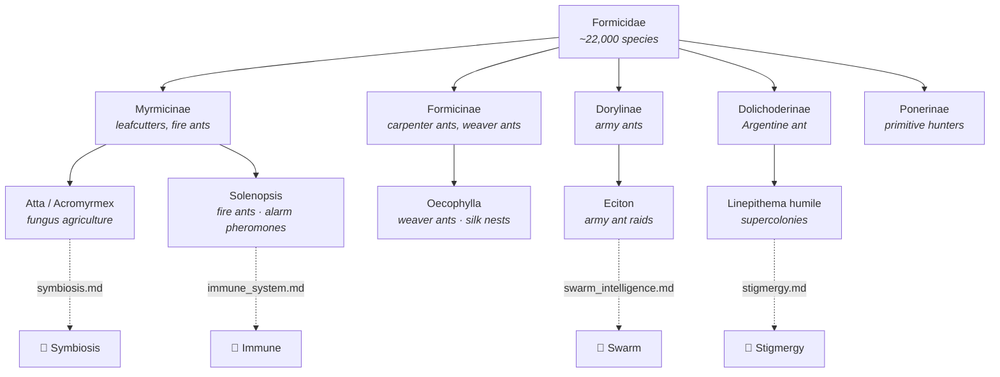
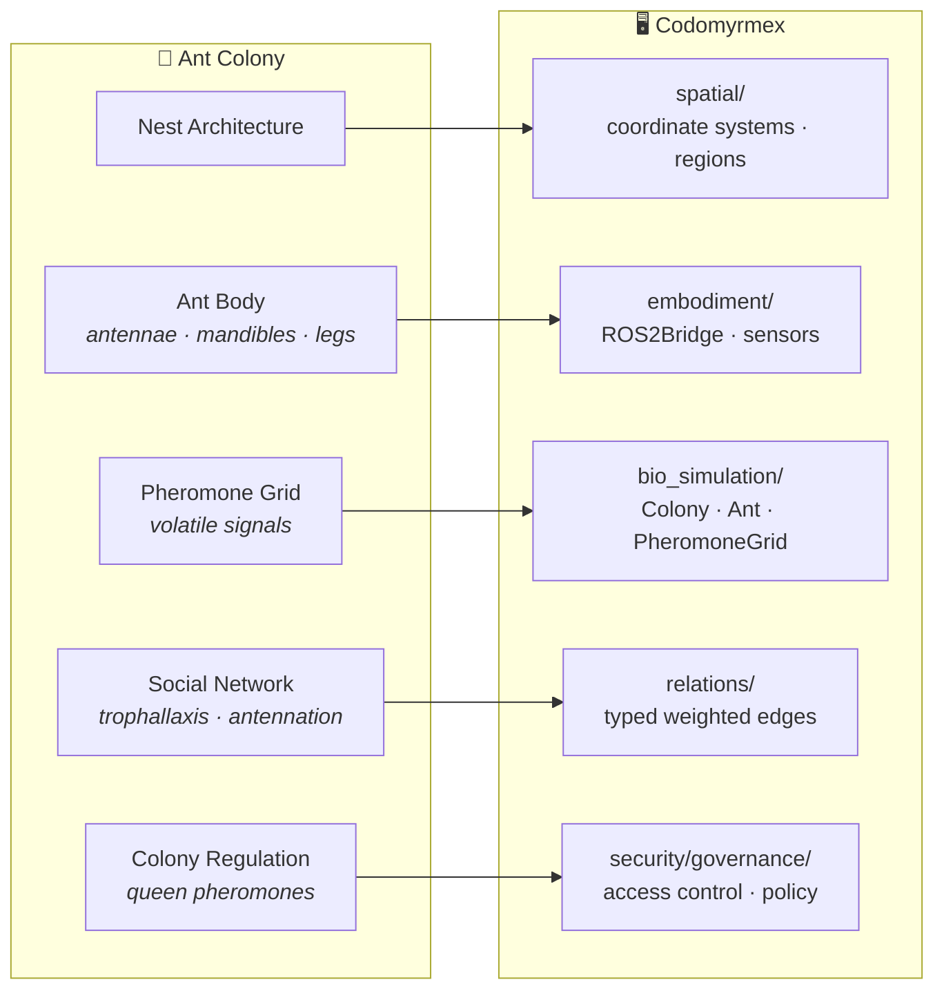
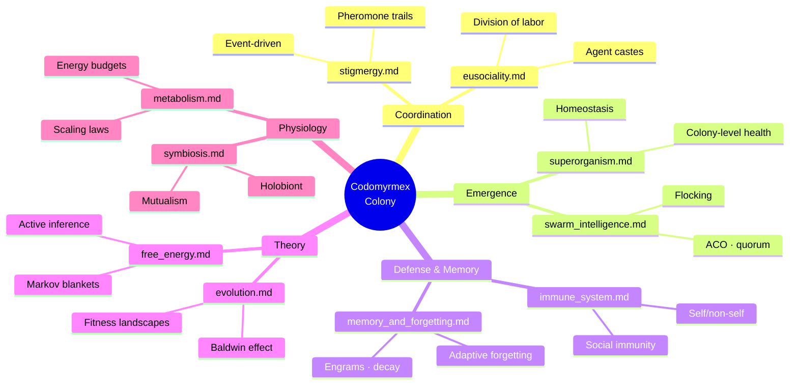

# The Naming and Nature of Codomyrmex

**Series**: [Biological & Cognitive Perspectives](./README.md) | **Role**: Hub Document

## The Science of Ants

The word *codomyrmex* fuses two classical roots: the Latin *codo*, meaning to arrange or put in order (here standing for *code* as structured instruction), and the Greek *myrmex* (μύρμηξ, ant). Myrmecology — the scientific study of ants — has been a productive source of insight into distributed systems since William Morton Wheeler's foundational 1910 monograph *Ants: Their Structure, Development and Behavior*, which first proposed that a colony functions as a superorganism. Edward O. Wilson and Bert Hölldobler expanded this program across decades, culminating in *The Ants* (1990), a comprehensive synthesis that earned the Pulitzer Prize and established ants as the preeminent model system for studying division of labor, communication, and collective behavior in biology (Hölldobler & Wilson, 1990).

Ants are compelling models for distributed computation because individual ants operate with limited local information yet colonies solve complex optimization problems including shortest-path routing, dynamic task allocation, and adaptive nest construction. Colonies are robust to individual failure and coordinate primarily through indirect communication (stigmergy) rather than centralized control. Deborah Gordon's longitudinal studies of harvester ant colonies demonstrated that task allocation emerges from local interaction rates without any supervisory hierarchy (Gordon, 2010). Marco Dorigo formalized these principles computationally in the Ant Colony Optimization metaheuristic (Dorigo & Stützle, 2004). These properties — local information, fault tolerance, indirect coordination, emergent optimization — are what codomyrmex's modular architecture seeks to embody.

### Taxonomic Context

The family Formicidae contains over 22,000 described species organized into ~25 subfamilies (Bolton, 2024). Codomyrmex's name evokes no specific taxon but draws on principles observed across the family tree — from the leaf-cutter agriculture of *Atta* and *Acromyrmex* (tribe Attini) to the army ant raiding columns of *Eciton* (Dorylinae), the slave-making social parasitism of *Polyergus* (Formicinae), and the supercolonial invasions of *Linepithema humile* (Dolichoderinae). Each lineage exhibits distinct solutions to the same fundamental challenges: coordination without central control, defense without immune system centralization, and optimization without global state representation.

## Architectural Mapping

Five codomyrmex modules map most directly to the biological structures studied in myrmecology:

**[bio_simulation](../../src/codomyrmex/bio_simulation/)** provides a literal computational model of colony dynamics. Its `Colony`, `Ant`, and `PheromoneGrid` classes implement agent-based simulations in which virtual ants deposit and follow pheromone gradients, forage for resources, and exhibit emergent path optimization. The `PheromoneGrid` is parameterized by deposition rate (ρ), evaporation rate (λ), and diffusion coefficient (D), recapitulating the reaction-diffusion dynamics that govern real trail pheromone propagation (Camazine et al., 2001).

**[spatial](../../src/codomyrmex/spatial/)** implements world models and environment representations — the nest architecture and foraging territory through which stigmergic signals propagate. Its coordinate systems and region abstractions provide the geometric foundation that bio_simulation requires. In myrmecology, spatial structure is not neutral: nest geometry constrains information flow, and foraging range limits colony metabolic rate (Dornhaus et al., 2006).

**[embodiment](../../src/codomyrmex/embodiment/)** bridges software agents to physical or simulated actuators via its `ROS2Bridge` and sensor interfaces. The biological analogue is the ant's body: antennae for chemical detection (olfactory receptor neurons tuned to colony-specific hydrocarbon profiles), compound eyes for polarized-light navigation (Wehner, 2003), and mandibles and legs for manipulation and locomotion. Embodiment matters because it constrains sensing bandwidth — what the agent can perceive determines what it can respond to.

**[relations](../../src/codomyrmex/relations/)** models social network structures. In a colony, nestmate recognition, trophallaxis (food sharing), and antennation form a dynamic interaction network whose topology affects information flow. Gordon (2010) showed that task-switching depends on interaction rates, not central commands — the relations module captures these as typed, weighted edges between agent nodes, enabling the kind of local-information-driven coordination that colonies exhibit.

**[security/governance](../../src/codomyrmex/security/governance/)** implements colony-level regulation: access control, policy enforcement, and resource allocation rules. Real colony governance is distributed — the queen's pheromones modulate worker behavior probabilistically, not deterministically. The queen does not command; she chemically biases probability distributions over worker behavior. The governance module similarly defines constraints that shape agent behavior without prescribing it — a **regulatory field** rather than a command hierarchy.

## The Colony as Architecture

Each document in this series illuminates a different facet of the colony metaphor as it applies to codomyrmex:

## The Umwelt of the Software Agent

Jakob von Uexküll's concept of *Umwelt* — the subjective perceptual world of an organism, determined by its sensory and effector capabilities — applies illuminatingly to software agents. An ant's Umwelt is dominated by chemical and tactile signals; it has almost no access to acoustic or visual information at distances beyond centimeters. Similarly, a codomyrmex agent's Umwelt is bounded by its tool access, context window, and sensor configuration. An agent with access only to `read_file` and `list_directory` inhabits a read-only Umwelt radically different from one with `write_file` and `run_command`. The Trust Gateway (see [immune_system.md](./immune_system.md)) doesn't merely restrict permissions — it reshapes the agent's Umwelt, expanding or contracting the perceptual-motor boundary that defines its possible actions.

This is not metaphor but structural identity: the Umwelt concept formalizes the relationship between sensor bandwidth and behavioral repertoire, and the Trust Gateway implements exactly this relationship computationally.

## Further Reading

- Hölldobler, B. & Wilson, E.O. (1990). *The Ants*. Cambridge, MA: Harvard University Press.
- Gordon, D.M. (2010). *Ant Encounters: Interaction Networks and Colony Behavior*. Princeton, NJ: Princeton University Press.
- Dorigo, M. & Stützle, T. (2004). *Ant Colony Optimization*. Cambridge, MA: MIT Press.
- Wheeler, W.M. (1910). *Ants: Their Structure, Development and Behavior*. New York: Columbia University Press.
- Wilson, E.O. (1971). *The Insect Societies*. Cambridge, MA: Harvard University Press.
- Camazine, S. et al. (2001). *Self-Organization in Biological Systems*. Princeton University Press.
- Wehner, R. (2003). Desert ant navigation: how miniature brains solve complex tasks. *Journal of Comparative Physiology A*, 189, 579–588.
- von Uexküll, J. (1934/2010). *A Foray into the Worlds of Animals and Humans*. University of Minnesota Press.

---

*Return to [series index](./README.md) | [Project README](../../README.md) | [PAI Integration](../../PAI.md)*
