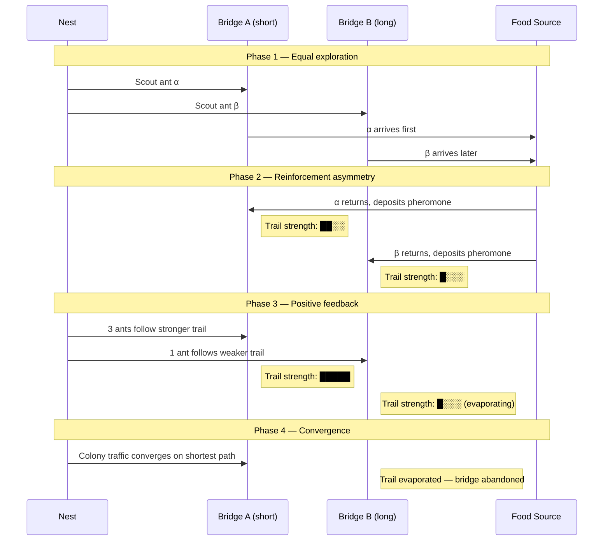
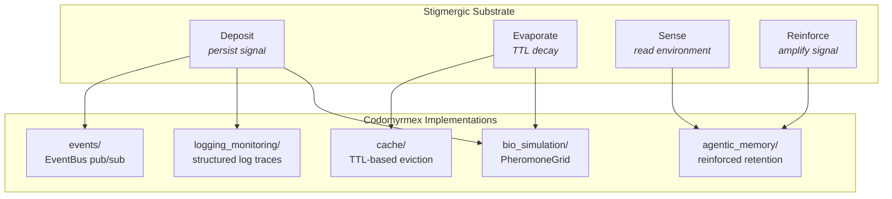

# Stigmergy and the Pheromone Trail

**Series**: [Biological & Cognitive Perspectives](./README.md) | **Hub**: [myrmecology.md](./myrmecology.md)

## The Biology

Stigmergy — from the Greek *stigma* (mark, στίγμα) and *ergon* (work, ἔργον) — was coined by Pierre-Paul Grassé in 1959 to describe how termites coordinate nest construction without direct communication (Grassé, 1959). A termite depositing a mud pellet changes the local environment in a way that stimulates further deposition at the same site. The work product itself becomes the signal. No termite needs to communicate with another; each responds to the cumulative state of the shared environment.

In ants, the canonical stigmergic mechanism is the pheromone trail. A foraging ant that discovers a food source deposits a volatile chemical along its return path. Other ants encountering this trail are probabilistically recruited to follow it, reinforcing the trail on their return. The result is a positive feedback loop: stronger trails attract more ants, which strengthen the trail further. Crucially, pheromone evaporates over time, so unreinforced trails fade — an adaptive forgetting mechanism that prevents lock-in to suboptimal solutions.

### The Double-Bridge Experiment

Deneubourg and colleagues demonstrated this in their double-bridge experiment (Deneubourg et al., 1990). Argentine ants (*Linepithema humile*) given two paths to food initially split traffic roughly equally, but stochastic fluctuations amplified until one bridge dominated. With unequal path lengths, the shorter path was reliably selected because faster-returning ants deposited pheromone sooner. Optimal path selection emerged from purely local, positive-feedback dynamics.

### Varieties of Stigmergy

Theraulaz and Bonabeau (1999) extended stigmergy to encompass wasp nest construction, distinguishing **qualitative stigmergy** (stimulus triggers a qualitatively different response) from **quantitative stigmergy** (stimulus modulates intensity of the same behavior). Heylighen (2016) argued that stigmergy is a **universal coordination mechanism** appearing in insect societies, human collaboration (Wikipedia, open-source software, git commit histories), and artificial multi-agent systems.

The mathematical structure of quantitative stigmergy is a **reaction-diffusion system**:

$$\frac{\partial C}{\partial t} = D \nabla^2 C - \lambda C + \rho \cdot \delta(\mathbf{x} - \mathbf{x}_{ant})$$

where *C* is pheromone concentration, *D* is diffusion coefficient, *λ* is evaporation rate, and *ρ* is deposition rate at the ant's position. This PDE governs both biological trail dynamics and the `PheromoneGrid` in `bio_simulation/`.

## Architectural Mapping

Five codomyrmex modules implement stigmergic coordination patterns, progressing from direct analogy to structural parallel:

**[events](../../src/codomyrmex/events/)** — The EventBus publish-subscribe system is the most direct software analogue of pheromone deposition. A module publishes an event to a shared medium without addressing any specific recipient. Subscribers detect and respond according to their own logic. The publisher does not know which subscribers exist, mirroring the ant that deposits pheromone without knowledge of which nestmates will encounter it. The signal is deposited in the medium, not transmitted to a receiver. This is the critical distinction between stigmergy and message-passing: in stigmergy, the environment is the communication channel.

**[cache](../../src/codomyrmex/cache/)** — TTL-based cache entries implement pheromone evaporation directly. A cached value persists for a defined duration, then expires. Repeated access refreshes the TTL, analogous to trail reinforcement by successive foragers. The cache module's eviction policies map to different biological evaporation schedules:

| Eviction Policy | Biological Analogue | Behavior |
|----------------|---------------------|----------|
| **TTL** | Pheromone evaporation | Constant-rate decay; signal dies without reinforcement |
| **LRU** | Recency-biased trail following | Most recently reinforced paths persist |
| **LFU** | Frequency-dependent recruitment | Heavily trafficked trails persist over rarely-used ones |

**[logging_monitoring](../../src/codomyrmex/logging_monitoring/)** — Structured log entries function as environmental traces. A module writes a log record not directed at any specific consumer. Dashboards, alerting systems, and analytics pipelines consume these traces independently — an append-only pheromone trail readable by any agent with environment access. Unlike cache entries, log entries do not expire — they are *fossilized stigmergy*, the permanent geological record of past activity.

**[agentic_memory](../../src/codomyrmex/agentic_memory/)** — Selective retention that parallels colony memory. Frequently reinforced pheromone trails constitute spatial memory outlasting any individual ant's lifespan. The agentic memory module similarly retains reinforced experiences while allowing low-value memories to decay. The relationship between stigmergic persistence and active forgetting is examined in [memory_and_forgetting.md](./memory_and_forgetting.md).

**[bio_simulation](../../src/codomyrmex/bio_simulation/)** — The `PheromoneGrid` class implements a literal two-dimensional pheromone field with configurable deposition rates, evaporation constants, and diffusion parameters — a reference implementation for validating the abstract stigmergic patterns in other modules.

## Design Implications

**Prefer indirect coordination over direct messaging.** When modules communicate through shared environmental state (events, caches, logs) rather than point-to-point calls, new consumers can be added without modifying producers — the architectural equivalent of a new ant species following an existing pheromone trail. This is the Open-Closed Principle expressed in stigmergic terms.

**Use TTLs as evaporation.** Signals without natural expiration accumulate indefinitely, masking current state with historical noise. TTL-based expiry ensures that only actively reinforced information persists, just as pheromone evaporation ensures only productive trails survive. The *absence of a signal* carries information — a decayed trail tells foragers to explore elsewhere.

**Let usage patterns reinforce important paths.** Allow access frequency to function as reinforcement rather than manually configuring priority. This mirrors Deneubourg's self-organizing path selection and connects to the emergent optimization patterns described in [swarm_intelligence.md](./swarm_intelligence.md).

**Design for graceful degradation.** The loss of any individual agent does not destroy environmental signals already deposited. The [superorganism.md](./superorganism.md) essay examines this resilience property at the system level.

**The medium is the message.** Marshall McLuhan's aphorism applies literally here: in stigmergic systems, the communication infrastructure *is* the message content. A pheromone trail is simultaneously the medium of communication and the information being communicated. Similarly, the EventBus is not merely infrastructure — the pattern of events it carries constitutes the system's real-time behavioral state.

## Further Reading

- Grassé, P.-P. (1959). La reconstruction du nid et les coordinations interindividuelles. *Insectes Sociaux*, 6, 41–80.
- Deneubourg, J.-L., Aron, S., Goss, S., & Pasteels, J.M. (1990). The self-organizing exploratory pattern of the Argentine ant. *Journal of Insect Behavior*, 3(2), 159–168.
- Theraulaz, G. & Bonabeau, E. (1999). A brief history of stigmergy. *Artificial Life*, 5(2), 97–116.
- Heylighen, F. (2016). Stigmergy as a universal coordination mechanism I: Definition and components. *Cognitive Systems Research*, 38, 4–13.
- Dorigo, M. & Stützle, T. (2004). *Ant Colony Optimization*. Cambridge, MA: MIT Press.
- Camazine, S. et al. (2001). *Self-Organization in Biological Systems*. Princeton University Press.

---

*Return to [series index](./README.md) | [hub document](./myrmecology.md) | [Project README](../../README.md) | [PAI Integration](../../PAI.md)*
