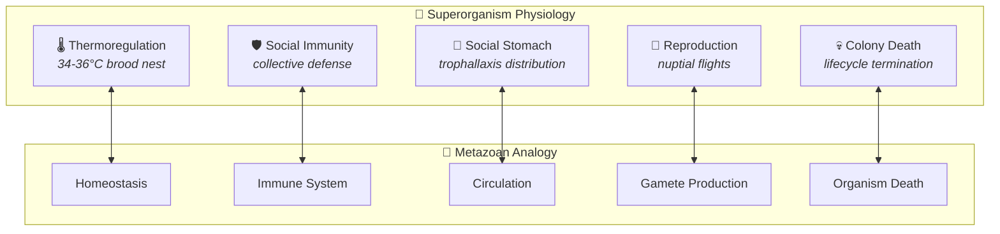
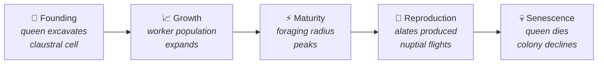
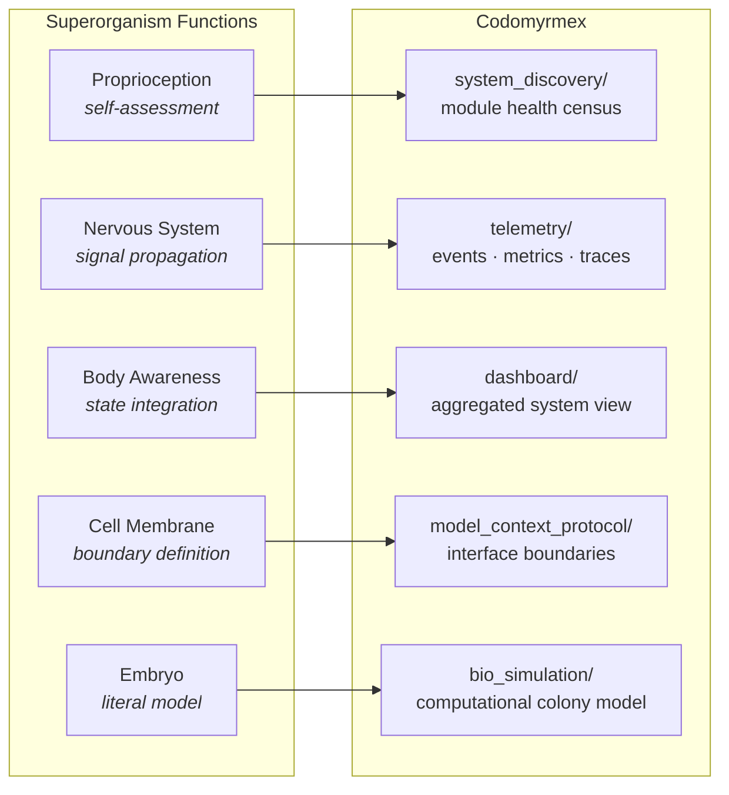

# The Superorganism

**Series**: [Biological & Cognitive Perspectives](./README.md) | **Hub**: [myrmecology.md](./myrmecology.md)

The superorganism concept treats the insect colony not as a collection of cooperating individuals but as a higher-order biological entity — an organism composed of organisms, with emergent physiology, metabolism, and behavior that cannot be predicted from constituent properties.

## The Biology

### Wheeler's Thesis

William Morton Wheeler introduced the superorganism concept in 1911, arguing that an ant colony exhibits functional integration analogous to a metazoan body: "The ant-colony is an organism and not merely the analogue of one" (Wheeler, 1911, p. 310). Colonies display coordinated physiology — regulating temperature, managing waste, distributing nutrition — without centralized control.

The concept fell into disfavor as Williams (1966) argued against group-level selection, emphasizing the gene as the unit of selection. Hölldobler and Wilson revived it in 2009, arguing that **multilevel selection theory** provides rigorous foundation for treating colonies as biological individuals. They demonstrated that colonies possess emergent properties that are not merely additive: foraging efficiency, disease resistance, and thermoregulation exceed what any individual or simple sum could achieve.

### Emergent Homeostasis

Colony thermoregulation illustrates this concretely. Honeybee colonies maintain brood nest temperature within 34–36°C despite large ambient fluctuations (Jones et al., 2004). Individual bees fan, cluster, and generate metabolic heat in response to local temperature gradients. No bee monitors the global thermal state; homeostasis emerges from thousands of parallel local feedback loops.

### Distributed Cognition

Seeley (2010) described honeybee nest-site selection as a "brain without neurons," where scouts serve as sensory neurons, the waggle dance as signal transmission, and the quorum threshold as a decision criterion. The colony computes *through* its members, not *within* any single member.

Johnson and Linksvayer (2010) argued that colony-level traits are built from **gene-regulatory networks expressed across many individuals**, as a metazoan body's traits arise from gene expression across many cells. The colony is not a metaphor for an organism — it *is* an organism at a different level of biological organization.

### The Colony Lifecycle

The colony lifecycle reinforces the organismal analogy:

## Architectural Mapping

- **[`system_discovery`](../../src/codomyrmex/system_discovery/)** — The colony's **proprioceptive sense**. Just as a superorganism continuously assesses workforce composition and resource reserves, system_discovery monitors module health, agent availability, and system composition. Without self-assessment, adaptive allocation is impossible. This is not monitoring *about* the system — it is the system monitoring *itself*, the diagnostic prerequisite for homeostasis.

- **[`telemetry`](../../src/codomyrmex/telemetry/)** — The superorganism's **nervous system**. Colony information propagates through pheromones, tactile cues, and vibrations, carrying state from local sites throughout the colony. Telemetry carries structured events, metrics, and traces across module boundaries, enabling system-level awareness of local states. The critical property is that signals propagate without central routing — telemetry event buses share this decentralized signal-propagation topology.

- **Dashboard** — The colony's **self-awareness interface**. While telemetry carries raw signals, the dashboard aggregates and interprets them — analogous to how proprioceptive signals integrate to produce body-state awareness. For a brainless superorganism, this integrative function is distributed; the dashboard serves as the interface through which operators perceive emergent system state.

- **[`model_context_protocol`](../../src/codomyrmex/model_context_protocol/)** — The **cell membrane**. MCP defines what enters and exits each module boundary. Hölldobler and Wilson (2009) emphasized that the colony boundary, maintained through nestmate recognition (cuticular hydrocarbon profiles), is essential to colony identity. MCP enforces analogous boundaries, ensuring modules interact only through defined interfaces. A superorganism with permeable membranes is not a superorganism — it is an undifferentiated mass.

- **[`bio_simulation`](../../src/codomyrmex/bio_simulation/)** — The **literal model**. Where the modules above instantiate superorganism principles implicitly, bio_simulation makes the analogy explicit: simulating colony growth, task allocation, and emergent behavior to test architectural hypotheses before production deployment.

## Design Implications

**Design for emergent properties, not just component behavior.** The central lesson is that the relevant unit of analysis is the colony, not the individual. Architects should define colony-level metrics — throughput, latency distribution, error rate, recovery time — alongside component metrics. A system where every module is healthy but aggregate behavior is pathological is a **sick superorganism with healthy cells**.

**Monitor colony-level health.** Thermoregulation works because local feedback loops are tuned to produce the desired global state. Monitoring should focus on emergent indicators: end-to-end completion rate, cross-module latency, system-wide resource balance — not only per-module health. The failure mode to watch for is **invisible cascade**: each module reports green while system-level behavior degrades.

**The boundary is as important as the interior.** Wheeler noted that colony identity depends on maintaining its boundary. The MCP layer defining module interfaces is **constitutive** of system identity and integrity. Interface discipline preserves the modularity enabling emergent coordination. This connects to the Markov blanket concept in [free_energy.md](./free_energy.md) — the boundary defines the statistical separation between inside and outside.

**A superorganism's death is not component failure.** Colonies die when coordination fails, not when individual ants die. System failure is typically an emergent property: the system "dies" when too many components become disconnected, misaligned, or unable to coordinate — even if each component still runs. Resilience engineering should focus on maintaining *coordination capacity*, not just component uptime.

## Further Reading

- Wheeler, W.M. (1911). The ant-colony as an organism. *Journal of Morphology*, 22(2), 307–325.
- Hölldobler, B. & Wilson, E.O. (2009). *The Superorganism: The Beauty, Elegance, and Strangeness of Insect Societies*. W.W. Norton.
- Johnson, B.R. & Linksvayer, T.A. (2010). Deconstructing the superorganism: social physiology, groundplans, and sociogenomics. *The Quarterly Review of Biology*, 85(1), 57–79.
- Seeley, T.D. (2010). *Honeybee Democracy*. Princeton University Press.
- Jones, J.C. et al. (2004). Honey bee nest thermoregulation. *Journal of Experimental Biology*, 207, 3427–3441.

## See Also

- [Myrmecology and Software Architecture](./myrmecology.md) — The foundational colony metaphor
- [Eusociality and the Division of Labor](./eusociality.md) — Caste specialization enabling superorganism functions
- [Metabolism and Resource Management](./metabolism.md) — Colony energy budget as superorganism metabolism
- [Immune System Analogies](./immune_system.md) — Social immunity as superorganism immune response
- [Free Energy and Active Inference](./free_energy.md) — Markov blankets and colony boundaries
- [Project README](../../README.md) | [PAI Integration](../../PAI.md)
