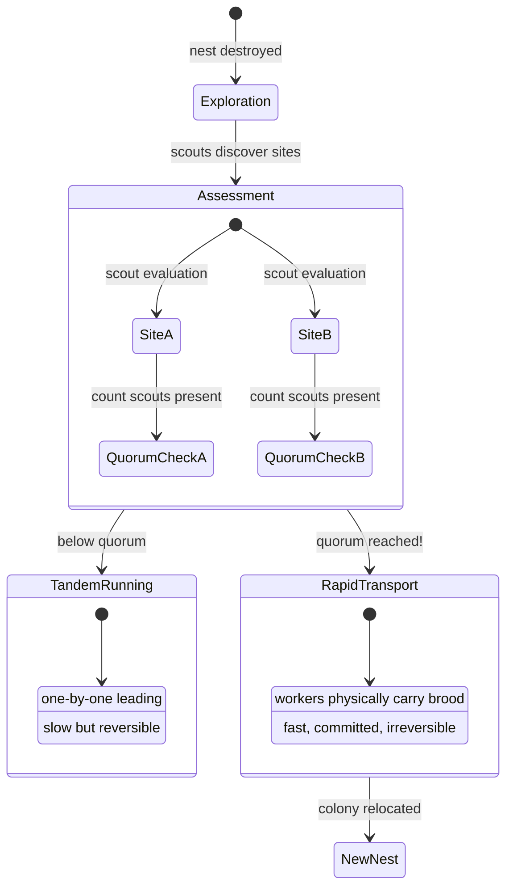
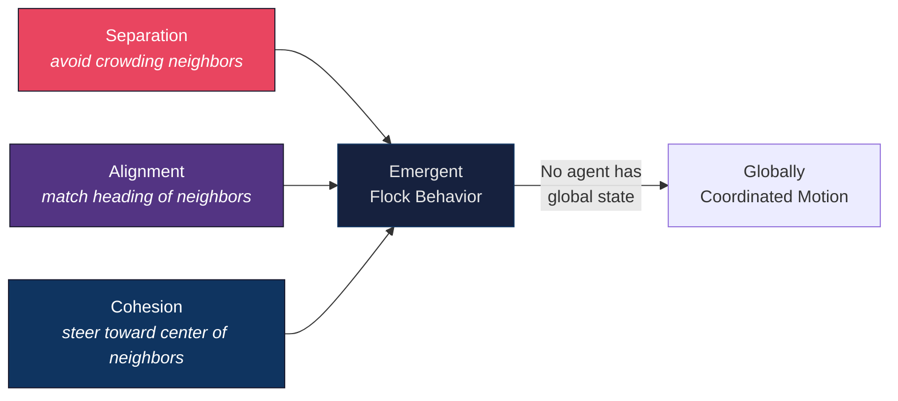
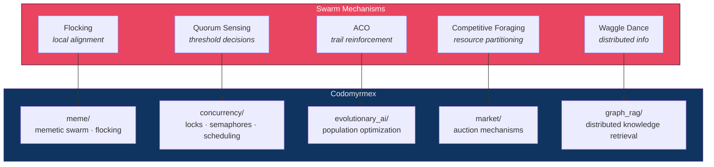

# Swarm Intelligence and Collective Decision-Making

**Series**: [Biological & Cognitive Perspectives](./README.md) | **Hub**: [myrmecology.md](./myrmecology.md)

Swarm intelligence describes the collective behavior of decentralized, self-organized systems composed of simple agents following local rules that produce globally coherent and often near-optimal behavior. The core insight is that insect colonies solve complex computational problems — shortest-path routing, optimal site selection, efficient allocation — without any individual possessing a global representation of the problem.

## The Biology

The term "swarm intelligence" was introduced by Beni and Wang (1993) in cellular robotics, but the phenomena have deep roots in entomology.

### Ant Colony Optimization

Ant Colony Optimization (ACO), formalized by Dorigo (1992), abstracts foraging behavior into a metaheuristic. The transition probability for ant *k* choosing edge (*i,j*) at time *t* is:

$$p_{ij}^k(t) = \frac{[\tau_{ij}(t)]^\alpha \cdot [\eta_{ij}]^\beta}{\sum_{l \in \mathcal{N}_i^k} [\tau_{il}(t)]^\alpha \cdot [\eta_{il}]^\beta}$$

where τ is pheromone intensity (trail reinforcement), η is heuristic desirability (e.g., inverse distance), and α, β are weighting parameters. Pheromone evaporation provides negative feedback, preventing lock-in on suboptimal solutions. This combination produces robust convergence toward near-optimal solutions across graph problems (Dorigo & Stützle, 2004).

### Quorum Sensing in Nest Emigration

Pratt et al. (2002) showed that *Temnothorax albipennis* ants use quorum thresholds during nest emigration: scouts independently assess candidate sites, and when a scout encounters sufficient other scouts at a site, she switches from slow tandem-running recruitment to fast carrying. This produces accurate collective decisions from individually noisy assessments — a biological "wisdom of crowds" (Surowiecki, 2004).

The quorum threshold controls a **speed-accuracy tradeoff**: lower thresholds produce faster but less accurate decisions; higher thresholds produce slower but more reliable ones. Franks et al. (2003) showed that colonies dynamically adjust this threshold based on urgency.

### Flocking and the Boids Model

The honeybee waggle dance (von Frisch, 1967) demonstrates distributed information sharing: returning foragers encode direction and distance to food sources through dance, and observing bees integrate information from multiple dancers, producing a colony-level probability distribution over foraging sites.

Reynolds (1987) showed that three local rules produce coordinated flock motion:

The critical feature across all these mechanisms is that **simple local rules produce globally adaptive behavior** without any agent representing the global state.

## Architectural Mapping

- **[`meme`](../../src/codomyrmex/meme/)** — The swarm submodule implements digital flocking and memetic evolution. Memetic swarm algorithms apply Reynolds' update rules to candidate solutions, evolving shared structures through imitation and recombination. Dawkins's "meme" as a unit of cultural selection (1976) is computationally instantiated here: solutions reproduce differentially based on fitness, creating cultural evolution within a single optimization run.

- **[`concurrency`](../../src/codomyrmex/concurrency/)** — Concurrent resource access parallels foraging competition. When multiple foragers exploit the same source, depletion creates implicit competition requiring distributed arbitration. The concurrency module manages locks, semaphores, and scheduling — the computational equivalents of forager interference, trail congestion, and the quorum thresholds that gate collective state transitions.

- **[`evolutionary_ai`](../../src/codomyrmex/evolutionary_ai/)** — Population-based optimization shares swarm intelligence's core structure: many agents interact through a shared fitness landscape, and optima emerge from local selection without centralized direction. ACO is implementable directly within this framework.

- **[`market`](../../src/codomyrmex/market/)** — Auction mechanisms implement competitive foraging computationally. Biological foragers compete for sources with varying profitability, influenced by crowding and pheromone cues. The market module provides analogous bidding, with allocation emerging from distributed competition rather than central planning.

- **[`graph_rag`](../../src/codomyrmex/graph_rag/)** — Graph-based retrieval distributes knowledge across a structure, with paths determined by query relevance. This mirrors how scouts distribute spatial knowledge through dance: no single bee holds a complete map, but the colony maintains a distributed representation any forager can query by attending to multiple dances.

## Design Implications

**Choose swarm approaches for decomposable, dynamic problems.** Swarm algorithms excel when the solution space is large, the environment changes (invalidating cached solutions), and agents have limited sensing. Hierarchical approaches suit problems with strict global constraints or strong sequential dependencies.

**Calibrate quorum thresholds.** Pratt et al. (2002) showed that quorum thresholds control a speed-accuracy tradeoff — the Tannenbaum trade of collective decision-making. In codomyrmex, consensus mechanisms should expose the threshold as a tunable parameter, letting operators adjust based on error cost versus delay cost.

**Guard against premature convergence.** ACO's evaporation prevents lock-in, but artificial systems often converge too quickly. Design diversity-maintenance mechanisms — analogous to scouts that continue exploring after quorum — to avoid locally optimal but globally suboptimal commitment. Kimura's neutral theory ([evolution.md](./evolution.md)) provides the theoretical basis: maintaining neutral diversity ensures the system can adapt when conditions shift.

**The colony is smarter than any ant.** No individual ant performs combinatorial optimization. No individual agent needs to solve the whole problem. Design agents for *local competence* and let system-level intelligence emerge from their interactions.

## Further Reading

- Dorigo, M. (1992). *Optimization, Learning and Natural Algorithms*. PhD thesis, Politecnico di Milano.
- Bonabeau, E., Dorigo, M. & Theraulaz, G. (1999). *Swarm Intelligence: From Natural to Artificial Systems*. Oxford University Press.
- Pratt, S.C., Mallon, E.B., Sumpter, D.J.T. & Franks, N.R. (2002). Quorum sensing, recruitment, and collective decision-making during colony emigration by the ant *Temnothorax albipennis*. *Behavioral Ecology and Sociobiology*, 52(2), 117–127.
- Reynolds, C.W. (1987). Flocks, herds and schools: A distributed behavioral model. *Computer Graphics*, 21(4), 25–34.
- von Frisch, K. (1967). *The Dance Language and Orientation of Bees*. Harvard University Press.

## See Also

- [Myrmecology and Software Architecture](./myrmecology.md) — The foundational colony metaphor
- [Stigmergy and Indirect Coordination](./stigmergy.md) — Pheromone trails as swarm infrastructure
- [Eusociality and the Division of Labor](./eusociality.md) — How specialized roles enable collective computation
- [Evolution, Selection, and Fitness Landscapes](./evolution.md) — The evolutionary basis of local rules
- [Free Energy and Active Inference](./free_energy.md) — Minimizing surprise as agent-level policy
- [Project README](../../README.md) | [PAI Integration](../../PAI.md)
