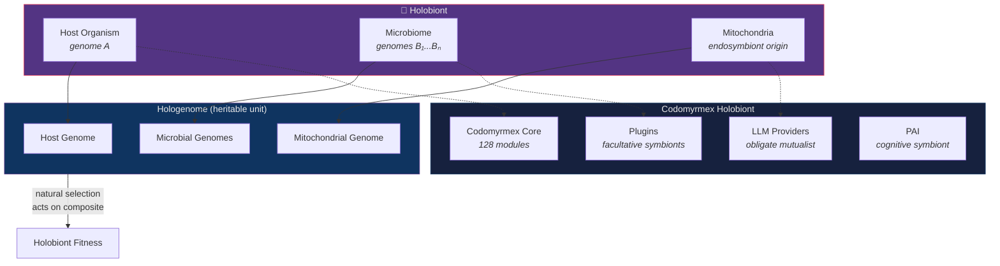
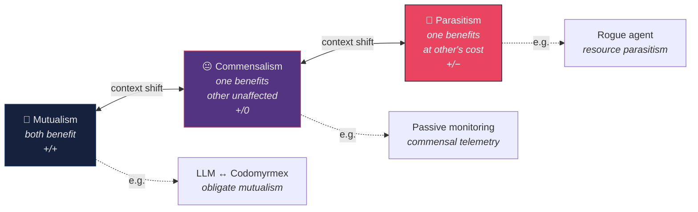

# Symbiosis, Mutualism, and the Holobiont

**Series**: [Biological & Cognitive Perspectives](./README.md) | **Hub**: [myrmecology.md](./myrmecology.md) | **Topic**: Interspecies Cooperation and Composite Organisms

## The Biology

### Endosymbiotic Origin of Eukaryotes

In 1967 Lynn Margulis proposed that mitochondria and chloroplasts were once free-living bacteria engulfed by ancestral host cells and retained as endosymbionts rather than digested (Margulis, 1967). This **endosymbiotic theory** demonstrated that the eukaryotic cell is itself a chimera — a stable partnership between organisms from different domains of life. Evolutionary novelty arises not only from mutation within lineages but from **merger of independent lineages** into composite entities with emergent capabilities.

This is the most powerful biological precedent for plugin architecture: the mitochondrion was once an independent organism; now it is an indispensable organelle. The transition from facultative symbiont to obligate organelle is the trajectory of successful integration.

### The Holobiont

The holobiont concept extends this logic to the organismal level. Bordenstein and Theis (2015) argued that a multicellular organism and its resident microbial communities should be understood as a single biological unit subject to selection as a composite entity. The **hologenome** — host plus symbiont genomes combined — is the heritable substrate on which natural selection acts.

### The Symbiosis Spectrum

Symbioses span a continuum: **mutualism** (both benefit), **commensalism** (one benefits, other unaffected), **parasitism** (one benefits at the other's expense). These categories shift with ecological context — a mutualist can become parasitic under stress, and vice versa. Stability depends on fitness alignment and enforcement mechanisms against cheaters.

### Ant Agriculture: The Archetypal Mutualism

Leaf-cutter ants exemplify sophisticated mutualism. Schultz and Brady (2008) used molecular phylogenetics to show that ant agriculture evolved approximately **50 million years ago**, undergoing transitions from cultivation of free-living fungi to obligate domestication. The system involves additional partners: actinomycete bacteria on ant cuticles produce antifungals suppressing parasitic *Escovopsis* (Currie et al., 1999). This is a **multi-partner symbiotic network** — not just bilateral exchange but an ecosystem of interdependencies.

Myrmecophily — adaptation of non-ant organisms to live with colonies — further illustrates how dominant ecological entities create niches for dependent species. Lycaenid butterfly larvae that secrete honeydew for ants in exchange for protection are myrmecophiles — parasitic, commensal, or mutualistic depending on the specific species and context.

## Architectural Mapping

| Biological Concept | Module | Relationship Type |
|-------------------|--------|------------------|
| Symbiotic membrane | `model_context_protocol/` | Interface boundary between host and symbiont |
| Endosymbiosis | `plugin_system/` | External capability integrated into host |
| Myrmecophiles | `agents/` | Species adapted to colony ecosystem |
| Obligate mutualism | `llm/` | Neither partner self-sufficient |
| Exchange economics | `wallet/` | Reciprocal resource accounting |

**[`model_context_protocol`](../../src/codomyrmex/model_context_protocol/)** functions as the **symbiotic membrane**. MCP defines the standardized protocol through which external tools, LLMs, and services interact with codomyrmex. Just as a cell membrane mediates molecular exchange between endosymbiont and host cytoplasm, MCP mediates all information exchange with external partners through typed messages, capability negotiation, and tool schemas. The membrane is where **fitness alignment** is enforced.

**[`plugin_system`](../../src/codomyrmex/plugin_system/)** implements **endosymbiosis**. A plugin begins as an independent external capability. When loaded, it becomes functionally integrated into the host — still recognizably distinct in origin, but essential to host processes. Heavily used plugins may become so deeply integrated that removal impairs function, paralleling the trajectory from facultative symbiont to obligate organelle. The evolutionary endpoint is absorption into the core codebase — loss of independent existence.

**[`agents`](../../src/codomyrmex/agents/)** are the platform's **myrmecophiles** — specialized entities adapted to operate within the codomyrmex ecosystem. Each agent type depends on the platform's infrastructure for tool access, communication, and orchestration, as myrmecophiles depend on colony nest structure and social tolerance. Agents violating behavioral norms face computational eviction — the analogue of intruder rejection via cuticular hydrocarbon mismatch.

**[`llm`](../../src/codomyrmex/llm/)** represents the primary **mutualistic partner**. LLMs provide inference capability codomyrmex cannot produce internally; codomyrmex provides structured prompts, context, and orchestration that make LLM capabilities actionable. Neither is self-sufficient — **obligate mutualism**. The relationship is as fundamental as the mitochondrion-host partnership.

**[`wallet`](../../src/codomyrmex/wallet/)** formalizes **mutualistic exchange economics**. Biological symbioses are maintained by reciprocal resource exchange. The wallet module tracks computational transactions, enforces budgets, and provides accounting to evaluate whether a partnership is mutualistic (net positive) or parasitic (net negative). **If a partnership consistently costs more than it produces, it is parasitism, not mutualism.**

## The PAI-Codomyrmex Holobiont

The relationship between [PAI](../../PAI.md) and codomyrmex is itself a symbiosis. PAI provides cognitive architecture: goal decomposition, agent delegation, skill invocation, adaptive planning. Codomyrmex provides execution infrastructure: modules, tools, APIs, and runtime. Neither is complete alone — PAI without codomyrmex is an algorithm without hands; codomyrmex without PAI is a toolbox without a carpenter. Together they form a **holobiont** whose capabilities exceed either partner's in isolation.

This has practical consequences. Changes to PAI's cognitive architecture may require corresponding changes to codomyrmex module interfaces, as **coevolution** between host and symbiont genomes maintains compatibility. The MCP bridge between them is the holobiont's membrane — the point of maximum vulnerability and maximum opportunity.

## Design Implications

**Design interfaces as symbiotic membranes.** The quality of a symbiosis depends on the quality of the membrane. A permeable membrane admits too much (parasites enter); an impermeable membrane admits too little (mutualists cannot exchange). MCP should be selectively permeable — admitting specified interactions while blocking unspecified ones.

**Monitor partnership fitness.** Every integration should be evaluated as a symbiosis: is it mutualistic, commensal, or parasitic? The wallet module's transaction accounting provides the data to make this assessment. **Terminate parasitic partnerships.**

**Expect coevolution.** Changing one partner requires adapting the other. API versioning, backward compatibility, and migration strategies are the software engineering of coevolutionary dynamics. Rapid unilateral change breaks symbioses.

**The most important integrations become organelles.** Watch for the pattern: a plugin that is always loaded, never removed, and whose absence breaks the system has undergone endosymbiotic capture. Recognize this and plan accordingly — it may be time to absorb it into the core.

## Further Reading

- Margulis, L. (1967). On the origin of mitosing cells. *Journal of Theoretical Biology*, 14(3), 225–274.
- Bordenstein, S.R. & Theis, K.R. (2015). Host biology in light of the microbiome: ten principles of holobionts and hologenomes. *PLOS Biology*, 13(8), e1002226.
- Schultz, T.R. & Brady, S.G. (2008). Major evolutionary transitions in ant agriculture. *Proceedings of the National Academy of Sciences*, 105(14), 5435–5440.
- Currie, C.R., Scott, J.A., Summerbell, R.C. & Malloch, D. (1999). Fungus-growing ants use antibiotic-producing bacteria to control garden parasites. *Nature*, 398(6729), 701–704.
- Douglas, A.E. (2010). *The Symbiotic Habit*. Princeton University Press.

## See Also

- [Myrmecology and Software Architecture](./myrmecology.md) — The foundational colony metaphor
- [Evolution and Adaptation](./evolution.md) — Coevolution between symbiotic partners
- [Metabolism, Energy Budgets, and Resource Flow](./metabolism.md) — The energetic basis of mutualistic exchange
- [Immune System Analogies](./immune_system.md) — Distinguishing mutualists from parasites
- [The Superorganism](./superorganism.md) — Colony as composite entity

---

*Return to [series index](./README.md) | [Project README](../../README.md) | [PAI Integration](../../PAI.md)*
