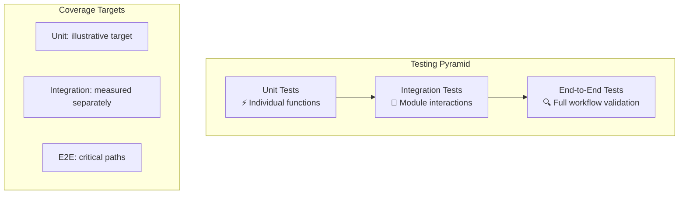

# Testing Strategy & Best Practices

This document outlines Codomyrmex's comprehensive testing approach, ensuring high-quality, reliable modules and integrations.

## 🎯 Testing Philosophy

### **Test-Driven Development (TDD)**

- **Write tests first**, then implement functionality
- **No mock methods** - always test with real implementations
- **Iterative approach** - rerun tests until all pass

### **Testing Pyramid**


```mermaid
graph TB
    subgraph sg_a0657c7da2 [Testing Pyramid]
        E2E["End-to-End Tests<br/>🔍 Full workflow validation"]
        Integration["Integration Tests<br/>🔗 Module interactions"]
        Unit["Unit Tests<br/>⚡ Individual functions"]

        Unit --> Integration
        Integration --> E2E
    end

    subgraph sg_4fe987e1c4 [Coverage Targets]
        UnitCov["Unit: illustrative target"]
        IntegCov["Integration: measured separately"]
        E2ECov["E2E: critical paths"]
    end
```

## 🧪 Testing Levels

### **1. Unit Tests**

**Purpose**: Test individual functions and classes in isolation

```python
# Example: Testing data visualization functions (ACTUAL IMPLEMENTATION)
import pytest
from codomyrmex.data_visualization import create_line_plot
import matplotlib
matplotlib.use('Agg')  # Non-interactive backend for testing
from pathlib import Path

def test_create_line_plot_basic():
    """Test basic line plot creation with real data and real function."""
    # Real data from actual test files
    x_data = [1, 2, 3, 4, 5]
    y_data = [2, 4, 6, 8, 10]

    # Call actual implemented function with exact signature
    fig = create_line_plot(
        x_data=x_data,
        y_data=y_data,
        title="Real Test Plot",
        output_path="test_plot.png",
        markers=True
    )

    # Real assertions based on actual return values
    assert fig is not None  # Returns matplotlib Figure object
    assert Path("test_plot.png").exists()  # File actually created

    # Cleanup
    Path("test_plot.png").unlink(missing_ok=True)
```

**Coverage Requirements**:

- ✅ All public functions tested
- ✅ Edge cases and error conditions
- ✅ Input validation scenarios
- ✅ Real data, no mocks

### **2. Integration Tests**

**Purpose**: Test module interactions and data flow

```python
# Example: Static Analysis integration (ACTUAL IMPLEMENTATION)
def test_static_analysis_real():
    """Test static analysis with real Pyrefly integration."""
    from codomyrmex.coding.static_analysis import check_pyrefly_available, run_pyrefly
    import tempfile
    from pathlib import Path

    import pytest

    if not check_pyrefly_available():
        pytest.skip("pyrefly not installed")

    # Create real test file
    with tempfile.TemporaryDirectory() as temp_dir:
        test_file = Path(temp_dir) / "test_code.py"
        test_file.write_text("""
def calculate_total(items):
    total = 0
    for item in items:
        total += item
    return total

# This will cause a Pyrefly error if undefined_var is used
# result = undefined_var + 1
""")

        # Run real Pyrefly on the file
        result = run_pyrefly(str(test_file))

        # Real assertions on the returned PyreflyResult dataclass
        assert result.success
        assert result.files_analyzed == 1
        assert isinstance(result.issues, list)  # list[PyreflyIssue]
        for issue in result.issues:
            assert issue.severity
            assert issue.message
```

### **3. End-to-End Tests**

**Purpose**: Test complete workflows from user perspective

```python
# Example: Complete development workflow (ACTUAL IMPLEMENTATION)
def test_complete_development_workflow():
    """Test full development cycle with real implemented functions."""
    import tempfile
    from pathlib import Path
    from codomyrmex.coding.static_analysis import run_pyrefly
    from codomyrmex.coding.execution import execute_code
    from codomyrmex.data_visualization import create_line_plot

    with tempfile.TemporaryDirectory() as tmp_dir:
        project_path = Path(tmp_dir)

        # 1. Create real sample project
        test_file = project_path / "test_module.py"
        test_file.write_text("""
def calculate_fibonacci(n):
    if n <= 1:
        return n
    return calculate_fibonacci(n-1) + calculate_fibonacci(n-2)

def main():
    result = calculate_fibonacci(10)
    print(f"Fibonacci(10) = {result}")

if __name__ == "__main__":
    main()
""")

        # 2. Test static analysis (real function; success is False without pyrefly)
        analysis = run_pyrefly(str(project_path))
        assert isinstance(analysis.issues, list)  # Returns a PyreflyResult

        # 3. Test code execution (real function; requires Docker)
        execution_result = execute_code(
            language="python",
            code="print('Testing workflow')",
            timeout=10
        )
        assert execution_result['status'] == 'success'
        assert 'Testing workflow' in execution_result['stdout']

        # 4. Test visualization (real function)
        x_data = [1, 2, 3, 4, 5]
        y_data = [1, 1, 2, 3, 5]  # First few Fibonacci numbers
        fig = create_line_plot(
            x_data=x_data,
            y_data=y_data,
            title="Fibonacci Sequence",
            output_path=str(project_path / "fibonacci.png")
        )
        assert fig is not None
        assert (project_path / "fibonacci.png").exists()
```

## 🏗️ Test Organization

### **Directory Structure**

```text
tests/
├── unit/                    # Unit tests for each module
│   ├── test_ai_code_editing.py
│   ├── test_data_visualization.py
│   ├── test_static_analysis.py
│   └── ...
├── integration/             # Integration tests
│   ├── test_ai_analysis_integration.py
│   ├── test_workflow_integrations.py
│   └── ...
├── e2e/                    # End-to-end workflow tests
│   ├── test_development_workflows.py
│   ├── test_example_scenarios.py
│   └── ...
├── fixtures/               # Test data and fixtures
│   ├── sample_projects/
│   ├── test_data/
│   └── expected_outputs/
└── utils/                  # Testing utilities
    ├── test_helpers.py
    ├── assertions.py
    └── fixtures.py
```

### **Naming Conventions**

- **Files**: `test_<module_name>.py`
- **Classes**: `Test<FeatureName>`
- **Functions**: `test_<specific_behavior>`
- **Fixtures**: `<resource_name>_fixture`

## 🎨 Test Quality Standards

### **Test Characteristics**

```python
def test_data_visualization_line_plot():
    """
    ✅ GOOD TEST EXAMPLE

    - Clear name describing what's being tested
    - Tests one specific behavior
    - Uses real data, no mocks
    - Has clear assertions
    - Includes error cases
    """
    # Arrange: Setup real test data
    x_data = [1, 2, 3, 4, 5]
    y_data = [2, 4, 6, 8, 10]

    # Act: Execute the function
    result = create_line_plot(
        x=x_data,
        y=y_data,
        title="Test Linear Data",
        output_path="test_linear.png"
    )

    # Assert: Verify expected outcomes
    assert result.success == True
    assert Path("test_linear.png").exists()
    assert result.metadata['correlation'] > 0.95  # Strong linear correlation

    # Test error case
    with pytest.raises(ValueError, match="Empty data"):
        create_line_plot(x=[], y=[], title="Empty")
```

### **Anti-Patterns to Avoid**

```python
# ❌ BAD: Vague test name
def test_plotting():
    pass

# ❌ BAD: Testing multiple behaviors
def test_plotting_and_analysis_and_ai():
    pass

# ❌ BAD: Mock everything (against our principles)
@mock.patch('matplotlib.pyplot')
def test_with_mocks():
    pass

# ❌ BAD: No clear assertions
def test_something():
    result = do_something()
    # What are we actually testing?
```

### Zero-Mock Policy (clarified)

The Zero-Mock Policy distinguishes **two kinds of test interventions**. The hazard the policy was authored to prevent is *verification theater* — tests that pass against fake behavior the production code doesn't actually exhibit. Controlling test-time inputs (environment variables, temp dirs, optional dependency availability) is **not** the same thing as faking behavior, and the policy reflects that distinction.

**Disallowed (prohibited):**

- `unittest.mock.Mock`, `MagicMock`, `patch` — substituting fake objects for real ones
- `pytest-mock` (third-party mocking framework)
- `monkeypatch.setattr(<module>, "<method>", lambda ...)` — replacing methods with stubs that change behavior
- Hand-rolled fake clients that bypass the real implementation and silently change return shapes
- Test doubles that mask real network/IO failures the production code would surface

**Allowed when narrowly scoped:**

- `monkeypatch.setenv` / `monkeypatch.delenv` — environment variable isolation. Tests that depend on environment state MUST use this rather than mutating `os.environ` directly so cleanup is automatic. See `tests/unit/utils/test_utils_core.py` for the canonical `get_env` pattern.
- `monkeypatch.chdir` — temporary working directory changes
- `tmp_path`, `tmp_path_factory` — pytest tempdir fixtures
- `FakeLLMClient`, `FakeSwarm`, or similar named test doubles when the real service is unavailable and the test exercises higher-layer logic. These MUST be explicitly named `Fake*` (not `Mock*`), live in a `tests/_fakes/` or `tests/_doubles/` location, and document what production behavior they preserve.
- `@pytest.mark.skipif(...)` guards for tests that require optional dependencies (e.g., `z3`, Ollama, network access)

**Verification:** `import-linter` enforces the layering boundary so test doubles cannot smuggle through layer violations. `tests/unit/test_zero_mock_policy.py` runs in every test job: it rejects `unittest.mock`, `pytest_mock` and the `mocker` fixture outright, and holds `monkeypatch.setattr` calls and `Mock*` classes to the per-file counts recorded when the guard was added, so existing uses can only shrink. Lower a file's baseline in that test when you remove a use.

**Why this distinction matters:** Environment isolation (`monkeypatch.setenv`) doesn't change the behavior of the code under test — it just controls test-time inputs. Behavior mocking does, and is the actual hazard. See [issue #175](https://github.com/docxology/codomyrmex/issues/175) for the resolution thread.

### Repository guards

These tests run in every test job and fail on regressions rather than relying
on review:

- `tests/unit/test_zero_mock_policy.py` — the zero-mock ratchet above. Its
  baselines must equal the current counts (`test_baselines_have_no_slack`), so
  lower or delete an entry in the same change that removes a use.
- `tests/unit/test_test_package_names.py` — pytest runs with
  `--import-mode=importlib`, so a `tests/unit/<name>/__init__.py` package is
  imported as the top-level module `<name>`. If `<name>` is also a real module
  (stdlib, installed, or in the repository) the test package replaces it in
  `sys.modules` and tests silently exercise the wrong code — this hid
  py-tree-sitter and the `soul` SDK. Directories that collide must not have an
  `__init__.py`.
- Tests write only under `tmp_path`. Calling an API with its default output
  path (for example `./git_analysis/`) from a test pollutes the working tree;
  pass an explicit path under `tmp_path`, or `monkeypatch.chdir(tmp_path)` when
  the code under test writes relative to the CWD.
- Stray-path guard (`tests/support/stray_paths.py`, registered by
  `tests/conftest.py`) — records the top-level entries of the repository root,
  and of the directory pytest was started from when that is inside the
  repository, at session start. After each test it notes which test had just
  run when a new entry appeared, and at the end of the session it reports the
  entries that are still there, with those hints. Under pytest-xdist each
  worker sends its hints to the controller, which makes the single report; a
  path can carry one hint per worker, and the test that created it is among
  them. Entries that existed when the session started, and the outputs of
  pytest, its plugins and coverage (`.pytest_cache`, `.hypothesis`,
  `.benchmarks`, `.coverage*`, `coverage.{xml,json,lcov,md}`, `htmlcov`,
  `junit*.xml`, and the `--basetemp`, `--junitxml` and `--cov-report=TYPE:DEST`
  destinations), are not reported. `CODOMYRMEX_STRAY_PATH_GUARD` selects
  `fail` (default: print the report and exit non-zero), `warn` (print the
  report only) or `off`. The default is `fail` because the unit suite and the
  other test trees run clean, and in CI, a fresh checkout that nothing else
  writes into during the run, every reported path is a test leak. Use `warn`
  in a shared checkout where an editor or a concurrent agent may create
  top-level files during the run: the guard cannot tell those apart from test
  output. Only the top level is watched, so a file written into an existing
  directory (for example `config/default.yaml` or `.pipelines/artifacts/`) is
  not caught. When the code under test defaults to the CWD in many tests of
  one directory, an autouse `monkeypatch.chdir(tmp_path)` fixture in that
  directory's `conftest.py` (as in `tests/unit/ci_cd_automation/` and
  `tests/unit/plugin_system/`) keeps them all out of the repository.
- `tests/unit/test_import_side_effects.py` — imports each top-level
  `codomyrmex.<package>` in a fresh interpreter started in an empty directory
  and fails if the import writes to stdout, leaves handlers on or changes the
  level of the root logger, or creates files in the CWD. Library code must not
  call `setup_logging()` or `logging.basicConfig()` or `print()` at import
  time; entry points (`main()`, `if __name__ == "__main__":`) configure
  logging. The sweep over every package is marked `slow`; modules that were
  fixed run in the fast unit lane. A package whose optional third-party
  dependency is missing is skipped with the import error as the reason.

Type checking is a ratchet too: `[tool.ty.rules]` in `pyproject.toml` makes
`possibly-unresolved-reference`, `unsupported-base`, `deprecated` and
`unresolved-import` errors (only optional integrations listed in
`[tool.ty.analysis] allowed-unresolved-imports` may be missing), and
`import-linter` enforces the layer contract. Run the same checks locally with:

```bash
uv run ty check --output-format concise --exclude src/codomyrmex/physical_management/object_manager.py src/ scripts/ tests/
uv run lint-imports --config pyproject.toml
```

## ⚡ Running Tests

### **Local Development**

```bash
# Run all tests (prefer uv; default addopts omit --cov for speed)
uv run pytest

# Run specific test categories
uv run pytest tests/unit/              # Unit tests only
uv run pytest tests/integration/       # Integration tests only
uv run pytest tests/e2e/              # End-to-end tests only

# Run tests for specific module
uv run pytest tests/unit/data_visualization/

# Run with coverage + 60% gate
uv run pytest --cov=src/codomyrmex --cov-report=html --cov-fail-under=60

# Run with detailed output
uv run pytest -v --tb=short
```

### **CI/CD Integration**

```yaml
# .github/workflows/tests.yml
name: Comprehensive Testing
on: [push, pull_request]

jobs:
  test:
    runs-on: ubuntu-latest
    strategy:
      matrix:
        python-version: [3.11, 3.12, 3.13]

    steps:
    - uses: actions/checkout@v4
    - name: Set up Python
      uses: actions/setup-python@v4
      with:
        python-version: ${{ matrix.python-version }}

    - name: Install dependencies
      run: |
        uv sync --dev

    - name: Run unit tests
      run: uv run pytest tests/unit/ --cov=src/codomyrmex --cov-fail-under=60

    - name: Run integration tests
      run: uv run pytest tests/integration/

    - name: Run E2E tests (critical paths only)
      run: uv run pytest tests/e2e/ -k "critical"
```

## 🔍 Testing Each Module Type

### **Foundation Modules**

```python
# Example: environment_setup testing (ACTUAL IMPLEMENTATION)
def test_environment_validation():
    """Test environment setup with real system checks."""
    from codomyrmex.environment_setup.env_checker import (
        is_uv_available,
        is_uv_environment,
    )
    from codomyrmex.coding import check_docker_available

    # Test real UV availability check
    uv_available = is_uv_available()
    assert isinstance(uv_available, bool)  # Function returns bool

    # Test real UV environment check
    in_uv_env = is_uv_environment()
    assert isinstance(in_uv_env, bool)  # Function returns bool

    # Test real Docker availability check
    docker_available = check_docker_available()
    assert isinstance(docker_available, bool)  # Function returns bool

    # Log results for debugging
    print(f"UV available: {uv_available}")
    print(f"In UV environment: {in_uv_env}")
    print(f"Docker available: {docker_available}")
```

### **AI-Enhanced Modules**

```python
# Example: Code execution testing (ACTUAL IMPLEMENTATION - AI not yet implemented)
def test_code_execution_real():
    """Test real code execution functionality."""
    from codomyrmex.coding.execution import execute_code, validate_language

    # Test language validation (real function)
    assert validate_language("python") == True
    assert validate_language("javascript") == True
    assert validate_language("nonexistent") == False

    # Test real code execution (runs in a Docker sandbox)
    result = execute_code(
        language="python",
        code="def add(a, b):\n    return a + b\n\nprint(add(2, 3))",
        timeout=10
    )

    # Real assertions based on actual return structure
    assert result['status'] == 'success'
    assert result['exit_code'] == 0
    assert '5' in result['stdout']  # Result of add(2, 3)
    assert result['execution_time'] > 0
```

### **Integration Modules**

```python
# Example: Testing deployment (ACTUAL IMPLEMENTATION)
def test_deployment_integration():
    """Test build synthesis using real implemented functions."""
    from codomyrmex.ci_cd_automation.build.build_orchestrator import (
        check_build_environment,
        validate_build_output,
        synthesize_build_artifact
    )
    import tempfile
    from pathlib import Path

    # Test real build environment check
    env_result = check_build_environment()
    assert isinstance(env_result, dict)
    assert 'python_available' in env_result

    # Test real build artifact synthesis
    with tempfile.TemporaryDirectory() as temp_dir:
        source_path = Path(temp_dir) / "src"
        source_path.mkdir()

        # Create sample Python file
        (source_path / "main.py").write_text("""
def main():
    print("Hello from build test!")

if __name__ == "__main__":
    main()
""")

        output_path = Path(temp_dir) / "output"

        # Test real synthesis
        success = synthesize_build_artifact(
            source_path=str(source_path),
            output_path=str(output_path),
            artifact_type="package"
        )

        # Real assertions
        assert isinstance(success, bool)
        if success:
            validation_result = validate_build_output(str(output_path))
            assert isinstance(validation_result, dict)
```

## 📊 Performance Testing

### **Benchmarking Critical Paths**

```python
import time
import pytest

def test_large_dataset_visualization_performance():
    """Test visualization performance with large datasets."""
    import numpy as np
    from codomyrmex.data_visualization import create_line_plot

    # Large dataset (100k points)
    x = np.linspace(0, 1000, 100000)
    y = np.sin(x) * np.random.random(100000)

    start_time = time.time()
    result = create_line_plot(x, y, title="Large Dataset Test")
    duration = time.time() - start_time

    assert result.success == True
    assert duration < 10.0  # Should complete within 10 seconds
    assert result.memory_usage_mb < 500  # Memory efficiency check
```

## 🚨 Error Handling & Edge Cases

### **Comprehensive Error Testing**

```python
def test_error_handling_comprehensive():
    """Test all error scenarios for robust error handling."""
    from codomyrmex.data_visualization import create_line_plot

    # Test empty data
    with pytest.raises(ValueError, match="Empty data"):
        create_line_plot([], [], "Empty Test")

    # Test mismatched data lengths
    with pytest.raises(ValueError, match="Data length mismatch"):
        create_line_plot([1, 2, 3], [1, 2], "Mismatch Test")

    # Test invalid file path
    with pytest.raises(PermissionError):
        create_line_plot([1, 2], [3, 4], "Test", output_path="/root/invalid.png")

    # Test resource exhaustion scenarios
    import numpy as np
    huge_array = np.random.random(10**8)  # Very large array
    with pytest.raises(MemoryError):
        create_line_plot(huge_array, huge_array, "Memory Test")
```

## 🔗 Related Documentation

- **[Contributing Guide](../project/contributing.md)**: How to contribute tests
- **[Module Creation Tutorial](../getting-started/tutorials/creating-a-module.md)**: Testing new modules
- **[Performance Guide](../reference/performance.md)**: Performance optimization and testing
- **[Development Setup](environment-setup.md)**: Development environment configuration
- **[Examples Documentation](../examples/README.md)**: Executable test examples

---

**Remember**: Tests are documentation that never lies. Write tests that clearly express intent, use real data, and provide confidence in system behavior.

## Navigation Links

- **Parent**: [Project Overview](../README.md)
- **Module Index**: [All Agents](../../AGENTS.md)
- **Documentation**: [Reference Guides](../../docs/README.md)
- **Home**: [Repository Root](../../README.md)
