# Testing Strategy & Best Practices

This document outlines Codomyrmex's comprehensive testing approach, ensuring high-quality, reliable modules and integrations.

## 🎯 Testing Philosophy

### **Test-Driven Development (TDD)**
- **Write tests first**, then implement functionality [[memory:7401885]]
- **No mock methods** - always test with real implementations [[memory:7401885]]
- **Iterative approach** - rerun tests until all pass [[memory:7401885]]

### **Testing Pyramid**

```mermaid
graph TB
    subgraph "Testing Pyramid"
        E2E["End-to-End Tests<br/>🔍 Full workflow validation"]
        Integration["Integration Tests<br/>🔗 Module interactions"]
        Unit["Unit Tests<br/>⚡ Individual functions"]

        Unit --> Integration
        Integration --> E2E
    end

    subgraph "Coverage Targets"
        UnitCov["Unit: 90%+"]
        IntegCov["Integration: 80%+"]
        E2ECov["E2E: Critical paths 100%"]
    end
```


## 🧪 Testing Levels

### **1. Unit Tests**
**Purpose**: Test individual functions and classes in isolation

```python
# Example: Testing data visualization functions (ACTUAL IMPLEMENTATION)
import pytest
from codomyrmex.data_visualization.line_plot import create_line_plot
import matplotlib
matplotlib.use('Agg')  # Non-interactive backend for testing
from pathlib import Path

def test_create_line_plot_basic():
    """Test basic line plot creation with real data and real function."""
    # Real data from actual test files
    x_data = [1, 2, 3, 4, 5]
    y_data = [2, 4, 6, 8, 10]

    # Call actual implemented function with exact signature
    fig = create_line_plot(
        x_data=x_data,
        y_data=y_data,
        title="Real Test Plot",
        output_path="test_plot.png",
        markers=True
    )

    # Real assertions based on actual return values
    assert fig is not None  # Returns matplotlib Figure object
    assert Path("test_plot.png").exists()  # File actually created

    # Cleanup
    Path("test_plot.png").unlink(missing_ok=True)
```

**Coverage Requirements**:
- ✅ All public functions tested
- ✅ Edge cases and error conditions
- ✅ Input validation scenarios
- ✅ Real data, no mocks [[memory:7401885]]

### **2. Integration Tests**
**Purpose**: Test module interactions and data flow

```python
# Example: Static Analysis integration (ACTUAL IMPLEMENTATION)
def test_static_analysis_real():
    """Test static analysis with real Pyrefly integration."""
    from codomyrmex.static_analysis.pyrefly_runner import run_pyrefly_analysis, parse_pyrefly_output
    import tempfile
    from pathlib import Path

    # Create real test file
    with tempfile.TemporaryDirectory() as temp_dir:
        test_file = Path(temp_dir) / "test_code.py"
        test_file.write_text("""
def calculate_total(items):
    total = 0
    for item in items:
        total += item
    return total

# This will cause a Pyrefly error if undefined_var is used
# result = undefined_var + 1
""")

        # Test real Pyrefly output parsing
        pyrefly_output = f"{test_file}:8:10: error: Undefined name 'undefined_var'"
        issues = parse_pyrefly_output(pyrefly_output, temp_dir)

        # Real assertions
        assert len(issues) >= 0  # May be 0 if no real issues
        if issues:
            assert issues[0]["file_path"] == "test_code.py"
            assert issues[0]["line_number"] == 8
            assert "undefined_var" in issues[0]["message"]
```

### **3. End-to-End Tests**
**Purpose**: Test complete workflows from user perspective

```python
# Example: Complete development workflow (ACTUAL IMPLEMENTATION)
def test_complete_development_workflow():
    """Test full development cycle with real implemented functions."""
    import tempfile
    from pathlib import Path
    from codomyrmex.static_analysis.pyrefly_runner import parse_pyrefly_output
    from codomyrmex.coding.code_executor import execute_code
    from codomyrmex.data_visualization.line_plot import create_line_plot

    with tempfile.TemporaryDirectory() as tmp_dir:
        project_path = Path(tmp_dir)

        # 1. Create real sample project
        test_file = project_path / "test_module.py"
        test_file.write_text("""
def calculate_fibonacci(n):
    if n <= 1:
        return n
    return calculate_fibonacci(n-1) + calculate_fibonacci(n-2)

def main():
    result = calculate_fibonacci(10)
    print(f"Fibonacci(10) = {result}")

if __name__ == "__main__":
    main()
""")

        # 2. Test static analysis parsing (real function)
        sample_output = f"{test_file}:2:5: info: Function definition"
        issues = parse_pyrefly_output(sample_output, str(project_path))
        assert isinstance(issues, list)  # Real function returns list

        # 3. Test code execution (real function)
        execution_result = execute_code(
            code="print('Testing workflow')",
            language="python",
            timeout=10
        )
        assert execution_result['success'] == True
        assert 'Testing workflow' in execution_result['output']

        # 4. Test visualization (real function)
        x_data = [1, 2, 3, 4, 5]
        y_data = [1, 1, 2, 3, 5]  # First few Fibonacci numbers
        fig = create_line_plot(
            x_data=x_data,
            y_data=y_data,
            title="Fibonacci Sequence",
            output_path=str(project_path / "fibonacci.png")
        )
        assert fig is not None
        assert (project_path / "fibonacci.png").exists()
```

## 🏗️ Test Organization

### **Directory Structure**
```
src/codomyrmex/tests/
├── unit/                    # Unit tests for each module
│   ├── test_ai_code_editing.py
│   ├── test_data_visualization.py
│   ├── test_static_analysis.py
│   └── ...
├── integration/             # Integration tests
│   ├── test_ai_analysis_integration.py
│   ├── test_workflow_integrations.py
│   └── ...
├── e2e/                    # End-to-end workflow tests
│   ├── test_development_workflows.py
│   ├── test_example_scenarios.py
│   └── ...
├── fixtures/               # Test data and fixtures
│   ├── sample_projects/
│   ├── test_data/
│   └── expected_outputs/
└── utils/                  # Testing utilities
    ├── test_helpers.py
    ├── assertions.py
    └── fixtures.py
```

### **Naming Conventions**
- **Files**: `test_<module_name>.py`
- **Classes**: `Test<FeatureName>`
- **Functions**: `test_<specific_behavior>`
- **Fixtures**: `<resource_name>_fixture`

## 🎨 Test Quality Standards

### **Test Characteristics**
```python
def test_data_visualization_line_plot():
    """
    ✅ GOOD TEST EXAMPLE

    - Clear name describing what's being tested
    - Tests one specific behavior
    - Uses real data, no mocks
    - Has clear assertions
    - Includes error cases
    """
    # Arrange: Setup real test data
    x_data = [1, 2, 3, 4, 5]
    y_data = [2, 4, 6, 8, 10]

    # Act: Execute the function
    result = create_line_plot(
        x=x_data,
        y=y_data,
        title="Test Linear Data",
        output_path="test_linear.png"
    )

    # Assert: Verify expected outcomes
    assert result.success == True
    assert Path("test_linear.png").exists()
    assert result.metadata['correlation'] > 0.95  # Strong linear correlation

    # Test error case
    with pytest.raises(ValueError, match="Empty data"):
        create_line_plot(x=[], y=[], title="Empty")
```

### **Anti-Patterns to Avoid**
```python
# ❌ BAD: Vague test name
def test_plotting():
    pass

# ❌ BAD: Testing multiple behaviors
def test_plotting_and_analysis_and_ai():
    pass

# ❌ BAD: Mock everything (against our principles)
@mock.patch('matplotlib.pyplot')
def test_with_mocks():
    pass

# ❌ BAD: No clear assertions
def test_something():
    result = do_something()
    # What are we actually testing?
```

## ⚡ Running Tests

### **Local Development**
```bash
# Run all tests
pytest

# Run specific test categories
pytest src/codomyrmex/tests/unit/              # Unit tests only
pytest src/codomyrmex/tests/integration/       # Integration tests only
pytest src/codomyrmex/tests/e2e/              # End-to-end tests only

# Run tests for specific module
pytest src/codomyrmex/tests/unit/test_data_visualization.py

# Run with coverage
pytest --cov=src/codomyrmex --cov-report=html

# Run with detailed output
pytest -v --tb=short
```

### **CI/CD Integration**
```yaml
# .github/workflows/tests.yml
name: Comprehensive Testing
on: [push, pull_request]

jobs:
  test:
    runs-on: ubuntu-latest
    strategy:
      matrix:
        python-version: [3.10, 3.11, 3.12]

    steps:
    - uses: actions/checkout@v4
    - name: Set up Python
      uses: actions/setup-python@v4
      with:
        python-version: ${{ matrix.python-version }}

    - name: Install dependencies
      run: |
        uv sync --dev

    - name: Run unit tests
      run: uv run pytest src/codomyrmex/tests/unit/ --cov=src/codomyrmex

    - name: Run integration tests
      run: uv run pytest src/codomyrmex/tests/integration/

    - name: Run E2E tests (critical paths only)
      run: uv run pytest src/codomyrmex/tests/e2e/ -k "critical"
```

## 🔍 Testing Each Module Type

### **Foundation Modules**
```python
# Example: environment_setup testing (ACTUAL IMPLEMENTATION)
def test_environment_validation():
    """Test environment setup with real system checks."""
    from codomyrmex.environment_setup.env_checker import (
        is_uv_available,
        is_uv_environment,
        check_docker_available
    )
    from codomyrmex.coding.code_executor import check_docker_available

    # Test real UV availability check
    uv_available = is_uv_available()
    assert isinstance(uv_available, bool)  # Function returns bool

    # Test real UV environment check
    in_uv_env = is_uv_environment()
    assert isinstance(in_uv_env, bool)  # Function returns bool

    # Test real Docker availability check
    docker_available = check_docker_available()
    assert isinstance(docker_available, bool)  # Function returns bool

    # Log results for debugging
    print(f"UV available: {uv_available}")
    print(f"In UV environment: {in_uv_env}")
    print(f"Docker available: {docker_available}")
```

### **AI-Enhanced Modules**
```python
# Example: Code execution testing (ACTUAL IMPLEMENTATION - AI not yet implemented)
def test_code_execution_real():
    """Test real code execution functionality."""
    from codomyrmex.coding.code_executor import execute_code, validate_language

    # Test language validation (real function)
    assert validate_language("python") == True
    assert validate_language("javascript") == True
    assert validate_language("nonexistent") == False

    # Test real code execution
    result = execute_code(
        code="def add(a, b):
    return a + b

print(add(2, 3))",
        language="python",
        timeout=10
    )

    # Real assertions based on actual return structure
    assert result['success'] == True
    assert '5' in result['output']  # Result of add(2, 3)
    assert result['execution_time'] > 0
    assert result['language'] == 'python'
```

### **Integration Modules**
```python
# Example: Testing build_synthesis (ACTUAL IMPLEMENTATION)
def test_build_synthesis_integration():
    """Test build synthesis using real implemented functions."""
    from codomyrmex.build_synthesis.build_orchestrator import (
        check_build_environment,
        validate_build_output,
        synthesize_build_artifact
    )
    import tempfile
    from pathlib import Path

    # Test real build environment check
    env_result = check_build_environment()
    assert isinstance(env_result, dict)
    assert 'python_available' in env_result

    # Test real build artifact synthesis
    with tempfile.TemporaryDirectory() as temp_dir:
        source_path = Path(temp_dir) / "src"
        source_path.mkdir()

        # Create sample Python file
        (source_path / "main.py").write_text("""
def main():
    print("Hello from build test!")

if __name__ == "__main__":
    main()
""")

        output_path = Path(temp_dir) / "output"

        # Test real synthesis
        success = synthesize_build_artifact(
            source_path=str(source_path),
            output_path=str(output_path),
            artifact_type="package"
        )

        # Real assertions
        assert isinstance(success, bool)
        if success:
            validation_result = validate_build_output(str(output_path))
            assert isinstance(validation_result, dict)
```

## 📊 Performance Testing

### **Benchmarking Critical Paths**
```python
import time
import pytest

def test_large_dataset_visualization_performance():
    """Test visualization performance with large datasets."""
    import numpy as np
    from codomyrmex.data_visualization import create_line_plot

    # Large dataset (100k points)
    x = np.linspace(0, 1000, 100000)
    y = np.sin(x) * np.random.random(100000)

    start_time = time.time()
    result = create_line_plot(x, y, title="Large Dataset Test")
    duration = time.time() - start_time

    assert result.success == True
    assert duration < 10.0  # Should complete within 10 seconds
    assert result.memory_usage_mb < 500  # Memory efficiency check
```

## 🚨 Error Handling & Edge Cases

### **Comprehensive Error Testing**
```python
def test_error_handling_comprehensive():
    """Test all error scenarios for robust error handling."""
    from codomyrmex.data_visualization import create_line_plot

    # Test empty data
    with pytest.raises(ValueError, match="Empty data"):
        create_line_plot([], [], "Empty Test")

    # Test mismatched data lengths
    with pytest.raises(ValueError, match="Data length mismatch"):
        create_line_plot([1, 2, 3], [1, 2], "Mismatch Test")

    # Test invalid file path
    with pytest.raises(PermissionError):
        create_line_plot([1, 2], [3, 4], "Test", output_path="/root/invalid.png")

    # Test resource exhaustion scenarios
    import numpy as np
    huge_array = np.random.random(10**8)  # Very large array
    with pytest.raises(MemoryError):
        create_line_plot(huge_array, huge_array, "Memory Test")
```

## 🔗 Related Documentation

- **[Contributing Guide](../project/contributing.md)**: How to contribute tests
- **[Module Creation Tutorial](../getting-started/tutorials/creating-a-module.md)**: Testing new modules
- **[Performance Guide](../reference/performance.md)**: Performance optimization and testing
- **[Development Setup](environment-setup.md)**: Development environment configuration
- **[Examples](../../scripts/examples/README.md)**: Executable test examples

---

**Remember**: Tests are documentation that never lies. Write tests that clearly express intent, use real data, and provide confidence in system behavior [[memory:7401885]] [[memory:7401883]].

## Navigation Links

- **Parent**: [Project Overview](../README.md)
- **Module Index**: [All Agents](../../AGENTS.md)
- **Documentation**: [Reference Guides](../../docs/README.md)
- **Home**: [Root README](../../../README.md)
