# Getting Started with Agents

**Version**: v1.1.9 | **Status**: Active | **Last Updated**: March 2026

A comprehensive guide to how agentic operations are deployed, orchestrated, and integrated within the Codomyrmex ecosystem — spanning **15+ agent providers**, **130 Python modules**, **~474 MCP tools**, **81 PAI skills**, and **15 Antigravity workflows**.

---

## Agent Architecture Overview

Codomyrmex hosts a multi-layer agent system. Users interact through **IDEs** (Cursor, Antigravity, Claude Code) or the **CLI**. Requests flow through the **Agent Orchestrator** to provider-specific agents, which consume Codomyrmex modules via the **MCP Bridge** and **Trust Gateway**.

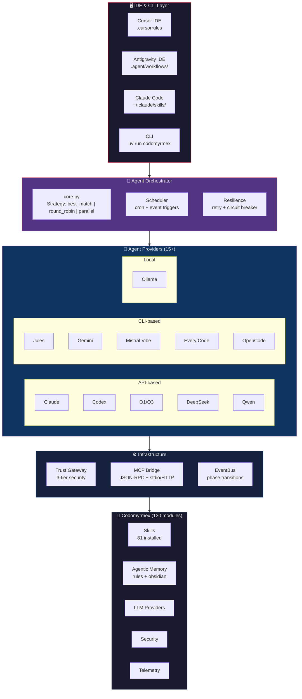

---

## 1. IDE Integrations

Codomyrmex meets agents where developers work — inside their IDEs. Each IDE surface has a distinct integration pattern:

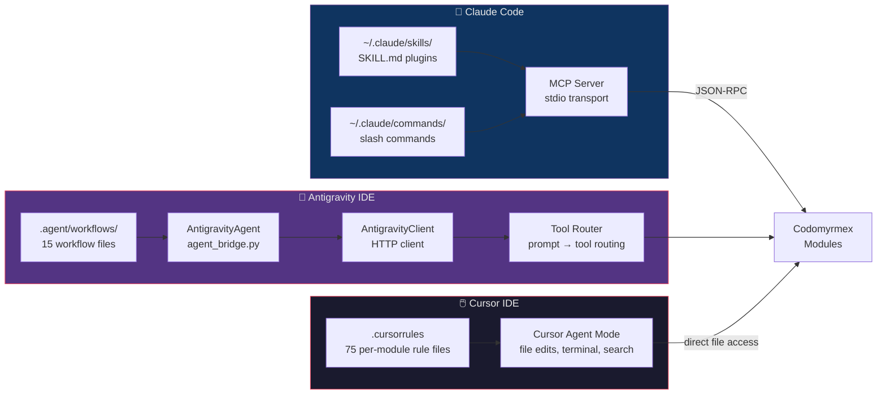

### Cursor Integration

Cursor uses **`.cursorrules`** files (75 per-module rule files) to configure agent behavior per directory. Rules are resolved hierarchically — more specific rules override general ones.

```python
from codomyrmex.agentic_memory.rules import RuleEngine

engine = RuleEngine()
rules = engine.resolve("src/codomyrmex/agents/pai/trust_gateway.py")
print(f"{len(rules)} rules apply to this file")
```

### Antigravity Integration

Antigravity connects via HTTP through the `AntigravityAgent` adapter, which wraps the `AntigravityClient` for the `AgentOrchestrator`.

**15 installed workflows** (`.agent/workflows/`):

| Workflow | Purpose |
|----------|---------|
| `/codomyrmexAnalyze` | Deep project/file analysis |
| `/codomyrmexDocs` | Retrieve module documentation |
| `/codomyrmexMemory` | Add to agentic long-term memory |
| `/codomyrmexSearch` | Codebase regex search |
| `/codomyrmexStatus` | System health & PAI awareness |
| `/codomyrmexVerify` | Capability audit & trust promotion |
| `/codomyrmexTrust` | Destructive tool trust granting |
| `/codomyrmexWorktree` | Git worktree management |
| `/desloppify` | Codebase health & tech debt scan |
| `/gitnexus` | Repo analysis & knowledge graph |
| `/modernPython` | Modern Python best practices (uv, ruff, ty) |
| `/propertyBasedTesting` | Hypothesis-based property testing |
| `/securityAudit` | Trail of Bits-style security audit |
| `/systematicDebugging` | Root-cause investigation methodology |
| `/tdd` | Test-Driven Development workflow |

### Claude Code Integration

Claude Code consumes Codomyrmex through two mechanisms:

| Mechanism | Language | Discovery | Examples |
|-----------|----------|-----------|----------|
| **MCP Tools** | Python (`@mcp_tool`) | Auto-discovered via pkgutil | `data_visualization`, `git_analysis` |
| **External Skills** | Markdown (`SKILL.md`) | Loaded from `~/.claude/skills/` | `visual-explainer`, `Codomyrmex` |

**MCP server startup:**

```bash
uv run python scripts/model_context_protocol/run_mcp_server.py --transport stdio
```

---

## 2. Agent Providers

### Provider Taxonomy

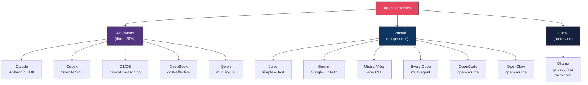

### Core Agent Modules (`src/codomyrmex/agents/`)

| Agent | Type | Module Path | Best For |
|-------|------|-------------|----------|
| **Claude** | API | `agents/claude/` | High-quality reasoning, production use |
| **Codex** | API | `agents/codex/` | Code-focused OpenAI tasks |
| **O1/O3** | API | `agents/o1/` | Complex reasoning, chain-of-thought |
| **DeepSeek** | API | `agents/deepseek/` | Cost-effective code generation |
| **Qwen** | API | `agents/qwen/` | Multilingual code tasks |
| **Jules** | CLI | `agents/jules/` | Simple, fast command-based tasks |
| **Gemini** | CLI | `agents/gemini/` | Google ecosystem, file ops |
| **Mistral Vibe** | CLI | `agents/mistral_vibe/` | Mistral models via `vibe` CLI |
| **Every Code** | CLI | `agents/every_code/` | Multi-agent orchestration |
| **OpenCode** | CLI | `agents/opencode/` | Open-source alternative |
| **OpenClaw** | CLI | `agents/openclaw/` | Open-source code agent |
| **Droid** | CLI | `agents/droid/` | General-purpose code agent |
| **Aider** | CLI | `agents/aider/` | Aider-style code editing |
| **AgenticSeek** | — | `agents/agentic_seek/` | Autonomous task-seeking |
| **Pooling** | — | `agents/pooling/` | Multi-agent load balancing & failover |

### Capability Matrix

| Capability | Claude | O1 | DeepSeek | Gemini | Every Code | Ollama |
|:-----------|:------:|:--:|:--------:|:------:|:----------:|:------:|
| Extended Reasoning | ✅ | ✅ | ❌ | ❌ | ❌ | ❌ |
| Multi-agent | ❌ | ❌ | ❌ | ❌ | ✅ | ❌ |
| Browser Integration | ❌ | ❌ | ❌ | ❌ | ✅ | ❌ |
| File Operations | ❌ | ❌ | ❌ | ✅ | ✅ | ❌ |
| Session Management | ❌ | ❌ | ❌ | ✅ | ✅ | ❌ |
| Local / No API Cost | ❌ | ❌ | ❌ | ❌ | ❌ | ✅ |

### Discovery & Verification

```bash
# Check which agents are operative on this machine
uv run python -m codomyrmex.agents.agent_setup --status-only
```

---

## 3. Orchestration

### Agent Orchestrator (`src/codomyrmex/orchestrator/`)

The orchestrator manages multi-agent workflows with scheduling, resilience, and observability.

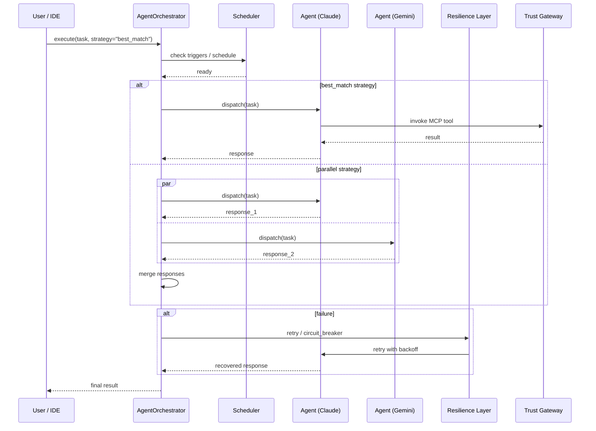

```python
from codomyrmex.orchestrator.core import AgentOrchestrator

orchestrator = AgentOrchestrator()

# Register agents
orchestrator.register_agent("claude", claude_agent)
orchestrator.register_agent("gemini", gemini_agent)

# Execute a task with automatic agent selection
result = orchestrator.execute(
    task="Refactor the validation module",
    strategy="best_match",  # or "round_robin", "parallel"
)
```

**Key submodules:**

| Submodule | Purpose |
|-----------|---------|
| `execution/` | `async_runner.py`, `parallel_runner.py` — concurrent agent execution |
| `resilience/` | `retry_engine.py`, `agent_circuit_breaker.py` — fault tolerance |
| `scheduler/` | `scheduler.py`, `triggers.py` — cron/event-based scheduling |
| `workflows/` | `workflow_engine.py`, `workflow_journal.py` — multi-step pipelines |
| `observability/` | `orchestrator_events.py`, `reporting.py` — audit trail |

---

## 4. PAI Integration

### The Algorithm — 7-Phase Pipeline

PAI (Personal AI Infrastructure) executes a 7-phase pipeline on every Claude Code prompt. Each phase maps to specific Codomyrmex modules:

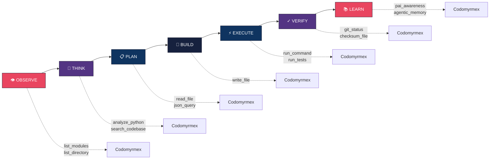

### PAI Bridge Components (`src/codomyrmex/agents/pai/`)

| Component | File | Purpose |
|-----------|------|---------|
| **PAI Bridge** | `pai_bridge.py` | Discovery, validation — reads PAI's filesystem (read-only) |
| **Trust Gateway** | `trust_gateway.py` | 3-tier security gating for tool execution |
| **MCP Bridge** | `mcp_bridge.py` | JSON-RPC protocol for tool invocation |
| **MCP Discovery** | `mcp/discovery.py` | Auto-discovers 130 modules with `mcp_tools.py` |
| **PAI Webhook** | `pai_webhook.py` | FastAPI router for bidirectional PAI ↔ Codomyrmex |
| **PAI Client** | `pai_client.py` | HTTP client to push events to PAI |

### Trust Gateway

The 3-tier trust model gates destructive operations behind explicit approval:

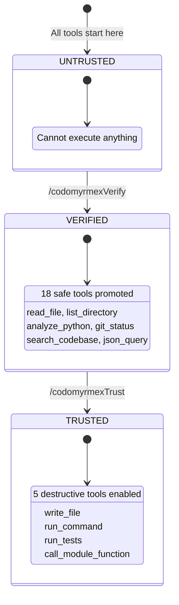

### Deployment Sequence

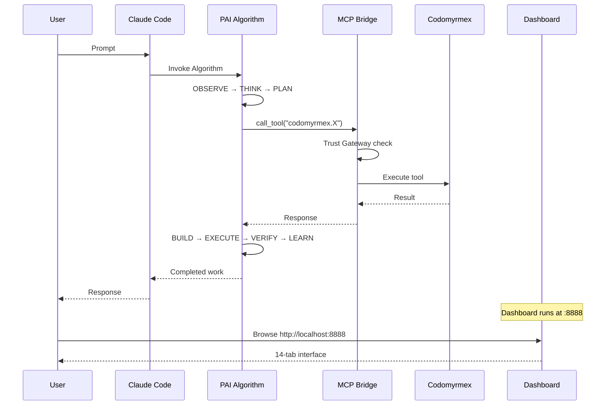

---

## 5. MCP Tool Integration

Every module exposes functionality through `mcp_tools.py` files. **130 modules** provide **~474 dynamically-discovered tools** plus 20 static tools.

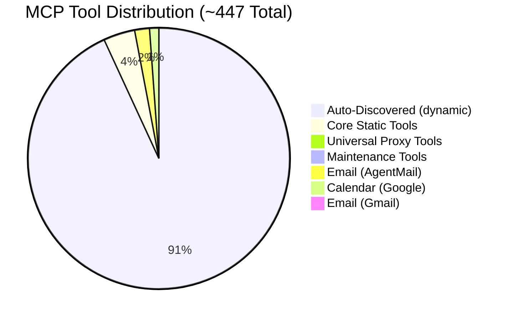

### Using MCP Tools

```python
from codomyrmex.agents.pai.mcp_bridge import get_tool_registry

registry = get_tool_registry()
tools = registry.list_tools()
print(f"{len(tools)} tools available")

# Invoke a tool
result = registry.invoke("analyze_code", {"file_path": "src/module.py"})
```

### Creating MCP Tools

```python
from codomyrmex.model_context_protocol import mcp_tool

@mcp_tool(
    name="my_analyzer",
    description="Analyze code quality",
    deprecated_in=None,  # Set to version string to mark deprecated
)
def my_analyzer(file_path: str) -> dict:
    """Analyze code quality for the given file."""
    return {"file": file_path, "score": 95}
```

### Deprecation Timeline

```python
from codomyrmex.model_context_protocol.mcp_deprecation import get_deprecation_summary

summary = get_deprecation_summary()
print(f"{summary['total_deprecated']} tools deprecated")
for version, count in summary['by_version'].items():
    print(f"  v{version}: {count} tools")
```

---

## 6. Skills System

### Two Extension Mechanisms

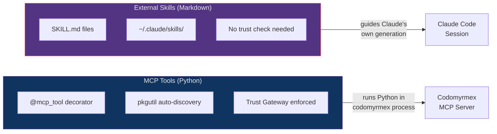

### PAI Skills (`src/codomyrmex/skills/`)

**81 installed skills** provide reusable, versioned capabilities.

```python
from codomyrmex.skills.skills_manager import SkillsManager

manager = SkillsManager()
skills = manager.list_skills()

# Execute a skill
result = manager.execute_skill("code_review", {
    "file_path": "src/codomyrmex/agents/pai/trust_gateway.py",
    "review_depth": "thorough",
})
```

### Installed External Skills

Skills are also accessible as **Claude Code plugins** via `~/.claude/skills/` and as **Antigravity workflows** via `.agent/workflows/`.

| Skill | Source | Version | Slash Commands |
|-------|--------|---------|---------------|
| **visual-explainer** | [nicobailon/visual-explainer](https://github.com/nicobailon/visual-explainer) | v0.4.4 | `/generate-web-diagram`, `/generate-visual-plan`, `/generate-slides`, `/diff-review`, `/plan-review`, `/project-recap`, `/fact-check` |
| **Codomyrmex** | This repo | v1.1.9 | `/codomyrmexVerify`, `/codomyrmexTrust`, `/codomyrmexAnalyze`, `/codomyrmexSearch`, `/codomyrmexDocs`, `/codomyrmexStatus`, `/codomyrmexMemory` |

---

## 7. Agentic Memory

### Memory Architecture

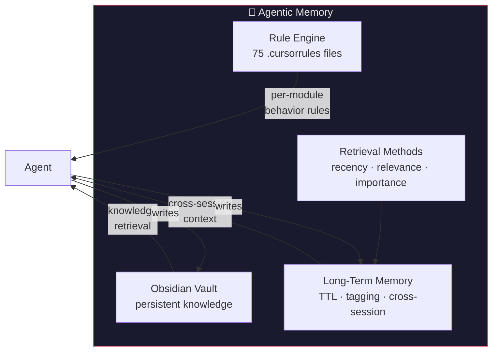

```python
from codomyrmex.agentic_memory.rules import RuleEngine

engine = RuleEngine()
rules = engine.resolve("src/codomyrmex/agents/pai/trust_gateway.py")
print(f"{len(rules)} rules apply to this file")
```

| Component | Purpose |
|-----------|---------|
| `rules/` | 75 `.cursorrules` files governing agent behavior per module |
| `obsidian/` | Obsidian vault integration for persistent knowledge |
| `long_term/` | Long-term memory with TTL, tagging, cross-session retrieval |
| `methods/` | Memory retrieval strategies (recency, relevance, importance) |

---

## 8. Event-Driven Agent Communication

### EventBus (`src/codomyrmex/events/core/event_bus.py`)

Agents communicate through the EventBus for phase transitions, tool results, and status updates.

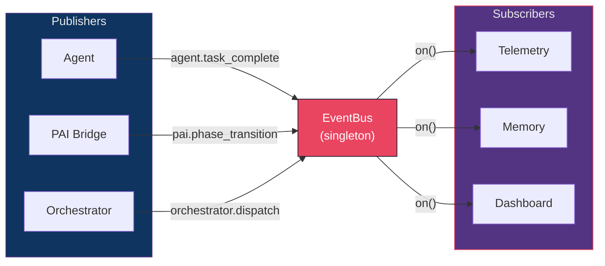

```python
from codomyrmex.events.core.event_bus import EventBus

bus = EventBus.get_default()

# Listen for PAI events
bus.on("pai.phase_transition", lambda event: print(f"Phase: {event}"))

# Emit agent events
bus.emit("agent.task_complete", {"agent": "claude", "task_id": "abc123"})
```

### PAI Webhook Integration

```python
from codomyrmex.agents.pai.pai_client import PAIClient

client = PAIClient()

# Notify PAI of phase transition
client.send_phase_transition("Assessment", "Action")

# Report tool execution result
client.send_tool_result("analyze_code", {"files": 42, "issues": 3})
```

---

## 9. Secret Management for Agents

API keys, tokens, and credentials used by agents are managed through `SecretManager`:

```python
from codomyrmex.config_management.secrets.secret_manager import SecretManager

sm = SecretManager()

# Store an API key
key_id = sm.store_secret("OPENAI_API_KEY", "sk-...")

# Rotate a key
event = sm.rotate_secret("OPENAI_API_KEY", "sk-new-...")
print(f"Rotated: {event['previous_id']} → {event['new_id']}")

# Check staleness
age = sm.check_key_age("OPENAI_API_KEY", max_age_days=90)
if age["stale"]:
    print(f"⚠️ Key is {age['age_days']} days old — rotate!")
```

---

## 10. Agent Diagnostics

### CLI Doctor

```bash
# Quick check
uv run codomyrmex doctor

# Full diagnostic
uv run codomyrmex doctor --all

# Auto-fix issues
uv run codomyrmex doctor --fix

# JSON output for CI
uv run codomyrmex doctor --all --json
```

### PAI Health

```python
from codomyrmex.agents.pai.pai_client import PAIClient

client = PAIClient(base_url="http://localhost:8080")
health = client.check_health()
print(health)  # {"status": "ok", "events_received": 42, ...}
```

---

## Quick Reference

| What | Command / Import |
|------|-----------------|
| Run diagnostics | `uv run codomyrmex doctor --all` |
| List MCP tools | `from codomyrmex.agents.pai.mcp_bridge import get_tool_registry` |
| Execute orchestrated task | `from codomyrmex.orchestrator.core import AgentOrchestrator` |
| PAI health check | `from codomyrmex.agents.pai.pai_client import PAIClient` |
| Resolve rules for file | `from codomyrmex.agentic_memory.rules import RuleEngine` |
| Manage secrets | `from codomyrmex.config_management.secrets.secret_manager import SecretManager` |
| List skills | `from codomyrmex.skills.skills_manager import SkillsManager` |
| Deprecation timeline | `from codomyrmex.model_context_protocol.mcp_deprecation import get_deprecation_summary` |
| Discover agents | `uv run python -m codomyrmex.agents.agent_setup --status-only` |
| Start MCP server | `uv run python scripts/model_context_protocol/run_mcp_server.py --transport stdio` |

---

## See Also

- [Tutorials](tutorials/README.md) — Step-by-step guides including MCP tools and testing
- [setup.md](setup.md) — Installation and environment configuration
- [quickstart.md](quickstart.md) — 5-minute quick start
- [Agent Comparison](../../docs/modules/agents/AGENT_COMPARISON.md) — Detailed provider comparison with decision matrix
- [PAI docs](../../docs/pai/README.md) — Full PAI-Codomyrmex integration docs (architecture, tools, workflows)
- [Agent Module docs](../../docs/modules/agents/README.md) — Agent module exports, testing, and directory structure
- [PAI.md](PAI.md) — Personal AI context for this directory
- [AGENTS.md](AGENTS.md) — Agent guidelines for this directory
