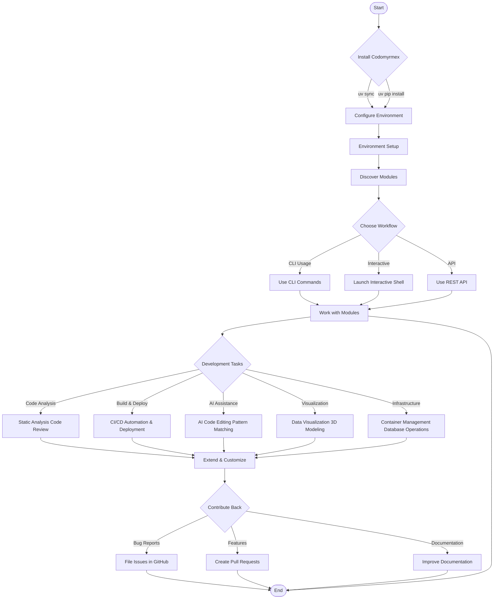
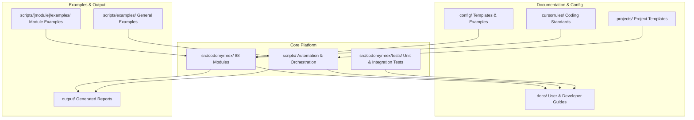

# Setup Guide

Installation and development setup for Codomyrmex. For architecture and module reference, see [Architecture Overview](../project/architecture-overview.md) and [Module Reference](../modules/module-reference.md).

## Installation & Setup

### Prerequisites

- Python ≥3.10
- [uv](https://github.com/astral-sh/uv) (recommended) or pip

### Installation Options

**Option 1: Using uv (Recommended)**

```bash
git clone https://github.com/docxology/codomyrmex.git
cd codomyrmex
uv sync
```

**Option 2: Using pip**

```bash
git clone https://github.com/docxology/codomyrmex.git
cd codomyrmex
uv pip install -e .
```

### Verify Installation

```bash
# Launch interactive shell
./start_here.sh

# Or use the CLI directly
codomyrmex --help

# Discover available modules
uv run python -c "from codomyrmex.system_discovery import SystemDiscovery; SystemDiscovery().discover_modules()"
```

For detailed installation instructions, see the [Installation Guide](installation.md).

## Getting Started Workflow

Typical user journey with Codomyrmex:



## Project Structure

```text
codomyrmex/
├── /src/codomyrmex/          # Core source modules
│   ├── /src/codomyrmex/coding/              # Code interaction and sandboxing
│   ├── /src/codomyrmex/coding/static_analysis/ # Code quality analysis
│   ├── /src/codomyrmex/logging_monitoring/  # Centralized logging
│   └── ...                  # 88 modules total
├── /scripts/                 # Maintenance and automation utilities
│   ├── /scripts/documentation/       # Documentation maintenance scripts
│   ├── /scripts/development/         # Development utilities
│   ├── /scripts/examples/            # Example scripts and demonstrations
│   └── ...                  # 30+ module orchestrators
├── /docs/                    # Project documentation
│   ├── /docs/getting-started/     # Installation and quickstart guides
│   ├── /docs/modules/             # Module system documentation
│   ├── /docs/project/             # Architecture and contributing guides
│   └── /docs/reference/           # API reference and troubleshooting
├── /src/codomyrmex/tests/    # Test suites
│   ├── /src/codomyrmex/tests/unit/                # Unit tests
│   └── /src/codomyrmex/tests/integration/         # Integration tests
├── /config/                  # Configuration templates and examples
│   ├── /config/examples/            # Configuration examples
│   └── /config/templates/           # Configuration templates
├── /cursorrules/             # Coding standards and automation rules
│   ├── /cursorrules/modules/             # Module-specific rules
│   ├── /cursorrules/cross-module/        # Cross-module coordination rules
│   └── /cursorrules/file-specific/       # File-specific rules
├── /projects/                # Project workspace and templates
│   └── /projects/test_project/        # Example project structure
└── /output/                 # Generated output and reports
```

### Repository Organization



## Signposting

**Navigation Links:**

- **Self**: [Codomyrmex Root](README.md)
- **Key Artifacts**:
  - [Agent Guide](AGENTS.md) - Technical documentation for AI agents
  - [Personal AI Infrastructure](PAI.md) - PAI documentation and capabilities
  - [Functional Spec](SPEC.md) - Functional specification
  - [Security](SECURITY.md) - Security policies
- **Children**:
  - [Source Code](src/README.md) - All modules and implementations
  - [Documentation](docs/README.md) - User and developer guides
  - [Scripts](scripts/README.md) - Automation and orchestration utilities
  - [Configuration](config/README.md) - Configuration templates

## Documentation

Comprehensive documentation for users, developers, and contributors. All documentation is organized in the [docs/](docs/README.md) directory.

### Getting Started

- **[Quick Start Guide](docs/getting-started/quickstart.md)** - Get up and running in 5 minutes
- **[Installation Guide](docs/getting-started/installation.md)** - Detailed installation instructions
- **[Setup Guide](docs/getting-started/setup.md)** - Environment configuration and setup
- **[Tutorials](docs/getting-started/tutorials/)** - Step-by-step tutorials including [Creating a Module](docs/getting-started/tutorials/creating-a-module.md)

### Architecture & Design

- **[Architecture Overview](docs/project/architecture.md)** - System design and principles
- **[Module System](docs/modules/overview.md)** - Module architecture and relationships
- **[Module Dependencies](docs/modules/dependency-graph.md)** - Dependency graph and relationships
- **[Module Relationships](docs/modules/relationships.md)** - How modules interact

### Development Resources

- **[Contributing Guide](docs/project/contributing.md)** - Development guidelines and workflow
- **[Development Environment](docs/development/environment-setup.md)** - Setting up your development environment
- **[Testing Strategy](docs/development/testing-strategy.md)** - Testing approaches and best practices
- **[Documentation Guide](docs/development/documentation.md)** - How to write and maintain documentation
- **[UV Usage Guide](docs/development/uv-usage-guide.md)** - Using uv for package management

### Integration

- **[Integration Guide](docs/integration/)** - Integrating Codomyrmex with other systems
- **[External Systems](docs/integration/external-systems.md)** - Integration with external services
- **[Fabric AI Integration](docs/integration/fabric-ai-integration.md)** - AI integration patterns

### Reference

- **[API Reference](docs/reference/api.md)** - Complete API documentation
- **[CLI Reference](docs/reference/cli.md)** - Command-line interface documentation
- **[Troubleshooting](docs/reference/troubleshooting.md)** - Common issues and solutions
- **[Migration Guide](docs/reference/migration-guide.md)** - Upgrading and migrating
- **[Performance Guide](docs/reference/performance.md)** - Performance optimization
- **[Security Guide](docs/reference/security.md)** - Security best practices

### Deployment

- **[Deployment Guide](docs/deployment/)** - Production deployment instructions
- **[Production Setup](docs/deployment/production.md)** - Production environment configuration

### Workflow Orchestration

- **[Project Lifecycle](docs/project_orchestration/project-lifecycle-guide.md)** - Managing project workflows
- **[Workflow Configuration](docs/project_orchestration/workflow-configuration-schema.md)** - Workflow schemas
- **[Task Orchestration](docs/project_orchestration/task-orchestration-guide.md)** - Task management
- **[Logistics Module](src/codomyrmex/logistics/)** - Orchestration, task management, and scheduling

### Examples

- **[Example Scripts](docs/examples/)** - Working examples and demonstrations
- **[Basic Examples](docs/examples/basic-examples.md)** - Simple usage examples
- **[Integration Examples](docs/examples/integration-examples.md)** - Integration patterns
- **[Orchestration Examples](docs/examples/orchestration-examples.md)** - Workflow examples

**See [Documentation Hub](docs/README.md) for complete documentation index.**

## Development

### Running Tests

```bash
# Run all tests
uv run pytest

# Run with coverage
uv run pytest --cov=src/codomyrmex --cov-report=html

# Run specific test suite
uv run pytest src/codomyrmex/tests/unit/
uv run pytest src/codomyrmex/tests/integration/
```

### Code Quality

```bash
# Format code
uv run black src/

# Lint code
uv run ruff check src/

# Type checking
uv run mypy src/
```

### Module Development

See **[Creating a Module Tutorial](docs/getting-started/tutorials/creating-a-module.md)** for detailed guidance on developing new modules.

## Contributing

We welcome contributions! Please see our **[Contributing Guide](docs/project/contributing.md)** for:

- Code standards and best practices
- Development workflow
- Pull request process
- Testing requirements
- Documentation guidelines

## Security

Security is a priority. See **[SECURITY.md](SECURITY.md)** for:

- Vulnerability reporting
- Security best practices
- Module-specific security considerations

## License

This project is licensed under the MIT License - see the [LICENSE](LICENSE) file for details.

Copyright (c) 2025 The Codomyrmex Contributors (@docxology)

## Key Metrics

- **Lines of Code**: ~100K+ across 88 modules
- **Test Coverage**: ~68% (15,179 tests passing, gate: 67%)
- **Module Count**: 88 modules (88 load successfully; 6 additional require optional SDKs)
- **Language Support**: Python, JavaScript, Go, Rust, Java
- **AI Integration**: 5+ LLM providers supported
- **Documentation**: 200+ pages across all modules

## Links

- **Repository**: [github.com/docxology/codomyrmex](https://github.com/docxology/codomyrmex)
- **Issues**: [github.com/docxology/codomyrmex/issues](https://github.com/docxology/codomyrmex/issues)
- **Documentation**: codomyrmex.readthedocs.io (coming soon)
- **PyPI**: pypi.org/project/codomyrmex/ (coming soon)
- **Docker Hub**: hub.docker.com/r/docxology/codomyrmex (coming soon)

---

**Built with a focus on modularity, clarity, and professional development practices.**

## Navigation Links

- **Documentation**: [Reference Guides](docs/README.md)
- **All Agents**: [AGENTS.md](AGENTS.md)
- **Functional Spec**: [SPEC.md](SPEC.md)
- **Source Index**: [src/README.md](src/README.md)
- **Architecture Overview**: [architecture-overview.md](../project/architecture-overview.md)
- **Module Reference**: [module-reference.md](../modules/module-reference.md)

## Example Usage

```bash
# CLI usage (primary entry point)
codomyrmex check                 # Verify environment setup
codomyrmex modules               # List available modules
codomyrmex status                # System status dashboard
codomyrmex shell                 # Interactive shell

# Python API usage
uv run python -c "
from codomyrmex.system_discovery import SystemDiscovery
sd = SystemDiscovery()
sd.discover_modules()
"
```
