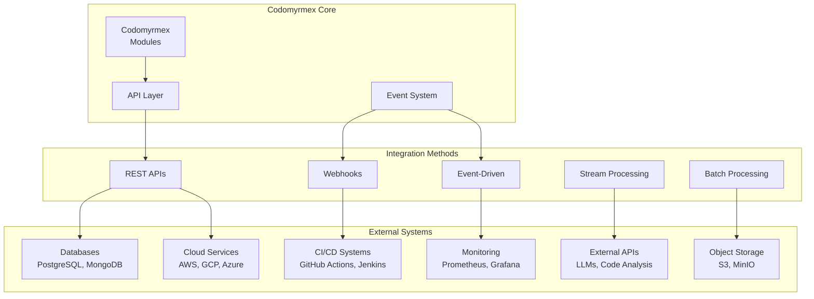

# External Systems Integration

This guide covers integrating Codomyrmex with external systems, APIs, databases, and third-party services for production workflows.

## 🔗 Integration Overview

### **Integration Patterns**



### **Integration Categories**

-   **📊 Data Integration**: Databases, data warehouses, analytics platforms
-   **☁️ Cloud Integration**: AWS, GCP, Azure services and APIs
-   **🔄 CI/CD Integration**: Build pipelines, deployment automation
-   **📈 Monitoring Integration**: Observability and alerting systems
-   **🤖 AI/ML Integration**: External ML services and model APIs
-   **📁 Storage Integration**: File systems, object storage, CDNs

## 📊 Database Integration

### **PostgreSQL Integration**

```python
# database_integration.py - PostgreSQL integration pattern
import asyncpg
import asyncio
from contextlib import asynccontextmanager
from typing import Dict, List, Optional
from codomyrmex.logging_monitoring import get_logger
import json

logger = get_logger(__name__)

class CodomyrmexDatabase:
    """PostgreSQL integration for Codomyrmex data persistence."""

    def __init__(self, database_url: str, pool_size: int = 10):
        self.database_url = database_url
        self.pool_size = pool_size
        self.pool = None

    async def initialize(self):
        """Initialize database connection pool."""
        self.pool = await asyncpg.create_pool(
            self.database_url,
            min_size=2,
            max_size=self.pool_size,
            command_timeout=60
        )

        # Create schema if it doesn't exist
        async with self.pool.acquire() as conn:
            await self._create_schema(conn)

        logger.info("Database pool initialized")

    async def _create_schema(self, conn):
        """Create database schema for Codomyrmex data."""
        await conn.execute("""
            CREATE TABLE IF NOT EXISTS codomyrmex_jobs (
                id SERIAL PRIMARY KEY,
                job_type VARCHAR(100) NOT NULL,
                status VARCHAR(50) NOT NULL DEFAULT 'pending',
                input_data JSONB NOT NULL,
                result JSONB,
                error_message TEXT,
                created_at TIMESTAMP WITH TIME ZONE DEFAULT NOW(),
                updated_at TIMESTAMP WITH TIME ZONE DEFAULT NOW(),
                execution_time_ms INTEGER
            );

            CREATE TABLE IF NOT EXISTS codomyrmex_analysis_cache (
                id SERIAL PRIMARY KEY,
                cache_key VARCHAR(255) UNIQUE NOT NULL,
                content_hash VARCHAR(64) NOT NULL,
                analysis_result JSONB NOT NULL,
                created_at TIMESTAMP WITH TIME ZONE DEFAULT NOW(),
                expires_at TIMESTAMP WITH TIME ZONE NOT NULL
            );

            CREATE INDEX IF NOT EXISTS idx_jobs_status ON codomyrmex_jobs(status);
            CREATE INDEX IF NOT EXISTS idx_jobs_type ON codomyrmex_jobs(job_type);
            CREATE INDEX IF NOT EXISTS idx_cache_key ON codomyrmex_analysis_cache(cache_key);
            CREATE INDEX IF NOT EXISTS idx_cache_expires ON codomyrmex_analysis_cache(expires_at);
        """)

    @asynccontextmanager
    async def transaction(self):
        """Database transaction context manager."""
        async with self.pool.acquire() as conn:
            async with conn.transaction():
                yield conn

    async def store_job(self, job_type: str, input_data: Dict) -> int:
        """Store a new job in the database."""
        async with self.transaction() as conn:
            job_id = await conn.fetchval("""
                INSERT INTO codomyrmex_jobs (job_type, input_data)
                VALUES ($1, $2)
                RETURNING id
            """, job_type, json.dumps(input_data))

        logger.info(f"Stored job {job_id} of type {job_type}")
        return job_id

    async def update_job_result(self, job_id: int, result: Dict,
                               execution_time_ms: int, success: bool = True):
        """Update job with execution result."""
        status = 'completed' if success else 'failed'

        async with self.transaction() as conn:
            await conn.execute("""
                UPDATE codomyrmex_jobs
                SET status = $1, result = $2, execution_time_ms = $3,
                    updated_at = NOW()
                WHERE id = $4
            """, status, json.dumps(result), execution_time_ms, job_id)

        logger.info(f"Updated job {job_id} with status {status}")

    async def get_cached_analysis(self, cache_key: str) -> Optional[Dict]:
        """Get cached analysis result."""
        async with self.pool.acquire() as conn:
            row = await conn.fetchrow("""
                SELECT analysis_result
                FROM codomyrmex_analysis_cache
                WHERE cache_key = $1 AND expires_at > NOW()
            """, cache_key)

        return json.loads(row['analysis_result']) if row else None

    async def store_cached_analysis(self, cache_key: str, content_hash: str,
                                  result: Dict, ttl_hours: int = 24):
        """Store analysis result in cache."""
        async with self.transaction() as conn:
            await conn.execute("""
                INSERT INTO codomyrmex_analysis_cache
                (cache_key, content_hash, analysis_result, expires_at)
                VALUES ($1, $2, $3, NOW() + INTERVAL '%d hours')
                ON CONFLICT (cache_key)
                DO UPDATE SET
                    content_hash = EXCLUDED.content_hash,
                    analysis_result = EXCLUDED.analysis_result,
                    expires_at = EXCLUDED.expires_at
            """ % ttl_hours, cache_key, content_hash, json.dumps(result))

        logger.debug(f"Cached analysis result for key {cache_key}")

# Usage example with static analysis
async def analyze_codebase_with_db_cache(codebase_path: str,
                                       db: CodomyrmexDatabase) -> Dict:
    """Analyze codebase with database caching."""
    from codomyrmex.static_analysis import analyze_codebase
    import hashlib

    # Generate cache key
    cache_key = f"static_analysis:{hashlib.md5(str(codebase_path).encode()).hexdigest()}"

    # Check cache first
    cached_result = await db.get_cached_analysis(cache_key)
    if cached_result:
        logger.info(f"Using cached analysis for {codebase_path}")
        return cached_result

    # Store job
    job_id = await db.store_job('static_analysis', {
        'codebase_path': str(codebase_path),
        'timestamp': time.time()
    })

    start_time = time.time()
    try:
        # Perform analysis
        result = analyze_codebase(codebase_path)
        execution_time = int((time.time() - start_time) * 1000)

        # Store results
        await db.update_job_result(job_id, result, execution_time, success=True)

        # Cache result
        content_hash = hashlib.md5(json.dumps(result, sort_keys=True).encode()).hexdigest()
        await db.store_cached_analysis(cache_key, content_hash, result)

        return result

    except Exception as e:
        execution_time = int((time.time() - start_time) * 1000)
        error_result = {'error': str(e)}
        await db.update_job_result(job_id, error_result, execution_time, success=False)
        raise
```

### **MongoDB Integration**

```python
# mongodb_integration.py - MongoDB integration for flexible document storage
from motor.motor_asyncio import AsyncIOMotorClient
from datetime import datetime, timedelta
import pymongo
from typing import Dict, List, Optional
from bson import ObjectId

class CodomyrmexMongoDB:
    """MongoDB integration for document-based data storage."""

    def __init__(self, connection_string: str, database_name: str = "codomyrmex"):
        self.client = AsyncIOMotorClient(connection_string)
        self.db = self.client[database_name]

    async def initialize(self):
        """Initialize MongoDB collections and indexes."""
        # Create collections
        self.jobs = self.db.jobs
        self.analysis_results = self.db.analysis_results
        self.user_preferences = self.db.user_preferences

        # Create indexes
        await self.jobs.create_index([("status", 1), ("created_at", -1)])
        await self.jobs.create_index([("job_type", 1)])
        await self.analysis_results.create_index([("cache_key", 1)], unique=True)
        await self.analysis_results.create_index([("expires_at", 1)], expireAfterSeconds=0)

        logger.info("MongoDB collections and indexes initialized")

    async def store_analysis_result(self, analysis_type: str, input_data: Dict,
                                  result: Dict, ttl_hours: int = 24) -> str:
        """Store analysis result with automatic expiration."""
        doc = {
            'analysis_type': analysis_type,
            'input_data': input_data,
            'result': result,
            'created_at': datetime.utcnow(),
            'expires_at': datetime.utcnow() + timedelta(hours=ttl_hours)
        }

        result_obj = await self.analysis_results.insert_one(doc)
        return str(result_obj.inserted_id)

    async def get_analysis_history(self, analysis_type: str = None,
                                 limit: int = 100) -> List[Dict]:
        """Get analysis history with optional filtering."""
        filter_query = {}
        if analysis_type:
            filter_query['analysis_type'] = analysis_type

        cursor = self.analysis_results.find(
            filter_query,
            sort=[('created_at', pymongo.DESCENDING)]
        ).limit(limit)

        return await cursor.to_list(length=limit)

    async def store_user_workflow(self, user_id: str, workflow_data: Dict) -> str:
        """Store user-specific workflow configuration."""
        doc = {
            'user_id': user_id,
            'workflow_data': workflow_data,
            'created_at': datetime.utcnow(),
            'updated_at': datetime.utcnow()
        }

        # Upsert based on user_id
        result = await self.user_preferences.replace_one(
            {'user_id': user_id},
            doc,
            upsert=True
        )

        return str(result.upserted_id or result.matched_count)

# Usage with AI code editing
async def ai_enhancement_with_history(code: str, user_id: str,
                                    mongo_db: CodomyrmexMongoDB):
    """AI code enhancement with history tracking."""
    from codomyrmex.agents.ai_code_editing import enhance_code

    # Enhance code
    result = await enhance_code(code, user_context=user_id)

    # Store in history
    await mongo_db.store_analysis_result(
        'ai_code_enhancement',
        {
            'user_id': user_id,
            'original_code': code,
            'enhancement_type': result.enhancement_type
        },
        {
            'enhanced_code': result.enhanced_code,
            'improvements': result.improvements,
            'confidence_score': result.confidence_score
        }
    )

    return result
```

## ☁️ Cloud Services Integration

### **AWS Integration**

```python
# aws_integration.py - AWS services integration
import boto3
import asyncio
from botocore.config import Config
from typing import Dict, List, Optional
import json

class AWSIntegration:
    """Integration with AWS services for cloud-native Codomyrmex deployment."""

    def __init__(self, region: str = 'us-east-1'):
        self.region = region
        self.config = Config(
            region_name=region,
            retries={'max_attempts': 3, 'mode': 'adaptive'}
        )

        # Initialize clients
        self.s3 = boto3.client('s3', config=self.config)
        self.lambda_client = boto3.client('lambda', config=self.config)
        self.sqs = boto3.client('sqs', config=self.config)
        self.sns = boto3.client('sns', config=self.config)
        self.cloudwatch = boto3.client('cloudwatch', config=self.config)

    async def store_analysis_artifacts(self, analysis_id: str,
                                     artifacts: Dict[str, bytes],
                                     bucket_name: str) -> List[str]:
        """Store analysis artifacts in S3."""
        stored_keys = []

        for artifact_name, artifact_data in artifacts.items():
            key = f"analysis-artifacts/{analysis_id}/{artifact_name}"

            # Upload to S3
            self.s3.put_object(
                Bucket=bucket_name,
                Key=key,
                Body=artifact_data,
                ContentType=self._get_content_type(artifact_name),
                Metadata={
                    'analysis_id': analysis_id,
                    'uploaded_by': 'codomyrmex',
                    'timestamp': str(time.time())
                }
            )

            stored_keys.append(key)
            logger.info(f"Stored artifact {artifact_name} at s3://{bucket_name}/{key}")

        return stored_keys

    async def trigger_lambda_analysis(self, function_name: str,
                                    payload: Dict) -> Dict:
        """Trigger serverless analysis via AWS Lambda."""
        response = self.lambda_client.invoke(
            FunctionName=function_name,
            InvocationType='RequestResponse',
            Payload=json.dumps(payload)
        )

        # Parse response
        result = json.loads(response['Payload'].read())

        if response['StatusCode'] == 200:
            logger.info(f"Lambda function {function_name} executed successfully")
            return result
        else:
            logger.error(f"Lambda function failed: {result}")
            raise Exception(f"Lambda execution failed: {result}")

    async def send_analysis_notification(self, topic_arn: str,
                                       analysis_result: Dict) -> str:
        """Send analysis completion notification via SNS."""
        message = {
            'analysis_id': analysis_result.get('id'),
            'status': analysis_result.get('status'),
            'completion_time': analysis_result.get('completion_time'),
            'summary': analysis_result.get('summary', {})
        }

        response = self.sns.publish(
            TopicArn=topic_arn,
            Subject='Codomyrmex Analysis Complete',
            Message=json.dumps(message, indent=2),
            MessageAttributes={
                'analysis_type': {
                    'DataType': 'String',
                    'StringValue': analysis_result.get('type', 'unknown')
                }
            }
        )

        return response['MessageId']

    async def publish_custom_metrics(self, metrics: List[Dict]):
        """Publish custom CloudWatch metrics."""
        metric_data = []

        for metric in metrics:
            metric_data.append({
                'MetricName': metric['name'],
                'Value': metric['value'],
                'Unit': metric.get('unit', 'Count'),
                'Dimensions': [
                    {
                        'Name': dim_name,
                        'Value': dim_value
                    }
                    for dim_name, dim_value in metric.get('dimensions', {}).items()
                ]
            })

        # Publish metrics (CloudWatch accepts up to 20 metrics per call)
        for i in range(0, len(metric_data), 20):
            batch = metric_data[i:i+20]

            self.cloudwatch.put_metric_data(
                Namespace='Codomyrmex',
                MetricData=batch
            )

        logger.info(f"Published {len(metric_data)} custom metrics")

    def _get_content_type(self, filename: str) -> str:
        """Get content type based on file extension."""
        content_types = {
            '.json': 'application/json',
            '.txt': 'text/plain',
            '.py': 'text/x-python',
            '.js': 'application/javascript',
            '.html': 'text/html',
            '.png': 'image/png',
            '.jpg': 'image/jpeg',
            '.pdf': 'application/pdf'
        }

        extension = Path(filename).suffix.lower()
        return content_types.get(extension, 'application/octet-stream')

# Usage example for cloud-native analysis workflow
async def cloud_analysis_workflow(codebase_path: str, aws_integration: AWSIntegration):
    """Complete cloud-native analysis workflow."""
    from codomyrmex.static_analysis import analyze_codebase
    from codomyrmex.data_visualization import create_analysis_dashboard

    analysis_id = f"analysis_{int(time.time())}"

    try:
        # 1. Perform static analysis
        analysis_result = analyze_codebase(codebase_path)

        # 2. Generate visualization artifacts
        dashboard_data = create_analysis_dashboard(analysis_result)

        # 3. Store artifacts in S3
        artifacts = {
            'analysis_report.json': json.dumps(analysis_result, indent=2).encode(),
            'dashboard.html': dashboard_data['html'].encode(),
            'metrics.json': json.dumps(dashboard_data['metrics'], indent=2).encode()
        }

        stored_keys = await aws_integration.store_analysis_artifacts(
            analysis_id, artifacts, 'codomyrmex-analysis-bucket'
        )

        # 4. Trigger additional Lambda processing if needed
        lambda_result = await aws_integration.trigger_lambda_analysis(
            'codomyrmex-post-process',
            {
                'analysis_id': analysis_id,
                'artifact_keys': stored_keys,
                'analysis_summary': analysis_result.get('summary', {})
            }
        )

        # 5. Publish metrics
        await aws_integration.publish_custom_metrics([
            {
                'name': 'AnalysisCompleted',
                'value': 1,
                'dimensions': {'analysis_type': 'static_analysis'}
            },
            {
                'name': 'FilesAnalyzed',
                'value': len(analysis_result.get('files', [])),
                'unit': 'Count'
            },
            {
                'name': 'IssuesFound',
                'value': len(analysis_result.get('issues', [])),
                'unit': 'Count'
            }
        ])

        # 6. Send notification
        notification_id = await aws_integration.send_analysis_notification(
            'arn:aws:sns:us-east-1:123456789:codomyrmex-notifications',
            {
                'id': analysis_id,
                'status': 'completed',
                'completion_time': datetime.utcnow().isoformat(),
                'summary': analysis_result.get('summary', {}),
                'artifacts': stored_keys
            }
        )

        logger.info(f"Cloud analysis workflow completed: {analysis_id}")
        return {
            'analysis_id': analysis_id,
            'artifacts': stored_keys,
            'lambda_result': lambda_result,
            'notification_id': notification_id
        }

    except Exception as e:
        logger.error(f"Cloud analysis workflow failed: {e}")

        # Send error notification
        await aws_integration.send_analysis_notification(
            'arn:aws:sns:us-east-1:123456789:codomyrmex-alerts',
            {
                'id': analysis_id,
                'status': 'failed',
                'error': str(e),
                'completion_time': datetime.utcnow().isoformat()
            }
        )

        raise
```

## 🔄 CI/CD Integration

### **GitHub Actions Integration**

```python
# github_integration.py - GitHub Actions and API integration
import aiohttp
import asyncio
from typing import Dict, List, Optional
import base64
import json

class GitHubIntegration:
    """Integration with GitHub API and Actions."""

    def __init__(self, token: str, owner: str, repo: str):
        self.token = token
        self.owner = owner
        self.repo = repo
        self.base_url = "https://api.github.com"
        self.headers = {
            'Authorization': f'token {token}',
            'Accept': 'application/vnd.github.v3+json',
            'User-Agent': 'Codomyrmex-Integration/1.0'
        }

    async def create_pull_request_analysis(self, pr_number: int) -> Dict:
        """Analyze pull request and create detailed analysis."""
        from codomyrmex.static_analysis import analyze_diff
        from codomyrmex.agents.ai_code_editing import review_code_changes

        async with aiohttp.ClientSession() as session:
            # Get PR details
            pr_url = f"{self.base_url}/repos/{self.owner}/{self.repo}/pulls/{pr_number}"
            async with session.get(pr_url, headers=self.headers) as response:
                pr_data = await response.json()

            # Get PR diff
            diff_url = f"{self.base_url}/repos/{self.owner}/{self.repo}/pulls/{pr_number}/files"
            async with session.get(diff_url, headers=self.headers) as response:
                files_data = await response.json()

            # Analyze changes
            analysis_tasks = []
            for file_data in files_data:
                if file_data['status'] in ['added', 'modified']:
                    # Get file content
                    content_url = file_data['contents_url']
                    async with session.get(content_url, headers=self.headers) as response:
                        content_data = await response.json()

                        if content_data['encoding'] == 'base64':
                            file_content = base64.b64decode(content_data['content']).decode()

                            # Schedule analysis
                            analysis_tasks.append(
                                self._analyze_file_changes(
                                    file_data['filename'],
                                    file_content,
                                    file_data.get('patch', ''),
                                    session
                                )
                            )

            # Execute all analyses in parallel
            analysis_results = await asyncio.gather(*analysis_tasks, return_exceptions=True)

            # Compile comprehensive review
            review = {
                'pr_number': pr_number,
                'title': pr_data['title'],
                'author': pr_data['user']['login'],
                'files_analyzed': len([r for r in analysis_results if not isinstance(r, Exception)]),
                'analysis_results': [r for r in analysis_results if not isinstance(r, Exception)],
                'errors': [str(r) for r in analysis_results if isinstance(r, Exception)],
                'summary': self._generate_review_summary(analysis_results),
                'recommendations': self._generate_recommendations(analysis_results)
            }

            return review

    async def _analyze_file_changes(self, filename: str, content: str,
                                  patch: str, session: aiohttp.ClientSession) -> Dict:
        """Analyze individual file changes."""
        from codomyrmex.static_analysis import analyze_code_quality
        from codomyrmex.pattern_matching import find_code_patterns

        try:
            # Static analysis
            quality_analysis = analyze_code_quality(content, filename)

            # Pattern analysis
            pattern_analysis = find_code_patterns(content, filename)

            # AI review (if enabled)
            ai_review = None
            if os.getenv('ENABLE_AI_REVIEW', 'false').lower() == 'true':
                from codomyrmex.agents.ai_code_editing import review_code_changes
                ai_review = await review_code_changes(content, patch, filename)

            return {
                'filename': filename,
                'quality_score': quality_analysis.overall_score,
                'issues': quality_analysis.issues,
                'patterns': pattern_analysis.patterns_found,
                'ai_review': ai_review,
                'recommendations': self._file_recommendations(quality_analysis, pattern_analysis)
            }

        except Exception as e:
            logger.error(f"Analysis failed for {filename}: {e}")
            return {
                'filename': filename,
                'error': str(e)
            }

    async def post_review_comment(self, pr_number: int, analysis_result: Dict) -> str:
        """Post comprehensive analysis as PR comment."""
        comment_body = self._format_analysis_comment(analysis_result)

        async with aiohttp.ClientSession() as session:
            comment_url = f"{self.base_url}/repos/{self.owner}/{self.repo}/issues/{pr_number}/comments"

            async with session.post(
                comment_url,
                headers=self.headers,
                json={'body': comment_body}
            ) as response:
                comment_data = await response.json()
                return comment_data['html_url']

    async def trigger_workflow(self, workflow_id: str, ref: str, inputs: Dict = None) -> str:
        """Trigger GitHub Actions workflow."""
        async with aiohttp.ClientSession() as session:
            workflow_url = f"{self.base_url}/repos/{self.owner}/{self.repo}/actions/workflows/{workflow_id}/dispatches"

            payload = {
                'ref': ref,
                'inputs': inputs or {}
            }

            async with session.post(
                workflow_url,
                headers=self.headers,
                json=payload
            ) as response:
                if response.status == 204:
                    return f"Workflow {workflow_id} triggered successfully"
                else:
                    error_data = await response.json()
                    raise Exception(f"Workflow trigger failed: {error_data}")

    def _format_analysis_comment(self, analysis_result: Dict) -> str:
        """Format analysis result as markdown comment."""
        comment_parts = [
            "## 🤖 Codomyrmex Analysis Report
",
            f"**Files Analyzed**: {analysis_result['files_analyzed']}
",
            f"**Author**: @{analysis_result['author']}

"
        ]

        # Summary
        if analysis_result.get('summary'):
            comment_parts.append("### 📊 Summary
")
            for key, value in analysis_result['summary'].items():
                comment_parts.append(f"- **{key.title()}**: {value}
")
            comment_parts.append("
")

        # File-by-file analysis
        if analysis_result.get('analysis_results'):
            comment_parts.append("### 📁 File Analysis

")

            for file_result in analysis_result['analysis_results']:
                if file_result.get('error'):
                    comment_parts.append(f"❌ **{file_result['filename']}**: Analysis failed - {file_result['error']}

")
                    continue

                comment_parts.append(f"#### {file_result['filename']}
")
                comment_parts.append(f"- **Quality Score**: {file_result.get('quality_score', 'N/A')}/100
")

                if file_result.get('issues'):
                    comment_parts.append(f"- **Issues Found**: {len(file_result['issues'])}
")
                    for issue in file_result['issues'][:3]:  # Top 3 issues
                        comment_parts.append(f"  - {issue['severity']}: {issue['message']}
")

                if file_result.get('ai_review'):
                    comment_parts.append(f"- **AI Insights**: {file_result['ai_review']['summary']}
")

                comment_parts.append("
")

        # Recommendations
        if analysis_result.get('recommendations'):
            comment_parts.append("### 💡 Recommendations

")
            for rec in analysis_result['recommendations']:
                comment_parts.append(f"- {rec}
")
            comment_parts.append("
")

        comment_parts.append("---
*This analysis was generated by Codomyrmex. For more details, check the full CI/CD pipeline.*")

        return "".join(comment_parts)

# GitHub Actions workflow file
github_workflow_content = """
# .github/workflows/codomyrmex-analysis.yml
name: Codomyrmex Code Analysis

on:
  pull_request:
    types: [opened, synchronize]
  push:
    branches: [main, develop]
  workflow_dispatch:
    inputs:
      analysis_type:
        description: 'Type of analysis to run'
        required: true
        default: 'comprehensive'
        type: choice
        options:
        - comprehensive
        - static-only
        - ai-review-only

jobs:
  codomyrmex-analysis:
    runs-on: ubuntu-latest
    timeout-minutes: 30

    steps:
    - name: Checkout code
      uses: actions/checkout@v4
      with:
        fetch-depth: 0  # Full history for comprehensive analysis

    - name: Set up Python
      uses: actions/setup-python@v4
      with:
        python-version: '3.11'
        cache: 'pip'

    - name: Install Codomyrmex
      run: |
        uv sync --all-extras
        # Or install from source
        # uv sync

    - name: Run Static Analysis
      if: ${{ github.event.inputs.analysis_type != 'ai-review-only' }}
      run: |
        codomyrmex analyze --path . --output-format json --output-file analysis.json

    - name: Run AI Code Review
      if: ${{ github.event.inputs.analysis_type != 'static-only' }}
      env:
        OPENAI_API_KEY: ${{ secrets.OPENAI_API_KEY }}
        ANTHROPIC_API_KEY: ${{ secrets.ANTHROPIC_API_KEY }}
      run: |
        codomyrmex ai-review --path . --pr-number ${{ github.event.number }}

    - name: Generate Visualizations
      run: |
        codomyrmex visualize --analysis-file analysis.json --output-dir ./analysis-output

    - name: Upload Analysis Artifacts
      uses: actions/upload-artifact@v4
      with:
        name: codomyrmex-analysis-${{ github.sha }}
        path: |
          analysis.json
          analysis-output/
        retention-days: 30

    - name: Post PR Comment
      if: github.event_name == 'pull_request'
      env:
        GITHUB_TOKEN: ${{ secrets.GITHUB_TOKEN }}
      run: |
        python scripts/documentation/post_analysis_comment.py \\
          --pr-number ${{ github.event.number }} \\
          --analysis-file analysis.json \\
          --repo ${{ github.repository }}

    - name: Check Quality Gates
      run: |
        python scripts/maintenance/check_quality_gates.py \\
          --analysis-file analysis.json \\
          --fail-on-error \\
          --min-quality-score 80
"""
```

## 📈 Monitoring & Observability Integration

### **Prometheus & Grafana Integration**

```python
# monitoring_integration.py - Monitoring systems integration
from prometheus_client import Counter, Histogram, Gauge, CollectorRegistry, generate_latest
import asyncio
import aiohttp
from datetime import datetime, timedelta
import json

class PrometheusIntegration:
    """Integration with Prometheus for comprehensive monitoring."""

    def __init__(self, pushgateway_url: str = None):
        self.registry = CollectorRegistry()
        self.pushgateway_url = pushgateway_url

        # Define Codomyrmex-specific metrics
        self.analysis_counter = Counter(
            'codomyrmex_analyses_total',
            'Total number of analyses performed',
            ['module', 'analysis_type', 'status'],
            registry=self.registry
        )

        self.analysis_duration = Histogram(
            'codomyrmex_analysis_duration_seconds',
            'Time spent on analyses',
            ['module', 'analysis_type'],
            registry=self.registry,
            buckets=[0.1, 0.5, 1, 5, 10, 30, 60, 300, 600]
        )

        self.active_jobs = Gauge(
            'codomyrmex_active_jobs',
            'Number of currently active jobs',
            ['job_type'],
            registry=self.registry
        )

        self.code_quality_score = Gauge(
            'codomyrmex_code_quality_score',
            'Latest code quality score',
            ['project', 'module'],
            registry=self.registry
        )

        self.ai_api_calls = Counter(
            'codomyrmex_ai_api_calls_total',
            'Total AI API calls',
            ['provider', 'model', 'status'],
            registry=self.registry
        )

        self.ai_token_usage = Counter(
            'codomyrmex_ai_tokens_used_total',
            'Total AI tokens consumed',
            ['provider', 'model', 'token_type'],
            registry=self.registry
        )

    def record_analysis(self, module: str, analysis_type: str,
                       duration: float, success: bool = True):
        """Record analysis metrics."""
        status = 'success' if success else 'error'

        self.analysis_counter.labels(
            module=module,
            analysis_type=analysis_type,
            status=status
        ).inc()

        self.analysis_duration.labels(
            module=module,
            analysis_type=analysis_type
        ).observe(duration)

    def update_active_jobs(self, job_type: str, count: int):
        """Update active job count."""
        self.active_jobs.labels(job_type=job_type).set(count)

    def record_quality_score(self, project: str, module: str, score: float):
        """Record code quality score."""
        self.code_quality_score.labels(
            project=project,
            module=module
        ).set(score)

    def record_ai_api_call(self, provider: str, model: str, success: bool = True,
                          input_tokens: int = 0, output_tokens: int = 0):
        """Record AI API usage."""
        status = 'success' if success else 'error'

        self.ai_api_calls.labels(
            provider=provider,
            model=model,
            status=status
        ).inc()

        if input_tokens > 0:
            self.ai_token_usage.labels(
                provider=provider,
                model=model,
                token_type='input'
            ).inc(input_tokens)

        if output_tokens > 0:
            self.ai_token_usage.labels(
                provider=provider,
                model=model,
                token_type='output'
            ).inc(output_tokens)

    async def push_metrics(self, job_name: str = 'codomyrmex'):
        """Push metrics to Pushgateway."""
        if not self.pushgateway_url:
            logger.warning("No Pushgateway URL configured")
            return

        metrics_data = generate_latest(self.registry)
        url = f"{self.pushgateway_url}/metrics/job/{job_name}"

        async with aiohttp.ClientSession() as session:
            async with session.post(
                url,
                data=metrics_data,
                headers={'Content-Type': 'text/plain'}
            ) as response:
                if response.status == 200:
                    logger.info("Metrics pushed to Pushgateway successfully")
                else:
                    logger.error(f"Failed to push metrics: {response.status}")

class GrafanaIntegration:
    """Integration with Grafana for dashboard automation."""

    def __init__(self, grafana_url: str, api_key: str):
        self.grafana_url = grafana_url.rstrip('/')
        self.api_key = api_key
        self.headers = {
            'Authorization': f'Bearer {api_key}',
            'Content-Type': 'application/json'
        }

    async def create_codomyrmex_dashboard(self) -> str:
        """Create comprehensive Codomyrmex dashboard."""
        dashboard_config = {
            "dashboard": {
                "id": None,
                "title": "Codomyrmex Analytics",
                "tags": ["codomyrmex", "code-analysis"],
                "timezone": "browser",
                "refresh": "30s",
                "time": {
                    "from": "now-1h",
                    "to": "now"
                },
                "panels": [
                    # Analysis Overview Panel
                    {
                        "id": 1,
                        "title": "Analysis Overview",
                        "type": "stat",
                        "targets": [
                            {
                                "expr": "sum(codomyrmex_analyses_total)",
                                "refId": "A"
                            }
                        ],
                        "fieldConfig": {
                            "defaults": {
                                "color": {"mode": "palette-classic"},
                                "custom": {"displayMode": "list", "orientation": "auto"},
                                "mappings": [],
                                "thresholds": {
                                    "mode": "absolute",
                                    "steps": [
                                        {"color": "green", "value": None},
                                        {"color": "red", "value": 80}
                                    ]
                                }
                            }
                        }
                    },
                    # Analysis Duration Panel
                    {
                        "id": 2,
                        "title": "Analysis Duration",
                        "type": "graph",
                        "targets": [
                            {
                                "expr": "histogram_quantile(0.95, codomyrmex_analysis_duration_seconds_bucket)",
                                "refId": "A",
                                "legendFormat": "95th percentile"
                            },
                            {
                                "expr": "histogram_quantile(0.50, codomyrmex_analysis_duration_seconds_bucket)",
                                "refId": "B",
                                "legendFormat": "Median"
                            }
                        ]
                    },
                    # Code Quality Trends
                    {
                        "id": 3,
                        "title": "Code Quality Trends",
                        "type": "graph",
                        "targets": [
                            {
                                "expr": "codomyrmex_code_quality_score",
                                "refId": "A",
                                "legendFormat": "{{project}}/{{module}}"
                            }
                        ]
                    },
                    # AI API Usage
                    {
                        "id": 4,
                        "title": "AI API Usage",
                        "type": "piechart",
                        "targets": [
                            {
                                "expr": "sum by (provider) (codomyrmex_ai_api_calls_total)",
                                "refId": "A"
                            }
                        ]
                    }
                ]
            },
            "overwrite": True
        }

        async with aiohttp.ClientSession() as session:
            url = f"{self.grafana_url}/api/dashboards/db"

            async with session.post(
                url,
                headers=self.headers,
                json=dashboard_config
            ) as response:
                if response.status == 200:
                    result = await response.json()
                    dashboard_url = f"{self.grafana_url}/d/{result['uid']}"
                    logger.info(f"Codomyrmex dashboard created: {dashboard_url}")
                    return dashboard_url
                else:
                    error = await response.text()
                    logger.error(f"Failed to create dashboard: {error}")
                    raise Exception(f"Dashboard creation failed: {error}")

# Usage with monitoring integration
monitoring_prometheus = PrometheusIntegration("http://pushgateway:9091")
monitoring_grafana = GrafanaIntegration(
    "http://grafana:3000",
    os.getenv("GRAFANA_API_KEY")
)

async def monitored_analysis_workflow(codebase_path: str):
    """Analysis workflow with comprehensive monitoring."""
    from codomyrmex.static_analysis import analyze_codebase
    import time

    start_time = time.time()

    # Update active jobs
    monitoring_prometheus.update_active_jobs('static_analysis', 1)

    try:
        # Perform analysis
        result = analyze_codebase(codebase_path)
        duration = time.time() - start_time

        # Record successful analysis
        monitoring_prometheus.record_analysis(
            'static_analysis',
            'codebase',
            duration,
            success=True
        )

        # Record quality score
        monitoring_prometheus.record_quality_score(
            Path(codebase_path).name,
            'overall',
            result.overall_quality_score
        )

        # Push metrics
        await monitoring_prometheus.push_metrics()

        return result

    except Exception as e:
        duration = time.time() - start_time

        # Record failed analysis
        monitoring_prometheus.record_analysis(
            'static_analysis',
            'codebase',
            duration,
            success=False
        )

        await monitoring_prometheus.push_metrics()
        raise

    finally:
        # Update active jobs
        monitoring_prometheus.update_active_jobs('static_analysis', 0)
```

## 🔗 Related Documentation

### **Integration Resources**

-   **[Production Deployment](../deployment/production.md)**: Production integration patterns and security configuration
-   **[Performance Optimization](../reference/performance.md)**: Integration performance tuning

### **Development Integration**

-   **[Development Setup](../development/environment-setup.md)**: Development environment setup
-   **[Testing Strategy](../development/testing-strategy.md)**: Integration testing patterns
-   **[API Reference](../reference/api.md)**: Complete API documentation for integration

### **Module-Specific Integration**

-   **[AI Code Editing API](../../src/codomyrmex/agents/ai_code_editing/API_SPECIFICATION.md)**: AI service integration
-   **[Static Analysis API](../../src/codomyrmex/static_analysis/API_SPECIFICATION.md)**: Analysis service integration
-   **[Data Visualization API](../../src/codomyrmex/data_visualization/API_SPECIFICATION.md)**: Visualization integration

---

**Integration Checklist** ✅:

-   [ ] External service credentials configured securely
-   [ ] Error handling and retry logic implemented
-   [ ] Monitoring and alerting configured
-   [ ] Rate limiting and API quotas managed
-   [ ] Data persistence and backup strategies defined
-   [ ] Integration testing automated
-   [ ] Documentation and runbooks created
-   [ ] Security review completed

**Need Integration Help?** Refer to our [Integration Troubleshooting Guide](../reference/troubleshooting.md#integration-issues) or check module-specific integration documentation.

## Navigation Links

- **Parent**: [Project Overview](../README.md)
- **Module Index**: [All Agents](../../AGENTS.md)
- **Documentation**: [Reference Guides](../../docs/README.md)
- **Home**: [Repository Root](../../README.md)
