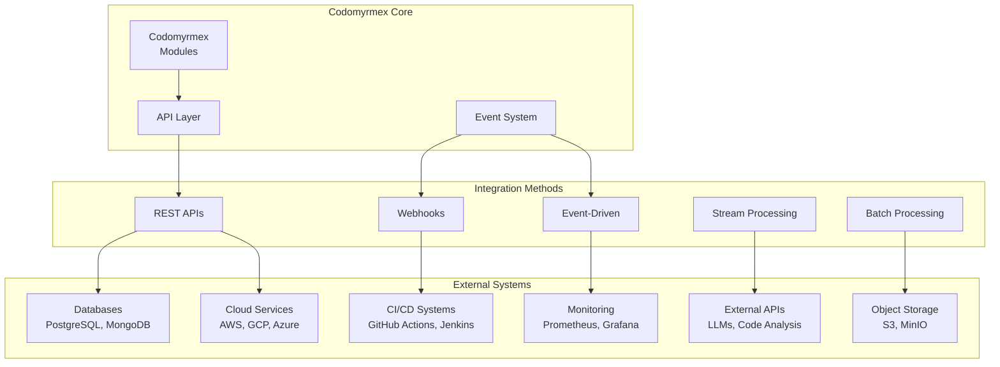

# External Systems Integration

This guide covers integrating Codomyrmex with external systems, APIs, databases, and third-party services for production workflows.

## 🔗 Integration Overview

### **Integration Patterns**

### **Integration Categories**

- **📊 Data Integration**: Databases, data warehouses, analytics platforms
- **☁️ Cloud Integration**: AWS, GCP, Azure services and APIs
- **🔄 CI/CD Integration**: Build pipelines, deployment automation
- **📈 Monitoring Integration**: Observability and alerting systems
- **🤖 AI/ML Integration**: External ML services and model APIs
- **📁 Storage Integration**: File systems, object storage, CDNs

