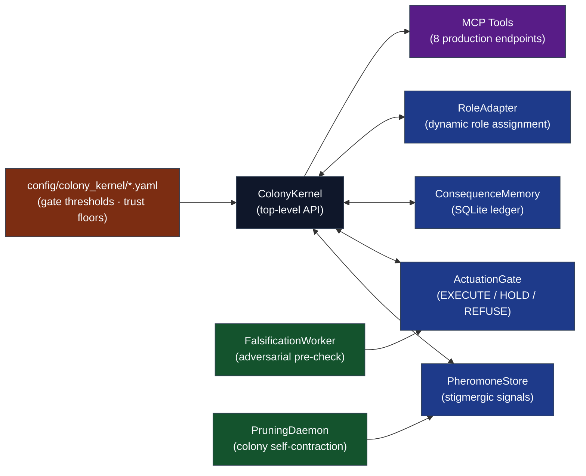

# Codomyrmex — The Artificial Ecology Manuscript

**Version**: v1.3.0 | **Status**: Active | **Last Updated**: July 2026

This manuscript presents **Codomyrmex**, an agentic software-development framework that models the AI agent collective as an artificial ecology: agents accumulate consequence histories, receive deterministic role reassignment, fail under recorded consequence, and may be flagged for pruning under configured pressure signals. The Colony Control Plane comprises eight subsystems (PheromoneStore, ResourceLedger, ActuationGate, ConsequenceMemory, RoleAdapter, PruningDaemon, FalsificationWorker, ColonyKernel) that implement a closed feedback loop in which the colony is designed to become less vulnerable to repeated and context-reset deception after recorded failed actions. Numeric claims are hydrated from generated artifacts at compose time so reviewer-sensitive figures are tied to the artifact that produced them.

## Navigation

- **Agent Guide**: [AGENTS.md](AGENTS.md)
- **Syntax Reference**: [SYNTAX.md](SYNTAX.md)
- **Configuration**: [config.yaml](config.yaml)
- **Colony Kernel Specification**: [../modules/colony_kernel/SPEC.md](../modules/colony_kernel/SPEC.md)

## Manuscript Structure

The `manuscript/` directory contains raw Markdown files rendered by `scripts/compile_manuscript.py` into the final academic PDF and HTML artifacts:

- `00_00_cover.md` — Cover page source; renders cover art, automatic date, ORCID, DOI status, repository, and version metadata.
- `00_01_contents.md` — Generated under `output/manuscript/` by `scripts/compile_manuscript.py`; PDF uses LaTeX `\tableofcontents`, HTML uses `nav#TOC`.
- `00_abstract.md` — Abstract; build variables and CSV-backed prose injected by `z_generate_manuscript_variables.py`.
- `01_introduction.md` — Ecology thesis, Colony Control Plane overview, and gate scoring model introduction.
- `02_methodology.md` — Colony Kernel architecture in full: stigmergic pheromone protocol, trust lifecycle, falsification algorithm, pruning daemon.
- `03_results.md` — Empirical measurements: gate decision distributions, trust score trajectories, pheromone field evolution.
- `04_conclusion.md` — Summary of the colony thesis, architectural commitments, and open falsification criteria.
- `05_experimental_setup.md` — Configuration parameters and colony initialization procedures for reproducing reported experiments.
- `06_reproducibility.md` — Machine-verifiable reproducibility certificate: cryptographic chain of custody from source commit to rendered PDF.
- `07_scope_and_related_work.md` — Scope boundaries, related work, trust-based access control, AI risk-management positioning, threat-informed security positioning, agentic-security benchmark scholarship, assurance-case / external-benchmark positioning, runtime-assurance, provenance, privacy-action, cyber-capability, visibility, and harmful-agent evaluation scholarship.
- `99_references.md` — Minimal bibliography anchor; rendered entries come from `references.bib` through Pandoc citeproc.

The renderer requires `pandoc-crossref` and Pandoc citeproc. Cross-reference labels (`sec`, `fig`, `tbl`, `eq`) are resolved before citations, and citations/cross-references are linked in both PDF and HTML outputs. Citation syntax guidance lives in [SYNTAX.md](SYNTAX.md), not in the rendered paper.

## Architecture

The Colony Control Plane is the centerpiece: a set of eight self-contained subsystems sharing only the `models.py` contract, exposed to external orchestrators through MCP tools.



## Quick Start

```bash
# From repository root

# 1. Hydrate manuscript variables from live build artifacts
uv run python scripts/z_generate_manuscript_variables.py

# 2. Render the cover, generated contents, linked HTML, and final PDF
uv run python scripts/compile_manuscript.py --pdf

# 3. Open the result
open output/paper.pdf
```

## AI Agent Directives

If you are an AI agent operating in this repository, you **MUST** read [`AGENTS.md`](../../AGENTS.md) before executing any code modifications. It defines the zero-mock testing constraints, three-tree mirror invariant, infrastructure coupling rules, and the RASP documentation standard (README, AGENTS, SPEC, PAI) that governs every module.

## See Also

- [`../../AGENTS.md`](../../AGENTS.md) — Full pipeline semantics, validation rules, and troubleshooting index.
- [`../../README.md`](../../README.md) — Project overview, architecture diagram, and contributor links.
- [`../modules/colony_kernel/SPEC.md`](../modules/colony_kernel/SPEC.md) — Colony Kernel formal specification.
- [`config.yaml`](config.yaml) — Manuscript metadata: title, authors, keywords, DOI.
- [`manuscript.css`](manuscript.css) — HTML rendering style, including the red hyperlink contract shared with the PDF preamble.
- [`layer_contract.yaml`](layer_contract.yaml) — Subsystem interface contracts enforced at compose time.
- [`SYNTAX.md`](SYNTAX.md) — Codomyrmex manuscript syntax, labels, generated variables, and rendering conventions.
