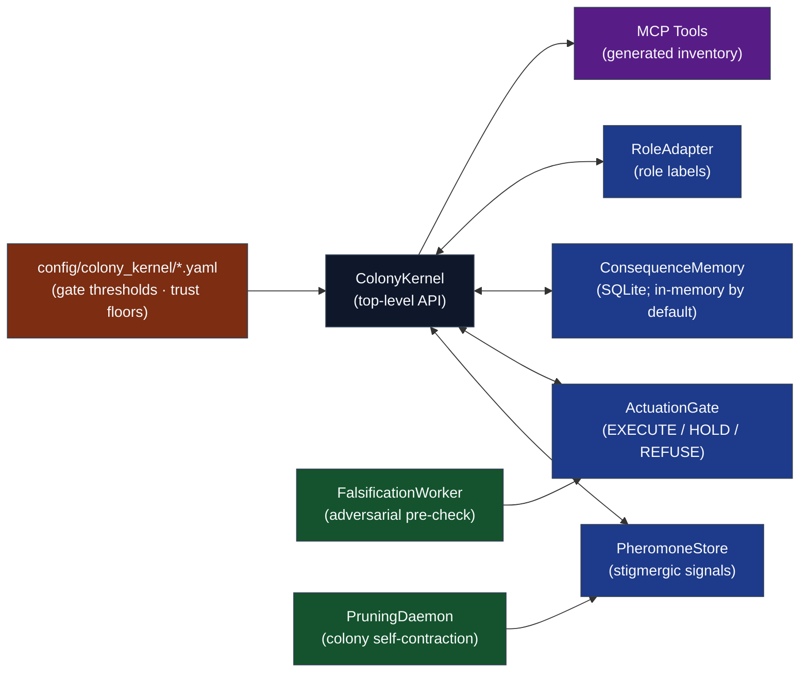

# Codomyrmex — The Artificial Ecology Manuscript

**Status**: Active. Version and publication date are injected from `config.yaml`.

This manuscript presents **Codomyrmex**, an agentic software-development framework that models an AI-agent collective as an artificial ecology. Its Colony Control Plane records caller-reported consequences, maintains a process-local signal field, computes deterministic trust and role labels, nominates pruning candidates, and returns EXECUTE/HOLD/REFUSE advisory gate decisions. The central checked contract is deliberately narrow: reported FAILURE at one location contributes to `max(RISK, FAILURE)`, lowering an otherwise identical same-target proposal while leaving an unrelated target unchanged; policy rejection and prospective falsification remain separate audit/RISK channels. Outcome attestation, complete restart persistence, external effectiveness, and production safety remain open. Numeric claims and generated images are rebuilt from the evaluated snapshot.

## Navigation

- **Agent Guide**: [AGENTS.md](AGENTS.md)
- **Syntax Reference**: [SYNTAX.md](SYNTAX.md)
- **Configuration**: [config.yaml](config.yaml)
- **Colony Kernel Specification**: [../modules/colony_kernel/SPEC.md](../modules/colony_kernel/SPEC.md)

## Manuscript Structure

The `manuscript/` directory contains raw Markdown files rendered by `scripts/compile_manuscript.py` into the final academic PDF and HTML artifacts:

- `00_00_cover.md` — Cover page source; renders cover art, automatic date, ORCID, DOI status, repository, and version metadata.
- `00_01_contents.md` — Generated under `output/manuscript/` by `scripts/compile_manuscript.py`; PDF uses LaTeX `\tableofcontents`, HTML uses `nav#TOC`.
- `00_abstract.md` — Abstract; build variables and CSV-backed prose injected by `z_generate_manuscript_variables.py`.
- `01_introduction.md` — Ecology thesis, Colony Control Plane overview, and gate scoring model introduction.
- `02_methodology.md` — Colony Kernel architecture in full: stigmergic pheromone protocol, trust lifecycle, falsification algorithm, pruning daemon.
- `02_theory.md` — Formal properties of the pheromone field, gate, trust process, privacy boundary, and boundedness results.
- `03_results.md` — Executed quality gates, deterministic paired fixtures, and formula-derived policy behavior; no external benchmark result.
- `04_conclusion.md` — Summary of the colony thesis, architectural commitments, and open falsification criteria.
- `05_experimental_setup.md` — Proposed external evaluation protocol separated from the live release configuration.
- `06_reproducibility.md` — Reproduction commands, generated evidence, and explicit limits of the configuration/artifact chain.
- `07_scope_and_related_work.md` — Bounded positioning against agentic software engineering, stigmergy, computational trust, capability security, runtime assurance, and external benchmarks.
- `08_active_inference.md` — A bounded Active Inference interpretation that distinguishes structural analogy from implemented Bayesian inference.
- `90_appendix_design_rationale.md` — Design decisions, alternatives, trade-offs, and calibration limits.
- `98_acknowledgements.md` — Unnumbered, configuration-injected contributor credit.
- `99_references.md` — Minimal bibliography anchor; rendered entries come from `references.bib` through Pandoc citeproc.

The renderer requires `pandoc-crossref` and Pandoc citeproc. Cross-reference labels (`sec`, `fig`, `tbl`, `eq`) are resolved before citations, and citations/cross-references are linked in both PDF and HTML outputs. Citation syntax guidance lives in [SYNTAX.md](SYNTAX.md), not in the rendered paper.

## Architecture

The Colony Control Plane is the centerpiece: operational components coordinated by `ColonyKernel` and exposed through the generated MCP inventory. The components exchange typed objects from `models.py`; selected modules also call one another through explicit integration paths.



## Quick Start

```bash
# From repository root

# 1. Hydrate manuscript variables from live build artifacts
uv run python scripts/z_generate_manuscript_variables.py

# 2. Generate the provenance-stamped visual assets
uv run python scripts/generate_manuscript_figures.py

# 3. Render linked HTML and the canonical PDF
uv run python scripts/compile_manuscript.py --pdf

# 4. Record commit, gate status, tool versions, and output hashes
uv run python scripts/generate_release_manifest.py \
  --extra-command 'uv run python scripts/compile_manuscript.py --pdf'
```

## AI Agent Directives

If you are an AI agent operating in this repository, you **MUST** read [`AGENTS.md`](../../AGENTS.md) before executing any code modifications. It defines the zero-mock testing constraints, three-tree mirror invariant, infrastructure coupling rules, and the RASP documentation standard (README, AGENTS, SPEC, PAI) that governs every module.

## See Also

- [`../../AGENTS.md`](../../AGENTS.md) — Full pipeline semantics, validation rules, and troubleshooting index.
- [`../../README.md`](../../README.md) — Project overview, architecture diagram, and contributor links.
- [`../modules/colony_kernel/SPEC.md`](../modules/colony_kernel/SPEC.md) — Colony Kernel formal specification.
- [`config.yaml`](config.yaml) — Manuscript metadata: title, authors, keywords, DOI.
- [`manuscript.css`](manuscript.css) — HTML rendering style, including the red hyperlink contract shared with the PDF preamble.
- [`layer_contract.yaml`](layer_contract.yaml) — Subsystem interface contracts enforced at compose time.
- [`SYNTAX.md`](SYNTAX.md) — Codomyrmex manuscript syntax, labels, generated variables, and rendering conventions.
