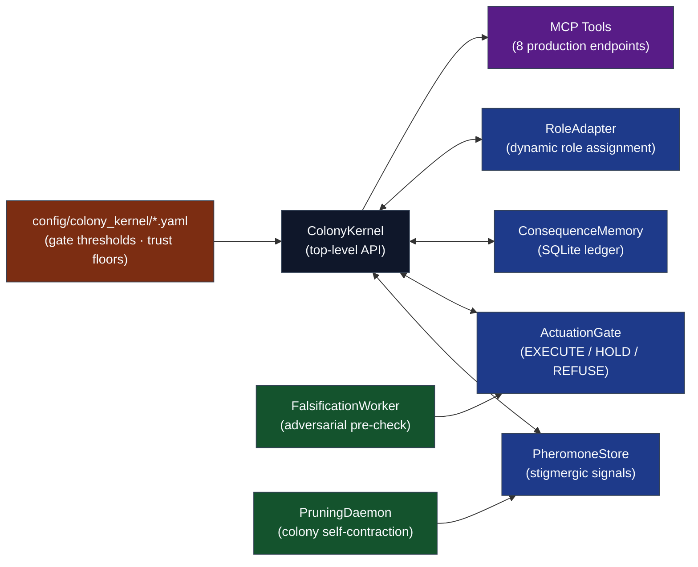

# Codomyrmex — The Artificial Ecology Manuscript

This manuscript presents **Codomyrmex**, an agentic software-development framework that models the AI agent collective as an artificial ecology: agents are not merely orchestrated — they compete, specialize, fail, and are pruned under selection pressure applied by the environment itself. The Colony Control Plane comprises eight subsystems (PheromoneStore, ResourceLedger, ActuationGate, ConsequenceMemory, RoleAdapter, PruningDaemon, FalsificationWorker, ColonyKernel) that implement a closed feedback loop in which the colony becomes structurally harder to deceive after every failed action. All numeric claims are hydrated from generated artifacts at compose time; no figure or statistic can drift from the artifact that produced it.

## Manuscript Structure

The `manuscript/` directory contains raw Markdown files rendered by `infrastructure/rendering/pdf_renderer.py` into the final academic PDF:

- `00_abstract.md` — Abstract; build variables and CSV-backed prose injected by `z_generate_manuscript_variables.py`.
- `01_introduction.md` — Ecology thesis, Colony Control Plane overview, and gate scoring model introduction.
- `02_methodology.md` — Colony Kernel architecture in full: stigmergic pheromone protocol, trust lifecycle, falsification algorithm, pruning daemon.
- `03_results.md` — Empirical measurements: gate decision distributions, trust score trajectories, pheromone field evolution.
- `04_conclusion.md` — Summary of the colony thesis, architectural commitments, and open falsification criteria.
- `05_experimental_setup.md` — Configuration parameters and colony initialization procedures for reproducing reported experiments.
- `06_reproducibility.md` — Machine-verifiable reproducibility certificate: cryptographic chain of custody from source commit to rendered PDF.
- `07_scope_and_related_work.md` — Related work in multi-agent coordination, stigmergy-inspired computing, and trust-based access control.
- `99_references.md` — BibTeX bibliography index and Pandoc citation rendering instructions.

## Architecture

The Colony Control Plane is the centerpiece: a set of eight self-contained subsystems sharing only the `models.py` contract, exposed to external orchestrators through MCP tools.



## Quick Start

```bash
# From repository root (template infrastructure)

# 1. Hydrate manuscript variables from live build artifacts
uv run python scripts/z_generate_manuscript_variables.py

# 2. Render the combined PDF
uv run python scripts/03_render_pdf.py --project codomyrmex

# 3. Open the result
open output/codomyrmex/pdf/codomyrmex_combined.pdf
```

## AI Agent Directives

If you are an AI agent operating in this repository, you **MUST** read [`AGENTS.md`](../../AGENTS.md) before executing any code modifications. It defines the zero-mock testing constraints, three-tree mirror invariant, infrastructure coupling rules, and the RASP documentation standard (README, AGENTS, SPEC, PAI) that governs every module.

## See Also

- [`../../AGENTS.md`](../../AGENTS.md) — Full pipeline semantics, validation rules, and troubleshooting index.
- [`../../README.md`](../../README.md) — Project overview, architecture diagram, and contributor links.
- [`../SPEC.md`](../SPEC.md) — Colony Kernel formal specification.
- [`config.yaml`](config.yaml) — Manuscript metadata: title, authors, keywords, DOI.
- [`layer_contract.yaml`](layer_contract.yaml) — Subsystem interface contracts enforced at compose time.
- [`../../../../docs/guides/manuscript-semantics.md`](../../../../docs/guides/manuscript-semantics.md) — Repository-wide manuscript semantics and rendering conventions.
