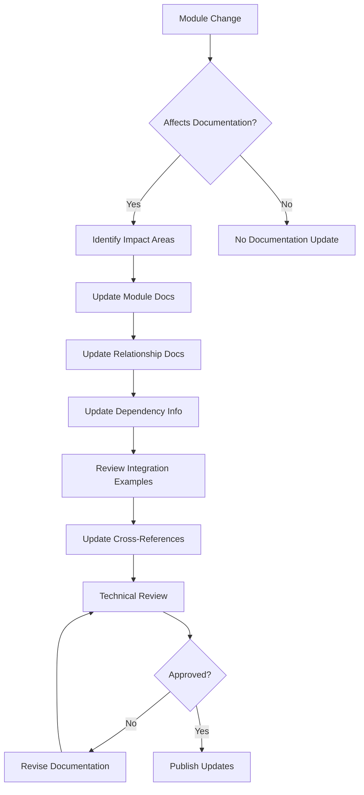

# Codomyrmex Agents — docs/modules

## Signposting
- **Parent**: [Parent](../AGENTS.md)
- **Self**: [Agents](AGENTS.md)
- **Children**:
    - None
- **Key Artifacts**:
    - [Functional Spec](SPEC.md)
    - [Human Readme](README.md)

**Version**: v0.1.0 | **Status**: Active | **Last Updated**: December 2025

## Purpose

Module system documentation and architectural guides for the Codomyrmex repository. This directory contains documentation about Codomyrmex's modular architecture, component relationships, dependencies, and integration patterns.

The docs/modules directory serves as the technical reference for understanding how Codomyrmex modules work together and how to effectively use and extend the platform.

## Module Documentation Structure

### Core Documentation Areas

The module documentation is organized by perspective and purpose:

| Area | Purpose | Key Content | Primary Audience |
|------|---------|-------------|------------------|
| **Overview** | System architecture | Module layers, capabilities, high-level design | New users, architects |
| **Relationships** | Component interactions | Dependencies, data flows, integration patterns | Developers, integrators |
| **Dependencies** | Technical dependencies | Module coupling, import relationships, build dependencies | Maintainers, CI/CD |
| **Specialized** | Specific module docs | Detailed guides for complex modules | Module users, contributors |

### Documentation Types

**System Overview Documentation**
- High-level architecture and design principles
- Module categorization and layering
- Core capabilities and feature sets
- Platform extensibility patterns

**Relationship Documentation**
- Module dependency graphs and coupling analysis
- Data flow patterns between modules
- Integration interfaces and contracts
- Cross-module communication protocols

**Dependency Documentation**
- Technical dependency analysis and visualization
- Import relationship mapping
- Build and runtime dependency management
- Circular dependency detection and resolution

**Specialized Module Documentation**
- Detailed guides for complex modules (Ollama, 3D modeling, etc.)
- Advanced usage patterns and best practices
- Performance optimization guidance
- Troubleshooting and common issues

## Active Components

### System Architecture Documentation
- `overview.md` – Module system architecture, layers, and capabilities
- `README.md` – Module documentation overview and navigation

### Relationship Documentation
- `relationships.md` – Module relationships, dependencies, and interaction patterns
- `dependency-graph.md` – Visual dependency graphs and coupling analysis

### Specialized Documentation
- `ollama_integration.md` – Detailed Ollama integration guide and best practices

## Module System Architecture

```mermaid
graph TD
    A[Codomyrmex Platform] --> B[Foundation Layer]
    A --> C[Core Layer]
    A --> D[Service Layer]
    A --> E[Specialized Layer]

    B --> F[environment_setup]
    B --> G[logging_monitoring]
    B --> H[model_context_protocol]
    B --> I[terminal_interface]

    C --> J[ai_code_editing]
    C --> K[static_analysis]
    C --> L[code_execution_sandbox]
    C --> M[data_visualization]
    C --> N[pattern_matching]
    C --> O[git_operations]
    C --> P[code_review]
    C --> Q[security_audit]

    D --> R[build_synthesis]
    D --> S[documentation]
    D --> T[api_documentation]
    D --> U[ci_cd_automation]
    D --> V[database_management]
    D --> W[containerization]
    D --> X[config_management]
    D --> Y[project_orchestration]

    E --> Z[modeling_3d]
    E --> AA[physical_management]
    E --> BB[system_discovery]
    E --> CC[performance]
    E --> DD[ollama_integration]
    E --> EE[language_models]
    E --> FF[plugin_system]
    E --> GG[events]
    E --> HH[api_standardization]
```



## Operating Contracts

### Universal Module Documentation Protocols

All module documentation must:

1. **Reflect Implementation** - Documentation must accurately represent current module capabilities
2. **Enable Effective Use** - Provide information needed to successfully use modules
3. **Support Integration** - Document integration patterns and best practices
4. **Guide Extension** - Explain how to extend or modify modules
5. **Maintain Consistency** - Follow established documentation patterns and terminology

### Content-Specific Guidelines

#### System Overview Documentation
- Provide clear mental models of the system architecture
- Explain the rationale behind architectural decisions
- Include high-level diagrams and component relationships
- Support both technical and business understanding

#### Relationship Documentation
- Document both explicit and implicit dependencies
- Explain data flow patterns and protocols
- Include integration examples and patterns
- Identify coupling points and integration risks

#### Dependency Documentation
- Provide accurate technical dependency information
- Include build and runtime dependency distinctions
- Document version compatibility requirements
- Support automated dependency analysis

#### Specialized Documentation
- Provide deep technical detail for complex modules
- Include performance characteristics and limitations
- Document configuration options and trade-offs
- Provide troubleshooting guides and known issues

## Module Documentation Maintenance

### Update Triggers

Module documentation must be updated when:
- Module interfaces or capabilities change
- New integration patterns are established
- Dependencies or compatibility requirements change
- Performance characteristics or limitations evolve
- New modules are added or existing ones modified

### Quality Assurance

- **Implementation Verification** - Documentation accuracy against current codebase
- **Integration Testing** - Examples work with documented integration patterns
- **Dependency Validation** - Dependency information remains current and accurate
- **Cross-Reference Checks** - All module references and links are functional

## Module Development Workflow



## Navigation
- **Human Documentation**: [README.md](README.md)
- **Functional Specification**: [SPEC.md](SPEC.md)

### For New Users
- **System Overview**: [overview.md](overview.md) - Understanding the module system
- **Getting Started**: [relationships.md](relationships.md) - How modules work together

### For Developers
- **Module Integration**: [relationships.md](relationships.md) - Integration patterns and dependencies
- **Dependency Management**: [dependency-graph.md](dependency-graph.md) - Technical dependency information

### For Contributors
- **Module Architecture**: [overview.md](overview.md) - System design and extension points
- **Integration Patterns**: [relationships.md](relationships.md) - Best practices for module integration

### For Specialized Modules
- **Ollama Integration**: [ollama_integration.md](ollama_integration.md) - Advanced Ollama usage guide

## Agent Coordination

### Module Documentation Synchronization

When modules change and affect documentation:

1. **Capability Updates** - Modify overview and capability documentation
2. **Relationship Updates** - Update dependency and relationship documentation
3. **Integration Updates** - Modify integration examples and patterns
4. **Reference Updates** - Update cross-references and navigation links

### Quality Gates

Before publishing module documentation changes:

1. **Technical Accuracy** - All technical details verified against implementation
2. **Completeness** - All module capabilities and relationships documented
3. **Consistency** - Documentation follows established patterns and terminology
4. **Integration Verification** - Documented integration patterns work correctly
5. **Cross-Reference Validation** - All references and links are functional

## Module Documentation Metrics

### Quality Metrics
- **Accuracy Rate** - Percentage of documentation that correctly reflects module capabilities
- **Completeness Score** - Coverage of module features, relationships, and dependencies
- **Freshness** - How current documentation remains relative to code changes
- **Usability** - Effectiveness in helping users understand and use modules

### Integration Metrics
- **Dependency Accuracy** - Correctness of dependency information and graphs
- **Integration Success** - Percentage of documented integration patterns that work
- **Cross-Module Compatibility** - Compatibility of modules as documented
- **Extension Support** - Effectiveness of documentation for module extension

## Module Analysis Framework

### Dependency Analysis

The module system supports automated dependency analysis:

```python
# Example dependency analysis structure
module_dependencies = {
    "module_name": {
        "direct_dependencies": ["list", "of", "modules"],
        "indirect_dependencies": ["transitive", "dependencies"],
        "coupling_level": "loose|medium|tight",
        "integration_patterns": ["event_driven", "direct_call", "data_flow"],
        "version_compatibility": "semantic_versioning_rules"
    }
}
```

### Integration Pattern Documentation

Standard integration patterns are documented with:

```markdown
## Integration Pattern: [Pattern Name]

### Description
[What this pattern accomplishes and when to use it]

### Participants
- **Primary Module**: [Module initiating the integration]
- **Secondary Modules**: [Modules being integrated with]
- **Data Flow**: [How data moves between modules]

### Implementation
[Code examples and configuration]

### Benefits
[Advantages of this integration approach]

### Considerations
[Limitations, performance implications, alternatives]
```

## Version History

- **v0.1.0** (December 2025) - Initial module documentation system with overview, relationships, dependencies, and specialized guides

## Related Documentation

- **[Architecture Overview](../project/architecture.md)** - Overall system architecture
- **[API Reference](../reference/api.md)** - Module API documentation
- **[Contributing Guide](../project/contributing.md)** - Module development guidelines
- **[Testing Strategy](../development/testing-strategy.md)** - Module testing approaches