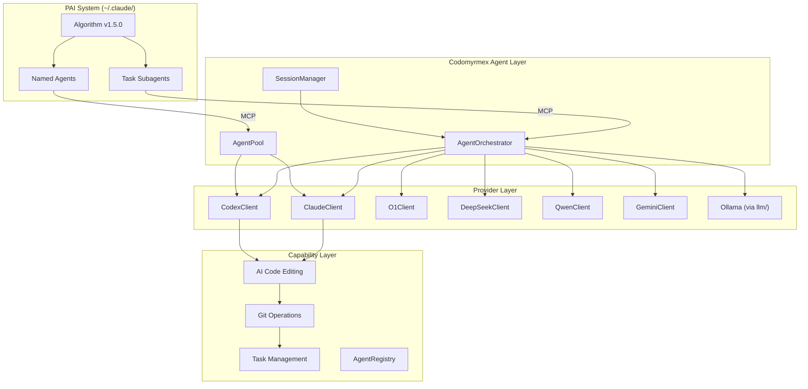

# Personal AI Infrastructure — Agents Module

**Version**: v1.0.0 | **Status**: Active | **Last Updated**: February 2026

## Overview

The Agents module is central to Codomyrmex's Personal AI Infrastructure. It provides the framework for integrating, coordinating, and orchestrating AI agents across multiple providers for code editing, task automation, and intelligent development workflows.

## PAI Capabilities

### Multi-Provider AI Integration

Support for multiple AI providers with consistent interfaces:

| Provider | Client | Type | PAI Use Case |
| :--- | :--- | :--- | :--- |
| Claude | `ClaudeClient` | API | Code review, generation, explanation |
| Codex | `CodexClient` | API | Code completion, transformation |
| O1 | `O1Client` | API | Complex reasoning, chain-of-thought |
| DeepSeek | `DeepSeekClient` | API | Cost-effective code generation |
| Qwen | `QwenClient` | API | Multilingual code tasks |
| Gemini | `GeminiClient` | CLI | Multi-modal code analysis |
| Ollama | via `llm/` | Local | Private local AI processing |

### AI Code Editing

The `ai_code_editing/` submodule provides:

```python
from codomyrmex.agents import CodeEditor

editor = CodeEditor()

# AI-powered refactoring
refactored = editor.refactor(
    code=original_code,
    instruction="Add comprehensive error handling"
)

# AI code review
review = editor.review(code, focus=["security", "performance"])

# AI code generation
generated = editor.generate(
    specification="REST API endpoint for user registration",
    context=existing_codebase
)
```

### Agent Orchestration

Coordinate multiple agents for complex tasks:

```python
from codomyrmex.agents import AgentOrchestrator, ClaudeClient, CodeEditor

orchestrator = AgentOrchestrator()

# Register specialized agents
orchestrator.register("reviewer", ClaudeClient(model="claude-3-opus"))
orchestrator.register("editor", CodeEditor())

# Define multi-agent workflow
workflow = orchestrator.create_workflow([
    {"agent": "reviewer", "action": "analyze"},
    {"agent": "editor", "action": "apply_suggestions"},
    {"agent": "reviewer", "action": "verify_changes"}
])

result = await orchestrator.execute(workflow, code=input_code)
```

### Session Management

Maintain context across AI interactions:

```python
from codomyrmex.agents import AgentSession, SessionManager

# Create persistent session
session = AgentSession(
    agent="claude",
    context={"project": "codomyrmex", "task": "refactoring"}
)

# Session persists across multiple interactions
session.send("Review this function")
session.send("Now optimize it for performance")
session.send("Add unit tests for the optimized version")

# Session manager for multiple concurrent sessions
manager = SessionManager()
manager.create("code_review_session")
manager.create("documentation_session")
```

## PAI Agent System Integration

When codomyrmex is used with the [PAI system](../../../PAI.md) (`~/.claude/skills/PAI/`), the agents module maps directly to PAI's three-tier agent architecture.

### Three-Tier Agent Mapping

PAI defines three tiers of agents. Each tier maps to codomyrmex components:

| PAI Tier | PAI Agents | Codomyrmex Mapping |
|----------|-----------|-------------------|
| **Task Subagents** | `Engineer`, `Architect`, `QATester`, `Designer`, `Pentester`, `Algorithm` | `AgentOrchestrator` dispatches to provider clients based on capability needs |
| **Named Agents** | Serena, Marcus, Remy, Johannes (personality + voice + specialty) | Consume codomyrmex tools via MCP; use `CodeEditor`, `AgentPool`, provider clients |
| **Custom Agents** | `ComposeAgent` (dynamic composition) | `BaseAgent` / `AgentIntegrationAdapter` base classes for custom implementations |

### Task Subagent → Codomyrmex Provider

Each PAI subagent type maps to specific codomyrmex capabilities:

| PAI Subagent | Primary Codomyrmex Modules | What It Uses |
|-------------|---------------------------|-------------|
| **Engineer** | `agents/ai_code_editing/`, `coding/`, `static_analysis/` | `CodeEditor.refactor()`, `CodeEditor.generate()`, sandbox execution |
| **Architect** | `agents/theory/`, `cerebrum/`, `pattern_matching/` | `DeliberativeArchitecture`, case-based reasoning, pattern analysis |
| **QATester** | `static_analysis/`, `security/`, `coding/` | `SecurityScanner.scan()`, test runners, browser automation |
| **Designer** | `agents/ai_code_editing/`, `ide/` | Component generation, UI code editing |
| **Pentester** | `security/`, `static_analysis/`, `encryption/` | Vulnerability scanning, security analysis |
| **Explore** | `documents/`, `search/`, `pattern_matching/` | File discovery, content search, pattern recognition |
| **Research** (GeminiResearcher, ClaudeResearcher, GrokResearcher) | `documents/`, `graph_rag/`, `search/` | Document processing, graph RAG, knowledge retrieval |

### Named Agents and MCP

PAI's named agents (e.g., Serena for research, Marcus for engineering) operate in Claude Code sessions and access codomyrmex through the MCP bridge:

```
Named Agent (PAI)  →  MCP Client  →  Codomyrmex MCP Server  →  Module Tools
    │                                                              │
    │  "Analyze this codebase"                                     │
    └──────────────────────────────────────────────────────────────→│
       calls: analyze_code, search_files, list_modules             │
    ←──────────────────────────────────────────────────────────────←┘
       returns: analysis results, file matches, module status
```

See [model_context_protocol/PAI.md](../model_context_protocol/PAI.md) for MCP bridge details.

## Algorithm Capability Selection

The PAI Algorithm's THINK phase selects which capabilities (agents, skills, tools) to use. This selection directly determines which codomyrmex modules get invoked.

### Two-Pass Selection

| Pass | Source | Authority |
|------|--------|-----------|
| **Pass 1: Hook Hints** | `FormatReminder` hook analyzes raw prompt | Draft suggestions |
| **Pass 2: THINK Validation** | Algorithm validates against ISC criteria | **Authoritative** |

Pass 2 can override Pass 1 based on what OBSERVE discovered. For example:

- Hook suggests `Engineer` → ISC reveals architecture decision needed → **add** `Architect`
- Hook suggests nothing → ISC requires browser verification → **add** `QATester`

### Composition Patterns

PAI composes capabilities using named patterns. These map to codomyrmex orchestration:

| PAI Pattern | Shape | Codomyrmex Implementation |
|-------------|-------|--------------------------|
| **Pipeline** | A → B → C | `WorkflowEngine` with DAG dependencies |
| **TDD Loop** | A ↔ B | `AgentOrchestrator` review-fix cycle |
| **Fan-out** | → [A, B, C] | `AgentPool` parallel dispatch |
| **Fan-in** | [A, B, C] → D | `AgentPool` + result aggregation |
| **Gate** | A → check → B or retry | `WorkflowEngine` conditional branching |
| **Escalation** | haiku → sonnet → opus | Provider client model upgrade |
| **Specialist** | Single A | Direct provider client call |

### Algorithm Phase → Agent Activity

| Phase | Agent Activity | Codomyrmex Module |
|-------|---------------|-------------------|
| **OBSERVE** | Explore agent reads codebase, searches patterns | `system_discovery`, `pattern_matching`, `search` |
| **THINK** | Capability selection, ISC expansion | `cerebrum` (reasoning), `agents/theory/` |
| **PLAN** | Workflow definition | `orchestrator` (DAG construction) |
| **BUILD** | Engineer/Designer creates artifacts | `agents/ai_code_editing/`, `coding` |
| **EXECUTE** | Selected agents run work in parallel | `agents/` (all providers), `AgentPool` |
| **VERIFY** | QATester validates against ISC | `static_analysis`, `security`, test runners |
| **LEARN** | Memory capture | `agentic_memory`, `logging_monitoring` |

## PAI Architecture



## PAI Configuration

### Environment Configuration

```bash
# API Keys (optional - only for cloud providers)
export ANTHROPIC_API_KEY="sk-..."
export OPENAI_API_KEY="sk-..."   # for Codex and O1
export DEEPSEEK_API_KEY="sk-..."
export DASHSCOPE_API_KEY="sk-..." # for Qwen

# Default provider (local-first)
export CODOMYRMEX_DEFAULT_AGENT="ollama"

# Session settings
export CODOMYRMEX_SESSION_TIMEOUT=3600
export CODOMYRMEX_MAX_SESSIONS=10
```

### Agent Configuration

```python
from codomyrmex.agents import AgentConfig

config = AgentConfig(
    provider="claude",
    model="claude-3-sonnet",
    temperature=0.7,
    max_tokens=4096,
    system_prompt="You are a code review assistant.",
    tools=["file_read", "file_edit", "search"]
)
```

## PAI Best Practices

### 1. Local-First Development

```python
# Default to local models for development
config = AgentConfig(
    provider="ollama",
    model="codellama:13b",
    fallback_provider="claude"  # Fall back if local unavailable
)
```

### 2. Audit AI Actions

```python
from codomyrmex.agents import AgentOrchestrator
from codomyrmex.logging_monitoring import get_logger

logger = get_logger("pai.agents")

orchestrator = AgentOrchestrator(audit_log=True)

# All AI actions are logged
orchestrator.on_action(lambda action:
    logger.info("AI action", action=action.type, agent=action.agent)
)
```

### 3. Review AI Outputs

```python
# Always review AI-generated code
result = editor.generate(spec)

# Automatic security scan
from codomyrmex.security import SecurityScanner
scanner = SecurityScanner()
scan_result = scanner.scan(result.code)

if scan_result.has_vulnerabilities:
    logger.warning("AI generated code with vulnerabilities",
                   issues=scan_result.issues)
```

## Signposting

### Navigation

- **Self**: [PAI.md](PAI.md)
- **Parent**: [../PAI.md](../PAI.md) — Source PAI documentation
- **Root Bridge**: [../../../PAI.md](../../../PAI.md) — Authoritative PAI system bridge doc

### Related Documentation

- [README.md](README.md) — Module overview
- [AGENTS.md](AGENTS.md) — Agent coordination
- [AI Code Editing](ai_code_editing/README.md) — Code editing details
- [MCP Bridge](../model_context_protocol/PAI.md) — MCP integration with PAI
- [../llm/PAI.md](../llm/PAI.md) — LLM PAI features
- [Connecting Tutorial](../../../docs/getting-started/tutorials/connecting-pai.md) — Step-by-step PAI setup
