# The Algorithm (v0.2.25)

The Algorithm is the core execution protocol for all PAI interactions. It ensures every response follows a structured path from observation to verified learning, producing consistently optimal outputs.

**Upstream**: [Personal AI Infrastructure](https://github.com/danielmiessler/Personal_AI_Infrastructure) | **Version**: v0.2.25
**Codomyrmex Constant**: [`ALGORITHM_PHASES`](../../../src/codomyrmex/agents/pai/pai_bridge.py) (L181-189)

---

## The One Rule

> The first token of every PAI response must be `🤖`. This signal ensures the Algorithm is being followed.

This is the compliance anchor. If a response doesn't begin with this token, the Algorithm is not active. Codomyrmex enforces this in agent context injection through the `PAI_PRINCIPLES` constant.

---

## The Seven Phases

Every non-trivial PAI interaction proceeds through seven sequential phases. Codomyrmex tools are mapped to each phase via [`get_skill_manifest().algorithm_mapping`](../../../src/codomyrmex/agents/pai/mcp_bridge.py) (L934-942):

```mermaid
graph LR
    O["1. OBSERVE<br/>🔍")
    T["2. THINK<br/>🧠"]
    P["3. PLAN<br/>📋"]
    B["4. BUILD<br/>🔨"]
    E["5. EXECUTE<br/>⚡"]
    V["6. VERIFY<br/>✅"]
    L["7. LEARN<br/>📖"]

    O --> T --> P --> B --> E --> V --> L
    L -.->|"Feedback loop"| O
```

### Phase Details

| Phase | Name | Purpose | ISC Role | Codomyrmex Tools |
|:---:|:---|:---|:---|:---|
| 1/7 | **OBSERVE** | Reverse-engineer user intent. Create **ISC** (Ideal State Criteria) | Define success | `list_modules`, `module_info`, `list_directory` |
| 2/7 | **THINK** | Thinking Tools assessment, Skill Check, Capability Selection | Evaluate approach | `analyze_python`, `search_codebase` |
| 3/7 | **PLAN** | Finalize the technical approach | Map to ISC | `read_file`, `json_query` |
| 4/7 | **BUILD** | Create artifacts and prepare logic | Produce code | `write_file` |
| 5/7 | **EXECUTE** | Run the work (parallel where possible) | Act on plan | `run_command`, `run_tests` |
| 6/7 | **VERIFY** | Evidence-based verification against ISC | Prove success | `git_status`, `git_diff`, `checksum_file` |
| 7/7 | **LEARN** | Capture insights for future improvement | Persist knowledge | `pai_awareness`, `pai_status` |

---

## Response Depth Levels

Not every interaction requires the full seven phases. The Algorithm defines three depth levels:


| Depth | When | Format | Codomyrmex Constant |
|:---|:---|:---|:---|
| **FULL** | Non-trivial problem solving, design, implementation | All 7 phases (Observe → Learn) | `RESPONSE_DEPTH_LEVELS[0]` |
| **ITERATION** | Adjusting work in progress | Condensed: Change + Verify | `RESPONSE_DEPTH_LEVELS[1]` |
| **MINIMAL** | Pure social (greetings, ratings) | Summary + Voice | `RESPONSE_DEPTH_LEVELS[2]` |

**Codomyrmex Source**: [`RESPONSE_DEPTH_LEVELS`](../../../src/codomyrmex/agents/pai/pai_bridge.py) (L191-195)

### Depth Classification via Hooks

PAI uses the `FormatReminder` hook to automatically classify response depth by running inference on the raw prompt. This is the first pass of the **Two-Pass Capability Selection** protocol:

1. **Pass 1 (Hook Hints)**: `FormatReminder` suggests initial capabilities and depth level
2. **Pass 2 (THINK Validation)**: The agent validates hints against the ISC. Pass 2 is authoritative

---

## Key Principles in The Algorithm

### 1. Parallel-by-Default

Independent tasks (no data dependencies) **must be launched concurrently**. Serial execution of independent tasks is considered a failure. **Fan-out** is the default pattern for 3+ independent workstreams.

**Codomyrmex Implementation**: The `ClaudeClient.execute_with_tools()` method supports multi-tool execution rounds, and the MCPBridge enables parallel tool calls through independent handlers.

### 2. Two-Pass Capability Selection

Ensures tools are selected intelligently, not reflexively:


### 3. Thinking Tools (Justify-Exclusion)

Thinking tools (Council, RedTeam, FirstPrinciples, etc.) are **opt-OUT**, not opt-in. The agent must justify why a thinking tool is NOT being used — the **Justify-Exclusion Principle**.

### 4. Mandatory Structured Interaction

All questions to the user must use the `AskUserQuestion` tool to ensure structured, trackable interactions. This maps to Codomyrmex's structured agent request/response pattern via `AgentRequest` and `AgentResponse`.

---

## ISC (Ideal State Criteria)

The ISC is the foundation of every FULL-depth Algorithm execution. Created in the OBSERVE phase, it defines:

- **What success looks like** (measurable outcomes)
- **What evidence proves success** (verification criteria)
- **What constraints apply** (boundaries, resources)

In VERIFY (phase 6), every ISC criterion must be evidenced. This is why Algorithm-mapped Codomyrmex tools include `git_diff`, `checksum_file`, and `run_tests` — they provide **machine-verifiable evidence**.

---

## Dynamic Skill.md Assembly

The Algorithm itself is dynamically assembled from components, not a static file. The `CreateDynamicCore.ts` tool in `PAI/Tools/`:


**Variables resolved**: `{DAIDENTITY.NAME}`, `{DAIDENTITY.FULLNAME}`, `{PRINCIPAL.NAME}`, `{PRINCIPAL.TIMEZONE}`

**Codomyrmex Discovery**: `PAIBridge.get_algorithm_version()` ([L314-329](../../../src/codomyrmex/agents/pai/pai_bridge.py)) parses the version from the assembled `SKILL.md`.

---

## Codomyrmex Algorithm Integration Summary

```mermaid
graph TD
    subgraph Sources["Upstream PAI"]
        PHASES["ALGORITHM_PHASES<br/>(7 phases)"]
        DEPTHS["RESPONSE_DEPTH_LEVELS<br/>(3 levels)"]
        PRINCIPLES["PAI_PRINCIPLES<br/>(16 principles)"]
    end

    subgraph Bridge["Codomyrmex Bridge"]
        CONST["Constants in pai_bridge.py"]
        MANIFEST["get_skill_manifest()<br/>algorithm_mapping"]
        TRUST["TrustGateway"]
    end

    subgraph Execution["Runtime"]
        CLAUDE["ClaudeClient<br/>(execute → execute_with_tools)"]
        ADAPTER["ClaudeIntegrationAdapter<br/>(phase-specific methods)"]
    end

    PHASES --> CONST
    DEPTHS --> CONST
    PRINCIPLES --> CONST
    CONST --> MANIFEST
    MANIFEST --> CLAUDE
    TRUST -->|"Security gates<br/>BUILD + EXECUTE phases"| CLAUDE
    CLAUDE --> ADAPTER
```



## Related Documents

- [Architecture: Algorithm Mapping](ARCHITECTURE.md#algorithm-mapping)
- [Flows: Complete Tool Execution Lifecycle](FLOWS.md#1-complete-tool-execution-lifecycle)
- [Signposts: Algorithm Constants](SIGNPOSTS.md#pai_bridgepy)
