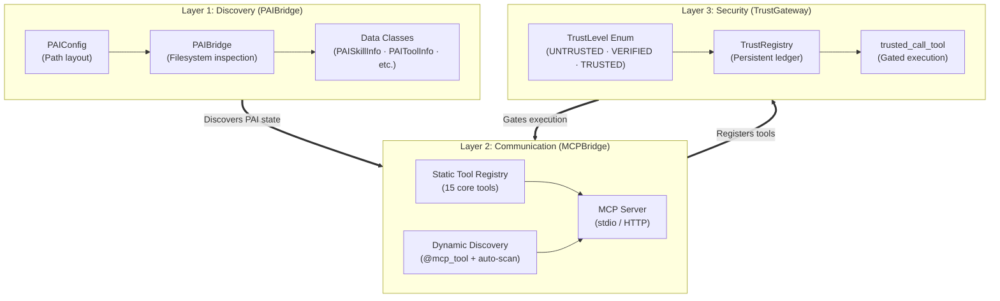
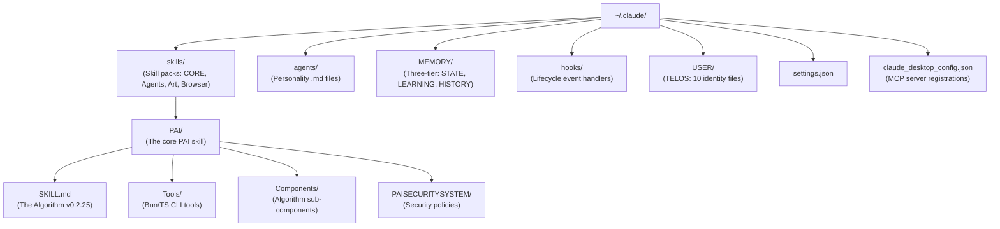
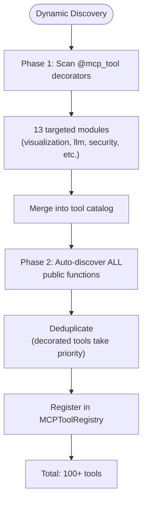
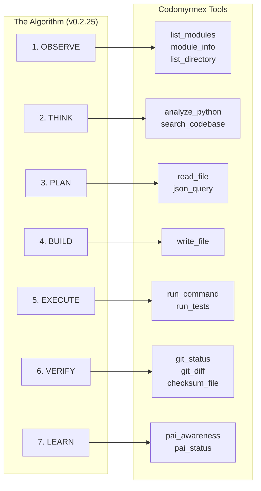
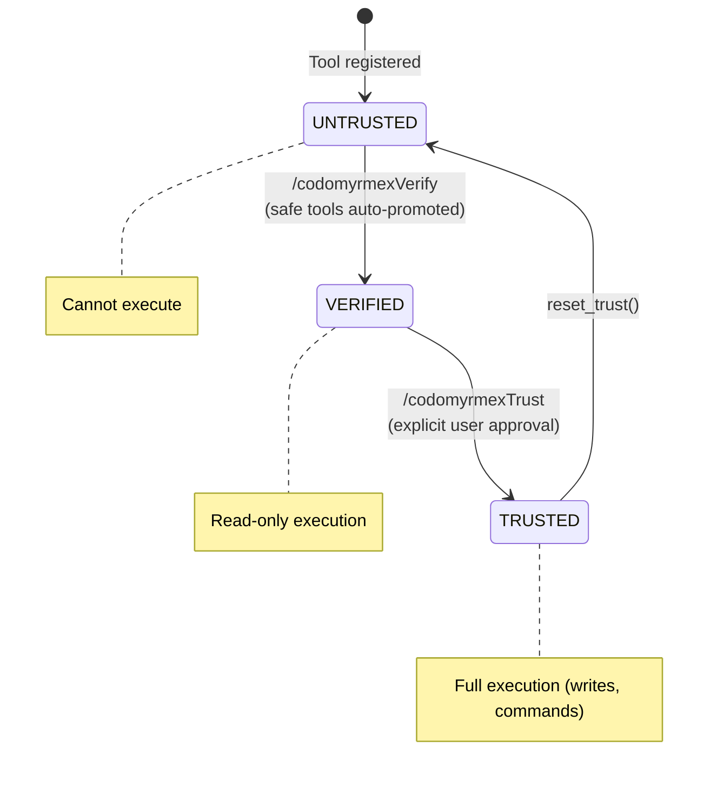
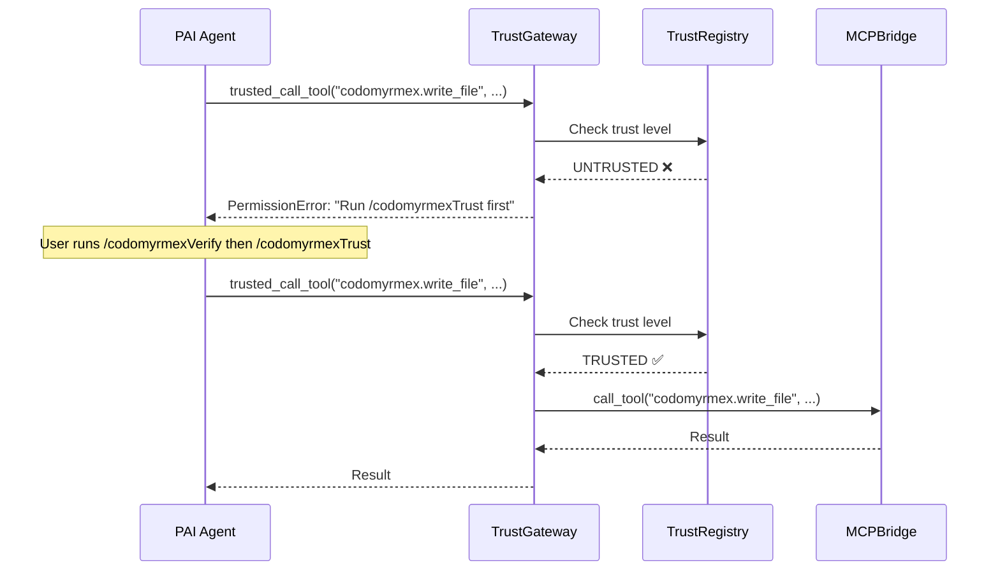
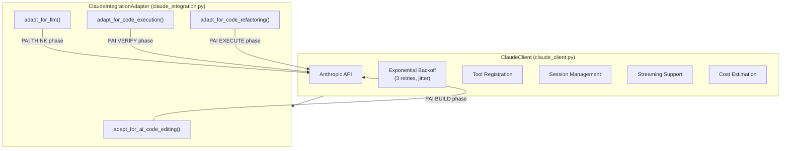

# PAI Architecture Deep Dive

This document provides a rigorous technical exploration of how Codomyrmex implements the bidirectional bridge with [Daniel Miessler's PAI](https://github.com/danielmiessler/Personal_AI_Infrastructure).

---

## Three-Layer Architecture

The integration is composed of three distinct layers, each with a clear responsibility:

---

## Layer 1: PAIBridge (Discovery)

**Source**: [pai_bridge.py](../../../src/codomyrmex/agents/pai/pai_bridge.py)

The PAIBridge treats the **filesystem as the single source of truth**. It performs zero network calls — every discovery operation is a real `Path.is_file()` / `Path.iterdir()` call against the user's local `~/.claude/` directory.

### PAIConfig: The Path Layout

The `PAIConfig` dataclass ([L49-127](../../../src/codomyrmex/agents/pai/pai_bridge.py)) defines the entire PAI filesystem topology:

### What PAIBridge Discovers

| Method | PAI Upstream Concept | What It Returns |
|:---|:---|:---|
| `is_installed()` | PAI presence check | `bool` — does `SKILL.md` exist? |
| `get_status()` | Full system inventory | Dict with all components and settings |
| `get_algorithm_version()` | The Algorithm version | Parses version from `SKILL.md` (e.g., `"v0.2.25"`) |
| `get_algorithm_phases()` | 7-phase protocol | `OBSERVE → THINK → PLAN → BUILD → EXECUTE → VERIFY → LEARN` |
| `get_principles()` | 16 PAI Principles | From User Centricity to Permission to Fail |
| `list_skills()` | Skill System | All subdirectories of `~/.claude/skills/` with `SKILL.md` |
| `list_tools()` | PAI Tools | All `.ts` files in `PAI/Tools/` |
| `list_hooks()` | Hook System | All `.hook.*` files, with archived flag |
| `list_agents()` | Agent Personalities | All `.md` files in `~/.claude/agents/` |
| `list_memory_stores()` | Memory System | All subdirectories of `MEMORY/` with item counts |
| `get_telos_files()` | TELOS (Deep Goal Understanding) | 10 identity files: MISSION, GOALS, BELIEFS, etc. |
| `get_security_config()` | Security System | Policy files and patterns from `PAISECURITYSYSTEM/` |
| `get_pai_env()` | Environment variables | `PAI_DIR`, `PAI_CONFIG_DIR`, etc. |
| `has_codomyrmex_mcp()` | MCP registration | Checks if Codomyrmex is registered in Desktop config |

---

## Layer 2: MCPBridge (Communication)

**Source**: [mcp_bridge.py](../../../src/codomyrmex/agents/pai/mcp_bridge.py)

This layer transforms Codomyrmex from a Python library into a **remotely-callable service** that any PAI agent can use.

### Static Core Tools (15)

These are hardcoded in `_TOOL_DEFINITIONS` ([L275-512](../../../src/codomyrmex/agents/pai/mcp_bridge.py)):

| Tool Name | Category | Description |
|:---|:---|:---|
| `codomyrmex.read_file` | File I/O | Read file contents with metadata |
| `codomyrmex.write_file` | File I/O | Write content to a file |
| `codomyrmex.list_directory` | File I/O | List directory contents with filtering |
| `codomyrmex.analyze_python` | Code Analysis | Analyze Python file structure and metrics |
| `codomyrmex.search_codebase` | Code Analysis | Regex search across code files |
| `codomyrmex.git_status` | Git | Repository status |
| `codomyrmex.git_diff` | Git | Staged/unstaged diff |
| `codomyrmex.run_command` | Shell | Safe shell command execution |
| `codomyrmex.json_query` | Data | JSON file query via dot-notation |
| `codomyrmex.checksum_file` | Data | File checksum (md5/sha1/sha256) |
| `codomyrmex.list_modules` | Discovery | All available Codomyrmex modules |
| `codomyrmex.module_info` | Discovery | Module docstring, exports, path |
| `codomyrmex.pai_status` | PAI | PAI installation status and components |
| `codomyrmex.pai_awareness` | PAI | Missions, projects, tasks, TELOS, memory |
| `codomyrmex.run_tests` | Testing | Run pytest for a module or whole project |

### Universal Module Proxy (3 meta-tools)

These three tools give PAI agents **unlimited access** to every public function in every Codomyrmex module:

| Tool | Purpose |
|:---|:---|
| `codomyrmex.list_module_functions` | Introspect any module's public API |
| `codomyrmex.call_module_function` | Call any public function by path |
| `codomyrmex.get_module_readme` | Read any module's README/SPEC |

### Dynamic Discovery Engine

The `_discover_dynamic_tools()` function ([L637-684](../../../src/codomyrmex/agents/pai/mcp_bridge.py)) performs two-phase scanning:

### Algorithm Mapping

The `get_skill_manifest()` function ([L836-993](../../../src/codomyrmex/agents/pai/mcp_bridge.py)) maps Codomyrmex tools to PAI Algorithm phases:

### MCP Resources and Prompts

**Resources** (2): `codomyrmex://modules` and `codomyrmex://status` — live data feeds for agent context.

**Prompts** (10): Pre-built prompt templates including `codomyrmex.analyze_module`, `codomyrmex.debug_issue`, `codomyrmex.create_test`, and all 7 `/codomyrmex*` workflow prompts.

---

## Layer 3: TrustGateway (Security)

**Source**: [trust_gateway.py](../../../src/codomyrmex/agents/pai/trust_gateway.py)

This layer implements PAI's **Security System** principle: commands are validated before execution.

### Three-Tier Trust Model

### How Trust Enforcement Works

### Destructive Tool Detection

The gateway uses **two strategies** to identify destructive tools:

1. **Explicit set**: `DESTRUCTIVE_TOOLS` frozenset (write_file, run_command, run_tests, call_module_function)
2. **Pattern matching**: For auto-discovered tools, function names containing `write`, `delete`, `execute`, `kill`, `destroy`, etc. are flagged

### Persistent Trust Ledger

Trust state is persisted to `~/.codomyrmex/trust_ledger.json`, surviving process restarts. The `TrustRegistry` singleton reloads state on every query to support multi-process coordination.

---

## Claude Integration Layer

**Source**: [claude_client.py](../../../src/codomyrmex/agents/claude/claude_client.py) + [claude_integration.py](../../../src/codomyrmex/agents/claude/claude_integration.py)

The Claude layer is **not part of PAI itself** but is PAI's primary **execution engine** within Codomyrmex. It implements PAI's Algorithm phases in code:

### Key Methods

| Method | PAI Phase | Purpose |
|:---|:---|:---|
| `execute()` | All | Core API call with retry logic |
| `execute_with_session()` | THINK/PLAN | Multi-turn conversations with history |
| `execute_with_tools()` | EXECUTE | Automatic tool execution loop (max 10 rounds) |
| `register_tool()` | PLAN | Register function calling tools |
| `edit_file()` | BUILD | AI-guided file editing |
| `adapt_for_ai_code_editing()` | BUILD | Code generation with language-specific prompting |
| `adapt_for_llm()` | THINK | OpenAI-compatible message format |
| `adapt_for_code_execution()` | VERIFY | Security/bug/performance analysis |

---

## Knowledge Scope

The `get_skill_manifest()` function categorizes all 100+ Codomyrmex modules into knowledge domains that PAI agents can navigate:

| Domain | Module Count | Examples |
|:---|:---:|:---|
| Core Infrastructure | 11 | logging, config, events, exceptions, utils |
| AI & Agents | 12 | agents, llm, MCP, orchestrator, prompt engineering |
| Code & Analysis | 10 | coding, static analysis, tree-sitter, git, testing |
| Data & Processing | 12 | database, vector store, cache, graph RAG, search |
| Security & Identity | 8 | security, auth, encryption, privacy, defense |
| Infrastructure & Ops | 15 | cloud, containerization, CI/CD, telemetry, metrics |
| UI & Interface | 11 | CLI, website, terminal, IDE, visualization, audio |
| Domain & Simulation | 14 | bio_simulation, finance, logistics, spatial, quantum |
| System & Meta | 10 | system discovery, plugin system, skills, tools, API |

---

## Related Documents

- [Algorithm: Phase-to-Tool Mapping](ALGORITHM.md#the-seven-phases)
- [Skills: Codomyrmex as a PAI Skill](SKILLS.md#codomyrmex-as-a-pai-skill)
- [TELOS: Granular Customization Layers](TELOS.md#the-granular-customization-layers)
- [Hooks: Security Hooks and Trust](HOOKS.md#security-hooks-and-the-trust-bridge)
- [Workflows: Workflow Execution Through MCP](WORKFLOWS.md#codomyrmex-workflow-integration)
- [Flows: Operational Sequence Diagrams](FLOWS.md)
- [Signposts: Line-Level Code Pointers](SIGNPOSTS.md)
