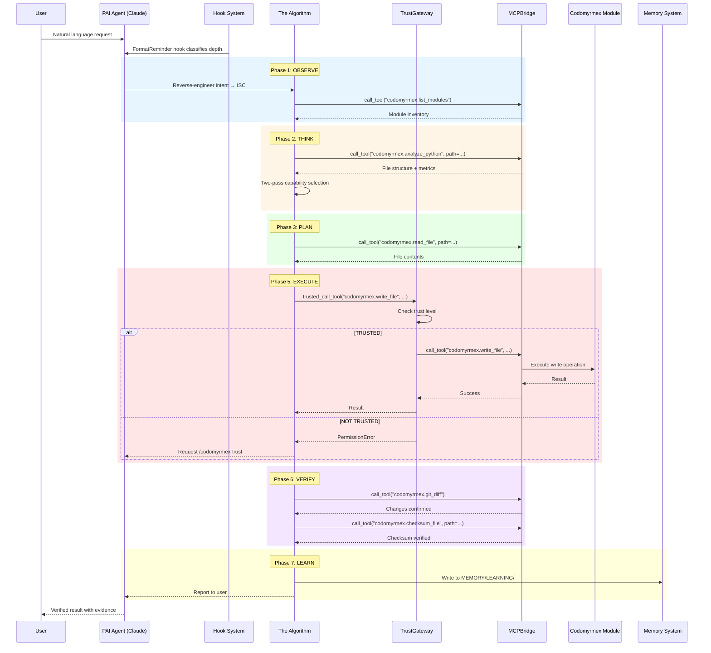
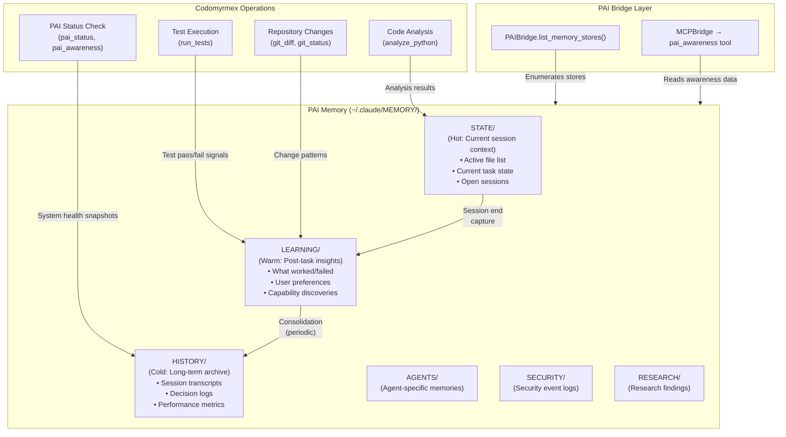
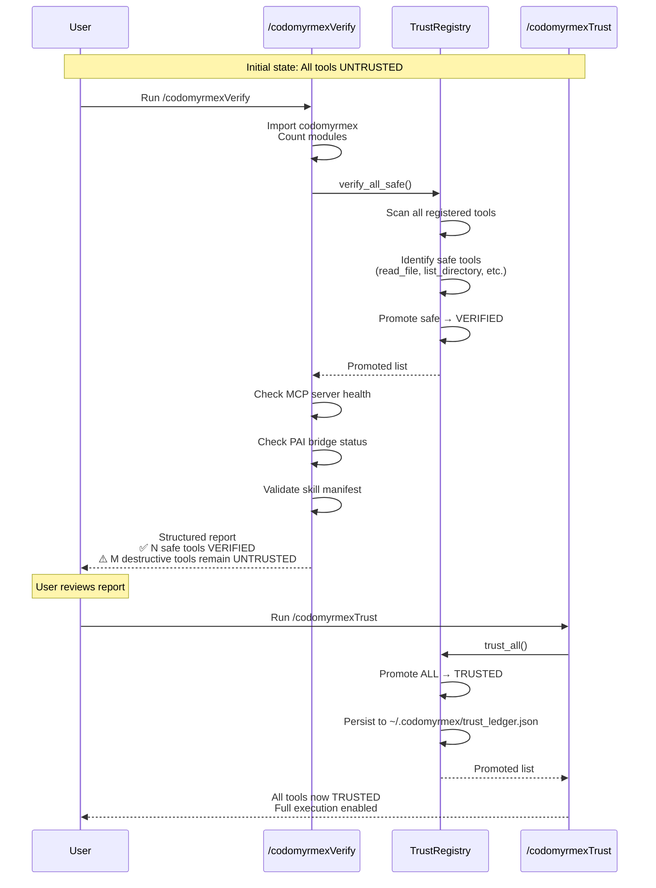
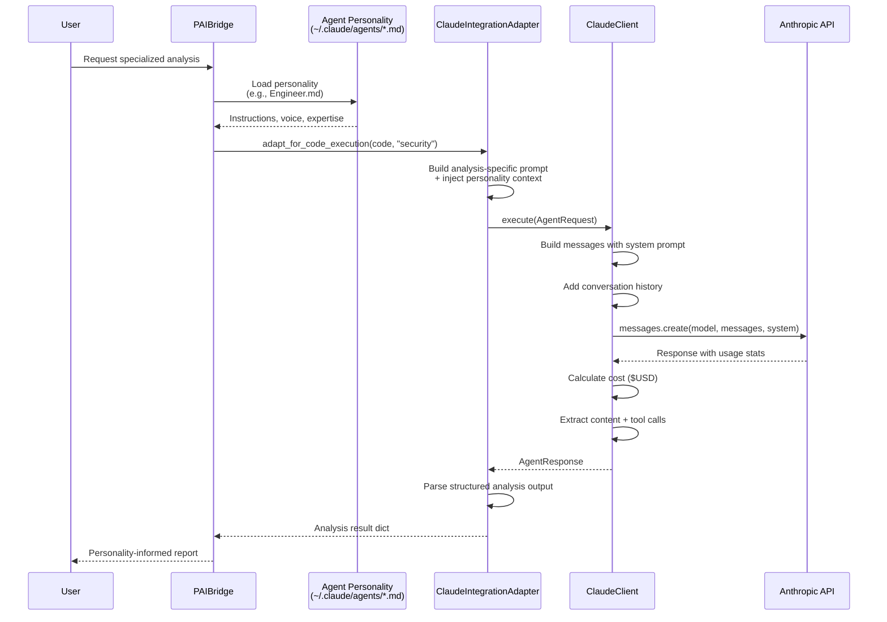

# PAI Operational Flows

Detailed Mermaid diagrams visualizing every major operational sequence in the PAI ↔ Codomyrmex integration.

**Upstream**: [Personal AI Infrastructure](https://github.com/danielmiessler/Personal_AI_Infrastructure) | **Codomyrmex Source**: [`mcp_bridge.py`](../../../src/codomyrmex/agents/pai/mcp_bridge.py), [`trust_gateway.py`](../../../src/codomyrmex/agents/pai/trust_gateway.py)

---

## 1. Complete Tool Execution Lifecycle

This is the full sequence when a PAI agent calls a Codomyrmex MCP tool, from Algorithm phase selection through trust enforcement to result delivery.

## 2. Dynamic Tool Discovery Pipeline

How the MCPBridge discovers and registers tools from across the entire Codomyrmex ecosystem.

```mermaid
flowchart TD
    START([Server Startup]) --> STATIC["Register 15 Static Core Tools<br/>(File I/O, Git, PAI, Testing)"]
    STATIC --> PROXY["Register 3 Universal Proxy Tools<br/>(list_module_functions, call_module_function, get_module_readme)"]
    PROXY --> PHASE1["Phase 1: Scan @mcp_tool Decorators"]
    
    PHASE1 --> SCAN["Scan 13 target modules:<br/>visualization, llm, security,<br/>git_operations, static_analysis,<br/>coding.execution, documentation,<br/>data_visualization.*, terminal_interface"]
    
    SCAN --> DECORATED["Collect decorated functions<br/>with schemas from decorators"]
    DECORATED --> PHASE2["Phase 2: Auto-Discover ALL<br/>Public Functions"]
    
    PHASE2 --> INSPECT["For each codomyrmex.* module:<br/>1. importlib.import_module()<br/>2. inspect.getmembers(mod, isfunction)<br/>3. inspect.signature(func)<br/>4. Generate JSON Schema"]
    
    INSPECT --> DEDUP["Deduplicate<br/>(decorated tools take priority)"]
    DEDUP --> REGISTER["Register in MCPToolRegistry"]
    REGISTER --> COUNT["Total: 100+ registered tools"]
    
    COUNT --> RESOURCES["Register 2 Resources<br/>(codomyrmex://modules, codomyrmex://status)"]
    RESOURCES --> PROMPTS["Register 10 Prompt Templates<br/>(analyze, debug, test, workflows)"]
    PROMPTS --> READY([MCP Server Ready])
```

## 3. Memory System Integration

How Codomyrmex operations feed into PAI's three-tier memory architecture.

## 4. Trust Promotion Workflow

The complete `/codomyrmexVerify` → `/codomyrmexTrust` workflow.

## 5. Agent Personality Coordination

How PAI's agent personality definitions interact with the Codomyrmex `ClaudeClient`.

## 6. MCP Server Initialization

Complete sequence for standing up the Codomyrmex MCP server that PAI agents connect to.

```mermaid
flowchart LR
    subgraph Init["create_codomyrmex_mcp_server()"]
        A["Create MCPServerConfig<br/>(name, transport)"] --> B["Create MCPServer"]
        B --> C["get_tool_registry()"]
        C --> D["Register static tools (15)"]
        D --> E["_discover_dynamic_tools()"]
        E --> F["Register dynamic tools (85+)"]
        F --> G["Register resources (2)"]
        G --> H["Register prompts (10)"]
        H --> I["Log tool/resource/prompt counts"]
    end
    
    I --> J{Transport?}
    J -->|stdio| K["server.run()<br/>(stdin/stdout)"]
    J -->|HTTP| L["server.run()<br/>(HTTP endpoint)"]
    
    K --> M["PAI Agent connects<br/>via claude_desktop_config.json"]
    L --> M
```

---

## Related Documents

- [Algorithm: The Seven Phases](ALGORITHM.md#the-seven-phases)
- [Architecture: Three-Layer Architecture](ARCHITECTURE.md#three-layer-architecture)
- [Skills: Skill Priority Hierarchy](SKILLS.md#skill-priority-hierarchy)
- [Hooks: FormatReminder](HOOKS.md#formatreminder-the-critical-hook)
- [TELOS: How TELOS Flows Through Codomyrmex](TELOS.md#how-telos-flows-through-codomyrmex)
- [Workflows: Agent Dispatch System](WORKFLOWS.md#agent-dispatch-system)
- [Signposts: Line-Level Code Pointers](SIGNPOSTS.md)
