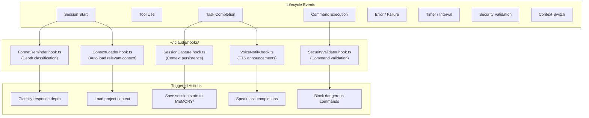
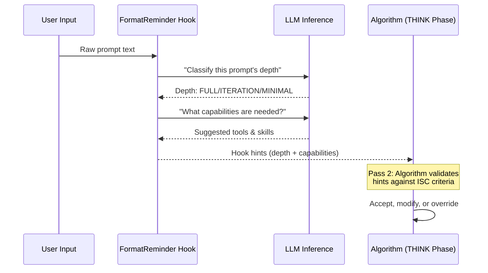
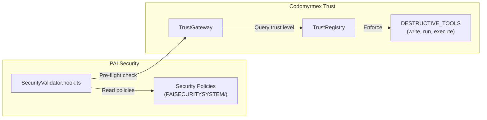

# PAI Hook System

Hooks are event-driven handlers that respond to **lifecycle events** in the PAI system — session start, tool use, task completion, security checks, and more. They enable autonomous behaviors without explicit user commands.

**Upstream**: [Personal AI Infrastructure](https://github.com/danielmiessler/Personal_AI_Infrastructure)

---

## Hook Architecture



---

## The 8 Event Types

PAI defines 8 lifecycle event types that hooks can subscribe to:

| Event | When Fired | Example Hook |
|:---|:---|:---|
| **session_start** | New Claude session begins | `ContextLoader`, `FormatReminder` |
| **tool_use** | Any MCP/builtin tool is called | Observability, logging |
| **task_complete** | A task reaches completion | `SessionCapture`, `VoiceNotify` |
| **command_exec** | Shell command about to execute | `SecurityValidator` |
| **error** | Unhandled error or failure | Error reporting, recovery |
| **timer** | Scheduled interval fires | Background maintenance |
| **security_check** | Permission validation needed | Security policy enforcement |
| **context_switch** | User changes project/task context | Context reloading |

---

## Codomyrmex Hook Discovery

The `PAIBridge.list_hooks()` method ([L423-453](../../../src/codomyrmex/agents/pai/pai_bridge.py)) scans the hooks directory for all `.hook.*` files:

```python
from codomyrmex.agents.pai import PAIBridge

bridge = PAIBridge()
for hook in bridge.list_hooks():
    status = "🟢 active" if not hook.is_archived else "📦 archived"
    print(f"{hook.name}: {status} ({hook.size_bytes} bytes)")

# Only active hooks
active = bridge.list_active_hooks()
```

### PAIHookInfo Data Class

**Source**: [L149-157](../../../src/codomyrmex/agents/pai/pai_bridge.py)

| Field | Type | Description |
|:---|:---|:---|
| `name` | `str` | Hook name (extracted from filename before `.hook.`) |
| `path` | `str` | Absolute path to hook file |
| `size_bytes` | `int` | File size |
| `is_archived` | `bool` | True if filename contains `v25-archived` or `-archived` |

### Hook Naming Convention

```
FormatReminder.hook.ts          → Active hook
SecurityValidator.hook.ts       → Active hook
OldHook.hook.ts.v25-archived    → Archived (inactive)
```

Codomyrmex detects archived hooks by checking for `-archived` in the filename and filters them with `list_active_hooks()` ([L455-457](../../../src/codomyrmex/agents/pai/pai_bridge.py)).

---

## FormatReminder: The Critical Hook

The most important hook in PAI is `FormatReminder`, which implements **Two-Pass Capability Selection** (Algorithm Key Principle #2):



This hook uses **AI inference** to classify the task before the Algorithm even begins, enabling intelligent tool pre-selection.

---

## Security Hooks and The Trust Bridge

PAI's Security System hooks integrate with Codomyrmex's TrustGateway:



### PAI Security Config Discovery

`PAIBridge.get_security_config()` ([L549-571](../../../src/codomyrmex/agents/pai/pai_bridge.py)) reads PAI's security policies:

```python
security = bridge.get_security_config()
print(security)
# {
#   "exists": True,
#   "path": "/Users/mini/.claude/skills/PAI/PAISECURITYSYSTEM",
#   "files": ["patterns.yaml", "policies.md"],
#   "patterns": { ... }  # Parsed YAML content
# }
```

---

## Hook ↔ Memory Interaction

Hooks are key contributors to PAI's memory system:

| Hook | Memory Tier | What It Writes |
|:---|:---|:---|
| `SessionCapture` | STATE/ (hot) | Current session context snapshot |
| `SessionCapture` | LEARNING/ (warm) | Post-session insights |
| `SecurityValidator` | SECURITY/ | Security event log |
| `ContextLoader` | STATE/ (hot) | Loaded context references |

---

## Codomyrmex Hook-Equivalent Patterns

While Codomyrmex doesn't implement hooks directly, it provides equivalent lifecycle integration points:

| PAI Hook | Codomyrmex Equivalent |
|:---|:---|
| FormatReminder (depth classification) | `RESPONSE_DEPTH_LEVELS` constant for depth routing |
| SecurityValidator (command validation) | `TrustGateway.trusted_call_tool()` |
| SessionCapture (context persistence) | `ClaudeClient.execute_with_session()` |
| ContextLoader (auto-load context) | `call_tool("codomyrmex.pai_awareness")` |

---

## Related Documents

- [Algorithm: Two-Pass Capability Selection](ALGORITHM.md#2-two-pass-capability-selection)
- [Architecture: Layer 3 TrustGateway](ARCHITECTURE.md#layer-3-trustgateway-security)
- [Signposts: Hook System Section](SIGNPOSTS.md#pai_bridgepy)
