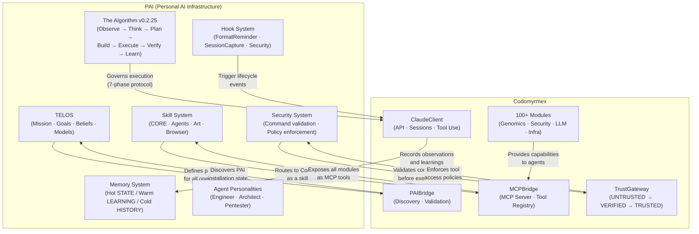
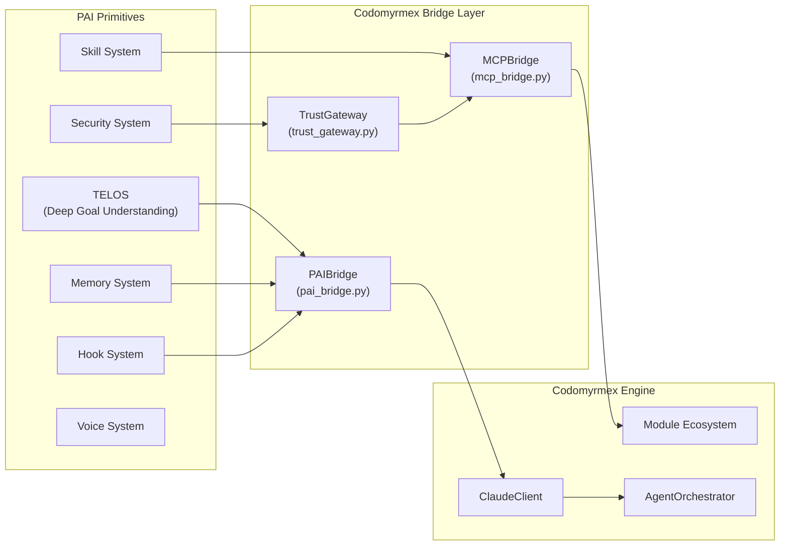

# PAI: Personal AI Infrastructure Integration

**Upstream**: [github.com/danielmiessler/Personal_AI_Infrastructure](https://github.com/danielmiessler/Personal_AI_Infrastructure)
**Version**: v1.0.3-dev | **Status**: Active | **Last Updated**: February 2026

---

## The Problem PAI Solves

> "AI should magnify everyone—not just the top 1%."
> — Daniel Miessler

Most agentic AI systems are **tool-centric** — they execute commands and forget. PAI is the inverse: a **goal-centric** personal AI platform where every interaction is informed by who you are, what you're trying to accomplish, and what the system has learned from past interactions.

Codomyrmex extends this vision by giving PAI agents access to an **industrial-grade module ecosystem** — 100+ capabilities spanning genomics, security, code analysis, LLM orchestration, and infrastructure operations — all exposed via the Model Context Protocol (MCP).

## The Bidirectional Architecture

The integration is not a one-way dependency. It is a **recursive feedback loop** where each system amplifies the other:



### Direction 1: PAI → Codomyrmex

| PAI System | What It Provides | Codomyrmex Consumer |
|:---|:---|:---|
| **TELOS** (10 identity files) | Mission, Goals, Beliefs, Models, Strategies | `PAIBridge.get_telos_files()` reads `~/.claude/USER/` |
| **The Algorithm** (v0.2.25) | 7-phase execution protocol (Observe→Learn) | `ALGORITHM_PHASES` constant injected into agent context |
| **Skill System** | Capability routing (CODE → CLI → PROMPT → SKILL) | `PAIBridge.list_skills()` discovers all skill packs |
| **Hook System** | Lifecycle events (session start, tool use, task completion) | `PAIBridge.list_hooks()` / `list_active_hooks()` |
| **Memory System** | Three-tier storage (hot/warm/cold) | `PAIBridge.list_memory_stores()` enumerates stores |
| **Security System** | Command validation policies | `PAIBridge.get_security_config()` reads policies |
| **Agent Personalities** | Specialized AI voices (Engineer, Architect) | `PAIBridge.list_agents()` discovers personalities |

### Direction 2: Codomyrmex → PAI

| Codomyrmex System | What It Provides | PAI Consumer |
|:---|:---|:---|
| **MCPBridge** | Full module ecosystem as MCP tools | PAI agents call `codomyrmex.*` tools |
| **TrustGateway** | Three-tier access control | PAI Security System integration |
| **ClaudeClient** | Anthropic API with retry, streaming, sessions | PAI Algorithm execution engine |
| **Dynamic Discovery** | Auto-discovered public functions as tools | PAI skill routing system |
| **Skill Manifest** | Algorithm-mapped capability catalog | PAI `THINK` phase skill selection |

## PAI Core Concepts (Upstream Reference)

### The 16 PAI Principles

These principles, defined in the [upstream repository](https://github.com/danielmiessler/Personal_AI_Infrastructure), are encoded in Codomyrmex as the `PAI_PRINCIPLES` constant ([pai_bridge.py:L197-214](../../../src/codomyrmex/agents/pai/pai_bridge.py)):

| # | Principle | Codomyrmex Alignment |
|:---:|:---|:---|
| 1 | **User Centricity** | TELOS integration via `PAIBridge` |
| 2 | **The Foundational Algorithm** | 7-phase constant in `ALGORITHM_PHASES` |
| 3 | **Clear Thinking First** | Two-pass capability selection in MCP |
| 4 | **Scaffolding > Model** | Modular architecture (100+ modules) |
| 5 | **Deterministic Infrastructure** | Zero-Mock testing policy |
| 6 | **Code Before Prompts** | Direct `call_tool()` Python API |
| 7 | **Spec / Test / Evals First** | SPEC.md + pytest at every module level |
| 8 | **UNIX Philosophy** | Each module does one thing well |
| 9 | **ENG / SRE Principles** | Production-grade logging, monitoring, CI/CD |
| 10 | **CLI as Interface** | `mcp_bridge.py` exposes shell tools |
| 11 | **Goal → Code → CLI → Prompts → Agents** | Trust hierarchy enforces this order |
| 12 | **Skill Management** | `get_skill_manifest()` generates PAI-compatible skill definitions |
| 13 | **Memory System** | Three-tier memory store enumeration |
| 14 | **Agent Personalities** | `list_agents()` discovers `.md` definitions |
| 15 | **Science as Meta-Loop** | Verify → Learn phases in Algorithm mapping |
| 16 | **Permission to Fail** | Graceful error handling throughout |

### PAI Primitives and Codomyrmex Counterparts



## Quick Start

```python
# Discovery: What PAI components are installed?
from codomyrmex.agents.pai import PAIBridge
bridge = PAIBridge()
print(bridge.get_status())        # Full inventory
print(bridge.list_skills())       # Skill packs
print(bridge.get_telos_files())   # Identity files

# MCP: Expose Codomyrmex to PAI agents
from codomyrmex.agents.pai import create_codomyrmex_mcp_server
server = create_codomyrmex_mcp_server()
server.run()  # stdio or HTTP

# Direct API: Call any tool without MCP overhead
from codomyrmex.agents.pai import call_tool
modules = call_tool("codomyrmex.list_modules")
status = call_tool("codomyrmex.pai_status")

# Trust: Gate destructive operations
from codomyrmex.agents.pai import verify_capabilities, trust_all, trusted_call_tool
verify_capabilities()   # Audit + promote safe tools to VERIFIED
trust_all()             # Promote destructive tools to TRUSTED
trusted_call_tool("codomyrmex.write_file", path="x.py", content="# hello")
```

## Navigation

### Core Documentation

| Document | Purpose |
|:---|:---|
| [**Architecture**](ARCHITECTURE.md) | Deep dive into PAIBridge, MCPBridge, and TrustGateway |
| [**Flows**](FLOWS.md) | Mermaid diagrams of operational sequences |
| [**Signposts**](SIGNPOSTS.md) | Precise code pointers with line-level accuracy |
| [**AGENTS.md**](AGENTS.md) | Agent coordination guide for this PAI folder |

### PAI Element Deep Dives

| Document | PAI Element | Key Topics |
|:---|:---|:---|
| [**Algorithm**](ALGORITHM.md) | The Algorithm v0.2.25 | 7 phases, ISC, depth levels, two-pass capability selection |
| [**Skills**](SKILLS.md) | Skill System | Skill architecture, priority hierarchy, dynamic assembly |
| [**TELOS**](TELOS.md) | Deep Goal Understanding | 10 identity files, memory system, customization layers |
| [**Hooks**](HOOKS.md) | Hook System | 8 event types, FormatReminder, security integration |
| [**Workflows**](WORKFLOWS.md) | Workflows & Dispatch | 5 workflows, Dispatch v3.2.1, PMServer tabs |
| [**Upstream Issue**](UPSTREAM_ISSUE.md) | PAI Community | GitHub issue for `danielmiessler/Personal_AI_Infrastructure` |
