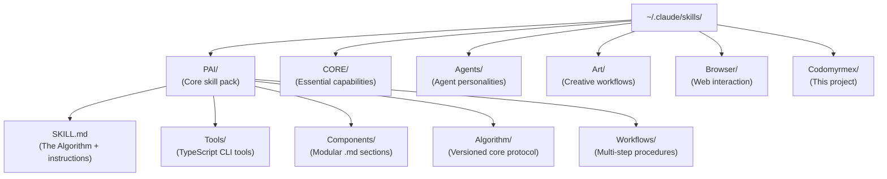
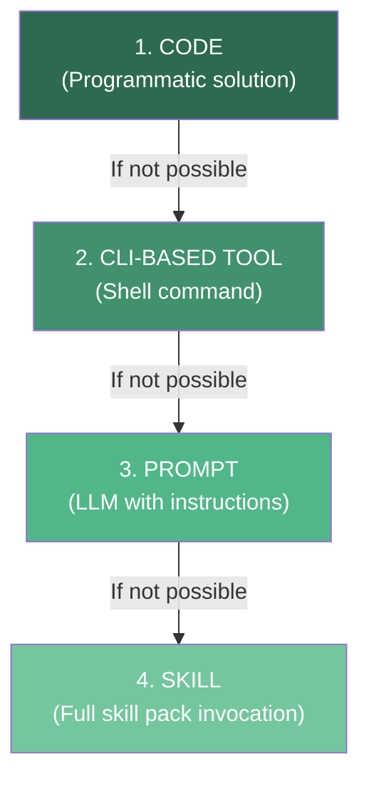
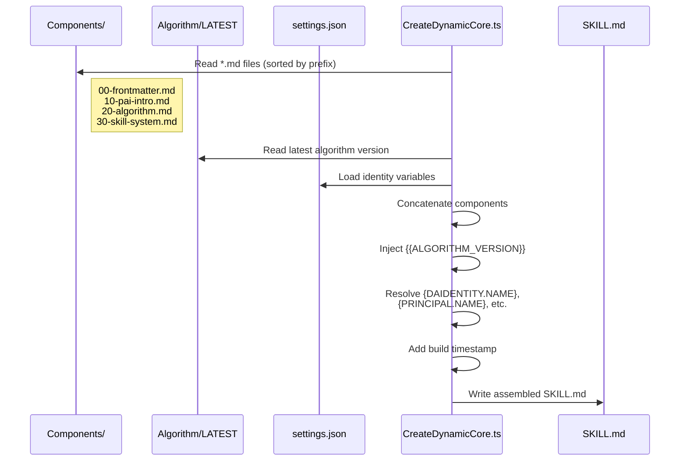

# PAI Skill System

The Skill System is PAI's modular capability architecture. Skills are self-contained packages of instructions, tools, and workflows that can be independently installed, updated, and routed to by the Algorithm.

**Upstream**: [Personal AI Infrastructure](https://github.com/danielmiessler/Personal_AI_Infrastructure) | **PAI Principle #12**: Skill Management

---

## Skill Architecture

A PAI skill pack is a directory within `~/.claude/skills/` that follows a standardized structure:



### Skill Pack Anatomy

| Component | Required | Purpose |
|:---|:---:|:---|
| `SKILL.md` | ✅ | The skill's instruction set (assembled from components) |
| `Tools/` | ❌ | TypeScript CLI tools (Bun runtime) |
| `Components/` | ❌ | Numbered `.md` files for dynamic assembly |
| `Workflows/` | ❌ | Multi-step procedure definitions |
| `Algorithm/` | ❌ | Versioned algorithm files (PAI skill only) |

---

## Codomyrmex Skill Discovery

The `PAIBridge.list_skills()` method ([L335-368](../../../src/codomyrmex/agents/pai/pai_bridge.py)) performs real filesystem scanning to discover all installed skill packs:

```python
from codomyrmex.agents.pai import PAIBridge

bridge = PAIBridge()
for skill in bridge.list_skills():
    print(f"{skill.name}: {skill.file_count} files")
    print(f"  SKILL.md: {skill.has_skill_md}")
    print(f"  Tools: {skill.has_tools}")
    print(f"  Workflows: {skill.has_workflows}")
```

### PAISkillInfo Data Class

**Source**: [L128-138](../../../src/codomyrmex/agents/pai/pai_bridge.py)

| Field | Type | Description |
|:---|:---|:---|
| `name` | `str` | Skill pack directory name |
| `path` | `str` | Absolute path to skill directory |
| `has_skill_md` | `bool` | Whether `SKILL.md` exists |
| `has_tools` | `bool` | Whether `Tools/` directory exists |
| `has_workflows` | `bool` | Whether `Workflows/` directory exists |
| `file_count` | `int` | Total files in skill pack (recursive) |

---

## Skill Priority Hierarchy

PAI applies a strict determinism hierarchy to capability selection (Principle #6: Code Before Prompts):



Codomyrmex enforces this through its tool registry:

- **CODE**: `call_tool()` direct Python invocation — zero MCP overhead
- **CLI**: `codomyrmex.run_command` tool for shell operations
- **PROMPT**: `ClaudeIntegrationAdapter.adapt_for_*()` methods
- **SKILL**: Full `get_skill_manifest()` integration with algorithm mapping

---

## Dynamic Skill Assembly

The PAI core skill uses `CreateDynamicCore.ts` to dynamically build its `SKILL.md` from modular components:



### Identity Variables

| Variable | Source | Example |
|:---|:---|:---|
| `{DAIDENTITY.NAME}` | `settings.json → daidentity.name` | "PAI" |
| `{DAIDENTITY.FULLNAME}` | `settings.json → daidentity.fullname` | "Personal AI" |
| `{DAIDENTITY.DISPLAYNAME}` | `settings.json → daidentity.displayname` | "PAI 🤖" |
| `{PRINCIPAL.NAME}` | `settings.json → principal.name` | "Daniel" |
| `{PRINCIPAL.TIMEZONE}` | `settings.json → principal.timezone` | "America/Los_Angeles" |

**Codomyrmex Access**: `PAIBridge.get_settings()` ([L599-605](../../../src/codomyrmex/agents/pai/pai_bridge.py)) loads these values.

---

## Codomyrmex as a PAI Skill

Codomyrmex itself registers as a PAI skill pack. The `get_skill_manifest()` function ([L836-993](../../../src/codomyrmex/agents/pai/mcp_bridge.py)) produces a PAI-compatible manifest:

```json
{
  "name": "Codomyrmex",
  "version": "0.1.0",
  "description": "Modular coding workspace exposing 100+ modules...",
  "mcp_server": "codomyrmex-mcp-server",
  "tools": [...],
  "resources": [...],
  "prompts": [...],
  "workflows": [...],
  "algorithm_mapping": {
    "OBSERVE": ["codomyrmex.list_modules", "codomyrmex.module_info"],
    "THINK": ["codomyrmex.analyze_python", "codomyrmex.search_codebase"],
    ...
  },
  "knowledge_scope": { ... }
}
```

This manifest allows PAI's skill routing system to understand:

1. **What capabilities** Codomyrmex provides (100+ tools)
2. **When to use them** (Algorithm phase mapping)
3. **What domains** they cover (9 knowledge scope categories)

---

## PAI Tool System

Within each skill pack, `Tools/` contains TypeScript CLI tools run via Bun. Codomyrmex discovers these through `PAIBridge.list_tools()` ([L388-410](../../../src/codomyrmex/agents/pai/pai_bridge.py)):

```python
for tool in bridge.list_tools():
    print(f"{tool.name}: {tool.size_bytes} bytes at {tool.path}")
```

### PAIToolInfo Data Class

**Source**: [L140-147](../../../src/codomyrmex/agents/pai/pai_bridge.py)

| Field | Type | Description |
|:---|:---|:---|
| `name` | `str` | Tool stem name (e.g., `"AddTask"`, `"CreateProject"`) |
| `path` | `str` | Absolute path to `.ts` file |
| `size_bytes` | `int` | File size |

### Known PAI Tools (from Dispatch KI)

| Tool | Purpose | Category |
|:---|:---|:---|
| `AddTask.ts` | Create new tasks in projects | CRUD |
| `CreateProject.ts` | Create new projects under missions | CRUD |
| `ListMissions.ts` | List all missions with status | Query |
| `ListProjects.ts` | List projects with filtering | Query |
| `ListTasks.ts` | List tasks with priority/status filters | Query |
| `UpdateProject.ts` | Modify project metadata | CRUD |
| `CompleteProject.ts` | Mark project as complete | Lifecycle |
| `CreateDynamicCore.ts` | Assemble SKILL.md from components | System |
| `TestProjectTools.ts` | Run 132-test verification suite | Verification |

---

## Related Documents

- [Algorithm: Phase-to-Tool Mapping](ALGORITHM.md#the-seven-phases)
- [Architecture: Skill Manifest](ARCHITECTURE.md#algorithm-mapping)
- [Signposts: Skill System](SIGNPOSTS.md#pai_bridgepy)
