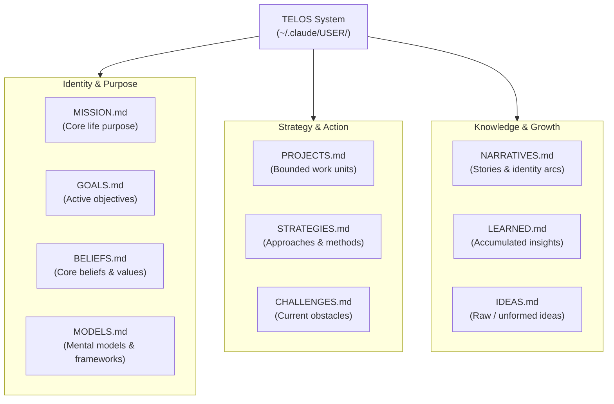
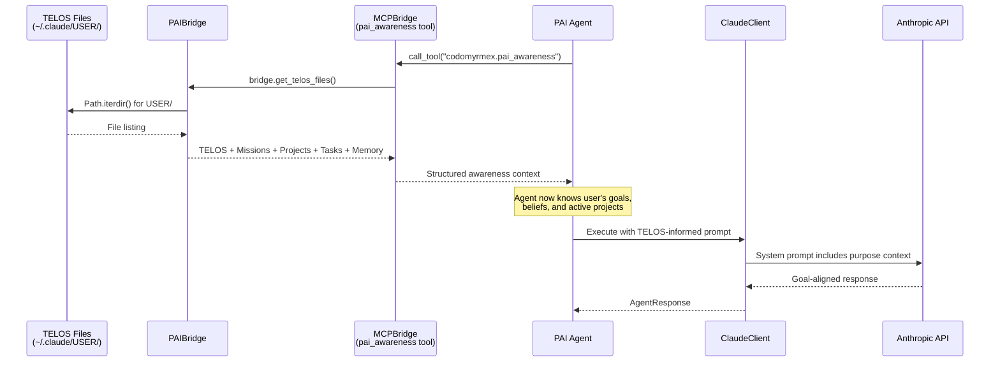
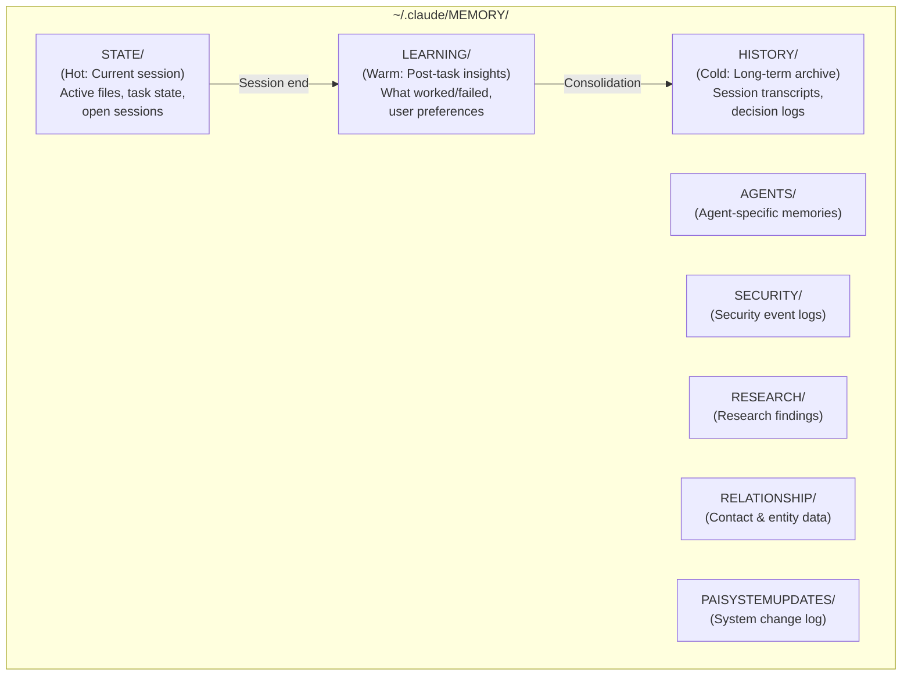

# TELOS: Deep Goal Understanding

TELOS is PAI's identity and purpose system — 10 structured files that capture **who you are, what you believe, and what you're trying to accomplish**. It is the foundation that transforms AI from a stateless tool into a goal-oriented assistant.

**Upstream**: [Personal AI Infrastructure](https://github.com/danielmiessler/Personal_AI_Infrastructure) | **PAI Principle #1**: User Centricity

---

## The 10 TELOS Files

TELOS files live in `~/.claude/USER/` and are loaded by PAI agents at session start to provide deep context:



### File Descriptions

| File | Category | Purpose |
|:---|:---|:---|
| `MISSION.md` | Identity | Your singular life purpose, the P0 goal |
| `GOALS.md` | Identity | Active objectives organized by timeframe (daily/weekly/monthly/yearly) |
| `BELIEFS.md` | Identity | Core values and non-negotiable principles |
| `MODELS.md` | Identity | Mental models and reasoning frameworks you apply |
| `PROJECTS.md` | Strategy | Bounded units of work with success criteria |
| `STRATEGIES.md` | Strategy | Methods, approaches, and playbooks |
| `CHALLENGES.md` | Strategy | Current obstacles and blockers |
| `NARRATIVES.md` | Knowledge | Personal stories and identity arcs |
| `LEARNED.md` | Knowledge | Hard-won insights from experience |
| `IDEAS.md` | Knowledge | Raw thoughts, hypotheses, and explorations |

---

## Codomyrmex TELOS Discovery

The `PAIBridge.get_telos_files()` method ([L577-593](../../../src/codomyrmex/agents/pai/pai_bridge.py)) reads the TELOS directory:

```python
from codomyrmex.agents.pai import PAIBridge

bridge = PAIBridge()
telos_files = bridge.get_telos_files()
print(telos_files)
# ['BELIEFS.md', 'CHALLENGES.md', 'GOALS.md', 'IDEAS.md',
#  'LEARNED.md', 'MISSION.md', 'MODELS.md', 'NARRATIVES.md',
#  'PROJECTS.md', 'STRATEGIES.md']
```

### Configuration Path

The TELOS directory path is defined in `PAIConfig.telos_dir` ([L122-125](../../../src/codomyrmex/agents/pai/pai_bridge.py)):

```
~/.claude/USER/       ← User customizations (upgrade-safe)
    MISSION.md
    GOALS.md
    ...
```

This honors PAI's **User/System Separation** principle: your identity files live in `USER/`, while system infrastructure lives in `SYSTEM/`. When PAI upgrades, your TELOS files are untouched.

---

## How TELOS Flows Through Codomyrmex



---

## TELOS and The Algorithm

TELOS directly informs the Algorithm's execution:

| Algorithm Phase | TELOS Influence |
|:---|:---|
| **OBSERVE** | ISC (Ideal State Criteria) references `GOALS.md` and `MISSION.md` |
| **THINK** | `MODELS.md` and `BELIEFS.md` shape reasoning frameworks |
| **PLAN** | `STRATEGIES.md` provides preferred approaches |
| **BUILD** | `PROJECTS.md` provides success criteria for artifacts |
| **EXECUTE** | Execution aligned with `CHALLENGES.md` constraints |
| **VERIFY** | Verification against ISC derived from goals |
| **LEARN** | Insights captured back into `LEARNED.md` |

---

## Memory System Integration

TELOS is complemented by PAI's **three-tier memory architecture**, which Codomyrmex discovers via `PAIBridge.list_memory_stores()` ([L508-536](../../../src/codomyrmex/agents/pai/pai_bridge.py)):



### PAIMemoryStore Data Class

**Source**: [L168-175](../../../src/codomyrmex/agents/pai/pai_bridge.py)

| Field | Type | Description |
|:---|:---|:---|
| `name` | `str` | Store name (e.g., `"STATE"`, `"LEARNING"`) |
| `path` | `str` | Absolute path to store directory |
| `item_count` | `int` | Number of files in store (recursive) |

### Memory ↔ TELOS Feedback

The memory system creates a **learning loop** with TELOS:

1. **Session observations** → `STATE/` (hot)
2. **Post-task learnings** → `LEARNING/` (warm) — PAI captures what worked, what failed
3. **Pattern accumulation** → `HISTORY/` (cold) — long-term knowledge
4. **Insight synthesis** → `LEARNED.md` (TELOS) — distilled wisdom feeds back into goals

This is PAI Principle #13 (Memory System): "Everything worth knowing gets captured."

---

## The Granular Customization Layers

TELOS sits at the top of PAI's six-layer customization system:

| Layer | What It Controls | Codomyrmex Access |
|:---|:---|:---|
| **1. Identity** | Name, voice, personality | `PAIBridge.get_settings()` |
| **2. Preferences** | Tech stack, tools | `PAIBridge.get_pai_env()` |
| **3. Workflows** | How skills execute | `PAIBridge.list_skills()` |
| **4. Skills** | What capabilities exist | `get_skill_manifest()` |
| **5. Hooks** | How events are handled | `PAIBridge.list_hooks()` |
| **6. Memory** | What gets captured | `PAIBridge.list_memory_stores()` |

---

## Related Documents

- [Algorithm: ISC and TELOS](ALGORITHM.md#isc-ideal-state-criteria)
- [Architecture: PAIConfig Path Layout](ARCHITECTURE.md#paiconfig-the-path-layout)
- [Signposts: TELOS Section](SIGNPOSTS.md#pai_bridgepy)
