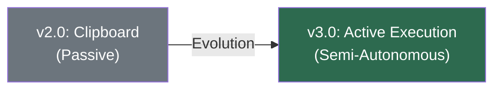
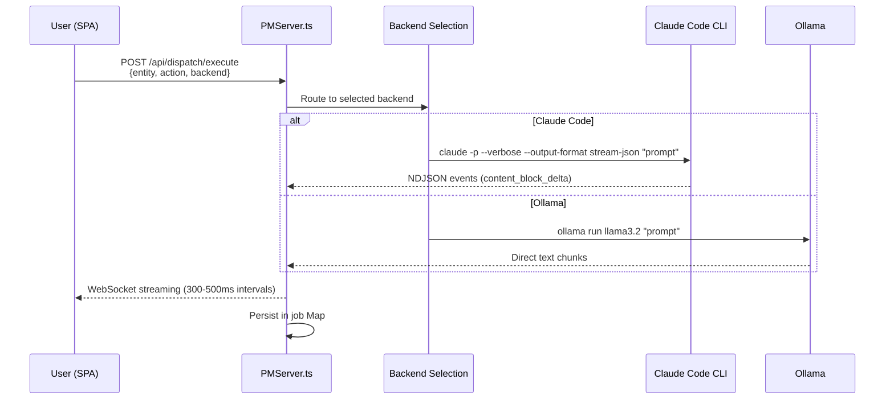
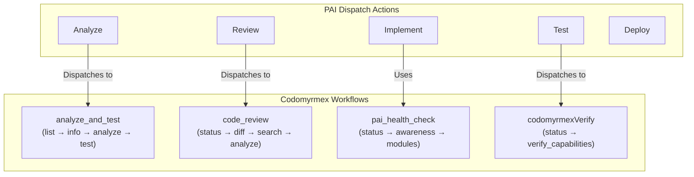
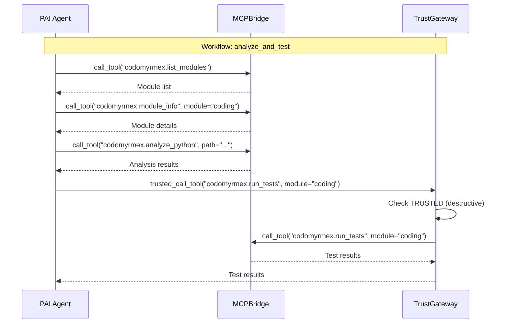
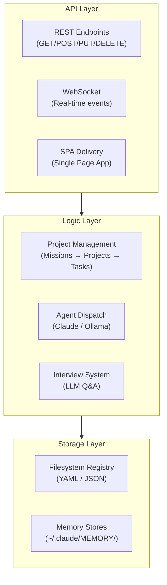

# PAI Workflows & Dispatch

Workflows are multi-step procedures that compose skills, tools, and prompts into reusable execution pipelines. The Dispatch system bridges the PAI web interface with AI agents for active execution.

**Upstream**: [Personal AI Infrastructure](https://github.com/danielmiessler/Personal_AI_Infrastructure) | **Dispatch Version**: v3.2.1

---

## Workflow System

### Codomyrmex-Defined Workflows

The `get_skill_manifest()` function ([L888-933](../../../src/codomyrmex/agents/pai/mcp_bridge.py)) defines 5 workflows that PAI agents can invoke:

```mermaid
graph TD
    subgraph W1["codomyrmexVerify"]
        V1["codomyrmex.pai_status"] --> V2["verify_capabilities()"]
    end

    subgraph W2["codomyrmexTrust"]
        T1["trust_all()"]
    end

    subgraph W3["analyze_and_test"]
        A1["list_modules"] --> A2["module_info"]
        A2 --> A3["analyze_python"]
        A3 --> A4["run_tests"]
    end

    subgraph W4["code_review"]
        C1["git_status"] --> C2["git_diff"]
        C2 --> C3["search_codebase"]
        C3 --> C4["analyze_python"]
    end

    subgraph W5["pai_health_check"]
        H1["pai_status"] --> H2["pai_awareness"]
        H2 --> H3["list_modules"]
    end
```



| Workflow | Steps | Purpose |
|:---|:---:|:---|
| `codomyrmexVerify` | 2 | Audit all capabilities, promote safe tools |
| `codomyrmexTrust` | 1 | Promote destructive tools to TRUSTED |
| `analyze_and_test` | 4 | Discover → Analyze → Test a module |
| `code_review` | 4 | Review changes via git + analysis |
| `pai_health_check` | 3 | Full PAI + Codomyrmex health assessment |

### Slash Command Workflows

Codomyrmex also defines slash-command workflows in `.agent/workflows/`:

| Slash Command | Backing Function | Purpose |
|:---|:---|:---|
| `/codomyrmexVerify` | `verify_capabilities()` | Full read-only audit with trust promotion |
| `/codomyrmexTrust` | `trust_all()` | Promote all tools to TRUSTED |
| `/codomyrmexStatus` | `PAIBridge.get_status()` | System health report |
| `/codomyrmexAnalyze` | Code analysis pipeline | Deep structural analysis |
| `/codomyrmexSearch` | Regex search | Pattern matching across codebase |
| `/codomyrmexDocs` | Module documentation | Retrieve README or SPEC |
| `/codomyrmexMemory` | Memory system | Add entry to agentic memory |

---

## Agent Dispatch System

The Dispatch system (v3.2.1) is PAI's active execution bridge, managed by `PMServer.ts`.

### Evolution Path



| Version | Mode | Mechanism | Features |
|:---|:---|:---|:---|
| **v2.0** | Passive | Clipboard copy | 14 prompt templates, manual review |
| **v3.0+** | Active | `Bun.spawn` subprocess | Real-time streaming, job tracking, multi-backend |

### Active Execution Architecture



### Dispatch API Reference

| Endpoint | Method | Purpose |
|:---|:---|:---|
| `/api/dispatch/execute` | POST | Trigger execution (returns `jobId`) |
| `/api/dispatch/status/:id` | GET | Job state + full output buffer |
| `/api/dispatch/jobs` | GET | Recent 20 dispatch operations |
| `/api/dispatch/queue` | POST | Add task to sequential queue |
| `/api/dispatch/queue/run` | POST | Trigger sequential executor |

### Execution Backends

| Backend | Binary Path | Streaming Format | Performance |
|:---|:---|:---|:---|
| **Claude Code CLI** | `~/.local/bin/claude` | NDJSON (`content_block_delta`) | Varies by model |
| **Ollama** | `/opt/homebrew/bin/ollama` | Raw text chunks | ~18-25 tok/s |

### Context Standard Pattern

All dispatch actions use a standardized entity context:

```json
{
  "title": "Entity Name",
  "id": "slug-identifier",
  "status": "Active",
  "priority": "HIGH",
  "goal": "Project objective",
  "criteria": ["Success criterion 1", "Success criterion 2"]
}
```

Technical details are stored in `dispatch_context` within YAML files:

- `links`: Reference URLs/paths
- `summary`: AI-generated rolling summary
- `notes`: Detailed implementation context

---

## Codomyrmex Workflow Integration

### How Codomyrmex Workflows Map to PAI Dispatch



### Workflow Execution Through MCP

When a PAI agent invokes a Codomyrmex workflow, each step is a discrete MCP tool call:



---

## PMServer: The Orchestration Hub

The PMServer provides the web infrastructure for workflow management:

### Three-Layer Architecture



### SPA Tabs

| Tab | Description | Status |
|:---|:---|:---|
| **Dashboard/Data** | Live overview, searchable mission/project lists | ✅ Verified |
| **Board (Kanban)** | Strategic mission overview + tactical task boards | ✅ Verified |
| **Projects** | Detailed project views with task lists | ✅ Verified |
| **Network** | D3 force-directed graph of relationships | ✅ Verified |
| **Dispatch** | Active execution hub (Claude/Ollama) | ✅ Verified |
| **Analytics/Timeline** | Progress metrics and temporal distribution | ✅ Verified |
| **Git** | Repository management | ✅ Verified |
| **Integration** | External tool connections | ✅ Verified |
| **Interview** | Human-in-the-loop intelligence gathering (v4.1.0) | ✅ Verified |

---

## Related Documents

- [Algorithm: Phase-to-Tool Mapping](ALGORITHM.md#the-seven-phases)
- [Skills: Codomyrmex as a Skill](SKILLS.md#codomyrmex-as-a-pai-skill)
- [Architecture: MCP Server Initialization](ARCHITECTURE.md#layer-2-mcpbridge-communication)
- [Flows: MCP Server Initialization](FLOWS.md#6-mcp-server-initialization)
