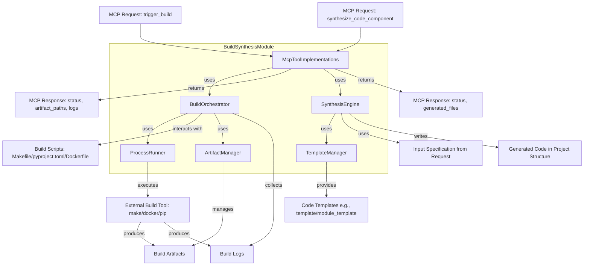

# Build Synthesis - Technical Overview

This document provides a detailed technical overview of the Build Synthesis module.

## 1. Introduction and Purpose

The Build Synthesis module serves as the backbone for automated construction and generation processes within the Codomyrmex project. It addresses the critical need for reliable, repeatable, and efficient mechanisms to compile source code, package distributable artifacts (like Python wheels or Docker containers), and synthesize boilerplate code or entire module structures from templates. Key responsibilities include managing build configurations, orchestrating build tool execution (e.g., Make, Docker, pip), and providing tools for scaffolding new project components, thereby streamlining development workflows and ensuring consistency across the ecosystem.

## 2. Architecture

The module is architected to support two primary functions: triggering builds and synthesizing code components. These are often exposed via MCP tools.

- **Key Components/Sub-modules**: 
  - **`BuildOrchestrator`**: The central component for handling build requests, typically initiated by the `trigger_build` MCP tool. It parses the request, identifies the appropriate build scripts (e.g., Makefiles, `pyproject.toml`, Dockerfiles, custom Python build scripts) or tools, and manages their execution. It captures logs, monitors status, and collects output artifacts.
  - **`SynthesisEngine`**: Manages code generation tasks, usually triggered by the `synthesize_code_component` MCP tool. It leverages templating engines (like Jinja2) and predefined templates (e.g., for a new Codomyrmex module, a Python class, or a REST API endpoint) to generate new files and directory structures based on user-provided names and specifications.
  - **`TemplateManager`**: Responsible for locating, loading, and managing templates used by the `SynthesisEngine`. It might support versioned templates or templates from various sources.
  - **`ArtifactManager`**: Handles the organization, storage, and retrieval of build artifacts. This includes placing outputs in designated directories (e.g., `output/builds/`, `dist/`) and providing paths to these artifacts in build responses.
  - **`ProcessRunner`**: A utility component for securely and reliably executing external command-line tools (like `make`, `docker`, `pip build`) used by the `BuildOrchestrator`. It captures stdout, stderr, and exit codes.
  - **`McpToolImplementations`**: Contains the concrete Python logic that implements the `trigger_build` and `synthesize_code_component` MCP tools, orchestrating the other components described above.

- **Data Flow**:
    - **For `trigger_build`**: 
        1. MCP request with target, profile, etc., arrives at `McpToolImplementations`.
        2. `BuildOrchestrator` is invoked, determines build strategy based on target.
        3. `ProcessRunner` executes external build commands (e.g., `make core_library`).
        4. Logs and artifacts are collected by `ArtifactManager`.
        5. Status and paths are returned in the MCP response.
    - **For `synthesize_code_component`**:
        1. MCP request with component type, name, output dir, etc., arrives at `McpToolImplementations`.
        2. `SynthesisEngine` is invoked.
        3. `TemplateManager` loads the relevant template(s).
        4. `SynthesisEngine` renders templates with provided data, creating files in the specified `output_directory`.
        5. Status and list of generated files are returned in the MCP response.

- **Core Algorithms/Logic**:
    - **Build Script Detection**: Logic within `BuildOrchestrator` to identify the correct build mechanism for a given `target_component` (e.g., looking for `Makefile`, `pyproject.toml`, `Dockerfile` in the component's directory).
    - **Template Rendering**: The `SynthesisEngine` uses a templating library (e.g., Jinja2) to fill in placeholders in template files with user-provided data.
    - **Path Management**: Ensuring correct and secure path manipulation for reading sources and writing artifacts/generated code.

- **External Dependencies & Tools**: 
    - **Standard Libraries**: `subprocess` (for `ProcessRunner`), `os`, `shutil` (for file system operations).
    - **Templating**: `Jinja2` (or similar) for the `SynthesisEngine`.
    - **Build Tools (executed via `ProcessRunner`)**: `make`, `docker` CLI, `pip` / `build` (Python packaging), potentially language-specific compilers or build tools (e.g., `npm`, `mvn`, `gradle` if project expands).
    - **Python Packaging Libraries**: `setuptools` (if interacting with `setup.py` or `pyproject.toml` driven builds directly).

## 3. Design Decisions and Rationale

- **Leveraging Standard Build Tools**: Instead of reinventing build systems, the module primarily orchestrates widely-used tools like `make`, `docker`, and Python's `build`. This promotes familiarity and allows leveraging the rich features of these tools.
- **Template-Driven Code Synthesis**: Using a templating engine like Jinja2 for `synthesize_code_component` provides flexibility and power in defining new component structures. It allows for easy updates to boilerplate and consistent scaffolding.
- **MCP as Primary Interface**: Exposing functionality through MCP tools (`trigger_build`, `synthesize_code_component`) aligns with the Codomyrmex architecture, enabling AI agents or other modules to interact with build and synthesis capabilities in a standardized way.
- **Configuration via Build Scripts**: Build specifics (compilation flags, dependencies, packaging steps) are primarily defined in standard build script files (`Makefile`, `pyproject.toml`, `Dockerfile`) co-located with the components, rather than in a central module configuration. This keeps build logic close to the code it builds.
- **Extensibility for Component Types**: The `synthesize_code_component` tool is designed with a `component_type` parameter, allowing new templates and synthesis logic to be added for different kinds of components over time without altering the core tool interface.

## 4. Data Models

Internally, the module may use more detailed structures to manage build and synthesis tasks beyond what is exposed directly via the Python API or MCP tools. Conceptual models include:

- **`InternalBuildJob`**:
  - `job_id` (string): Unique identifier for the build job (corresponds to `build_id` in API/MCP).
  - `target` (string): The specific build target identifier.
  - `requested_config` (dict): The configuration provided in the `trigger_build` request.
  - `status` (enum): E.g., QUEUED, PREPARING, RUNNING_SCRIPT, COLLECTING_ARTIFACTS, COMPLETED_SUCCESS, COMPLETED_FAILURE, CANCELLED.
  - `current_step_description` (string, optional): Human-readable description of the current build phase.
  - `process_handle` (object, optional): Handle to the external process being run by `ProcessRunner`.
  - `start_time` (datetime, optional): Timestamp when the build started processing.
  - `end_time` (datetime, optional): Timestamp when the build finished or failed.
  - `log_buffer` (list[string]): Buffer for accumulating log lines during execution.
  - `collected_artifact_paths` (list[string]): Paths to artifacts as they are identified.
  - `error_info` (string, optional): Detailed error message if the build failed.
  - `output_path_override` (string, optional): The final resolved output path for artifacts.

- **`InternalSynthesisTask`**:
  - `task_id` (string): Unique identifier for the synthesis task.
  - `synthesis_type` (enum): E.g., FROM_PROMPT, FROM_SPECIFICATION, FROM_TEMPLATE_ONLY.
  - `input_parameters` (dict): All parameters received by the synthesis API function (e.g., prompt, spec_file_path, language, target_directory).
  - `status` (enum): E.g., PENDING, LOADING_TEMPLATES, RENDERING_FILES, LLM_QUERYING (if applicable), COMPLETED_SUCCESS, COMPLETED_FAILURE.
  - `generated_file_map` (dict): A map of target file paths to their generated content before writing to disk, or paths after writing.
  - `llm_interaction_log` (list[object], optional): If LLM-assisted, logs of prompts and responses.
  - `error_info` (string, optional): Detailed error if synthesis failed.

These models are conceptual and would be refined during implementation within their respective components (`BuildOrchestrator`, `SynthesisEngine`).

## 5. Configuration

While most build logic is in component-specific scripts, the module itself might have some configurations:

- **`DEFAULT_TEMPLATE_BASE_PATH`**: (string) Filesystem path to the root directory containing templates for `synthesize_code_component` (e.g., `"./templates/"`).
- **`DEFAULT_ARTIFACT_OUTPUT_PATH`**: (string) Default base directory for storing build artifacts if not specified in a `trigger_build` request (e.g., `"./output/builds/"`).
- **Executable Paths (less common, usually relies on PATH)**: Potentially, explicit paths to `make`, `docker` if not reliably on system PATH, though this is generally discouraged.
    - `MAKE_EXECUTABLE`: Default "make".
    - `DOCKER_EXECUTABLE`: Default "docker".
- **Log Verbosity Levels**: Configuration for the detail level of logs produced by the build orchestrator itself (not the underlying build tools).

## 6. Scalability and Performance

The Build Synthesis module must handle potentially long-running build processes and concurrent requests efficiently.

- **Handling Long-Running Builds (`trigger_build`, `get_build_status`)**:
    - **Asynchronous Execution**: The `trigger_build` API and MCP tool are designed to be potentially asynchronous. It should return a `build_id` quickly, allowing the caller to poll for status using `get_build_status`. This prevents blocking the caller for the duration of a long build.
    - **Background Workers**: The `BuildOrchestrator` should ideally use a task queue and background worker system (e.g., Celery, RQ, or a custom `ThreadPoolExecutor`/`ProcessPoolExecutor` managed pool) to execute build jobs. This isolates build processes and allows the main application/MCP service to remain responsive.
    - **Persistent State**: Information about ongoing and completed builds (status, logs, artifact paths) needs to be stored persistently (e.g., in a simple database, or structured files on disk if a DB is too heavy) so `get_build_status` can retrieve it.
- **Concurrent Operations**:
    - **Build Concurrency**: The number of concurrent builds the `BuildOrchestrator` can handle will depend on system resources (CPU, memory, disk I/O) and any configured limits. The worker pool should be configurable.
    - **Synthesis Concurrency**: Code synthesis tasks are generally I/O bound (template rendering, file writing) or CPU/Network bound if LLM-assisted. These can also be handled by a worker pool. LLM API rate limits are a key consideration for `synthesize_component_from_prompt`.
- **Build Step Caching**: 
    - While this module primarily orchestrates external tools, it can encourage or respect caching mechanisms of those tools:
        - **Docker Layer Caching**: Ensured by writing efficient Dockerfiles for Docker-based builds.
        - **Language-Specific Caches**: Python wheels, `ccache` for C/C++, Maven/Gradle caches, etc. The module should not unnecessarily invalidate these by default (e.g., `clean_build=False`).
    - **Internal Caching**: For frequently requested synthesis tasks with identical parameters (especially non-LLM based template rendering), output could potentially be cached, though the benefits vs. complexity need evaluation due to file system side effects.
- **Resource Management by External Tools**: The module relies on the underlying build tools (make, Docker, etc.) to manage their own resources during execution. The `ProcessRunner` captures their output and status.
- **Potential Bottlenecks**:
    - **I/O for Artifacts/Logs**: Heavy disk I/O during builds or when managing numerous log files.
    - **External Tool Performance**: The overall performance is heavily dependent on the efficiency of the orchestrated build tools.
    - **LLM API Limits/Latency**: For LLM-assisted synthesis, LLM provider rate limits and response times are critical factors.
    - **Task Queue Saturation**: If a large number of build/synthesis requests arrive simultaneously, the task queue could become a bottleneck if not scaled appropriately.
- **Optimization Strategies**:
    - **Optimized Build Scripts**: Encourage well-written, efficient `Makefiles`, `Dockerfiles`, etc., for the components being built.
    - **Selective Builds**: If the build system supports it (e.g., Make), ensure only necessary components are rebuilt.
    - **Efficient Templating**: For code synthesis, use efficient templating engines and avoid overly complex template logic.
    - **Configuration of Worker Pools**: Allow administrators to tune the number of concurrent workers for build and synthesis tasks based on available system resources.

## 7. Security Aspects

Refer to `SECURITY.md` and the security considerations in `MCP_TOOL_SPECIFICATION.md`. Key internal aspects include:

- **Secure Process Execution (`ProcessRunner`)**: When running external build tools, ensure that command arguments are properly escaped and validated, especially if parts of the command are derived from user inputs (e.g., `target_component` or options in `trigger_build`). Avoid shell=True or use it with extreme caution.
- **Path Traversal Prevention**: For both artifact management and code synthesis (`output_directory`, `component_name`), ensure that resolved paths are validated to stay within designated project boundaries to prevent arbitrary file writes.
- **Template Input Sanitization**: If `synthesize_code_component` allows complex specifications that are injected into templates, these inputs must be sanitized to prevent injection of malicious code or commands into the generated files, especially if those generated files are later executed or interpreted.
- **Resource Limits on Builds**: While hard to enforce directly by this module for external tools, consider that builds can be resource-intensive. If possible, CI/CD systems invoking these builds should have resource limits.

## 8. Future Development / Roadmap

- **Support for More Build Systems/Languages**: Extending orchestration capabilities for other common build systems (e.g., Gradle, Maven, CMake, npm/yarn scripts).
- **Advanced Artifact Caching**: Implementing or integrating with build caching mechanisms (e.g., Docker layer caching, ccache) to speed up rebuilds.
- **Parallel Build Execution**: Allowing the `BuildOrchestrator` to run multiple independent build targets in parallel if resources allow.
- **Richer Synthesis Options**: More sophisticated templates, options for conditional file generation within templates, and potentially interactive synthesis.
- **Integration with CI/CD Platforms**: Specific adapters or hooks for easier integration with popular CI/CD systems (e.g., generating status reports in formats they consume).
- **Build Dependency Visualization**: Tools to analyze and visualize dependencies between build targets.
## Navigation Links

- **Parent**: [Project Overview](../README.md)
- **Module Index**: [All Agents](../../AGENTS.md)
- **Documentation**: [Reference Guides](../../README.md)
- **Home**: [Root README](../../../README.md)
