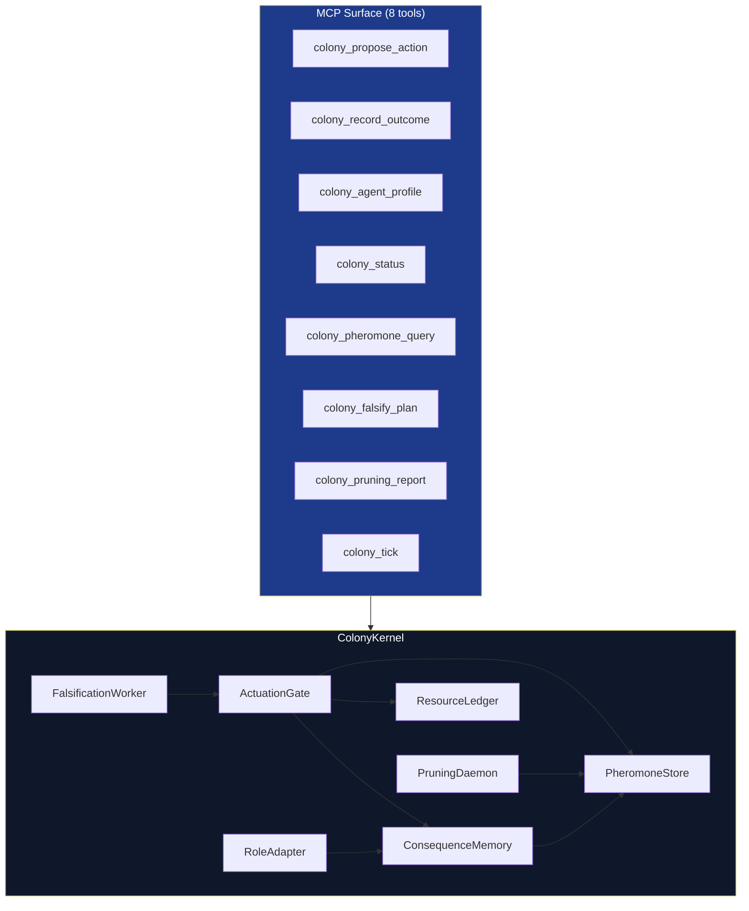

# colony_kernel

**Version**: v1.3.0 | **Status**: Active | **Last Updated**: July 2026

> Proposal-evaluation control plane for Codomyrmex's artificial ecology: combines adversarial checks, budget state, reported consequences, trust, and a process-local signal field.

## Navigation

- **Agent Guide**: [AGENTS.md](AGENTS.md)
- **Formal Specification**: [SPEC.md](SPEC.md)
- **Source Module**: [../../../src/codomyrmex/colony_kernel/](../../../src/codomyrmex/colony_kernel/)
- **Scope Document**: [../../todo/COLONY_KERNEL.md](../../todo/COLONY_KERNEL.md)

## Overview

The Colony Kernel constrains proposal verdicts using reported consequences, a process-local signal field, budget state, trust, completeness, role state, and falsification checks. Its verdict is advisory to downstream callers: the kernel neither executes tools nor attests that submitted outcomes correspond to prior authorized actions.

The kernel exposes 8 MCP tools for the propose→gate→record→tick lifecycle and wires 8 internal subsystems: PheromoneStore, ResourceLedger, ActuationGate, ConsequenceMemory, RoleAdapter, PruningDaemon, FalsificationWorker, and the ColonyKernel coordinator. The MCP tool layer is the public surface over those subsystems, not a ninth subsystem.

## Architecture



## Usage

```python
from codomyrmex.colony_kernel import ColonyKernel
from codomyrmex.colony_kernel.models import ActionProposal

# Kernel is accessed via the module-level singleton exposed through MCP tools.
# Direct construction is for tests only.
kernel = ColonyKernel()

# Propose an action — returns GateResult(decision, gate_score, reason)
result = kernel.propose_action(
    ActionProposal(
        agent_id="engineer-1",
        agent_type="repair_ant",
        action_type="patch_file",
        target="codomyrmex.git_operations.core",
        rationale="Fix off-by-one in branch name parser",
        rollback_plan="git revert HEAD~1",
        evidence={"test_ids": ["test_slash_in_name"]},
        expected_outcome="test_slash_in_name passes; no other branch-name tests regress",
    ),
)
```

Via MCP tools:

```bash
# Propose action (returns decision: execute | hold | refuse)
colony_propose_action agent_id=engineer-1 action_type=patch_file target=codomyrmex.git_operations.core ...

# Record outcome after execution
colony_record_outcome agent_id=engineer-1 tests_passed=true ...

# Advance the colony clock (evaporates pheromone traces)
colony_tick
```

## Key Files

| File | Purpose |
|------|---------|
| `AGENTS.md` | Agent coordination guide and subsystem reference |
| `SPEC.md` | Formal specification: gate scoring model, trust lifecycle, pheromone taxonomy, invariants |

## Related Docs

- **Source**: [src/codomyrmex/colony_kernel/](../../../src/codomyrmex/colony_kernel/)
- **MCP Tool Specification**: [src/codomyrmex/colony_kernel/MCP_TOOL_SPECIFICATION.md](../../../src/codomyrmex/colony_kernel/MCP_TOOL_SPECIFICATION.md)
- **Tests**: [tests/unit/colony_kernel/](../../../tests/unit/colony_kernel/)
- **Scope / TODO**: [docs/todo/COLONY_KERNEL.md](../../todo/COLONY_KERNEL.md)
