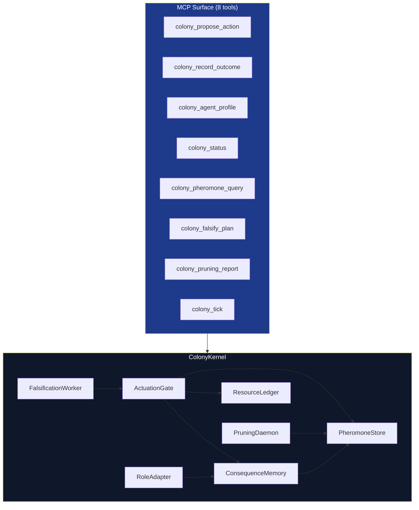

# colony_kernel

> Control plane for Codomyrmex's artificial ecology: gates every agent action through adversarial falsification, multi-dimensional budget tracking, earned trust scores, and a stigmergic pheromone field.

## Overview

The Colony Kernel is the central governance layer of Codomyrmex. Rather than coordinating agents through centralised command, it models the agent collective as a biological colony where permission emerges from accumulated signal. Agents earn trust through clean outcomes, leave pheromone traces that encode collective memory, and must pass an adversarial falsification step before any action executes.

The kernel exposes 8 MCP tools for the propose→gate→record→tick lifecycle and wires nine internal subsystems: PheromoneStore, ResourceLedger, ActuationGate, ConsequenceMemory, RoleAdapter, PruningDaemon, FalsificationWorker, ColonyKernel, and the MCP tool layer.

## Architecture



## Usage

```python
from codomyrmex.colony_kernel import ColonyKernel
from codomyrmex.colony_kernel.models import ActionProposal

# Kernel is accessed via the module-level singleton exposed through MCP tools.
# Direct construction is for tests only.
kernel = ColonyKernel(...)

# Propose an action — returns GateResult(decision, gate_score, reason)
result = kernel.submit_proposal(
    proposal=ActionProposal(
        agent_id="engineer-1",
        action_type="patch_file",
        target="codomyrmex.git_operations.core",
        rationale="Fix off-by-one in branch name parser",
        rollback_plan="git revert HEAD~1",
        evidence={"test_ids": ["test_slash_in_name"]},
    ),
    execute_callback=lambda p: perform_patch(p),
)
```

Via MCP tools:

```bash
# Propose action (returns decision: execute | hold | refuse)
colony_propose_action agent_id=engineer-1 action_type=patch_file target=codomyrmex.git_operations.core ...

# Record outcome after execution
colony_record_outcome agent_id=engineer-1 tests_passed=true ...

# Advance the colony clock (evaporates pheromone traces)
colony_tick
```

## Key Files

| File | Purpose |
|------|---------|
| `AGENTS.md` | Agent coordination guide and subsystem reference |
| `SPEC.md` | Formal specification: gate scoring model, trust lifecycle, pheromone taxonomy, invariants |

## Related Docs

- **Source**: [src/codomyrmex/colony_kernel/](../../src/codomyrmex/colony_kernel/)
- **MCP Tool Specification**: `MCP_TOOL_SPECIFICATION.md` (when present)
- **Tests**: [src/codomyrmex/tests/unit/colony_kernel/](../../src/codomyrmex/tests/unit/colony_kernel/)
- **Scope / TODO**: [docs/todo/COLONY_KERNEL.md](../../docs/todo/COLONY_KERNEL.md)
