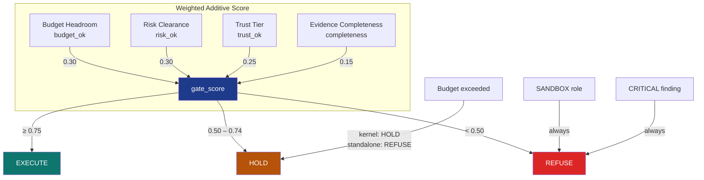
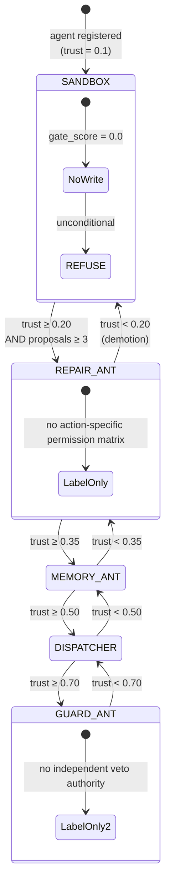
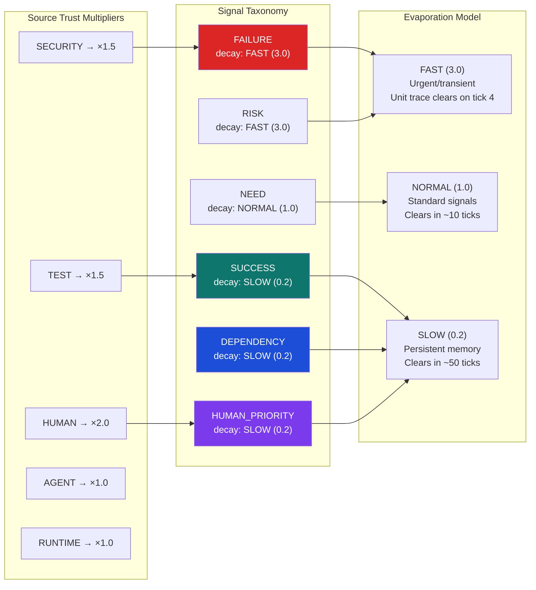

# Colony Kernel — Module Specification

**Version**: v1.3.0 | **Status**: Active | **Last Updated**: July 2026

## Navigation

- **Module README**: [README.md](README.md)
- **Agent Guide**: [AGENTS.md](AGENTS.md)
- **Source Module**: [../../../src/codomyrmex/colony_kernel/](../../../src/codomyrmex/colony_kernel/)
- **Source MCP Spec**: [../../../src/codomyrmex/colony_kernel/MCP_TOOL_SPECIFICATION.md](../../../src/codomyrmex/colony_kernel/MCP_TOOL_SPECIFICATION.md)
- **Tests**: [../../../tests/unit/colony_kernel/](../../../tests/unit/colony_kernel/)

## Purpose

The Colony Kernel is the control plane for Codomyrmex's artificial ecology thesis. Rather than coordinating agents through centralised command, it models the collective as a colony where:

- **Modules** are organisms with assigned roles, earned trust scores, and finite lifespans
- **Agents** are caller identifiers whose reported history updates trust profiles
- **The pheromone field** is process-local shared state unless a future persistent backend is supplied

The kernel exposes 8 MCP tools for agent interaction.

## Architecture

```
                    ┌─────────────────────────────────────┐
                    │          ColonyKernel               │
                    │  (top-level integration class)       │
                    └──────────┬──────────────────────────┘
                               │
        ┌──────────┬───────────┼───────────┬──────────┐
        │          │           │           │          │
   ┌────▼───┐ ┌───▼────┐ ┌───▼────┐ ┌───▼────┐ ┌───▼────┐
   │Pheromone│ │Resource│ │Actu-   │ │Conseq- │ │Role    │
   │Store    │ │Ledger  │ │ation   │ │uence   │ │Adapter │
   │         │ │        │ │Gate    │ │Memory  │ │        │
   └─────────┘ └────────┘ └────────┘ └────────┘ └────────┘
                                         │
                                    ┌────▼────┐
                                    │Pruning  │
                                    │Daemon   │
                                    └─────────┘
```

## Gate Scoring Model

The ActuationGate computes a composite score in [0.0, 1.0]:



Formula:
```
gate_score = budget_ok * 0.30 + risk_ok * 0.30 + trust_ok * 0.25 + completeness * 0.15
```

## Trust Lifecycle



Delta formula:
```
delta = +0.04  if tests_passed
delta = -0.08  otherwise
delta += -0.05  if repair_needed
delta += human_feedback × 0.03
```

## Pheromone Signal Types



Compound key format: `"{location}:{signal_type.value}"` (e.g. `"codomyrmex.git_operations.core:failure"`).

## MCP Tool Surface

All 8 tools route through a module-level `ColonyKernel` singleton. State persists for the lifetime of the MCP server process.

| Tool | Input | Output |
|------|-------|--------|
| `colony_propose_action` | agent_id, action_type, target, rationale, rollback_plan, evidence | GateResult (decision, gate_score, reason, required_evidence) |
| `colony_record_outcome` | agent_id, action_type, target, actual_outcome, tests_passed, human_feedback | status, consequence_id, trust_score, role |
| `colony_agent_profile` | agent_id | AgentTrustProfile (role, trust_score, total_proposals, consequence_history) |
| `colony_status` | (none) | pheromone_summary, budget_usage, role_distribution, recent_consequences, pruning_candidates_count |
| `colony_pheromone_query` | location, signal_type | list of ColonySignal dicts |
| `colony_falsify_plan` | plan_json | findings, severity_score, recommendation |
| `colony_pruning_report` | (none) | candidates, total_candidates, generated_at |
| `colony_tick` | (none) | post-tick colony_status |

## Invariants

1. **Zero-mock**: All tests use real ColonyKernel instances; no unittest.mock.
2. **Idempotent registration**: `register_all()` is idempotent.
3. **Typed subsystem exchange**: `models.py` is the shared value-object contract; `ColonyKernel` owns cross-subsystem sequencing.
4. **Trust clamping**: Trust scores are always in [0.0, 1.0].
5. **Budget enforcement**: Any single dimension exceeded → HOLD.
6. **SANDBOX block**: SANDBOX agents always receive REFUSE.
7. **Report is read-only**: the MCP pruning report only nominates candidates; the separate archive API is dry-run by default and mutates only when explicitly invoked.
8. **DEPENDENCY on record**: `record_outcome` always deposits DEPENDENCY signal.

## Test Coverage

```bash
uv run pytest tests/unit/colony_kernel/ -v
```

## Navigation

- **README**: [README.md](README.md)
- **Agent Guide**: [AGENTS.md](AGENTS.md)
- **Source**: [src/codomyrmex/colony_kernel/](../../../src/codomyrmex/colony_kernel/)
- **MCP Spec**: [src/codomyrmex/colony_kernel/MCP_TOOL_SPECIFICATION.md](../../../src/codomyrmex/colony_kernel/MCP_TOOL_SPECIFICATION.md)
- **Tests**: [tests/unit/colony_kernel/](../../../tests/unit/colony_kernel/)
