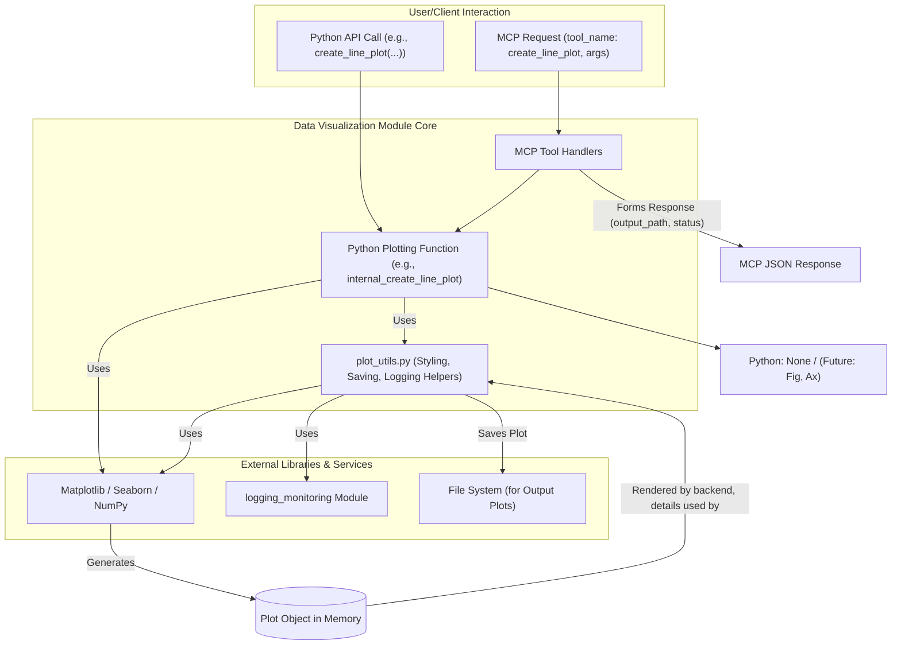

# Data Visualization - Technical Overview

This document provides a detailed technical overview of the Data Visualization module.

## 1. Introduction and Purpose

The Data Visualization module is responsible for generating a variety of common plot types—including line plots, scatter plots, bar charts, histograms, pie charts, and heatmaps—from provided datasets. It aims to offer a simple and consistent interface for other Codomyrmex modules or users to quickly visualize data, primarily leveraging libraries like Matplotlib and Seaborn. It solves the problem of needing scriptable, reproducible, and well-logged visualizations within the Codomyrmex ecosystem, accessible via direct Python function calls or through Model Context Protocol (MCP) tools.

## 2. Architecture

The module's architecture is straightforward, consisting of a collection of Python functions, each dedicated to creating a specific plot type. These functions are the primary interface. For MCP integration, these Python functions are wrapped by corresponding MCP tool handlers.

- **Key Components/Sub-modules**:
  - **Plotting Functions** (e.g., in `line_plot.py`, `heatmap.py`, etc., and typically exposed via `data_visualization/__init__.py` or a central `plotter.py`):
    - `create_line_plot()`: Generates line plots.
    - `create_scatter_plot()`: Generates scatter plots.
    - `create_bar_chart()`: Generates bar charts.
    - `create_histogram()`: Generates histograms.
    - `create_pie_chart()`: Generates pie charts.
    - `create_heatmap()`: Generates heatmaps.
  - **`plot_utils.py` (Conceptual/Actual)**: Contains shared helper functions for common tasks such as initializing Matplotlib/Seaborn figures and axes, applying consistent styling or themes, managing color palettes, saving figures to various formats with appropriate logging, and standardized integration with the `logging_monitoring` module.
  - **MCP Tool Implementations** (Conceptual `McpToolImplementations.py` or similar): Python functions that serve as handlers for MCP tool requests. These wrappers parse incoming MCP arguments, validate them, call the appropriate core Python plotting function (e.g., `create_line_plot`), and then format the MCP response, which typically includes the `output_path` of the generated plot file and status details.

- **Data Flow** (for a direct Python call):
  1. User/Module imports a specific plotting function (e.g., `from codomyrmex.data_visualization import create_line_plot`).
  2. Structured data (e.g., lists, NumPy arrays) and plot configuration parameters (title, labels, output_path, etc.) are passed as arguments to the function.
  3. The function utilizes Matplotlib and/or Seaborn to configure and render the plot.
  4. If `output_path` is provided, the plot is saved to the specified file. If `show_plot` is true (for direct calls), `plt.show()` might be invoked (less common for server-side/MCP usage).
  5. Logging occurs throughout the process via the `logging_monitoring` module.

- **Data Flow** (for an MCP tool call, e.g., `create_line_plot` tool):
  1. MCP request arrives with `tool_name: "create_line_plot"` and `arguments` (data, title, output_path, etc.).
  2. The MCP tool handler for `create_line_plot` validates arguments.
  3. The handler calls the internal Python `create_line_plot` function with the validated arguments.
  4. The internal function generates the plot and saves it if `output_path` is specified.
  5. The MCP handler constructs a response (e.g., `{"output_path": "path/to/plot.png", "fig_details": {"status": "saved"}}`) and returns it.

- **Core Logic**: The core logic involves:
  - Mapping input parameters to Matplotlib/Seaborn function calls and object properties.
  - Setting up figure and axes.
  - Iterating over data to plot series.
  - Applying customizations (colors, labels, titles, legends).
  - Managing plot saving and display.
  - Robust error handling for invalid inputs or plotting issues.

- **External Dependencies**:
  - `matplotlib`: Core plotting library for 2D graphics.
  - `seaborn`: Higher-level interface for statistical graphics, built on Matplotlib.
  - `numpy`: For numerical operations, often a dependency or utility for preparing data for Matplotlib/Seaborn.
  - `logging_monitoring` (Codomyrmex internal): For all logging activities within the module. This is a project-wide utility.
  - `environment_setup` (Codomyrmex internal, conceptual for direct use by this module): Primarily for ensuring dependencies are met at a project level. This module's own `requirements.txt` lists its specific dependencies like Matplotlib, Seaborn, and NumPy with pinned versions.

## 3. Design Decisions and Rationale

- **Choice of Matplotlib and Seaborn**: Matplotlib was chosen for its comprehensive capabilities, fine-grained control, and widespread adoption, providing a solid foundation for 2D plotting. Seaborn was added for its ease of use in creating common statistical plot types, its aesthetically pleasing defaults, and its good integration with Pandas data structures (though direct Pandas dependency is minimized in core functions to keep them lean, accepting NumPy arrays or lists primarily).
- **Function-per-PlotType Python API**: Providing distinct Python functions (e.g., `create_line_plot`, `create_bar_chart`) offers a clear and straightforward API for users. This improves discoverability and ease of use for common plot types. MCP tools generally mirror this structure.
- **MCP Integration for Automation**: Exposing plotting capabilities via MCP tools allows AI agents and other automated systems within Codomyrmex to request visualizations programmatically. This facilitates tasks like automated report generation or visual data exploration by agents.
- **Parameter-based Customization**: Plot customization (titles, labels, colors, sizes, `figure_size`) is primarily handled through function parameters. This strikes a balance between simplicity for common cases and flexibility for users needing specific adjustments. For highly advanced customization, future enhancements might involve returning Matplotlib Figure/Axes objects (see Future Development).
- **Focus on Static Image Generation**: The primary output is static image files (e.g., PNG, SVG, PDF). Interactive plots, while powerful, are considered out of scope for the initial core functionality to maintain simplicity and server-side compatibility for MCP tools.
- **Standardized Logging and Error Handling**: All public functions and MCP handlers utilize the `logging_monitoring` module for consistent logging of operations, parameters (sanitized if necessary), and errors. Robust error handling for invalid inputs or plotting issues is a priority.

## 4. Data Models

The primary data models are the input structures expected by each plotting function and MCP tool. These are detailed in `API_SPECIFICATION.md` and `MCP_TOOL_SPECIFICATION.md`.
Generally, they involve:
-   **X-Y Plots** (`create_line_plot`, `create_scatter_plot`):
    -   `x_data`: `list` or `np.ndarray` of numerical values.
    -   `y_data`: `list` or `np.ndarray` of numerical values (can be a list of lists for multiple lines in `create_line_plot`).
-   **Categorical Plots** (`create_bar_chart`):
    -   `categories`: `list` of strings.
    -   `values`: `list` of numerical values corresponding to categories.
-   **Distribution Plots** (`create_histogram`):
    -   `data`: `list` or `np.ndarray` of numerical values.
-   **Proportional Plots** (`create_pie_chart`):
    -   `labels`: `list` of strings.
    -   `sizes`: `list` of numerical values.
-   **Matrix Plots** (`create_heatmap`):
    -   `data`: 2D `list` of lists or `np.ndarray`.

Python functions might internally convert lists to NumPy arrays for compatibility with Matplotlib/Seaborn where beneficial.

## 5. Configuration

Most configurations are handled via function parameters at the time of the call. However, some internal defaults or behaviors are established within the module, potentially managed or centralized in `plot_utils.py`:

-   **Default DPI**: A standard resolution (e.g., `100` or `150` DPI) for saved figures if not otherwise specified by a save utility function or parameter.
-   **Default Figure Size**: Common default dimensions for plots (e.g., `(10, 6)` inches) can be overridden by parameters like `figure_size` available in most plotting functions.
-   **Default File Format**: PNG is a common default if `output_path` doesn't specify an extension supported by Matplotlib. The saving utilities should support multiple formats (PNG, SVG, PDF).
-   **Style Sheets/Themes**: A consistent Matplotlib/Seaborn style (e.g., using `seaborn.set_theme()` or a custom Matplotlib style sheet) may be applied internally by `plot_utils.py` to ensure a unified Codomyrmex look and feel for all generated plots. This could include default color palettes.
-   **Color Palettes**: Default color sequences or specific named palettes might be defined in `plot_utils.py` and used by plotting functions if explicit colors are not provided by the user, ensuring visual consistency.

## 6. Scalability and Performance

-   **Dependency on Backend Libraries**: Performance is largely dictated by Matplotlib and Seaborn. Generating very complex plots or plots from extremely large datasets can be CPU and memory intensive.
-   **Single Call Execution**: Each plotting function call or MCP tool invocation typically generates one plot. The module is not designed for streaming or continuous updates of a single plot object across multiple calls.
-   **Concurrency**: If multiple plots are requested concurrently (e.g., via simultaneous MCP calls), the underlying application server or task management system must handle concurrency. Matplotlib itself is not inherently thread-safe for all operations across different figures/axes if not managed carefully, but typical usage of generating separate plot files per call is generally safe.
-   **No Distributed Processing**: The module operates on a single-node basis per call.

## 7. Security Aspects

Key security considerations are detailed extensively in `SECURITY.md`. In summary:

-   **Input Validation**: While plotting libraries handle most numerical data issues, textual inputs for titles, labels, and especially `output_path` must be treated with care. MCP tool handlers are a key point for such validation.
-   **Output Path Security**: This is paramount. The `output_path` parameter, when exposed via Python API or MCP tools, MUST be rigorously validated by the calling application or the MCP hosting environment. This includes preventing path traversal, ensuring writes are confined to designated, non-critical directories, and sanitizing filenames.
-   **Resource Exhaustion**: Very large or complex data inputs could lead to DoS. The calling application or MCP framework might need to implement safeguards like input size limits, timeouts, or run plotting tasks in resource-constrained environments if such inputs are anticipated from untrusted sources.
-   **Accessibility**: Improve considerations for plot accessibility (e.g., colorblind-friendly palettes by default, options for text-based descriptions or alt-text generation for plots).
-   **Return Figure/Axes Objects**: For advanced Python API users, consider adding an option for plotting functions to return the Matplotlib `Figure` and `Axes` objects. This would allow for further, highly custom modifications by the caller after initial plot generation, without needing to reimplement the core plotting logic.

## 8. Future Development / Roadmap

-   **Support for More Plot Types**: Expand the library with functions for 3D plots, network graphs (e.g., using NetworkX + Matplotlib), geographical maps (e.g., with Cartopy), or more specialized statistical visualizations.
-   **Enhanced Styling and Theming**: Offer more built-in themes or easier ways to apply comprehensive custom styles relevant to Codomyrmex branding or user preferences.
-   **Interactive Plotting (Optional Module/Mode)**: For use cases where a UI is present, explore integration with libraries like Plotly or Bokeh to generate interactive HTML-based visualizations.
-   **Direct Pandas DataFrame Input**: Offer more convenience functions that directly accept Pandas DataFrames and allow specifying columns by name for plot aesthetics.
-   **Plot Templates**: Allow users to define and save plot templates for recurring visualization tasks with consistent styling.
-   **Accessibility**: Improve considerations for plot accessibility (e.g., colorblind-friendly palettes by default, options for text-based descriptions of plots).

## Navigation Links

- **Parent**: [Project Overview](../README.md)
- **Module Index**: [All Agents](../../AGENTS.md)
- **Documentation**: [Reference Guides](../../README.md)
- **Home**: [Root README](../../../README.md)
